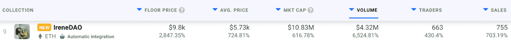

# Instagram 和密码影响者 Irene Zhao 看到 DAO NFTs 飙升

> 原文：<https://web.archive.org/web/https://dappradar.com/blog/instagram-and-crypto-influencer-irene-zhao-sees-dao-nfts-skyrocketing>

## 1107 家会员 NFT 的交易额超过 610 万美元

Irene Zhao 已经成为一名有影响力的加密专家有一段时间了，她的 IreneDAO 项目现在看到了她在该领域受欢迎的好处。在过去的 24 小时内，IreneDAO NFT 系列吸引了 430%的交易者，并将其底价提高了 2847%，至 9800 美元左右。

IreneDAO 的活动激增并不奇怪，因为该系列非常新。部落通过 1 月 14 日推出的 NFTs，让所有者获得 DAO。除了汽油费，造币厂完全免费。由于只有 1107 张通行证可用，二级市场的活动正在蓬勃发展。[艾琳·赵](https://web.archive.org/web/20221206175037/https://twitter.com/Irenezhao_)在推特上有超过 129000 名粉丝，在 Instagram 上有 375000 名粉丝。这意味着只有大约 0.22%的追随者可以拥有通行证并参加道。

重要的是，这一系列的稀缺性和艾琳·赵的大量社交媒体关注对部落传递 NFTs 的活动产生了很大影响。考虑到 Twitter 上的大肆宣传，以及艾琳·赵在社交媒体上的受欢迎程度，IreneDAO 项目在推出后立即成为热门话题。随着募捐活动一飞冲天，其市值现已超过 1000 万美元。仅在过去 24 小时内，IreneDAO 就吸引了 432 万美元的交易量。NFTs 的底价现在是 2 ETH，所有的交易费版税都归 IreneDAO。

## 艾琳赵导到底是怎么回事？

IreneDAO 是一个全球性的草根运动，旨在扰乱创造者经济。重要的是，IreneDAO 收集的所有 NFT 都呈现了赵对空间的看法。有些包括迷因类笑话，有些则以流行的密码术语为特色。

IreneDAO 的主要目标是为像 Irene Zhao 这样的 crypto 爱好者创造一个可接受和鼓舞人心的创作环境。赵不仅在 Instagram 上发布照片，她还建立了一个基于 web3 的社交媒体平台 SoCoL。

在撰写本文时，IreneDAO 的 Discord 已有超过 3000 名成员。令人印象深刻的是，DAO 在正式发布几天后就已经有了第一个社区提案。该提案询问社区是否希望 Irene 与 [Ghozali Ghozalu](https://web.archive.org/web/20221206175037/https://twitter.com/Ghozali_Ghozalu) 合作。Ghozalu 是一位有创造力的艺术家，他在 5 年的时间里每天都给自己拍照。这总共超过了 1825 张他作为 NFTs 出售的个人图像。

DappRadar 将继续关注 IreneDAO，因为创意社区会关注新闻。艾琳·赵是密码领域的重要人物，她的影响力对艾琳·道·NFT 系列的流行产生了巨大的影响。要跟踪部落通行证的最新销售数据，请查看 [DappRadar PRO](https://web.archive.org/web/20221206175037/https://dappradar.com/token/pro) 。PRO 让您可以访问最近 15 分钟的数据。这也让你成为达普拉达自己的社区政府[不和谐](https://web.archive.org/web/20221206175037/https://discord.gg/4ybbssrHkm)频道的一部分。

 NewsletterUnsubscribe at any time. [T&Cs](https://web.archive.org/web/20221206175037/https://dappradar.com/terms) and [Privacy Policy](https://web.archive.org/web/20221206175037/https://dappradar.com/privacy-policy)