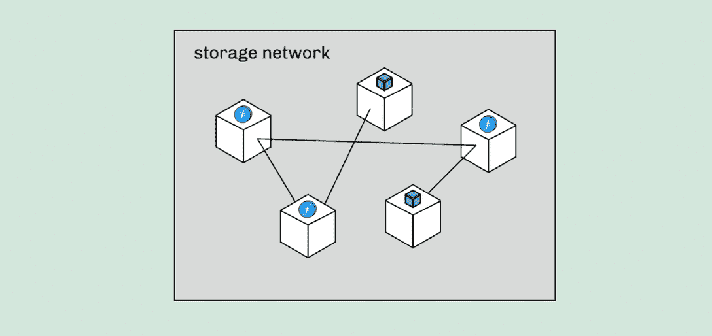

# 介绍 NFT。存储:NFTs 和元数据的分散存储

> 原文：<https://web.archive.org/web/https://dappradar.com/blog/introducing-nft-storage-the-decentralized-storage-for-nfts-and-metadata>

## NFT。存储利用 IPFS 和 Filecoin 网络来存储 NFS 和元数据

**NFT。存储提供了一种以完全分散的方式存储 NFT 及其元数据的解决方案。它允许开发者和 NFT 创作者通过利用 IPFS 和 Filecoin 来保护他们的数字资产和元数据。**

**概要:**

*   超过 3 万名用户选择了 NFT。存储作为他们的分散存储服务。
*   NFT。Storage 的用户包括个人艺术家和重要的[市场](https://web.archive.org/web/20230120174513/https://dappradar.com/nft/marketplaces)，如 [OpenSea](https://web.archive.org/web/20230120174513/https://dappradar.com/ethereum/marketplaces/opensea) 、 [MakersPlace](https://web.archive.org/web/20230120174513/https://dappradar.com/ethereum/collectibles/makersplace) 、Holaplex、MagicEden、Galaxy、Jigstack 等等。
*   NFT。存储为用户提供 IPFS URIs 而不是 HTTP URLs，确保[NFT](https://web.archive.org/web/20230120174513/https://dappradar.com/nft)是不可变的。
*   平台简单易用，免费使用。
*   NFT。存储支持企业成为面向 web3 的企业。

去年，NFT 市场在区块链行业中脱颖而出，因为加密用户在这些数字资产上花费了数十亿美元。随着 NFT 有史以来第一次允许令牌持有者拥有数字资产主权，NFT 将继续作为加密收藏品、数字媒体、游戏内物品等的价值存储。

然而，NFTs 的元数据有时不是以分散的方式存储的，这意味着 NFT 的内容可能会发生变化。为了避免这样的问题，NFT。存储引入了一种解决方案，为 NFTs 和 NFT 元数据提供分散存储。

## 什么是 NFT。存储？

NFT。Storage 是一种旨在为 NFT 及其元数据构建分散存储的服务。利用 IPFS 和 NFT 的技术。存储可以通过内容寻址和分散存储来保护 NFT 应用程序中的虚拟资产和相关元数据。

自 2021 年 4 月推出以来，这项服务已经成为 NFT 开发者的重要组成部分。目前，超过 3 万名用户信任 NFT。存储是一种可靠且用户友好的方法，可确保虚拟资产的内容持久性。

该解决方案提供商已经成功处理了超过 1500 万次上传和 20 多 TiB 的 NFT 数据，包括整个 NFTs、元数据和其他资产。促成这些数字的用户包括艺术家个人和重要的市场，如 OpenSea、MakersPlace、Holaplex、MagicEden、Galaxy、Jigstack 等。

## 为什么是 NFT。存储？

NFT 授予人们对其数据资产的所有权，前提是没有人能够改变 NFT 所承载的内容。然而，情况并非总是如此。

NFT 中的元数据存储实际内容并描述内容。每个 NFT 都有自己的 tokenId，对应的统一资源标识符(URI)指向 JSON 格式的元数据。因此，URI 如何指向元数据至关重要。

这个 URI 可以指向 NFT 创造者的以 HTTP 开始的集中网站。在这种情况下，NFT 创建者有权更改 NFT 下的内容。这种存储方式的另一个问题是这样的 HTTP 服务器可能会完全关闭。

最佳实践是使用包含 IPFS 内容 id(cid)的 URIs，因为 IPFS 以分散的方式存储内容。因此，它避免了数据操作的可能性。

有了这些背景信息，现在我们可以理解为什么 NFT。存储在 NFT 和元数据存储方面有如此大的优势。NFT。存储给用户 IPFS URIs，而不是 HTTP 网址。这允许用户确保元数据是 NFT 的一部分，而不是将关键元数据保存在第三方服务器上并指向 HTTP URL。

此外，只要 IPFS 网络上存在副本，无论是在公共 IPFS 节点上、在 Filecoin 上，还是在运行 IPFS 节点的用户计算机上，用户都可以下载该数据的副本。

#### NFT。存储网关

安全地存储 NFT 后，下一步是高效地检索 NFT 数据。NFT。存储保证了这一过程的简单和高效。为了促进最终的检索体验，该团队推出了 NFT。存储网关，一个缓存层，能够对最终用户请求做出最快的响应。用户可以找到更多关于 NFT 的信息。本页上的存储网关。

## 快速入门指南

开始使用这项服务只需要几个简单的步骤。用户可以在页面上找到[详细的入职指南，或者快速浏览以下快照。](https://web.archive.org/web/20230120174513/https://nft.storage/docs/quickstart/)

1.  创造一个 NFT。存储帐户
2.  上传 NFTs
    *   通过网站上传
    *   通过 NFTUp 应用程序上传文件和目录
    *   在您的应用程序中上传
        *   获取免费的 API 令牌
        *   使用 JavaScript API
3.  使用元数据在任何区块链平台上创建 NFT。

开发人员可以将 HTTP API 直接用于任何能够发送 HTTP 请求的编程语言或工具。非开发者用户可以直接从 NFT 上的[文件页面](https://web.archive.org/web/20230120174513/https://nft.storage/files/)轻松上传和检索文件。存储网站。

## 与 NFT 一起储存。储存；储备

存储。NFT 从根本上改变了目前的 NFT 存储方式，为用户带来了真正的 web 3.0 体验。最重要的是，NFT。储物免费使用。用户不必像使用云存储服务(如 Dropbox 或 iCloud)那样为容量付费。

此外，只要数据是 NFT 的一部分，用户就可以上传任意多的数据(例如，元数据、图像以及令牌或其元数据中引用的其他资产)。目前，个人上传的限制是 31GiB。

存储。NFT 让每个人都能用得起 NFT 分散存储。因此，它为未来的元宇宙增加了价值，这个城市充满了 NFT 驱动的数字资产。从存储中获益。NFT，把你的生意描绘成一个面向 web3 的生意。

了解更多关于 NFT 的信息。存储

[网站](https://web.archive.org/web/20230120174513/https://nft.storage/)

[推特](https://web.archive.org/web/20230120174513/https://twitter.com/nft_storage)

[不和](https://web.archive.org/web/20230120174513/https://discord.com/invite/KKucsCpZmY)

**免责声明** —这是一篇赞助文章。DappRadar 不认可本页面上的任何内容或产品。DappRadar 旨在提供准确的信息，但读者应该在采取行动之前总是自己做研究。DappRadar 的文章不能被认为是投资建议。