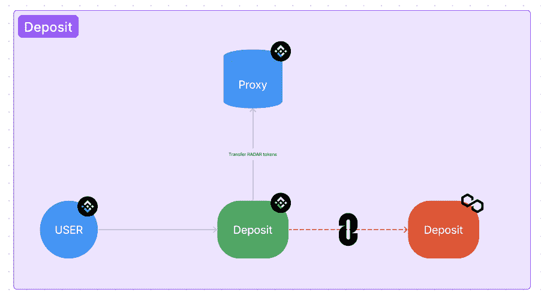
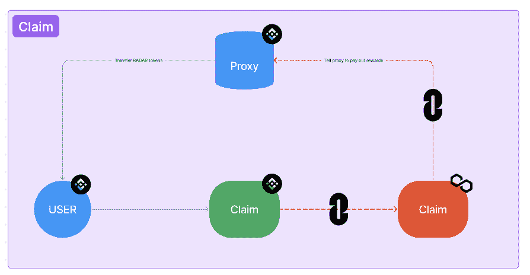
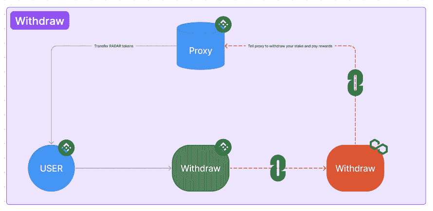

# 简介:雷达交叉链标记

> 原文：<https://web.archive.org/web/https://dappradar.com/blog/introducing-radar-cross-chain-token-staking>

## 在任何链条上申领雷达赌注奖励，无论赌注在哪里

DappRadar 很高兴宣布雷达跨链标记，让用户可以在任何链上申领标记奖励，无论他们的雷达标记在哪里。APR 将在所有连锁店中相同，消除了连接资产或支付天然气费用的需要，当 RADAR 正式在该连锁店推出时，将启用赌注。

互操作性协议 LayerZero 被选择来完成繁重的工作，并允许智能合约在不同的区块链之间进行通信。值得注意的是，这并不局限于 EVM 兼容的连锁店，为 DappRadar 社区提供了最全面的选择。

DappRadar 没有运行在以太坊、Fantom、Polygon 或任何其他链上。尽管如此，我们跟踪和覆盖所有类型的 dapps，包括 DeFi、NFTs、游戏和其他垂直市场。所有这一切都发生在超过 45 个区块链。达普拉达是区块链不可知论者。

**今天，我们自豪地推出业内首个“跨链代币赌注”。**

当我们在 2021 年 12 月推出[雷达令牌](https://web.archive.org/web/20221128211036/https://dappradar.com/token/overview)时，我们知道必须让它跨链工作。那么，这对用户来说意味着什么呢？

*   当雷达在链上正式发射时，标桩将到达该链
*   用户可以在任何链上要求奖励，不管他们把雷达标在哪里
*   所有连锁店的年利率都是一样的，确保没有人仅仅为了赌注而不得不跨越资产和支付汽油费

我们的目标是确保不同连锁店用户之间的平等。无论你在哪个链条上使用 dapps，都可以参与到雷达生态系统中。我们希望让任何链上的任何人都能够参与我们的 Contribute2Earn 生态系统，这是实现这一目标的第一步。

# 挑战

正如您可能想象的那样，跨链赌注带来了一系列前所未见的独特挑战。当然，这需要复杂的跨链解决方案。

经过慎重考虑，我们决定选择 LayerZero。它是一个全链互操作协议。抛开沉重的技术细节不谈，LayerZero 允许智能合约在不同的区块链之间进行通信，这不仅限于与 EVM 兼容的区块链。

# 它是如何工作的？

雷达跨链标桩主干由 2 个智能合同组成；控制器和代理。

#### 控制器

*   仅部署在一个交易便宜的连锁店(低汽油费)
*   记录所有的存款和回报率
*   有权告诉代理合同发放奖励或收回代币

#### 代理人

*   部署在任何链上的雷达都是在
*   通过 LayerZero 与控制器通信，通知控制器用户想要执行的操作
*   不保存任何存款或奖励信息。充当用户和控制器之间的信息桥梁。
*   持有赌注代币

现在让我们花点时间来看看跨链存款是如何工作的。一个用户把雷达放在 BNB 链上，代币交给 BNB 的代理。控制者通过 LayerZero 了解存款，奖励开始累积。

然后，每隔一段时间，用户想要要求奖励或最终提取他们的赌注代币。要求奖励和收回奖励的方式非常相似。用户通知代理合同他们要求奖励或撤回的愿望。然后，代理将这个请求转发给控制器。如果它是一个有效的请求，控制器告诉代理将雷达令牌转移给用户。

# 结论

这样的设置允许我们在不同的链上获得相同的奖励，并且我们的社区能够在便宜的网络上获得奖励。这节省了宝贵和昂贵的天然气费。跨链跑马圈地的推出也意味着 RADAR token 将更深入地整合到 DappRadar 产品中。这是我们正在采取的第一步，以确保无论你在哪个链上持有雷达，你都可以像在任何其他链上一样使用它。

在 DappRadar，我们相信多链、跨链和可互操作的未来。现在这已经在你的雷达上了，让我们拥抱它吧！

让我们先来阅读一下关于如何下注你的雷达代币的指南吧！