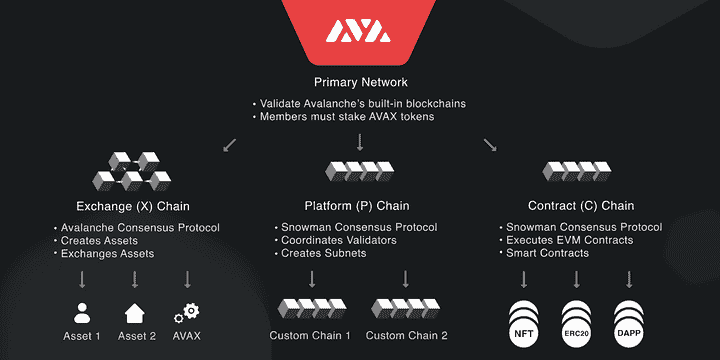
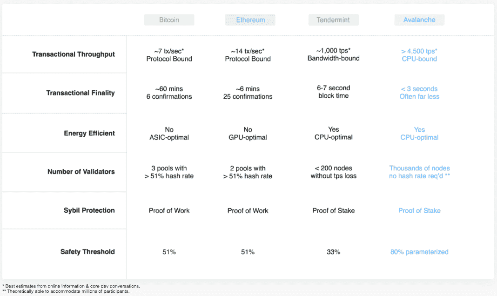
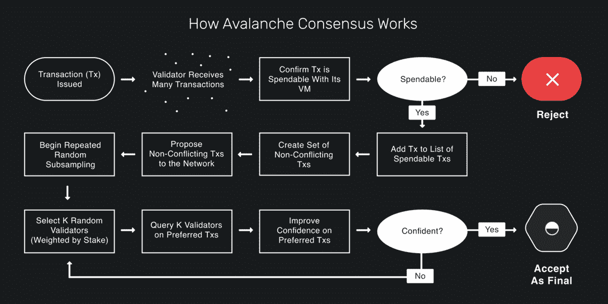
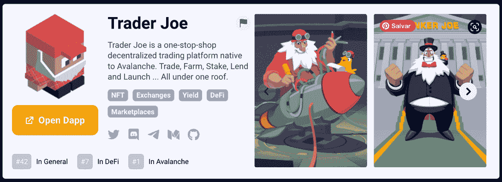
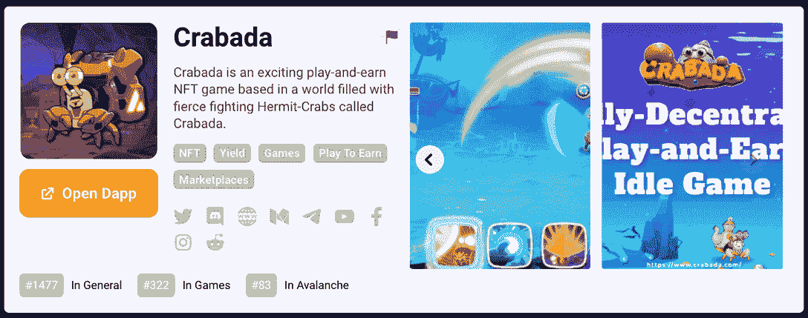
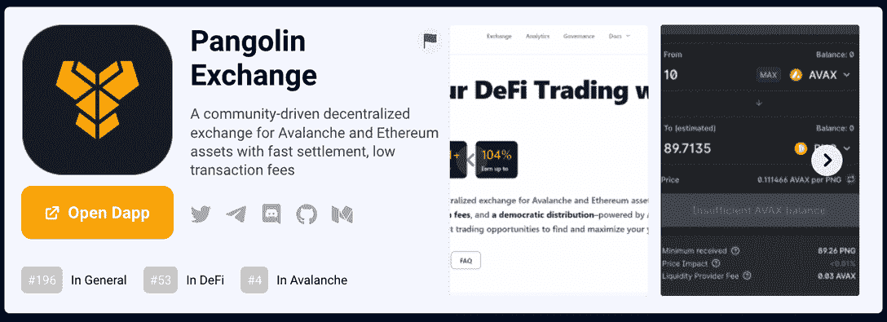
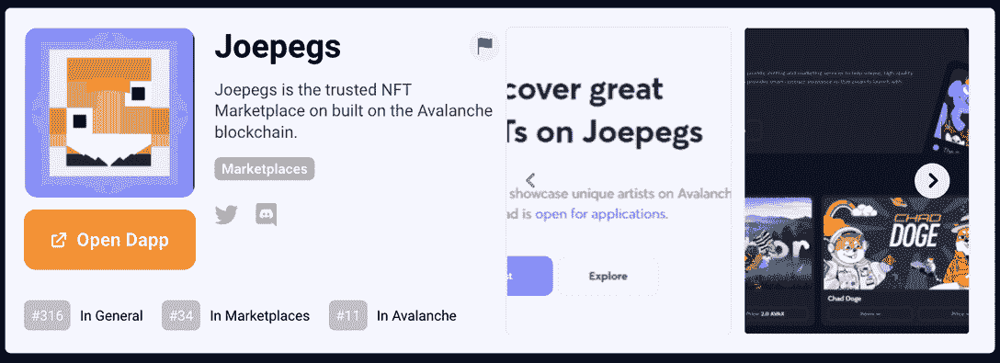

# 什么是雪崩？了解关于 DeFi & Gaming 区块链的所有信息

> 原文：<https://web.archive.org/web/https://dappradar.com/blog/introducing-the-avalanche-blockchain>

## 创建快速、私人和定制的区块链网络

**雪崩是世界上使用最多的区块链之一。但是到底是什么让它特别，Avalanche 又是如何持续吸引开发者的呢？你能在雪崩上做什么？本文将回答这些以及更多最常见的问题。加入我们，了解这个领先的以太坊——另类区块链。**

**内容**

*   *[什么是雪崩？](https://web.archive.org/web/20221202194445/https://dappradar.com/blog/introducing-the-avalanche-blockchain/#What-is-Avalanche?)*
*   *[谁创造了雪崩？](https://web.archive.org/web/20221202194445/https://dappradar.com/blog/introducing-the-avalanche-blockchain/#Who-created-Avalanche?)*
*   *[雪崩是如何工作的？](https://web.archive.org/web/20221202194445/https://dappradar.com/blog/introducing-the-avalanche-blockchain/#How-does-Avalanche-work?)*

    *   *[C 链](https://web.archive.org/web/20221202194445/https://dappradar.com/blog/introducing-the-avalanche-blockchain/#C-Chain)*

*   *[什么是 AVAX 令牌？](https://web.archive.org/web/20221202194445/https://dappradar.com/blog/introducing-the-avalanche-blockchain/#What-is-the-AVAX-token?)*
*   *[雪崩上的赌注](https://web.archive.org/web/20221202194445/https://dappradar.com/blog/introducing-the-avalanche-blockchain/#Staking-on-Avalanche)*
*   *[雪崩与其他区块链有何不同？](https://web.archive.org/web/20221202194445/https://dappradar.com/blog/introducing-the-avalanche-blockchain/#How-is-Avalanche-different-from-other-blockchains?)*
    *   *[雪崩和以太坊有什么不同？](https://web.archive.org/web/20221202194445/https://dappradar.com/blog/introducing-the-avalanche-blockchain/#How-is-Avalanche-different-from-Ethereum?)*
*   *[跟踪雪崩上的最佳 dapps](https://web.archive.org/web/20221202194445/https://dappradar.com/blog/introducing-the-avalanche-blockchain/#Track-the-best-dapps-on-Avalanche)*
    *   *[乔氏](https://web.archive.org/web/20221202194445/https://dappradar.com/blog/introducing-the-avalanche-blockchain/#Trader-Joe)*
    *   *[克拉巴达](https://web.archive.org/web/20221202194445/https://dappradar.com/blog/introducing-the-avalanche-blockchain/#Crabada)*
    *   *step . app*
    *   *[穿山甲交换](https://web.archive.org/web/20221202194445/https://dappradar.com/blog/introducing-the-avalanche-blockchain/#Pangolin-Exchange)*
    *   *本齐*
*   *[什么是雪崩:综上](https://web.archive.org/web/20221202194445/https://dappradar.com/blog/introducing-the-avalanche-blockchain/#What-is-Avalanche:-In-Summary)*
*   *[跟着 dappar Dar](https://web.archive.org/web/20221202194445/https://dappradar.com/blog/introducing-the-avalanche-blockchain/#Keep-learning-about-the-blockchain-industry-with-DappRadar)*不断了解区块链行业
    *   *[有用文章](https://web.archive.org/web/20221202194445/https://dappradar.com/blog/introducing-the-avalanche-blockchain/#Useful-articles)*

## 什么是雪崩？

雪崩区块链是一个开源平台，用于在一个可互操作、高度可扩展的生态系统中启动分散式应用(dapps)和企业解决方案。mainnet 于 2020 年 9 月下旬上线。

它是第一个在一秒钟内确认交易的智能合约平台，支持以太坊开发工具包，并使独立验证者能够作为完整块生产者参与。它号称是*“惊人的快，低成本，环保”*。

从 2022 年开始，在 Terra 崩溃后的，Avalanche 将其主要关注点从分散金融(DeFi)转移到 Web3 游戏和不可替代代币(NFT)。此外，机构也在区块链的关注范围之内。

> DappRadar 团队在一次独家采访中与来自 Avalanche 的 Eric Kang 聊起了区块链 2022 年的项目。下面来看看吧！

[https://web.archive.org/web/20221202194445if_/https://www.youtube.com/embed/an9YDewp458?feature=oembed](https://web.archive.org/web/20221202194445if_/https://www.youtube.com/embed/an9YDewp458?feature=oembed)

*   **对雪崩好奇？** [探索最佳雪崩点](https://web.archive.org/web/20221202194445/https://dappradar.com/rankings/protocol/avalanche)

## 谁创造了雪崩？

Avalanche 是由康奈尔大学教授 Emin Gün Sirer、Kevin Sekniqi 和 Mao fan“Ted”Yin 在 2018 年通过艾娃实验室创建的。尽管区块链平台拥有高素质的团队，但它是开源的，并希望依靠全球各地的贡献者。

作为其自然发展的一部分，Avalanche 也有一个以社区为中心的平台，称为 Avalanche Hub。在那里，社区成员和 AVAX 令牌持有者可以因对生态系统的研究、教育和工程计划做出贡献而获得奖励。

## 雪崩是如何工作的？

[Avalanche](https://web.archive.org/web/20221202194445/https://www.avax.network/) 采用具有三个区块链的多链框架来划分关键功能，甚至采用不同的数据结构，从而为开发人员提供最大的灵活性和对其应用的控制。

Source: [Avalanche Medium](https://web.archive.org/web/20221202194445/https://medium.com/avalancheavax/avalanche-101-an-overview-of-the-internet-of-finance-7cdc5a2bee46)

总之，将网络划分为 3 个独立的处理能力或实体，使 Avalanche 能够提供第一个智能合约平台，在一秒钟内确认交易。

### 1.x 链

首先，存在交换链(X 链)。X 链便于个人之间点对点的资产创建和交换，包括雪崩的本地令牌 AVAX。

### 2.c 链

第二，还有契约链(C 链)。C 链是 Avalanche 的默认智能合约区块链，是以太坊虚拟机的超快速实现。

它与 Solidity 智能合约和以太坊工具完全兼容，因此以太坊开发人员能够轻松地将应用程序移植到 Avalanche 生态系统中。

### 3.p 链

最后是平台链(P 链)。P 链负责堆叠、协调跨网络的验证器以及创建自定义子网。

每个雪崩验证器都参与 P 链上的堆叠，以帮助保护核心网络，但这些验证器随后可以形成动态或私有的验证器集来操作子网。

在这些子网上，验证器可以完全控制数据、经济模型、虚拟机等等。

## 什么是 AVAX 令牌？

Avalanche (AVAX)令牌是 Avalanche 平台的本机令牌，用于通过在 Avalanche 平台上创建的多个子网之间进行赌注、对等交易、付费和提供基本记账单位来保护网络。

在撰写本文时，2022 年 9 月，AVAX 的价值为**$ 17.11**——根据 [CoinGecko](https://web.archive.org/web/20221202194445/https://www.coingecko.com/en/coins/avalanche) 的数据。这种代币在 2021 年 11 月达到历史最高点，为**144.96 美元**。历史低点是 2020 年 12 月的**2.80 美元**。

> 随着 [#Avalanche](https://web.archive.org/web/20221202194445/https://twitter.com/hashtag/Avalanche?src=hash&ref_src=twsrc%5Etfw) 、[、@BitcoinCom](https://web.archive.org/web/20221202194445/https://twitter.com/BitcoinCom?ref_src=twsrc%5Etfw) 的数百万用户现在可以购买、出售、发送和接收[、$AVAX](https://web.archive.org/web/20221202194445/https://twitter.com/search?q=%24AVAX&src=ctag&ref_src=twsrc%5Etfw) 。[https://t.co/6iQjJoBef6](https://web.archive.org/web/20221202194445/https://t.co/6iQjJoBef6)
> 
> — Avalanche 🔺 (@avalancheavax) [September 9, 2022](https://web.archive.org/web/20221202194445/https://twitter.com/avalancheavax/status/1568222778943234051?ref_src=twsrc%5Etfw)

## 雪崩中的饥饿

[赌注](https://web.archive.org/web/20221202194445/https://dappradar.com/blog/what-is-nft-staking)是参与开放网络的一种自然机制，赌注节点在经济上受到激励，以采取明智的行动，避免可能损害其股份价值的行为。

希望进入网络的节点可以通过首先建立并锁定在由令牌持有者确定的规定时间段内不能移动的标桩来自由地这样做。

一旦接受，就不能恢复或解锁，以确保节点共享相同的、稳定的网络视图。更好的是，对于令牌持有者和网络来说，赌注不会产生任何额外的成本。

与其他也提出赌注证明(PoS)机制的系统不同， [AVAX 不使用斜线](https://web.archive.org/web/20221202194445/https://bisontrails.co/slashing/#:~:text=minimize%20slashing%20risks%3F-,What%20is%20Slashing%3F,are%20downtime%20and%20double%20signing.)，因此，当赌注期限到期时，将返还总赌注。

## 雪崩和其他区块链有什么不同？

Avalanche 和其他分散式网络的一个关键区别是共识协议。迄今为止，只有 3 种方法可以解决[共识](https://web.archive.org/web/20221202194445/https://en.wikipedia.org/wiki/Consensus_(computer_science))问题:经典、中本聪和雪崩。

在 Nakamoto 向世界展示比特币之后，世界仍然希望有一个具有 Nakamoto 共识的所有好处(如健壮性和真正的去中心化)以及经典共识的所有好处(如速度、规模、快速终结)的协议，同时实现能源效率。

[<picture></picture>](https://web.archive.org/web/20221202194445/https://www.avalabs.org/why-avalanche)

Source: [Avalanche](https://web.archive.org/web/20221202194445/https://www.avalabs.org/why-avalanche)

Avalanche 从 Nakamoto 模型中吸取了两种解决方案的特点，如健壮性和真正的去中心化。此外，它利用了传统共识的优势，如速度、规模、快速终结和能效。Avalanche 将这两者结合成一个新的协议。

还有待证明，是否有可能既有古典和中本聪的优点，又没有任何一类协议的缺点，但雪崩无疑已经取得了巨大的进步。

[<picture></picture>](https://web.archive.org/web/20221202194445/https://medium.com/avalancheavax/avalanche-101-an-overview-of-the-internet-of-finance-7cdc5a2bee46)

Source: [Avalanche Medium](https://web.archive.org/web/20221202194445/https://medium.com/avalancheavax/avalanche-101-an-overview-of-the-internet-of-finance-7cdc5a2bee46)

### 雪崩和以太坊有什么不同？

雪崩区块链明确表示，他们不想被贴上另一个“以太坊杀手”的标签，因为该团队的许多创始成员在早期都与以太坊有关。

当谈到雪崩与以太坊的比较时，雪崩的相似性在表面水平上更加明显。Avalanche 支持以太坊虚拟机(EVM)及其工具——但在幕后，他们以非常不同的方式应对分布式挑战。

现在[以太坊是一个利益攸关的区块链，在 2022 年 9 月](https://web.archive.org/web/20221202194445/https://dappradar.com/blog/what-is-the-ethereum-merge)合并后，这两个区块链之间的差异正在消失。

之前，以太坊一直在努力扩大参与规模，而不产生大量费用和网络拥塞，因为它是一个工作证明区块链。对于蓬勃发展的 DeFi 建造者和使用者来说，利益相关证明机制要容易得多。

以太坊 2.0 有所帮助，但它也引入了显著的复杂性和执行风险，其扩展方法是“分片”，旨在同时处理事务，而不是连续处理。

Avalanche 系列中的协议能够实现亚秒终结性，支持每秒 4，500+个事务，并可扩展至数百万个参与共识的完整、生成块的验证器节点。

Avalanche 上的应用程序可以在它们自己独立的区块链(称为子网)中运行。这些子网仍然连接到 Avalanche 上更广泛的链生态系统，但现在它们的关系纯粹是增值而不是竞争。这不仅允许创建私有子网，还允许开发人员定义特定实现的规则、经济性、参与者和安全性。

*   **[阅读](https://web.archive.org/web/20221202194445/https://dappradar.com/blog/what-is-the-ethereum-merge)完全指南中所有关于以太坊合并的内容**

## 追踪雪崩上的最佳 dapps

真正学习任何东西的最好方法之一就是将你的知识付诸实践。因此，为了继续我们在雪崩领域的学习之路，让我们更多地了解一下基于平台构建的[最佳 dapps。](https://web.archive.org/web/20221202194445/https://dappradar.com/rankings/protocol/avalanche)

你可以访问 [DappRadar 顶级雪崩 dapps 排名](https://web.archive.org/web/20221202194445/https://dappradar.com/rankings/protocol/avalanche)自行探索和研究，但这里是最著名的雪崩 Dapps。

### 交易员乔

> Trader Joe 是 Avalanche 原生的一站式去中心化交易平台。交易、农场、股份、贷款和发射…都在一个屋檐下。

[<picture></picture>](https://web.archive.org/web/20221202194445/https://dappradar.com/avalanche/defi/trader-joe)

[Track Trader Joe on DappRadar](https://web.archive.org/web/20221202194445/https://dappradar.com/avalanche/defi/trader-joe)

### 沙巴达

> 克拉巴达是一个令人兴奋的玩赚 NFT 游戏的基础上，世界充满了激烈的战斗寄居蟹称为克拉巴达。

[<picture></picture>](https://web.archive.org/web/20221202194445/https://dappradar.com/avalanche/games/crabada)

[Track Crabada on DappRadar](https://web.archive.org/web/20221202194445/https://dappradar.com/avalanche/games/crabada)

### Step.app

> Step App 通过元宇宙、增强现实和区块链的领先技术，将健身目标转化为收入社交欢乐友好型竞赛。

[<picture></picture>](https://web.archive.org/web/20221202194445/https://dappradar.com/avalanche/social/step-app)

[Track Step.app on DappRadar](https://web.archive.org/web/20221202194445/https://dappradar.com/avalanche/social/step-app)

### 穿山甲交易所

> 一个社区驱动的分散式交易所，用于雪崩和以太坊资产，结算速度快，交易费用低。

[<picture></picture>](https://web.archive.org/web/20221202194445/https://dappradar.com/avalanche/defi/pangolin-exchange)

[Track Pangolin Exchange on DappRadar](https://web.archive.org/web/20221202194445/https://dappradar.com/avalanche/defi/pangolin-exchange)

### Joepegs NFT 市场

> Joepegs 是建立在雪崩区块链上的值得信赖的 NFT 市场。

[<picture></picture>](https://web.archive.org/web/20221202194445/https://dappradar.com/avalanche/marketplaces/joepegs)

[Track Joepegs on DappRadar](https://web.archive.org/web/20221202194445/https://dappradar.com/avalanche/marketplaces/joepegs)

[<picture></picture>](https://web.archive.org/web/20221202194445/https://dappradar.com/blog/introducing-the-avalanche-blockchain)[<picture></picture>](https://web.archive.org/web/20221202194445/https://dappradar.com/rankings/protocol/avalanche)[<picture></picture>](https://web.archive.org/web/20221202194445/https://dappradar.com/avalanche/defi/pangolin-exchange)

## 什么是雪崩:概括地说

雪崩协议试图挑选当前分布式账本技术的最佳方面，并把它们放在一个整洁的框架内。

通过实施以太坊和 EVM 的创新，尊重古老的系统，同时改变核心机制，以实现更快、更轻、更低的运行成本。

雪崩区块链解决方案的关键特征是给开发者社区一种创建他们自己的区块链生态系统的方式。

建筑商的利益是显而易见的，而速度和效率的优势应该受到社区的欢迎。只有时间才能证明雪崩是否能在拥挤的区块链空间发起严重的挑战。

## 通过 DappRadar 继续了解区块链行业

知识就是力量，尤其是在瞬息万变的区块链行业。如果你想做出自信而明智的决定，了解 dapps 和 tokens 是很有必要的。我们很高兴成为您学习旅程的一部分！

现在你知道雪崩区块链是怎么回事了。如果您想深入了解 AVAX 生态系统，可以考虑阅读官方文档。

在 DappRadar，除了非常有用的[排名工具](https://web.archive.org/web/20221202194445/https://dappradar.com/rankings/protocol/avalanche)，你还可以找到简单易懂的[区块链教程和新闻](https://web.archive.org/web/20221202194445/https://dappradar.com/blog/)。

我们希望你喜欢和我们一起学习雪崩。请务必在 Twitter 上关注 DappRadar，并在 T2 Discord 上加入我们的社区，成为未来科技的一部分。

### 有用的文章

*   [Avalanche 上最看好的 5 款游戏](https://web.archive.org/web/20221202194445/https://dappradar.com/blog/5-most-bullish-gaming-dapps-on-avalanche)
*   [创建您自己的 Avalanche NFTs 并在 Shopify 上销售](https://web.archive.org/web/20221202194445/https://dappradar.com/blog/create-your-own-avalanche-nfts-to-sell-on-shopify)
*   [什么是克拉巴达？雪崩上的新游戏](https://web.archive.org/web/20221202194445/https://dappradar.com/blog/what-is-crabada-new-play-to-earn-game-on-avalanche)
*   [雪崩:最新消息和文章](https://web.archive.org/web/20221202194445/https://dappradar.com/blog/tag/avalanche)

[Explore The Top Avalanche Dapps](https://web.archive.org/web/20221202194445/https://dappradar.com/rankings/protocol/avalanche)

***以上不构成投资建议。此处给出的信息仅供参考。请尽职调查并自行研究。***

 NewsletterUnsubscribe at any time. [T&Cs](https://web.archive.org/web/20221202194445/https://dappradar.com/terms) and [Privacy Policy](https://web.archive.org/web/20221202194445/https://dappradar.com/privacy-policy)