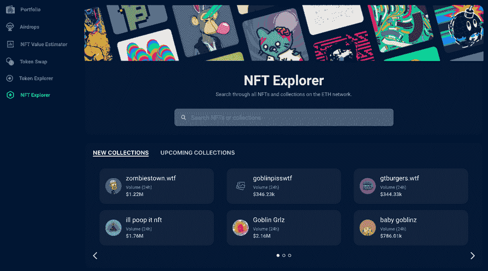
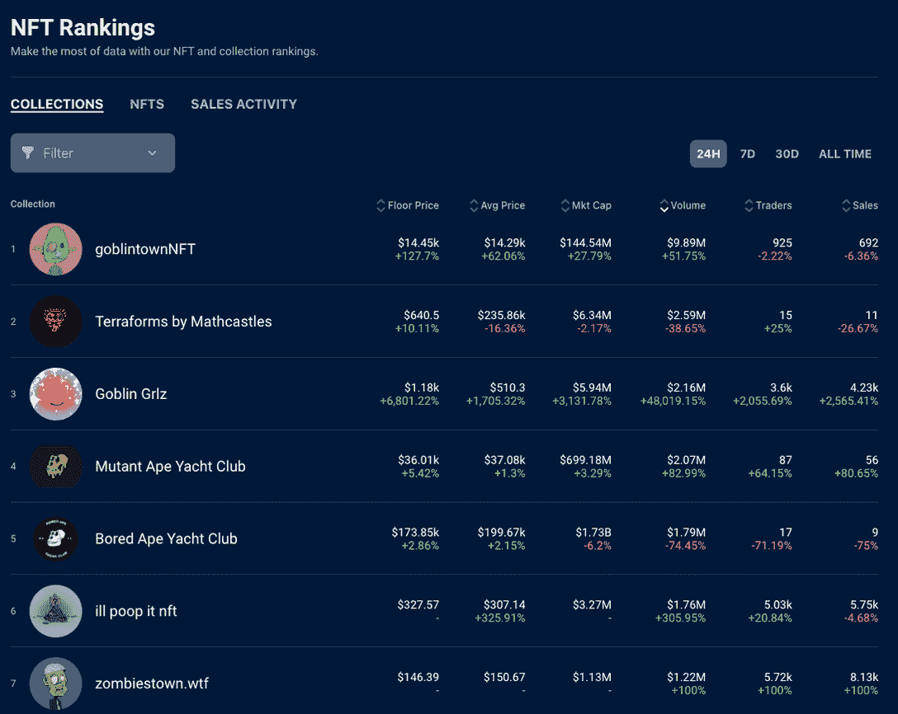
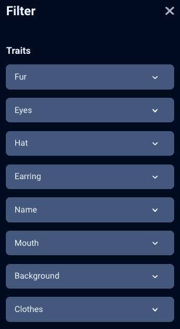
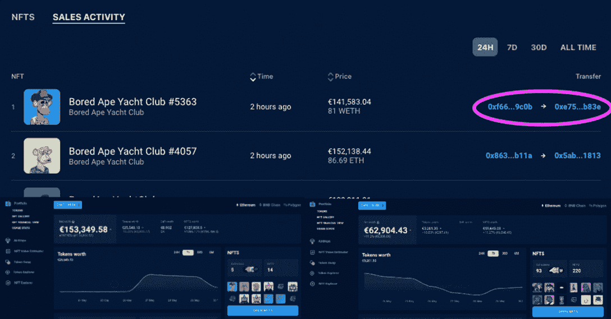

# 介绍全新的 dappar Dar NFT 系列浏览器

> 原文：<https://web.archive.org/web/https://dappradar.com/blog/introducing-the-new-dappradar-nft-collection-explorer>

## 构建工具来帮助您完成区块链之旅

**全新的** [**【达普拉达】NFT 收藏浏览器**](https://web.archive.org/web/20220705003155/https://dappradar.com/hub/nft-explorer) **让寻找、分析和购买非转售商品变得简单。从一个中心枢纽，DappRadar 用户现在可以利用最准确的市场数据探索即将到来的和可用的 NFT，并采取行动。**

在 DappRadar，我们总是展望未来。我们正在寻找为我们的社区带来价值的最佳方式，通过构建工具来帮助您踏上 Web3 之旅。考虑到这一点，我们很高兴向您介绍我们新的 [NFT 收藏探索者](https://web.archive.org/web/20220705003155/https://dappradar.com/hub/nft-explorer)。

DappRadar NFT 收藏品浏览器的价格估计是由一种机器学习算法驱动的，该算法通过查看过去销售的元数据来确定你最珍贵资产的价值。请将所有反馈和评论放入我们的[官方不和谐](https://web.archive.org/web/20220705003155/https://dappradar.com/discord)频道。我们希望你喜欢我们的新产品，阅读更多关于 NFT 收集浏览器。

## NFT 收藏浏览器的亮点

*   探索以太坊上的 NFT 系列(更多连锁店即将推出)
*   寻找和准备即将到来的 NFT 下降和特别版薄荷糖
*   使用行业标准指标分析 NFT 市场活动
*   使用准确的市场数据和元数据过滤器，深入了解 NFT 的个人收藏
*   使用 DappRadar 投资组合跟踪工具跟踪活动并跟踪智能资金

#### 探索 ETH 上现有和即将推出的 NFT 系列

在这场游戏中领先的最好方法是在它结束之前了解一个新的 NFT 项目。因此，我们开发了一个即将推出的收藏选项卡，您可以在其中发现即将推出的最新项目。在这里，你会看到铸币日期，铸币价格，以及有多少项目是在收集。

*   搜索成千上万的集合，找到 NFT，并采取行动
*   为下跌做准备，分析早期市场数据，寻找下一个 NFT 独角兽

#### 探索 NFT 排名

知道有多少人在购买或出售 NFT 是一个很好的指标，它的表现如何，它是否是一个好的投资。

*   查看按收藏排序的市场活动
*   分析单个 NFT 和最高销售额
*   按 24 小时、7 天、30 天和全天过滤

#### 探索 NFT 的个人收藏

每个 NFT 收藏的专用页面显示关键的 24 小时数据，如 NFT 收藏的底价、均价、交易量和销售量。

#### 通过元数据探索 NFTs

并非所有的 NFT 都是平等的。即使在一个集合中，单个的 NFT 在它们所具有的特征上也彼此不同。这些可能是毛发、穿孔、动物种类、眼睛颜色的变化，甚至是猿类嘴里是否有香烟。集合的元数据定义了这些特征，我们的元数据过滤器使用户能够细化他们的搜索。用一个工具找到最稀有的 NFT 以获得最佳价值。

*   使用元数据过滤器在集合中找到完美的 NFT

#### 探索 NFT 买家和卖家钱包

使用 DappRadar 投资组合管理器查看最近的美元和瑞士法郎销售额，并深入了解买家和卖家的钱包。学习鲸鱼和影响者投资者的交易习惯和 NFT 交易偏好，跟随聪明的钱。

新的 DappRadar NFT 收集浏览器补充了 DappRadar 上现有的工具，是帮助用户在最复杂的市场之一进行分析、导航和采取行动的另一种方式。目前，探索者跟踪所有以太坊 NFT 系列，不久将增加更多连锁店，所以很快，无论你是 OG 以太坊 NFTs 的粉丝还是 Solana 的后起之秀，DappRadar 都会覆盖你。

 NewsletterUnsubscribe at any time. [T&Cs](https://web.archive.org/web/20220705003155/https://dappradar.com/terms) and [Privacy Policy](https://web.archive.org/web/20220705003155/https://dappradar.com/privacy-policy)