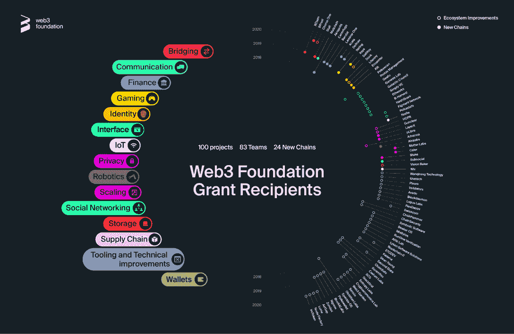

# 什么是波尔卡多特网络？简单的指南

> 原文：<https://web.archive.org/web/https://dappradar.com/blog/introducing-the-polkadot-blockchain>

## Polkadot 的核心特性可以打开一个服务的世界

**区块链技术正以令人难以置信的速度发展，Polkadot 在提供可扩展性方面是领先的解决方案。这个最近的项目正在革新这个行业，任何进入 Web3 的人都不可能看不到它。在这篇完整的文章中，您将找到关于 Polkadot 的所有必要信息。继续阅读一些波尔卡多特 101。**

## 目录

*   [波尔卡多特是什么？](https://web.archive.org/web/20220929043828/https://dappradar.com/blog/introducing-the-polkadot-blockchain/#What-is-Polkadot?)
*   谁创造了波尔卡多特？
*   [波尔卡多为什么不一样？](https://web.archive.org/web/20220929043828/https://dappradar.com/blog/introducing-the-polkadot-blockchain/#Why-is-Polkadot-different?)
    *   [1。缩放比例](https://web.archive.org/web/20220929043828/https://dappradar.com/blog/introducing-the-polkadot-blockchain/#1.-Scaling)
    *   [2。针对用例优化](https://web.archive.org/web/20220929043828/https://dappradar.com/blog/introducing-the-polkadot-blockchain/#2.-Optimized-for-use-cases)
    *   [3。没有叉子](https://web.archive.org/web/20220929043828/https://dappradar.com/blog/introducing-the-polkadot-blockchain/#3.-No-Forks)
    *   [4。协作](https://web.archive.org/web/20220929043828/https://dappradar.com/blog/introducing-the-polkadot-blockchain/#4.-Collaborate)
    *   [5。治理](https://web.archive.org/web/20220929043828/https://dappradar.com/blog/introducing-the-polkadot-blockchain/#5.-Governance)
*   谁在波尔卡多特上建房？
*   [基于波尔卡多特的顶级项目](https://web.archive.org/web/20220929043828/https://dappradar.com/blog/introducing-the-polkadot-blockchain/#Top-projects-built-on-Polkadot)
*   [什么是点令牌？](https://web.archive.org/web/20220929043828/https://dappradar.com/blog/introducing-the-polkadot-blockchain/#What-is-the-DOT-token?)
*   [波尔卡多特总结](https://web.archive.org/web/20220929043828/https://dappradar.com/blog/introducing-the-polkadot-blockchain/#Polkadot-In-Summary)

## 什么是波尔卡多？

Polkadot 是一个下一代平台，使区块链和其他 parachains 在一个保护伞下一起工作。它被称为第 0 层区块链，除了它的主 Polkadot 中继链之外，还可以有多个 Polkadot 副链与之链接。

该网络旨在允许任何类型的数据在任何类型的区块链之间发送，并有可能开启广泛的现实世界用例。

## 谁创造了波尔卡多特？

Polkadot 由平价公司(Parity)打造，该公司由[以太坊](https://web.archive.org/web/20220929043828/https://dappradar.com/rankings/protocol/ethereum)联合创始人加文·伍德博士和前以太坊基金会安全负责人尤塔·斯坦纳博士创立。

从构建广泛使用的奇偶以太坊客户端和比特币及 Zcash 的实现，到现在使用 Polkadot 开发的 ***【下一代区块链技术】*** ，奇偶校验基本上塑造了区块链产业。

*   [一瞥最新的 Dapp 行业概况](https://web.archive.org/web/20220929043828/https://dappradar.com/industry-overview)

## 波尔卡多为什么不一样？

Polkadot 区块链的营销工作从一开始就提出了一个强有力的道德立场，即围绕个人数据的问题以及在当今世界中中央集权实体如何使用(或滥用)个人数据。

> *“因为这些数据通常可以描绘出我们个人生活的详细画面，所以它已经成为比石油更有价值的资源”*
> 
> [*Polkadot Lightpaper*](https://web.archive.org/web/20220929043828/https://polkadot.network/Polkadot-lightpaper.pdf)

Polkadot 团队希望优先考虑个人主权，但同时也认识到，目前形式的区块链技术还没有准备好摆脱企业对网络的控制。他们想要改变的东西。

通过整合多个专业区块链的功能，Polkadot 旨在为新的分散式应用(dapps)和市场的出现铺平道路，并提供访问服务的方式。

Polkadot 的目标是在先前区块链网络的基础上进一步发展，为建筑商和最终用户提供基本优势。下面来看看 Polkadot 的主要功能:

### 1.缩放比例

孤立运行区块链只能处理有限的流量。Polkadot 是一个分片多链网络，这意味着它可以并行处理几个链上的许多事务，消除了旧网络上可能出现的瓶颈。

这种并行处理能力显著提高了可扩展性，并有可能为增加采用率和未来发展创造合适的条件。可以说，这些是目前区块链行业最重要的增长指标。

### 2.针对用例进行了优化

如前所述，Polkadot 是一个分片区块链，这意味着它在一个网络中连接几个链。这允许并行处理事务以及在链之间交换数据的能力。

网络中的每个链都可以针对特定的用例进行优化，而不是被迫适应一刀切的模式。更多的链条和更多的专业化意味着更多的创新可能性。

### 3.没有叉子

区块链和其他软件一样，需要更新才能正确有效地运行。然而，升级传统的链需要所谓的“硬分叉”，它创建两个独立的交易历史[可以破坏一个社区](/web/20220929043828/https://dappradar.com/blog/steem-vs-hive-dappradars-watching-what-happens-next/)，并且通常需要大量耗时的工作。

波尔卡多特承诺进行无叉升级，这将允许区块链随着更好的技术的出现而容易地发展和适应。

### 4.合作

Polkadot 上的网络和应用程序可以像手机上的应用程序一样共享信息和功能，而不需要依赖集中式服务提供商。Polkadot 提供了互操作性和跨链通信。

例如，一个提供金融服务的链可以与另一个提供真实世界数据访问的链进行通信，比如用于令牌化股票交易的股票市场价格馈送。

### 5.管理

区块链竞技场的管理程序是一个全新的概念。老区块链没有给个人利益相关者或令牌持有者提议或拒绝协议变更的发言权。[波尔卡多特由任何拥有圆点符号](https://web.archive.org/web/20220929043828/https://polkadot.network/polkadot-governance/)的人统治，圆点符号是波尔卡多特的本地货币。所有 DOT 持有者都可以提议修改协议或对现有提议进行投票。

总的来说，点令牌服务于三个不同的目的:网络治理、标桩和[绑定](https://web.archive.org/web/20220929043828/https://polkadot.network/Polkadot-lightpaper.pdf)。Polkadot 令牌持有者完全控制协议，因为在其他平台上只给予矿工的所有特权都给予了所有的点持有者。而下注只是激励代币持有者诚实行事以获得奖励。

Polkadot 上的开发者以他们认为合适的方式管理他们的网络，并且在 Polkadot 网络管理的整体未来中拥有透明的股份。团队可以根据他们的需求定制他们的区块链治理，尝试新的想法，或者更换现成的部件以加快部署。

**又读** : [什么是区块链？DappRadar 的终极指南](https://web.archive.org/web/20220929043828/https://dappradar.com/blog/what-is-a-blockchain-dappradars-ultimate-guide)

## 谁在波尔卡多特上建筑？

Polkadot 是 Web3 基金会的旗舰项目，该基金会是瑞士的一个基金会，旨在促进一个功能齐全、用户友好的去中心化网络。

到目前为止，Web3 基金会已经用[赠款](https://web.archive.org/web/20220929043828/https://github.com/w3f/General-Grants-Program)支持了几个团队，并资助了 web3 技术行业各个层面的项目，从低级基础设施到生态系统部件，如钱包、副链、桥梁和工具。

此外，在 2021 年初， [Interlay 推出了 Polkadot 的第一个无信任包装比特币](https://web.archive.org/web/20220929043828/https://polkadot.network/bitcoin-is-coming-to-polkadot/)-PolkaBTC-一旦部署，用户就可以在 Polkadot 上创造 1:1 的比特币支持资产，这标志着向真正可互操作的生态系统迈出了关键的一步。

超过 100 个项目已经或正在 Polkadot 生态系统中建设。这些项目从核心技术基础设施到分散金融(DeFi)、隐私导向数据、数字身份系统、社交网络、物联网、游戏、机器人和供应链物流的应用。

例如，目前在 Polkadot 上构建的一些应用程序具有这样的功能，即用户的帐户和数据通过加密存储在他们自己的设备上，而不是存储在中央服务器上。

这种方法以一种用户友好的方式让人们完全控制他们的数据，并进一步实现了 Polkadot 从一开始就概述的道德立场。Polkadot 希望通过建立从根本上无法通过设计滥用用户信任的系统，使社会朝着更公平、更具代表性的方向发展。

> 你听说过笔比剑更有力这句话。很快，键盘将变得比笔更强大。这个世界，从某种意义上来说，是属于编码者的。”
> 
> Polkadot founder Gavin Wood remarked

[https://web.archive.org/web/20220929043828if_/https://www.youtube.com/embed/GcOKXAOh4Xw?feature=oembed](https://web.archive.org/web/20220929043828if_/https://www.youtube.com/embed/GcOKXAOh4Xw?feature=oembed)

## 基于波尔卡多特的顶级项目

由于波尔卡多特是第 0 层区块链，它允许在其上建立其他区块链(称为副链)。在波尔卡多特上建造的一些最著名的项目包括:

*   草间弥生:波尔卡多特的实验网络被设计成波尔卡多特应用的试验床，但最终成为了它自己的实体——也是第 0 层；
*   [moon beam](https://web.archive.org/web/20220929043828/https://dappradar.com/rankings/protocol/moonbeam):Polkadot para chain，是专门为部署智能合约而构建的平台；
*   Acala : Polkadot 的 DeFi hub，旨在提供金融原语和稳定的内容；
*   Polkastarter: Polkadot 的跨链去中心化交流和众筹平台。

波尔卡多特是区块链领域的游戏规则改变者，它的潜力才刚刚开始被意识到。有了 Polkadot，我们终于可以脱离单链范式，进入一个真正链间互操作的世界。

**进一步阅读:** [达达现在在月光上追踪达达&月亮河](https://web.archive.org/web/20220929043828/https://dappradar.com/blog/dappradar-now-tracking-dapps-on-moonbeam-moonriver)

## 什么是点令牌？

点令牌是 Polkadot 的本地加密货币，用于保护网络和奖励贡献的验证者。它还允许用户与 Polkadot 应用程序交互并管理网络。

就像 DappRadar 的[雷达令牌](https://web.archive.org/web/20220929043828/https://dappradar.com/hub/token/eth/RADAR)一样，DOT 所有权赋予持有者对 Polkadot 公投的投票权，这决定了项目的发展方向。

## 概括地说

所有区块链都被迫做出折衷以支持特定的特性和用例，并且随着链专门化的增加，在它们之间进行交易的需求只会增加。

当将上述优势与 Polkadot 背后的世界级团队和基础设施相结合时，这些核心功能可以为新服务打开一个可能性的世界，这一点变得更加明显。

此外，它应该能更好地说明为什么围绕波尔卡多特有如此多的炒作。

Polkadot 为开发人员提供了一个可扩展的、可互操作的、专业化的、易于升级的区块链解决方案，在此基础上部署分散式应用程序(dapps ),随着[以太坊的可扩展性和成本问题持续存在](https://web.archive.org/web/20220929043828/https://dappradar.com/blog/ethereum-2-0-five-things-you-need-to-know),它们可能会被证明是一个无法摆脱的大刺。

随着 Polkadot 等其他解决方案开始部署提供更高水平效率和更低费用的项目，开发人员将被迫注意到这一点，而用户将只是享受好处，而不关心底层操作或其提供商。

## 跟着 DappRadar 继续学习

在 cryptoverse 中寻找机会时，访问优质内容对于保持领先地位至关重要。在 DappRadar，我们将继续关注 Polkadot 在区块链创新中的领导作用，随时为您报道。

确保[定期阅读我们的博客](https://web.archive.org/web/20220929043828/https://dappradar.com/blog/)，在[推特](https://web.archive.org/web/20220929043828/https://twitter.com/DappRadar)上关注我们，订阅我们的时事通讯，成为第一个获得我们的 dapp 评论、见解和[报道](https://web.archive.org/web/20220929043828/https://dappradar.com/reports)的人。

## 有用的链接:

*   [光纸](https://web.archive.org/web/20220929043828/https://polkadot.network/Polkadot-lightpaper.pdf)
*   [网站](https://web.archive.org/web/20220929043828/https://polkadot.network/)
*   [赠款](https://web.archive.org/web/20220929043828/https://github.com/w3f/General-Grants-Program)
*   [博客](https://web.archive.org/web/20220929043828/https://polkadot.network/blog/)

***以上不构成投资建议。此处给出的信息仅供参考。请尽职调查并自行研究。***

 NewsletterUnsubscribe at any time. [T&Cs](https://web.archive.org/web/20220929043828/https://dappradar.com/terms) and [Privacy Policy](https://web.archive.org/web/20220929043828/https://dappradar.com/privacy-policy)