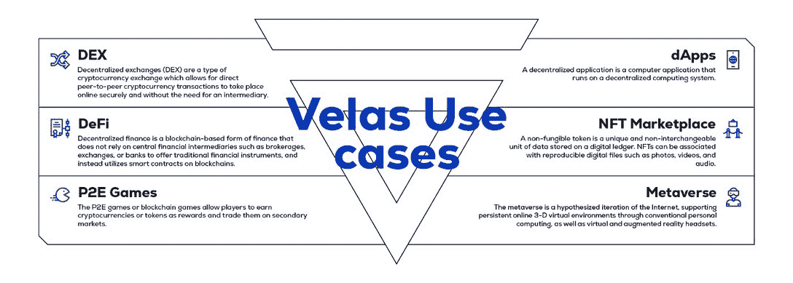

# 介绍 Velas:高性能区块链

> 原文：<https://web.archive.org/web/https://dappradar.com/blog/introducing-velas-the-high-performance-blockchain>

## 在所有现有的区块链平台中，Velas 的性能最高

[**Velas**](https://web.archive.org/web/20221214204934/https://velas.com/?utm_source=dappradar&utm_medium=about_velas) **区块链致力于为日常使用提供更快、更便宜、更可用的区块链生态系统。Velas 最重要的成就之一是，它消除了当前区块链技术所面临的一些限制，如低性能、不稳定和高费用。此外，Velas network 还为分散的项目提供技术基础设施，并通过支持资本、营销和运营策略为项目顺利启动保驾护航。**

Velas 区块链提供最快的 EVM 链与以太坊 2.0 竞争。Velas 团队怀着对区块链核心价值观的坚定信念和对 Web3.0 的愿景创建了这个项目。他们希望开发和集成技术产品和服务，积极影响全球的生活。

[https://web.archive.org/web/20221214204934if_/https://www.youtube.com/embed/-ThXHgqZpzA?list=PLu7mShzkC4iUUKf_tHjtE1MYlcD7Nu5ka](https://web.archive.org/web/20221214204934if_/https://www.youtube.com/embed/-ThXHgqZpzA?list=PLu7mShzkC4iUUKf_tHjtE1MYlcD7Nu5ka)

## Velas 区块链的使用案例

Velas 旨在为各行各业成千上万的应用和服务提供一个区块链平台。因此，该团队在技术开发过程中始终将安全和效率放在基础位置。为了全面了解 Velas 生态系统，让我们探索一下 Velas 区块链的一些使用案例。

1.  使用 WagyuSwap 进行令牌交换

WagyuSwap 是区块链大草原上的第一个分散式交易所(DEX)。由于 Velas 的尖端技术，用户在使用 WagyuSwap 时，可以享受比以太坊、比特币、币安智能链低得多的交易成本。目前，WagyuSwap 的赌注超过 600 万美元，每月活跃用户超过 1，500 人。

2.  BitOrbit 社交媒体

Bitоrbit 是 Velas 生态系统中的第一个项目。注重隐私的社交媒体网络使内容创作者能够在没有中介的情况下从其内容中获利。通过内置的加密货币钱包，用户可以直接光顾影响者。此外，微应用将允许内容创作者建立自己的商业项目，并通过提供高质量的内容和产品来主动与客户互动。最重要的是，Velas 保护了平台上所有通信和交互的隐私。

3.  完全支持 DeFi、NFTs 等

由于与 Etherscan、Chainlink、Asset bridges 和许多其他基于以太坊构建的优秀应用程序的集成，Velas 正在过渡到快速生态系统扩张的阶段。这意味着在以太坊或 EVM 区块链上开发的所有东西都可以在 Velas 上高效运行:Defi 服务、NFT 平台、dex、游戏等等。下图显示了 Velas 的多功能性。

## 相对于竞争对手的优势:更快、更便宜

Velas 专注于克服当前区块链技术的问题，提供一个强调可扩展性和成本效益的解决方案，而不牺牲分散性。下表展示了 Velas 与其竞争对手之间的直观对比。

### 专为处理高并发性而构建

首先，由于 Solana 的可靠特性，该团队决定构建 Solana 的代码。第二，[开发者](https://web.archive.org/web/20221214204934/https://docs.velas.com/?utm_source=dappradar&utm_medium=about_velas)集成了 EVM，允许基于以太坊的项目在不到 5 分钟的时间内部署到 Velas 上。此外，Velas 的高性能协议将竞争对手远远甩在身后。潜在地，Velas 的革命性技术可以在时间结构、事务处理机制和高效的共识模型方面实现突破。因此，Velas 每秒可以轻松处理 50，000+笔交易。

此外，Velas 的第 1 层特性意味着无需使用链外或第 2 层解决方案即可实现网络性能。在这种情况下，它消除了与第 2 层网络相关的大量出口和其他风险等问题。因此，当其他区块链不得不开发和更新软件来增加网络容量时，Velas 却没有这些限制。Velas 软件的设计具有良好的完整性。这意味着当面临可扩展性问题时，Velas 只需要解决硬件问题，例如硬件速度。在这方面，硬件性能升级相对来说比软件优化更直接。

### 交易费用几乎为零

与其他区块链相比，Velas 几乎不收任何费用。例如，在 Velas 中，你只需花 1 美元就可以完成 10 万笔交易。对于以太坊网络中相同数量的交易，每笔交易的平均费用为 6 美元，您需要支付大约 60 万美元。

## 资助计划

[项目团队启动了一项 1 亿美元的资助计划](https://web.archive.org/web/20221214204934/https://docs.velas.com/grants/?utm_source=dappradar&utm_medium=about_velas),资助基于 Velas 区块链构建的开发人员和团队，以推动 Velas 生态系统的发展和扩张。这笔赠款旨在支持 Velas 的核心价值观，如建立一个包容和多元化的生态系统。换句话说，Velas 通过填补生态系统和更广泛的加密世界的空白，专注于 DeFi、分散式交易所、NFT 平台和游戏，将团队的核心价值付诸行动。

> 一些人预计激烈的市场环境将向有利于密码行业的方向转变，而另一些人则掌握方向盘，实施最大胆的想法。我们非常荣幸能够帮助有抱负的团队，为 Velas 生态系统做出贡献。
> 
> Head of Advisory Board at Velas, Timur Kemel

为了申请资助，初创公司应该提供关于他们项目的完整信息、路线图以及他们的项目将如何为 Velas 生态系统做出贡献的愿景。入选资助计划的团队将获得全面的营销和技术支持，并有机会参加 Velas IDO。

## 发射台

Velas 生态系统的最终形式将采取各种各样的项目。Velas 将自己定位为一个独特的合作场所。Velas 已经迫不及待地投身到创新的浪潮中，并利用它将网络推向一个更高的水平。

为了实现这一点，Velas 有自己的发射台，旨在扩大新区块链初创公司和加密货币项目的规模。它提供全方位的服务，包括孵化、资助项目、营销和 IDO 支持。Velas 是全球所有团队、企业家和独立开发者的理想专业合作伙伴。

## 令牌蜡烛

区块链的母语是 VLX。它的主要目的是为网络供电，并作为运行程序和进行交易的支付货币。Velas 代币在各种交易所都有，包括 PancakeSwap、Uniswap、Gate 和 Kucoin。随着 Velas 生态系统的扩展，将获得进一步的采用。

基本 VLX 指标:

*   总供应量–2，229，737，314 VLX
*   循环供给–2223461795 VLX
*   通货膨胀率——每年 8%。

## 结论

Velas 专注于尖端区块链技术的深度探索。同时，该团队注重实效，致力于开发和实施最实用的分散式服务解决方案。

Velas 致力于为全球各种类型的企业提供服务。目前，有超过 40 个项目正在进行中，其中 9 个已经在 Velas 上上线。本质上，它是 Velas 生态系统的战略设计与许多项目产生共鸣的最强有力的证明。毫无疑问，Velas 生态系统将在区块链的激烈竞争中独树一帜。

要开始与 Velas 合作，欢迎访问[官网。](https://web.archive.org/web/20221214204934/https://velas.com/?utm_source=dappradar&utm_medium=about_velas)

**关于 Velas 的更多信息**

[网站](https://web.archive.org/web/20221214204934/https://velas.com/?utm_source=dappradar&utm_medium=about_velas)
[白皮书](https://web.archive.org/web/20221214204934/https://velas.com/pdf/whitepaper.pdf)
[资助计划](https://web.archive.org/web/20221214204934/https://docs.velas.com/grants/?utm_source=dappradar&utm_medium=about_velas)
[脸书](https://web.archive.org/web/20221214204934/https://www.facebook.com/velasblockchain)
[LinkedIn](https://web.archive.org/web/20221214204934/https://www.linkedin.com/company/velas-ag)
[Twitter](https://web.archive.org/web/20221214204934/https://twitter.com/VelasBlockchain)
[电报公告](https://web.archive.org/web/20221214204934/https://t.me/VelasOfficial)
[电报社区](https://web.archive.org/web/20221214204934/https://t.me/velascommunity)
[insta gram](https://web.archive.org/web/20221214204934/http://instagram.com/velas.blockchain)
[不和](https://web.archive.org/web/20221214204934/https://discord.gg/CTcKpPc) [YouTube](https://web.archive.org/web/20221214204934/https://youtube.com/c/VelasOfficial)
[媒体](https://web.archive.org/web/20221214204934/https://velasblockchain.medium.com/)

**免责声明** —这是一篇赞助文章。DappRadar 不认可本页面上的任何内容或产品。DappRadar 旨在提供准确的信息，但读者应该在采取行动之前总是自己做研究。DappRadar 的文章不能被认为是投资建议。

 NewsletterUnsubscribe at any time. [T&Cs](https://web.archive.org/web/20221214204934/https://dappradar.com/terms) and [Privacy Policy](https://web.archive.org/web/20221214204934/https://dappradar.com/privacy-policy)