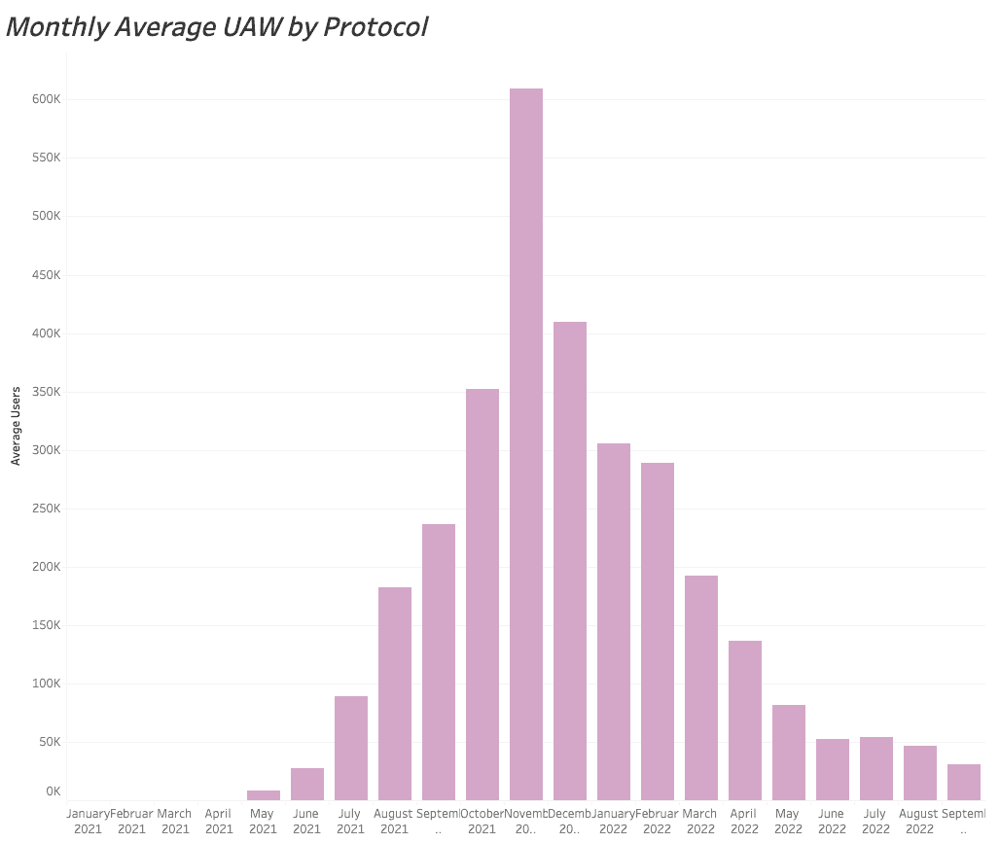
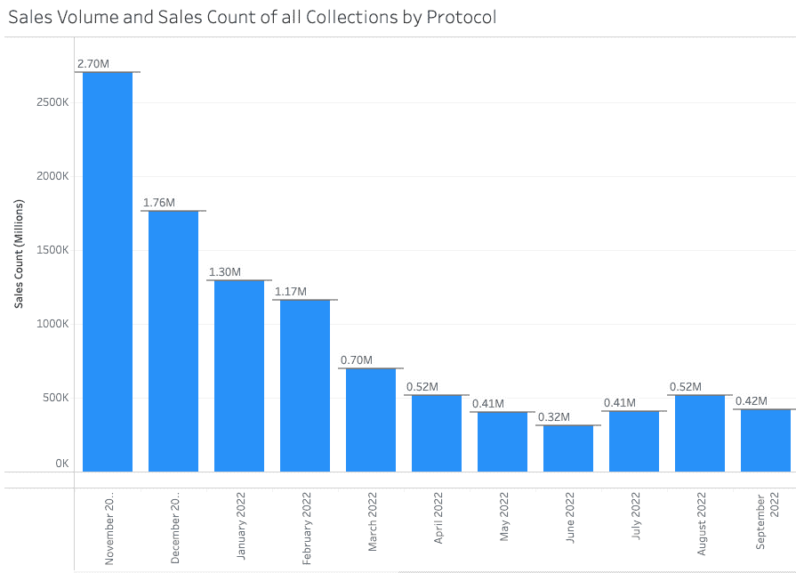

# Axie Infinity 是否正在重获新生？

> 原文：<https://web.archive.org/web/https://dappradar.com/blog/is-axie-infinity-regaining-its-spark>

## 新的土地所有者游戏和天空专家赌注可以消除 2022 年的麻烦

10 月 11 日，Axie Infinity 发布了一个面向地主的新游戏和 Sky Mavis 的一个大赌注承诺的消息。加上链上数据显示，我们的用户不再离开数以千计的平台，2023 年有希望成为 Axie 的好年景吗？

**总结**

*   ***相比 2021 年，Axie Infinity 度过了艰难的 2022 年。该游戏平台是 6 亿美元黑客攻击的受害者，目前正受到不景气的 Web3 行业的影响。***
*   新游戏的发布和 Axie 开发商 Sky Mavis 的大规模代币赌注计划应该有助于消费者信心。
*   链上数据还显示，虽然 Axie Infinity 的事情远非完美，但这艘船已经稳定下来，用户可以开始希望有一个更光明的未来。

2022 年对于 [Axie Infinity](https://web.archive.org/web/20221130150935/https://dappradar.com/multichain/games/axie-infinity) 来说是一个大杂烩。今年开局良好，但受到了游戏经济不景气、[破纪录的桥牌黑客攻击和现实世界中更广泛的系统性问题的影响。](https://web.archive.org/web/20221130150935/https://dappradar.com/blog/axie-infinity-activity-plummets-after-600-million-ronin-exploit)

幸运的是，有希望的迹象。Axie Infinity 已经为土地所有者推出了 Raylights 游戏，Sky Mavis 将持有 1148 万 AXS 代币作为对用户的长期承诺。

DappRadar 数据还显示，Axie Infinity 可能正在转危为安。自 2021 年 11 月至 2022 年 3 月大幅下跌后，NFT 交易自 4 月以来保持稳定。对于任何寻找希望的人来说，这些都是积极的信号。

[Check Axie Infinity Data](https://web.archive.org/web/20221130150935/https://dappradar.com/multichain/games/axie-infinity)

## Axie Infinity 的光线是活的

Axie Infinity 推出了其首款面向土地所有者的游戏。对于致力于 Axie 的社区来说，这是一个受欢迎的消息，他们已经等待 Sky Mavis 推出这样的东西三年了。

第一次 [Axie Infinity](https://web.archive.org/web/20221130150935/https://dappradar.com/multichain/games/axie-infinity) 土地出售发生在 2019 年 5 月，[土地标桩于今年 7 月](https://web.archive.org/web/20221130150935/https://dappradar.com/blog/axie-infinity-land-staking-is-live/)上线。现在，根据 Axie 的 Substack，土地所有者可以“在 Lunacia 播种矿物，种植植物，培育最美丽的土地。”

[https://web.archive.org/web/20221130150935if_/https://www.youtube.com/embed/VuR-QHvp68U?feature=oembed](https://web.archive.org/web/20221130150935if_/https://www.youtube.com/embed/VuR-QHvp68U?feature=oembed)

Raylights trailer

Raylights 本质上是 Axie Infinity 生态系统中的一个农业游戏。一般游戏围绕着在你的土地上播种植物，并照顾它们成熟。从这些，你可以收获矿物，这些矿物在将来可能会有一些转售价值。

[Axie Infinity](https://web.archive.org/web/20221130150935/https://dappradar.com/multichain/games/axie-infinity) 将于美国东部时间 10 月 21 日晚上 11:30 推出两场 Raylights 比赛。一个是世界第一，另一个是最具美感的&创意剧情。

[Axie Infinity Data](https://web.archive.org/web/20221130150935/https://dappradar.com/multichain/games/axie-infinity)

## sky mavis 致力于 axs starking 计划

Axie Infinity 的其他好消息是，Sky Mavis Ltd 将下注 11，475，000 AXS。AXS 是 Axie Infinity 的游戏货币。该公司在 10 月 11 日发布的一系列推文中给出了理由。

> 1/
> 
> 为了加强我们对 Axie Infinity 生态系统的长期承诺，Sky Mavis，Ltd .将在其资产负债表上增加 11，475，000 AXS。
> 
> — Sky Mavis (@SkyMavisHQ) [October 11, 2022](https://web.archive.org/web/20221130150935/https://twitter.com/SkyMavisHQ/status/1579749776840880130?ref_src=twsrc%5Etfw)

Sky Mavis tweet

这一举动可以从几个方面来看:要么这是一个善意的姿态，表明长期的承诺。或者是 Sky Mavis Ltd 试图重振他们的经济和对他们游戏的热情。

最终，可能两者都有一点，这一举动将给 Axie Infinity 社区带来信心，该社区已经看到其 AXS 的价值全年沿着缓慢、悲伤的下行曲线行进。

[Check AXS Price](https://web.archive.org/web/20221130150935/https://dappradar.com/hub/token/eth/AXS?from=0xbb0e17ef65f82ab018d8edd776e8dd940327b28b)

## Axie Infinity 链上数据是否指向更光明的未来？

今年 1 月，Axie Infinity 的浪人区块链拥有 305，688 个独特的活跃钱包(UAW)连接。四个月后，这一数字下降了 73%，至 5 月份的 81，937 次连接。

Source: [DappRadar](https://web.archive.org/web/20221130150935/https://dappradar.com/rankings/protocol/ronin)

在同一时期，整个区块链的 UAW 连接仅下降了 18%，从 362 万降至 295 万。因此，Axie 的问题不仅仅是更广泛的行业趋势的一部分；天空梅维斯有问题。

Source: [DappRadar](https://web.archive.org/web/20221130150935/https://dappradar.com/rankings)

积极和希望的迹象来自 Axie Infinity NFT 市场，我们可以看到，在过去的六个月里，交易和销量已经稳定下来。自 4 月份以来，交易数量(发生的单笔交易数量)一直保持在 32 万至 52 万之间。

Source: [DappRadar](https://web.archive.org/web/20221130150935/https://dappradar.com/nft/protocol/ronin)

虽然交易活动确实离我们在 2021 年看到的峰值还有一段距离，但下降已经停止的事实表明，这可能是 Axie Infinity 的底部。如果是这样的话，他们将会把烦恼抛在脑后，期待一个光明的未来。

[Explore Axie Infinity NFTs](https://web.archive.org/web/20221130150935/https://dappradar.com/hub/nft-explorer/collection/axie-infinity)

## 随身携带您的 Web3 之旅

使用 DappRadar 移动应用程序，再也不会错过 Web3。查看最受欢迎的 dapps 的性能，并关注您投资组合中的 NFT。您在 DappRadar 上的帐户会与我们的移动应用程序同步，这样您很快就可以选择实时接收提醒。

[Download the DappRadar app now](https://web.archive.org/web/20221130150935/https://dappradar.app.link/blog)[<picture></picture>](https://web.archive.org/web/20221130150935/https://play.google.com/store/apps/details?id=com.portfolio.dappradar) NewsletterUnsubscribe at any time. [T&Cs](https://web.archive.org/web/20221130150935/https://dappradar.com/terms) and [Privacy Policy](https://web.archive.org/web/20221130150935/https://dappradar.com/privacy-policy)