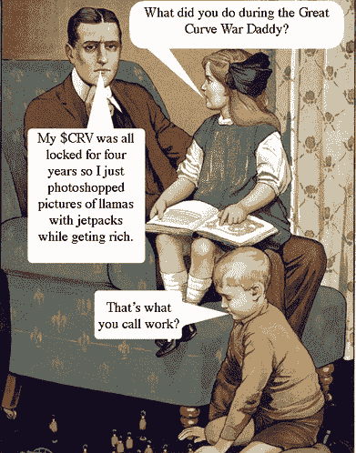
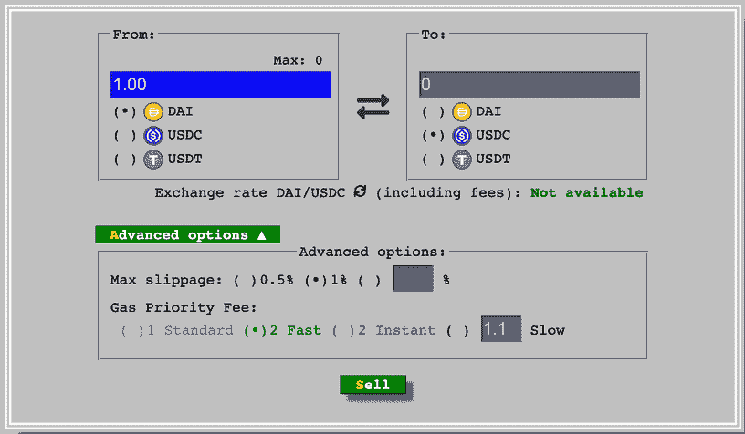
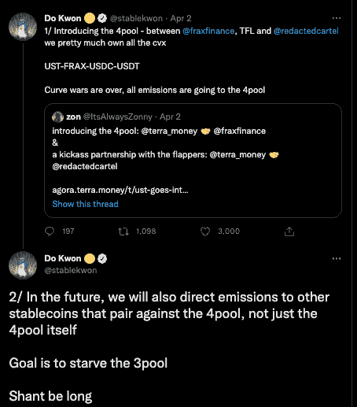
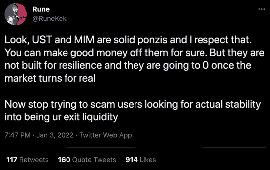

# Terra 是不是想杀了刀匠戴的 Stablecoin？

> 原文：<https://web.archive.org/web/https://dappradar.com/blog/is-terra-trying-to-kill-maker-daos-dai-stablecoin>

## 曲线战争又回来了

Terra 正试图通过在曲线融资上阻碍戴的流动性，来扼杀“道”及其“戴稳定圈”。他们通过在曲线上推出一个新的池来做到这一点，该池省略了戴稳定币。如果没有流动性，戴可能会失去其与美元的联系汇率，甚至跌至零，这将在此过程中摧毁制造商道的标志。

## 摘要

*   前 CEO 马克尔道称泰拉的 UST stablecoin 是一个庞氏骗局
*   Terra [的首席执行官在 Twitter](https://web.archive.org/web/20221206182220/https://twitter.com/stablekwon/status/1510021709776449543) 上宣布了通过吸引投资者到他的 Curve 4pool 来饿死 Curve Finance 3pool 的计划。
*   [曲线金融](https://web.archive.org/web/20221206182220/https://dappradar.com/multichain/defi/curve)上的新池省略[戴稳定币](https://web.archive.org/web/20221206182220/https://dappradar.com/hub/token/eth/DAI?from=0x6b175474e89094c44da98b954eedeac495271d0f)。
*   如果戴成功的话，它可能会失去与美元的联系，进而，[可能会崩溃。](https://web.archive.org/web/20221206182220/https://dappradar.com/hub/token/eth/MKR/ETH?from=0x9f8f72aa9304c8b593d555f12ef6589cc3a579a2)

曲线战争可以被描述为不同 DeFi 协议之间的战争，这些协议需要不断确保它们使用的池提供最高的 CRV 奖励。

Curve Finance (CRV)是最重要的 DeFi 协议，专门从事稳定的货币互换，锁定了 210 亿美元的总价值。此外，Curve 的 CRV 治理令牌市值超过 10 亿美元。Curve 是最大的分散交易所(DEX ),它为以太坊上的稳定货币提供了最大的流动性。它的流动资金池由 Fantom、Yearn Finance、Aave、SushiSwap、Synthetix、Badger DAO、Cream Finance、Compound 和其他公司使用。

将 CRV 锁定在 veCRV 的用户可以获得 CVX、寿司和 SDT 等形式的利润丰厚的农业奖励。此外，锁定 CRV 的用户可以获得交易费、治理权和额外奖励。

戴在历史上比重要得多，但在 2021 年 12 月，推翻了戴。UST 是泰拉的稳定货币，与美元挂钩，美元在 2021 年越来越受欢迎，市值达到 160 亿美元。戴是道公司与美元挂钩的稳定货币，市值 90 亿美元。

*The fate of DeFi lies in the hands of a WIndows 98’ looking protocol*

从 DeFi dapp 的角度来看，被纳入受欢迎的曲线池可以显著提高项目的流动性。此外，随着越来越多的 veCRV 加入流动性池，其收益率也会上升。对于拥有大量 CRV 的大型项目，有可能将奖励提高 2.5 倍。

凸金融(CVX)是建立在曲线金融之上的激励协议。凸奖励曲线流动性提供者和 CRV 代币持有者，允许他们将资产押在曲线上，以获得比曲线提供的更高的收益率。简单来说，每个使用 Convex 的人都将他们的资产集中在一起，这样平台就可以获得更多的 CRV，将其转化为 veCRV，然后向所有 Curve LP 令牌持有者提供最高的回报。

## 阴谋还是事实？

Terra 的创始人兼首席执行官 Do Kwon 丝毫没有隐藏他的意图。相反，他于 4 月 2 日在 Twitter 上宣布了通过吸引投资者到他的 Curve 4pool 来饿死 Curve Finance 3pool 的计划。戴是唯一不在 4 号位的稳定球员，这就说明了一切。

有趣的是，这场口水战，以及现在的行动，始于 2022 年 1 月，制造商道的原始联合创始人指控 UST 是一个庞氏骗局。虽然这纯粹是猜测，但在秘密空间中制造一个像 Terra 这样强大的敌人可能会引起反响。

## 为什么 3pool 如此重要？

Curve 的 3pool 是分散式金融和加密领域中最大、利用率最高、最稳定的货币流动性池。流动性池允许投资者以非常低的滑点和费用互换戴、和稳定债券。如今，3pool 拥有 32 亿美元的流动性，其中 45%是戴代币。几乎所有的 stablecoins 都与 3pool 配对以获得流动性。如果你在一个指数上将 UST 换成 USDC，它很有可能利用 3pool 来获得流动性。

此外，3pool 是维持、、戴联系汇率的关键基础设施，对 DeFi 的运行至关重要。因为 3pool，，，和戴在历史上一直是交易者和投资者最认可的稳定币选择。Terra 对这个资金池的攻击将对戴造成最大伤害，因为 3 资金池为戴提供了大量流动性，而 USDC 和 USDT 与 UST 一起被纳入新的 4 资金池。

Terra 与 Frax 联手，并编辑卡特尔，以实现其推翻戴和制造商道的目标。Frax 是 CVX 代币最大的分散持有者，Redacted Cartel 拥有的 CVX 大约是 Frax 的三分之二。加上 Terra，这三个政党持有大约 10%的 CVX 选票。利用这个 CVX 作为激励，4pool 背后的团队可以向在 4pool 中持有稳定股份的投资者提供更高的回报。似乎有理由认为，这将促使投资者从 3 号池转向新的 4 号池，从而有效地将戴排除在等式之外。

## 生存斗争

制造者道把新的曲线战争描述为生存而不是利润的斗争。戴背后的刀确实财大气粗，但不清楚他们会不会用它来撑起三潭。Convex 最重要的鲸鱼 Tetranode 也在 Terra 的 4pool 声明后开始了新的冒险。

根据最新的 [Q1 Dapp 行业报告](https://web.archive.org/web/20221206182220/https://dappradar.com/blog/dapp-industry-report-q1-2022-overview) Terra 已经成为仅次于以太坊的 TVL 第二大网络，截至 3 月底锁定了 230 亿美元，比 2021 年底增加了 68%。由于有效的稳定的生态系统和像 Anchor 这样提供有竞争力的产量的 DeFi 协议，Terra 已经成为主导的 DeFi 力量。Terra 持有该行业约 10%的 TVL，是仅次于以太坊 60%的 TVL 优势的第二大网络。

拿出你的爆米花，因为这只会变得更有趣。

 NewsletterUnsubscribe at any time. [T&Cs](https://web.archive.org/web/20221206182220/https://dappradar.com/terms) and [Privacy Policy](https://web.archive.org/web/20221206182220/https://dappradar.com/privacy-policy)

***以上不构成投资建议。此处给出的信息仅供参考。请行使尽职调查，做你的研究。作者持有多种加密货币的头寸，包括 BTC、瑞士法郎和雷达。***