# 加入 Everscale 培训计划，获得学习和资助机会

> 原文：<https://web.archive.org/web/https://dappradar.com/blog/join-everscale-traineeship-for-learning-and-funding-opportunities>

## 为 DeFi、CBDC 等公司打造的创新分散平台。

Everscale 是一个基于 Ever OS 的分散式点对点区块链网络。这个动态多线程、分片的区块链有可能将其吞吐量提升到每秒一百万个事务。最近，Everscale 推出了一项培训计划，以支持雄心勃勃的开发人员加入其快速增长的生态系统。

**内容:**

*   Everscale 是什么？
*   Everscale 的独特之处是什么？
*   Everscale 充满活力的生态系统
*   让我们从 Everscale 开始编码:一步一步的教程
*   加入 Everscale 培训，建立可扩展的 dapps

Everscale 坚信，未来属于那些为现实世界公用事业应用奠定基础的区块链网络。它致力于让 Web 3.0 和我们复杂交织的经济中的实体部门受益。

为了实现这一点，分布式 Everscale 的团队昼夜不停地开发新的解决方案。除了已经投入使用的 DeFi、GameFi 和 NFT 项目，这些解决方案还面向 CBD 和私立区块链。这些都是我们遥遥领先的领域，因为我们从 Everscale 区块链成立伊始就开始探索这些领域。

Everscale 最近一直在获得动力，但社区希望邀请更多准备挑战自己并利用新兴技术服务全球数百万用户的开发人员。

[Learn more about Everscale](https://web.archive.org/web/20221130134137/https://bit.ly/3eea3BS)

为此，Everscale 推出了培训计划，为开发人员提供学习构建其高性能网络的机会。此外，它允许团队获得赞助以加速他们的项目。

除此之外，Everscale 还准备了一个由四部分组成的旅程，帮助开发人员更好地了解这个开创性的网络。它包括

1.  介绍性文章(你现在在这里)。
2.  对艾弗斯卡·区块链建筑的探究。
3.  Everscale 的 CBDC、DeFi 和私人通信解决方案概述。
4.  开发者支持项目概述:培训、资助和风险投资。

在今天的文章中，我们将向您介绍 Everscale 的优势，以及如何一步一步地在其网络上创建 dapps。

如果您已经熟悉 Everscale，请跳过此介绍，通过部署您的第一个智能合同来测试您的技能。

**[开始编码](https://web.archive.org/web/20221130134137/https://dappradar.com/blog/join-everscale-traineeship-for-learning-and-funding-opportunities/#Let's-start-coding) [提问](https://web.archive.org/web/20221130134137/https://bit.ly/3e5c977)**

*部署您的第一份智能合同。*

如果你是一个新手，请继续阅读这个简短的介绍，以了解什么是 Everscale。很快你也会编码。

## Everscale 是什么？

Everscale 是一个由社区管理的区块链，具有很高的增长潜力，旨在解决其他平台的局限性。截至目前，它每秒可以处理 64000 笔交易，有可能达到 100 万笔。

由于其开发人员友好的编程模型算法，它是构建 dapps、分散式通信服务和 CBDCs 的理想选择。Everscale 开发了一种独特的分片方式，引入了分散式机器人(DeBots)和一种创新的解决方案来处理数据存储，以提高可扩展性并降低最终用户的成本。

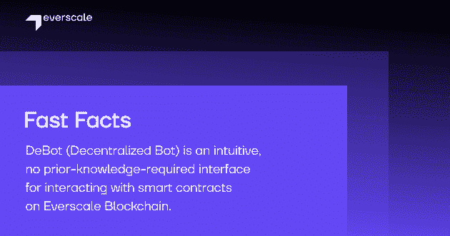

Everscale 的推出可以追溯到 2020 年，通过合并和后续升级前顿区块链架构。从那时起，它就在快速扩张。因此，越来越多领先的 dapps 和公用事业驱动的服务登陆它。用户可以通过下面的按钮找到所有正在运行的项目和正在开发的项目。

[Projects on Everscale](https://web.archive.org/web/20221130134137/https://everkit.org/en/ecosystem)

## Everscale 的独特之处是什么？

Everscale 平台提供了许多开创性的特性，使其有别于其他竞争对手，例如动态多线程、软多数共识和分布式编程。这些特性使得 Everscale 具有可伸缩性、快速性和安全性。

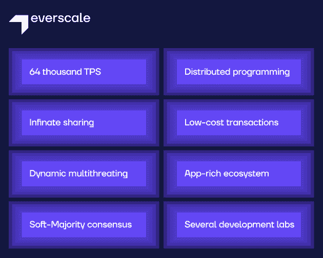

### 健壮的操作系统

Everscale 是一个独特的区块链设计，它提出了一个可扩展的、分散的世界计算机，配有一个分布式操作系统——Ever OS。该系统拥有诸如图灵完全智能合约、可靠性编译器和分散用户界面(编写为称为 DeBots 的智能合约)等功能。

最重要的是，以往的操作系统可以并行处理消息，消除了 dApp 的可扩展性界限。

### 强大的开发工具

让我们仔细看看开发人员工具。其中包括 Solidity 和 C++的编译器、API、SDK、13 种编程语言的客户端库和一个用于 dapp 测试的本地节点。

还有呢？Everscale 还拥有 CLI 工具和钱包，支持 DeFi、NFT 和令牌化领域的许多应用。

另外，Everscale 最近发布了一款 NFT 和一款游戏 SDK。这些 SDK 支持 NFT 发行和刻录、游戏内市场和土地令牌化。SDK 将允许开发者在 Everscale 上轻松构建 NFT 和游戏项目。

### 分权治理

此外，Everscale 通过软多数投票协议采用分散式方法管理其社区，并建立在精英原则的基础上。

这些伟大的功能仅仅是 Everscale 的开始。分布式团队一直致力于改进当前的特性，并为网络实现新的技术解决方案。

[Check out Everscale](https://web.archive.org/web/20221130134137/https://bit.ly/3eea3BS)

## Everscale 充满活力的生态系统

尽管 Everscale 只有不到两年的历史，但其网络扩张的速度是惊人的。

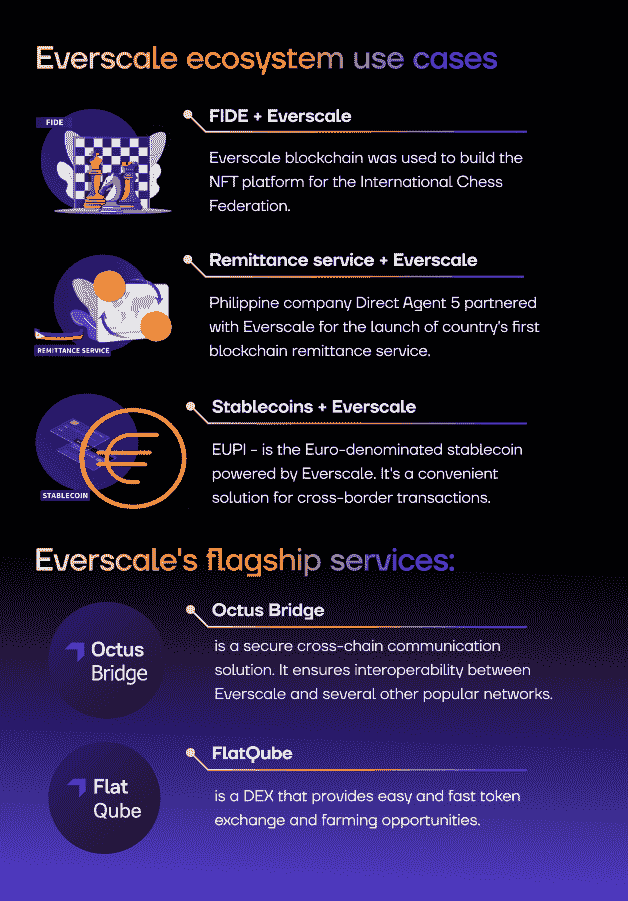

Octus Bridge 为 Everscale 网络带来互操作性。具体来说，它促进了 Everscale 和其他几个流行网络之间的跨链传输。

FlatQube 是 Everscale 生态系统流动性的枢纽。它为用户提供了一个方便的代币交换，并允许他们参与产量农业的流动性池。

除此之外，许多知名机构和公司都选择在该平台上进行构建。例如，国际象棋联合会(FIDE)利用 Everscale 区块链构建了其 NFT 驱动的平台。

此外，金融行业也能从 Everscale 中获益良多。例如，Everscale 可以让跨境交易变得高效、透明和安全。

受益于 Everscale 的 DeFi 基础设施的项目包括 EUPI、可 1:1 兑换欧元的 stablecoin、Direct Agent 5、菲律宾的汇款服务等等。

[Learn more about Everscale](https://web.archive.org/web/20221130134137/https://bit.ly/3eea3BS)

## 让我们从 Everscale 开始编码:一步一步的教程

### 设置 Everscale 的开发环境

最初的几个开发步骤可能是最困难的，因为开发人员不知道什么工具可以使他们的工作更容易。作为回应，Everscale 向开发人员提供了一套全面的说明，解释如何设置他们的 Everscale 工作区。

#### 选择您的开发环境

在这里，在 Everscale，开发者可以找到集成开发环境(IDE)的两个选项， **Everdev** 和 **Locklift** 。两者都包括与 Everscale 区块链交互、编译、部署和测试智能合约的工具的最新版本。

*   Locklift(我们将使用它来部署我们的第一个智能合同)
*   Everdev(我们将使用它来生成密钥)

首先，请确保安装了以下各项。

*   节点 JS–版本 14 或更高版本
*   docker–版本 19 或更高版本
*   Everscale Solidity 编译器(在 Windows 上需要 VC++运行时)。

### 安装 Locklift 以简化智能合同开发

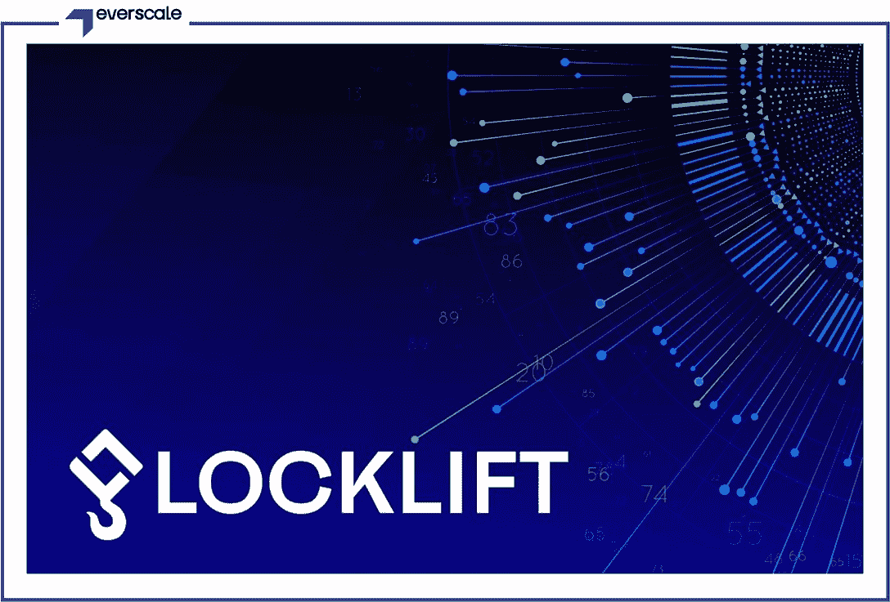

使用 Locklift，您可以:

*   网络管理(mainnet、testnet 和本地节点配置)
*   使用 Mocha 进行自动化合同测试
*   围绕 Everscale 智能合约的便捷包装
*   带有测试令牌的预部署钱包
*   密钥对管理
*   外部脚本运行程序，类似于 hardhat

### 安装

1.  让我们为您的第一个项目创建一个空目录。

2.  **太好了！**现在您可以安装 Locklift 了。

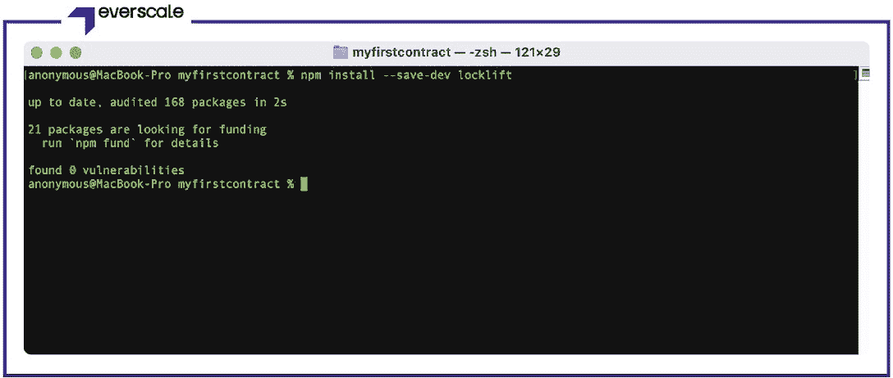

3.  运行 npx locklift–version 以确保 lock lift 安装成功。

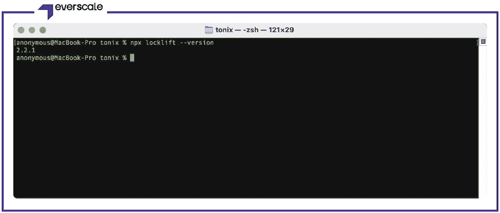

4.  干得好！让我们在 VS 代码编辑器中打开您的项目。

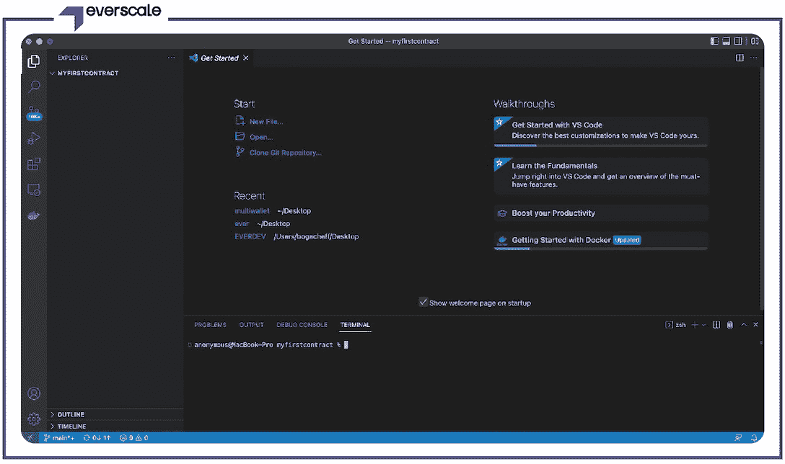

5.  让我们初始化项目。为此，请在终端中运行以下命令。要在当前目录中初始化，请参考以下内容。

有关指定新名称的信息，请参见下文。

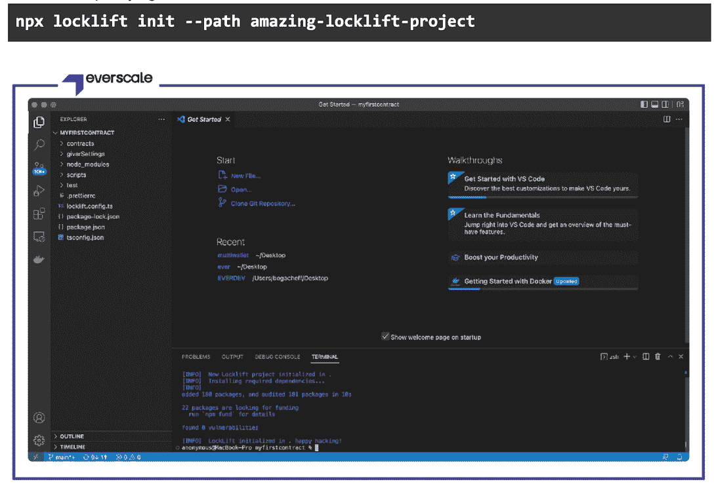

6.  干得好！让我们用一个智能合约示例初始化您的测试 Locklift 项目。

您可以看到您的 Sample.sol 智能合约出现在目录中。

7.  现在，让我们转到 locklift.config.ts，你可以在下图中看到这个字符串。

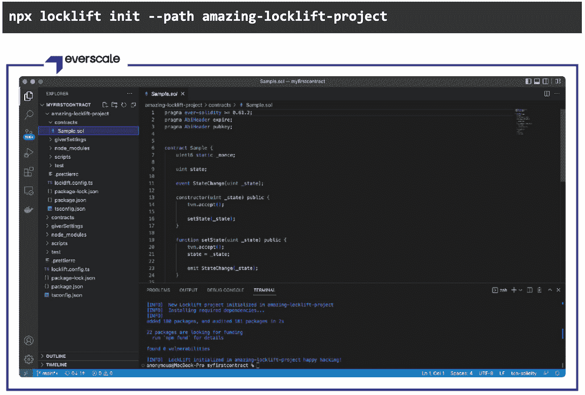

使用 **tonos-cli** 生成密钥(该实用程序随 everdev 包提供)，然后在第 75 行用您的密钥替换测试密钥。

使用命令 tonos-cli genphrase 。

8.  该命令使用 TON Solidity 编译器和 TVM 链接器来构建项目的所有智能合约。

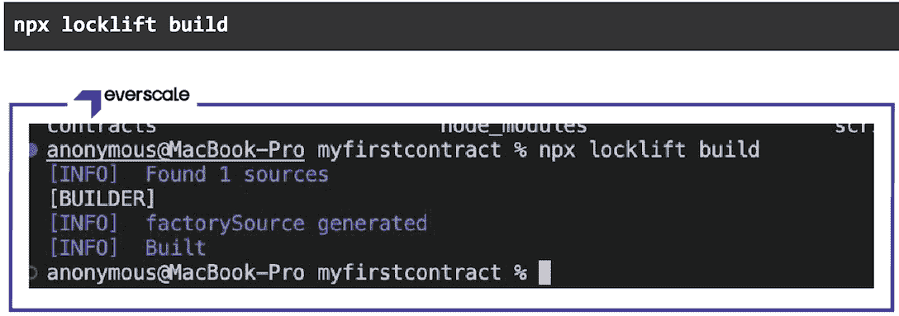

9.  下面的命令运行 Mocha 项目的测试。Locklift 对象将被自动配置和启用。不需要手动导入。

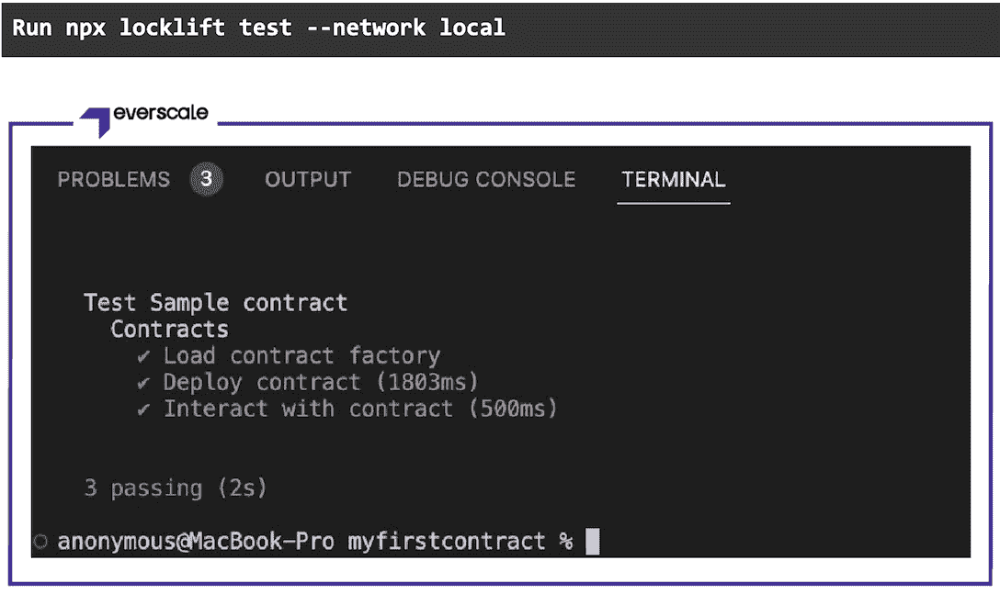

MochaJS 是一个 JavaScript 框架，用于应用程序的自动化测试。它既可以在 Javascript 服务器上使用，也可以在浏览器中使用。

**ChaiJS** 是 Node JS 的库，和 Mocha 一样，也可以在服务器上使用，也可以在浏览器中使用。Chai 可以与任何库一起用于测试。

### 现在让我们看看智能合约本身

指明 Solidity 编译器的版本，以避免新的编译器在将来影响您的代码。

您可以访问 EverX(例如。，TON Labs)储存库通过[这个链接](https://web.archive.org/web/20221130134137/https://github.com/tonlabs)。它将为你提供编译器的源代码，你可以免费使用。对于编译器 API 文档，请点击[这个链接。](https://web.archive.org/web/20221130134137/https://github.com/tonlabs/TON-Solidity-Compiler/blob/master/API.md)

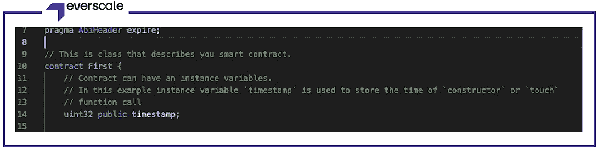

变量通常在类 contract {$CONTRACT-NAME} {}中声明

让我们检查一下函数构造函数()public {。

**构造函数**是只执行一次的函数。也就是说，当智能合同部署在区块链上时。
让我们将以下变量添加到我们的合同 uint32 公共时间戳中；

现在我们来给函数 timestamp = now 赋值；。

这意味着函数执行结果将包含在部署期间的 timestamp 变量中，该变量以 UnixTime 格式返回当前时间(1662380751)。

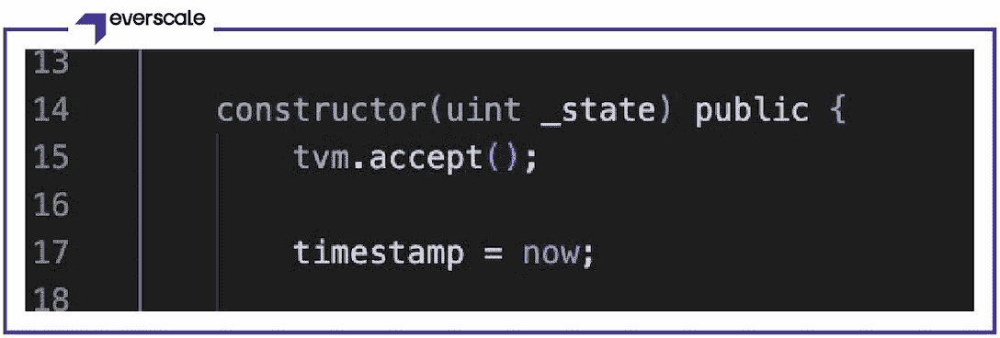

#### 更多关于 ABI 计划。

ABI 代表应用程序二进制接口。它用于调用应用程序二进制文件。

***.abi.json** 是一个告诉区块链如何处理代码的 json 文件。它还列出了我们的智能合同的所有功能。

智能协定生成的 ABI 是一个 JSON 格式的数组，包含两组参数:名称和值。调用智能合约时，您可以使用 ABI 来了解智能合约实现了哪些功能和参数。

编译后，我们将得到下面的 ABI。

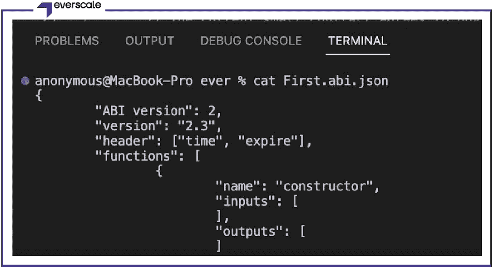

让我们在测试网络上运行我们的脚本。

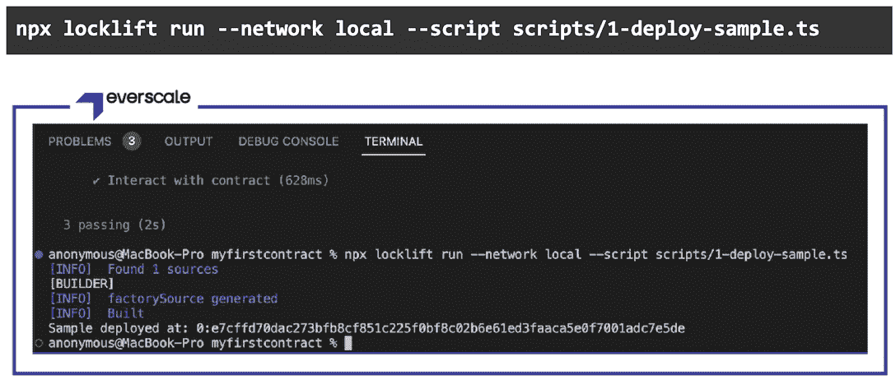

现在，您可以看到智能合约已经成功编译并部署在测试网络上。

智能合同的地址如下:

**0:e 7 cffd 70 DAC 273 bfb 8 cf 851 c 225 f 0 BF 8 c 02 b 6 e 61 ed 3 faaca 5 e0f 7001 ADC 7 E5 de**

## 加入 Everscale 培训，建立可扩展的 dapps

Everscale 的高吞吐量、即时终结性和强大的工具使区块链对开发人员非常友好，是 DeFi、NFTs、CBDCs 和私有区块链等用例的理想选择。获得批准的参与者可以获得资金赞助以及技术和营销指导。

如果您对编码部分有任何疑问，或者准备参加培训，请不要犹豫，通过此链接加入 Everscale 的电报聊天[。](https://web.archive.org/web/20221130134137/https://bit.ly/3e5c977)

关于 Everscale 技术的详细信息，欢迎您[查阅开发者文档](https://web.archive.org/web/20221130134137/https://bit.ly/3e84TY6)和[网络网站](https://web.archive.org/web/20221130134137/https://bit.ly/3eea3BS)！

Everscale 的扩展之旅才刚刚开始。下一次我们将深入到 Everscale 区块链建筑中去更深入地理解它。[在 Twitter 上关注 Everscale](https://web.archive.org/web/20221130134137/https://bit.ly/3RUWIMl)成为第一个知道最新更新的人！

**免责声明** —这是一篇赞助文章。DappRadar 不认可本页面上的任何内容或产品。DappRadar 旨在提供准确的信息，但读者应该在采取行动之前总是自己做研究。DappRadar 的文章不能被认为是投资建议。