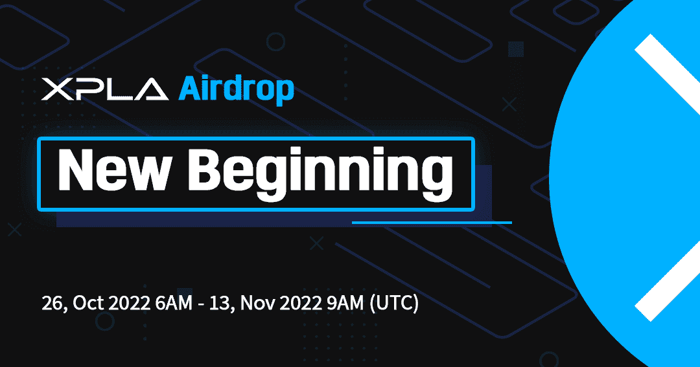
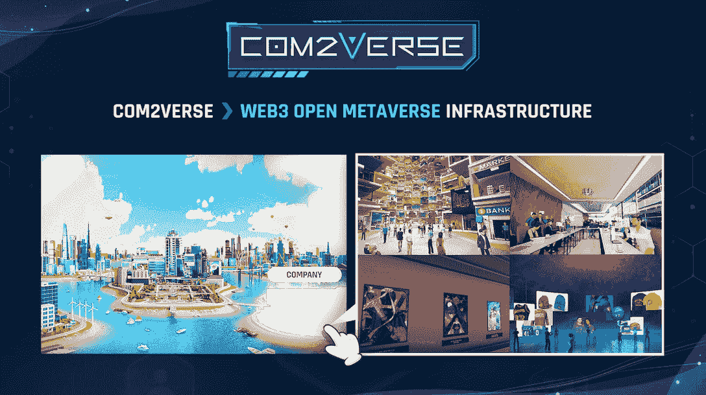

# 加入 XPLA Airdrop，为构建 Web3 娱乐做出贡献

> 原文：<https://web.archive.org/web/https://dappradar.com/blog/join-xpla-airdrop-and-contribute-to-building-the-web3-entertainment>

## XPLA 是 Web3 数字媒体内容中心

XPLA Chain 是一个开源的区块链，拥有充满活力的 dapps 生态系统和顶级开发工具。它旨在为 Web3 的娱乐产业提供必要的基础设施。10 月 26 日至 11 月 13 日期间，XPLA 正在为其本地令牌(也称为 XPLA)进行空投。

数字化从根本上改变了现代人的生活方式，在娱乐领域尤其如此。[根据 Allied Market Research](https://web.archive.org/web/20221128081540/https://www.alliedmarketresearch.com/online-entertainment-market-A06413) 的数据，2019 年在线娱乐市场规模估计为 1831 亿美元，预计到 2020 年将达到 6525 亿美元

2027 年，2021-2027 年 CAGR 为 20.82%。

在这些惊人的数字中，很大一部分将来自 Web3 项目。这是因为，在 Web2 时代，用户无法控制自己的在线数据，这带来了隐私泄露、个人数据滥用等问题。

Web3 保证您对数据、资产和数字身份的所有权，并保护您的数据隐私。许多项目都致力于改进 Web3，包括 XPLA，Web3 数字媒体内容的基础设施构建者。

作为用户，你现在可以参与 XPLA 的硬币空投，成为这个分散网络的早期贡献者，并为此获得奖励。

**内容:**

*   [XPLA 是什么？](https://web.archive.org/web/20221128081540/https://dappradar.com/blog/join-xpla-airdrop-and-contribute-to-building-the-web3-entertainment/#what)
    *   [游戏](https://web.archive.org/web/20221128081540/https://dappradar.com/blog/join-xpla-airdrop-and-contribute-to-building-the-web3-entertainment/#gaming)
    *   [娱乐](https://web.archive.org/web/20221128081540/https://dappradar.com/blog/join-xpla-airdrop-and-contribute-to-building-the-web3-entertainment/#entertainment)
    *   [元宇宙](https://web.archive.org/web/20221128081540/https://dappradar.com/blog/join-xpla-airdrop-and-contribute-to-building-the-web3-entertainment/#metaverse)
*   [XPLA 币是什么？](https://web.archive.org/web/20221128081540/https://dappradar.com/blog/join-xpla-airdrop-and-contribute-to-building-the-web3-entertainment/#xpla)
*   [如何加入空投？](https://web.archive.org/web/20221128081540/https://dappradar.com/blog/join-xpla-airdrop-and-contribute-to-building-the-web3-entertainment/#join)
    *   [下载并安装 XPLA Vault 参与](https://web.archive.org/web/20221128081540/https://dappradar.com/blog/join-xpla-airdrop-and-contribute-to-building-the-web3-entertainment/#download)
    *   [完成任务](https://web.archive.org/web/20221128081540/https://dappradar.com/blog/join-xpla-airdrop-and-contribute-to-building-the-web3-entertainment/#complete)
*   [有用的链接](https://web.archive.org/web/20221128081540/https://dappradar.com/blog/join-xpla-airdrop-and-contribute-to-building-the-web3-entertainment/#links)

## XPLA 是什么？

XPLA 由 Metamagnet 与其主要合作伙伴 Com2uS Group 共同构建，是致力于分散在线娱乐内容的下一代网络。XPLA 代表探索和玩耍。

作为一个以 Cosmos 为动力、面向娱乐的第 1 层网络，XPLA 提供了一个独特的基础设施来连接 Web2 和 Web3 服务。该生态系统基于社区驱动的用户反馈，努力培育 Web3 游戏、艺术、音乐和 dapps。

[Join XPLA airdrop](https://web.archive.org/web/20221128081540/https://gleam.io/oBld9/xpla-airdrop-event)

### 赌博

XPLA 由区块链游戏平台 C2X 演变而来，该平台也是由 Metamagnet 开发的。XPLA 发布后，C2X 将继续作为一个游戏平台存在于 XPLA mainnet 上。此外，该网络将成为任何第三方工作室构建游戏和创建媒体内容的中心。

一个充满活力的生态系统已经在 C2X 平台上蓬勃发展。可供体验的游戏包括半音阶灵魂、召唤师战争、Kritika Global，以及更多即将推出的游戏。

[Join XPLA airdrop](https://web.archive.org/web/20221128081540/https://gleam.io/oBld9/xpla-airdrop-event)

### 娱乐

在 Web3 之前，大公司在很大程度上控制了娱乐内容。但是在 Web3 中情况会有所不同。希望所有权将从平台转移到实际生产内容的创作者手中。

此外，Web3 将为艺人和他们的粉丝创造一种新的激励模式。

XPLA 为上述成为现实打下了坚实的基础。该网络还与娱乐行业的各种团队合作，包括 Rainbowbridge World、WYSIWYG Studios、My Music Taste 等。

### 虚拟空间

XPLA 也已经有了一个在开发阶段的本地元宇宙链。Com2Verse 由 Com2uS 开发，是一个庞大的、包罗万象的元宇宙平台。它高度再现了虚拟世界中的真实生活。随着现实世界的社交、文化和经济被转移到数字世界，用户现在可以来到 Com2Verse，打造他们理想的虚拟生活空间。

## XPLA 币是什么？

XPLA 是 XPLA 链的原生币。XPLA 实现了治理和赌注的目的。

由于 XPLA 链是一个利益攸关的区块链，它采用了一个利益攸关的过程来促进其共识。赌注是将 XPLA 绑定到验证器以换取赌注奖励的过程。

治理是民主的过程，允许用户和验证者治理 XPLA 链的开发和操作。社区成员提交、投票并实施提案。每个社区成员都可以拥有与自己的股份比例相等的投票权。一个赌注 XPLA 等于一票。

加入 XPLA 的空投可以让用户提前参与这个区块链，并获得更多的好处。

[Join XPLA airdrop](https://web.archive.org/web/20221128081540/https://gleam.io/oBld9/xpla-airdrop-event)

## 如何加入空投？

在 10 月 26 日至 11 月 13 日期间，将向幸运的 3100 名获奖者空投 43000 份 XPLA，您也可以在下面找到如何成为获奖者之一的详细信息。

### 下载并安装 XPLA Vault 来参与

XPLA Vault 是用于管理 XPLA 生态系统中所有令牌和 NFT 的标准钱包。

虽然 XPLA 在 8 月底刚刚推出了他们的 Genesis Block，但 XPLA 在 2022 年期间已经执行了重要的合作伙伴关系，并已经拥有超过 6 个可靠的在链项目。

没有人能预测 XPLA 的价格会涨到多高，但它肯定值得考虑，特别是在主要的第一层网络的天然气费用仍然很高，加密游戏继续增长的情况下。这是一个机会，使您的加密组合多样化，同时赚取可观的回报。

下载 xplayvault:

[iOS](https://web.archive.org/web/20221128081540/https://apps.apple.com/app/xpla-vault/id1640593143)|[AOS](https://web.archive.org/web/20221128081540/https://play.google.com/store/apps/details?id=xpla.android)|[Chrome](https://web.archive.org/web/20221128081540/https://chrome.google.com/webstore/detail/xpla-vault-wallet/ocjobpilfplciaddcbafabcegbilnbnb)|[Web](https://web.archive.org/web/20221128081540/https://vault.xpla.io/)|[Chrome](https://web.archive.org/web/20221128081540/https://chrome.google.com/webstore/detail/xpla-vault-wallet/ocjobpilfplciaddcbafabcegbilnbnb)|[Firefox](https://web.archive.org/web/20221128081540/https://addons.mozilla.org/ko/firefox/addon/xpla-vault-wallet/)

### 完成任务

*   访问 XPLA 网站
*   关注 XPLA Twitter 账户
*   转发 XPLA 的推文
*   用#XPLA 发布推文
*   关注 XPLA 的媒体账户
*   加入 XPLA 的官方电报群聊
*   关注 C2X 的推特账户
*   下载 XPLA Vault 并提交地址
*   *请确保您提交了正确的地址，否则即使您赢得了 airdrop，也不会收到它。
*   解答简单的测验
*   邀请你的一个朋友

[Start completing the tasks right now](https://web.archive.org/web/20221128081540/https://gleam.io/oBld9/xpla-airdrop-event)

## 有用的链接

*   [网站](https://web.archive.org/web/20221128081540/https://xpla.io/)
*   [中等](https://web.archive.org/web/20221128081540/https://medium.com/@XPLA_Official)
*   [推特](https://web.archive.org/web/20221128081540/https://twitter.com/XPLA_Official)
*   [TG(官方)](https://web.archive.org/web/20221128081540/https://t.me/Official_XPLA)
*   [TG(Kor)](https://web.archive.org/web/20221128081540/https://t.me/XPLA_Korea)

**免责声明** —这是一篇赞助文章。DappRadar 不认可本页面上的任何内容或产品。DappRadar 旨在提供准确的信息，但读者应该在采取行动之前总是自己做研究。DappRadar 的文章不能被认为是投资建议。