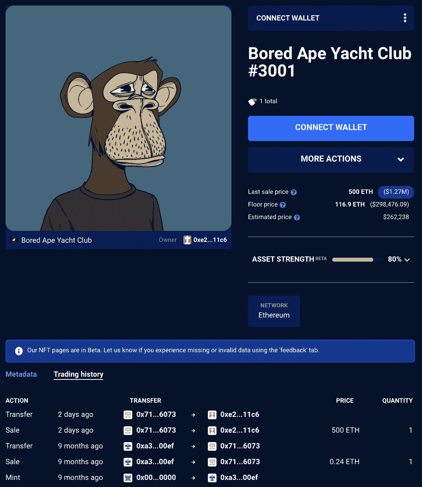
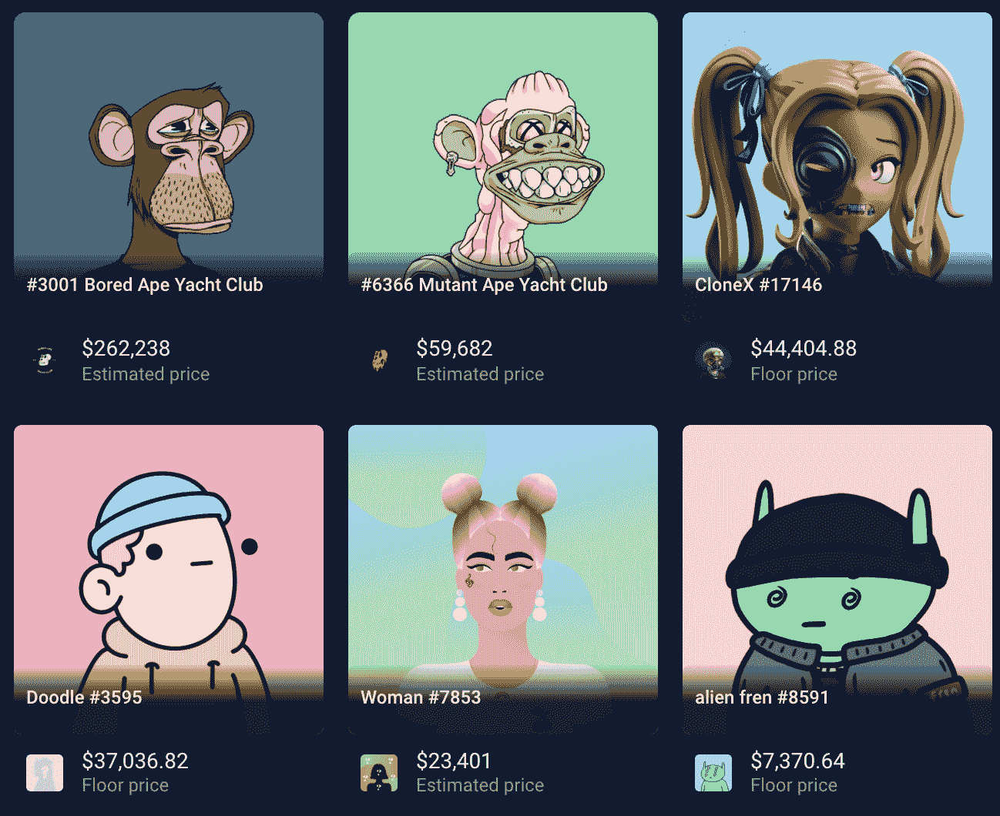

# 贾斯汀比伯花了 131 万美元买了一辆 NFT

> 原文：<https://web.archive.org/web/https://dappradar.com/blog/justin-bieber-splurged-on-a-bayc-nft-for-1-31-million>

## 这位音乐明星以高出底价很多的价格购买了 BAYC #3001

随着价值 131 万美元的巨额收购，贾斯汀比伯再次成为头条新闻。这位音乐家现在拥有 BAYC # 3001 然而，这不是他第一次购买 NFT。他的投资组合持有价值超过 570，000 美元的 1517 份 NFT。

净值如此之低似乎令人惊讶。然而，BAYC #3001 的估价与 Justing Bieber 支付的价格相差甚远。根据达普拉达·NFT 价值估算师的说法，这幅 NFT 的售价应该接近 262238 美元。反过来，NFT 在比伯金库里的总价值相当于他买一只无聊猿猴的一半。

这仅仅是 BAYC #3001 自诞生以来第二次易主。令人印象深刻的是，之前的出售价格为 0.24 ETH，约合 620 美元。在短短九个月内，这对卖家来说是一笔巨大的收益。

当然，无聊猿游艇俱乐部有了巨大的发展，尤其是在 2021 年下半年。目前，贝可 NFT 的底价是 116.9 瑞士法郎，约合 298，476 美元

## 深入了解贾斯汀比伯的投资组合

除了最近购买的 [BAYC #3001](https://web.archive.org/web/20221006043055/https://dappradar.com/hub/assets/eth/0xbc4ca0eda7647a8ab7c2061c2e118a18a936f13d/3001) ，贾斯汀比伯拥有相对广泛的 NFT 组合。值得注意的是，许多这些代币被免费转移到歌手的钱包里，可能来自粉丝或创作者，他们希望给他们的项目一些影响力。尽管如此，通过 DappRadar NFT 投资组合跟踪系统的探索表明，比伯自己也涉足了其他系列。

明星有两个[CloneX NFT](https://web.archive.org/web/20221006043055/https://dappradar.com/hub/wallet/eth/0xe21dc18513e3e68a52f9fcdacfd56948d43a11c6/nfts/1/clonex-rtfkt-x-murakami)，两个[涂鸦 NFT](https://web.archive.org/web/20221006043055/https://dappradar.com/hub/wallet/eth/0xe21dc18513e3e68a52f9fcdacfd56948d43a11c6/nfts/1/doodles-v4)，一个[变异猿](https://web.archive.org/web/20221006043055/https://dappradar.com/hub/wallet/eth/0xe21dc18513e3e68a52f9fcdacfd56948d43a11c6/nfts/1/mutant-ape-yacht-club)，还有几个[中间人](https://web.archive.org/web/20221006043055/https://dappradar.com/hub/wallet/eth/0xe21dc18513e3e68a52f9fcdacfd56948d43a11c6/nfts/1/inbetweeners-gianpiero)NFT。虽然 BAYC #3001 是比伯钱包中最贵的 NFT，但他似乎并不回避投资其他藏品。

在 DeFi 方面，他的持仓仅限于[以太坊](https://web.archive.org/web/20221006043055/https://dappradar.com/hub/token/eth/ETH)。歌手还有 JACY 和狗代币，大概是粉丝送的。尽管如此，在撰写本文时，比伯金库仍持有 339.77 ETH，价值接近 90 万美元。

达普拉达将继续关注贾斯汀比伯的钱包，因为看起来这位明星已经为更多的 NFT 购买做好了准备。要了解更多名人钱包和跟踪其他 VIP 投资组合，请查看 [DappRadar 名人页面](https://web.archive.org/web/20221006043055/https://dappradar.com/blog/celebrity-wallets-a-dive-into-crypto-hollywood)。此外，你可以在[推特](https://web.archive.org/web/20221006043055/https://twitter.com/dappradar)上关注 DappRadar，抢先获得最新的 NFT 新闻。

 NewsletterUnsubscribe at any time. [T&Cs](https://web.archive.org/web/20221006043055/https://dappradar.com/terms) and [Privacy Policy](https://web.archive.org/web/20221006043055/https://dappradar.com/privacy-policy)