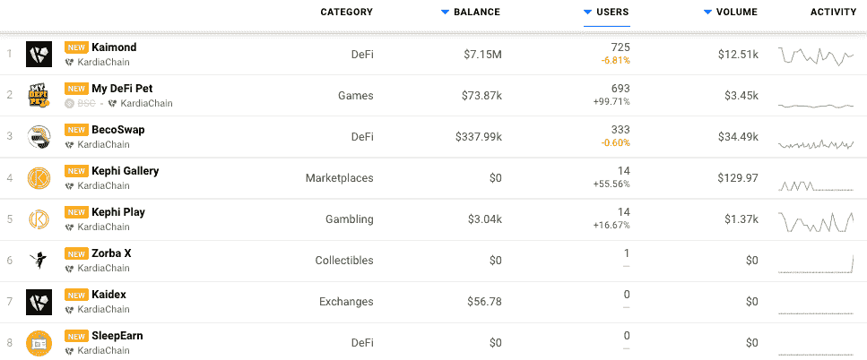
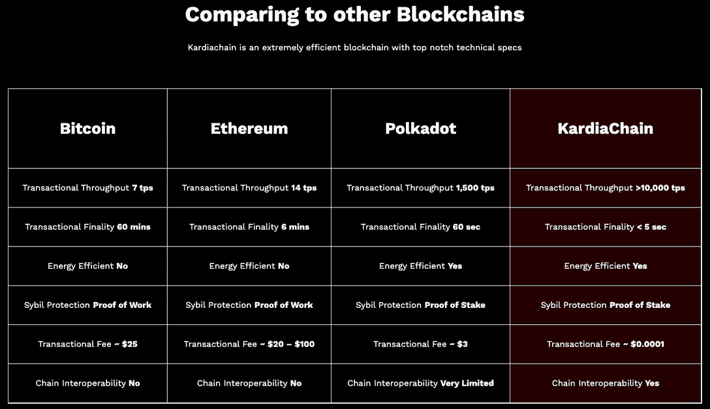
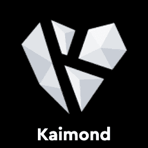
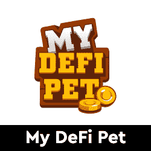
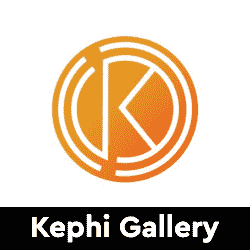

# 卡尔迪亚链现在在达普拉达上跳

> 原文：<https://web.archive.org/web/https://dappradar.com/blog/kardiachain-dapps-now-on-dappradar>

## 现有和未来区块链之间的连锁经营

DappRadar 很高兴宣布整合了 KardiaChain 网络及其 dapps 生态系统。DappRadar 每月 100 万的网站访客现在可以通过 [**KardiaChain dapp 排名**](https://web.archive.org/web/20221127160542/https://dappradar.com/rankings/protocol/kardiachain) **来分析哪些 dapp 吸引了最多的交易量，唯一的用户钱包，或者处理了最多的交易。这样，每个人都可以了解哪些 dapps 和令牌在 KardiaChain 上建立了稳固的社区和价值。**

KardiaChain 旨在提供一个统一的基础设施，使开发人员能够通过实现互操作性来创建可以在多个平台上运行的应用程序，同时使实现尽可能简单。KardiaChain 的许多独特功能之一是，用户可以与 KardiaChain 交互，以触发一个链中的事件，从而导致不同链中的结果。

## 卡尔迪亚链区块链达普拉达排名

在发布时，DappRadar 将在 KardiaChain 上跟踪包括 DeFi、游戏和 NFT 在内的广泛类别的八个 dapps。 [Kaimond](https://web.archive.org/web/20221127160542/https://dappradar.com/kardiachain/defi/kaimond) 是网络上领先的 dapp，为 DeFi 社区提供在 KardiaChain 上交换代币等方式。包括获得由 KardiaChain 孵化的项目的私人令牌分配的特权，例如 MyDeFiPet 和更多即将到来的项目。追逐凯蒙德的是 [BecoSwap](https://web.archive.org/web/20221127160542/https://dappradar.com/kardiachain/defi/becoswap) ，它有一种与领导者非常相似的感觉和提议。

MyDeFiPet 最初是在 BSC 上推出的，它在游戏赚钱类别中获得了相当大的成功。这款游戏在 KardiaChain 上仍在增长，目前占两家连锁店总用户的 10%左右。 [Kephi Gallery](https://web.archive.org/web/20221127160542/https://dappradar.com/kardiachain/marketplaces/kephi-gallery) 是卡尔迪亚链在 NFT 的本土市场，来自不同学科的艺术家可以聚集在一起，分享他们的作品并将其货币化，而 [Zorba X](https://web.archive.org/web/20221127160542/https://dappradar.com/kardiachain/collectibles/zorba-x) 是卡尔迪亚链目前唯一的 NFT 本土收藏。

## 引擎盖下的 KardiaChain

双主节点技术同时提供两个链(KardiaChain 和另一个选择链)的分类帐数据。他们可以从外部链接收交易，并安全地将这些更新消费到 KardiChain 分类帐中，而不会损害两个链的安全性。该网络的共识算法使用拜占庭容错-授权的利害关系证明-这将确保数据的一致性和节点的完整性，并确保整个 KardiaChain 网络的安全性。

KardiaChain 上的构建器可以使用 Kardia 虚拟机(KVM)。一个健壮的虚拟沙盒环境，负责执行与以太坊虚拟机(EVM)完全兼容的智能合约。这意味着 dapp 开发人员可以非常容易地从 BSC 或 Ethereum 等其他链移植 dapp，或者直接在 KardiaChain 上构建，几乎不需要额外的编程知识。

## 面向 dapp 开发人员的 KardiaChain

如上所述，KardiaChain 完全兼容 EVM，dappRadar 邀请 Dapp 开发者[向 DappRadar](https://web.archive.org/web/20221127160542/https://dappradar.com/submit-dapp) 提交他们的 Dapp，从而在全球 Dapp 商店上创造更多的可见性。有兴趣了解更多关于 KardiaChain 及其可能性的开发者可以从 [KardiaChain docs 网站](https://web.archive.org/web/20221127160542/https://docs.kardiachain.io/docs/)开始。

[<picture></picture>](https://web.archive.org/web/20221127160542/https://dappradar.com/kardiachain/defi/kaimond)[<picture></picture>](https://web.archive.org/web/20221127160542/https://dappradar.com/kardiachain/games/my-defi-pet)[<picture></picture>](https://web.archive.org/web/20221127160542/https://dappradar.com/kardiachain/marketplaces/kephi-gallery) NewsletterUnsubscribe at any time. [T&Cs](https://web.archive.org/web/20221127160542/https://dappradar.com/terms) and [Privacy Policy](https://web.archive.org/web/20221127160542/https://dappradar.com/privacy-policy)