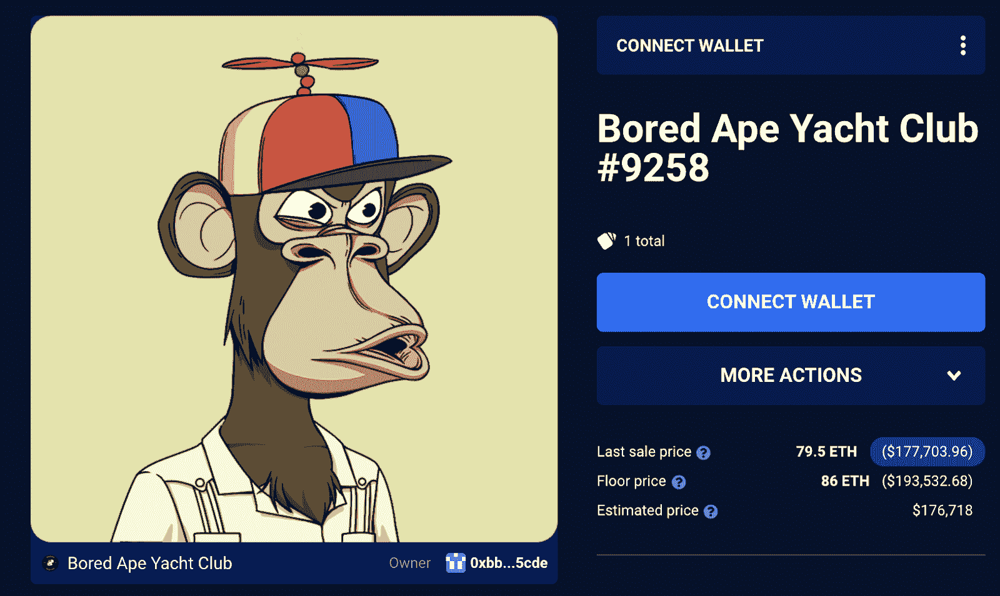

# 凯文·哈特加入了无聊的猿族

> 原文：<https://web.archive.org/web/https://dappradar.com/blog/kevin-hart-joins-the-bored-ape-family>

## Moonpay 又一次帮助一位名人进入了 NFT 空间

好莱坞演员兼喜剧演员凯文·哈特是无聊猿游艇俱乐部家族的最新名人成员。这位演员巧妙地展示了他的新无聊猿#9258，转发了一个观察者。大师邮政注意到销售。虽然他的许多名人朋友已经决定将他们在社交媒体平台上的个人资料照片改为他们的 BAYC NFTs，但哈特选择更巧妙地处理他的购买。

有趣的是，越来越多的名人决定在 Moonpay 的帮助下购买他们的第一批 NFT 商品，他也是其中之一。该加密公司为 NFT 支付了 79.5 ETH 或大约 20 万美元，然后将其转移到[哈特的钱包](https://web.archive.org/web/20230307144442/https://dappradar.com/hub/wallet/eth/0xbbdac7ba85af15420afd1f4aa3313c3535b15cde/nfts)。

令人印象深刻的是，尽管 BAYC #9258 拥有几处最稀有的房产，Moonpay 还是以低于底价的价格拿下了 NFT。当然，考虑到加密公司和预期最终所有者的诚信，这并不令人惊讶。

## 凯文·哈特加入了名人参与的增长趋势

NFT 收藏品，尤其是无聊的猿类，正稳步吸引着各界名人的注意。凯文·哈特是最新一个加入名人 NFT 俱乐部的人。DappRadar 名人钱包页面不断发展，新成员不断加入。

最近，说唱歌手[阿姆](https://web.archive.org/web/20230307144442/https://dappradar.com/blog/eminem-joins-the-bored-ape-yacht-club/)也通过购买他的猿分身加入了 BAYC 家族。此外，像[塞雷娜·威廉姆斯](https://web.archive.org/web/20230307144442/https://dappradar.com/hub/wallet/eth/0x0864224f3cc570ab909ebf619f7583ef4a50b826)、[沙奎尔·奥尼尔](https://web.archive.org/web/20230307144442/https://dappradar.com/hub/wallet/eth/0x3c6aeff92b4b35c2e1b196b57d0f8ffb56884a17)和[拉梅洛·鲍尔](https://web.archive.org/web/20230307144442/https://dappradar.com/hub/wallet/eth/0xc1064e3662b0718357e9050694a3bfeaabede8ab)这样的体育明星也加入到 NFT 的炒作中。

这些名人中的许多人选择使用 Moonpay 等加密公司的服务来购买 NFT。虽然这可能意味着他们没有深入太空、了解区块链内部运作的欲望，但这些购买确实给 NFT 迷和主流观众带来了信心。

名人代言对任何成功的企业都很重要，BAYC 似乎已经掌握了这种艺术。从统计数据来看，猩猩通常是名人第一个求助的 NFT 系列，作为他们投资组合的起点。无论是通过 Moonpay 这样的服务，还是通过直接购买，BAYC NFTs 在名人中很流行。

随着越来越多的名人决定进行跳跃，达普拉达将继续关注 NFT 空间。要了解最新的 NFT 新闻和销售数据，请考虑成为 DappRadar PRO 的会员。有了 PRO，你可以从最近 15 分钟内获得连锁销售数据。如果你好奇想看更多名人 NFT 作品集，请点击这里查看我们的名人钱包精选。

 NewsletterUnsubscribe at any time. [T&Cs](https://web.archive.org/web/20230307144442/https://dappradar.com/terms) and [Privacy Policy](https://web.archive.org/web/20230307144442/https://dappradar.com/privacy-policy)