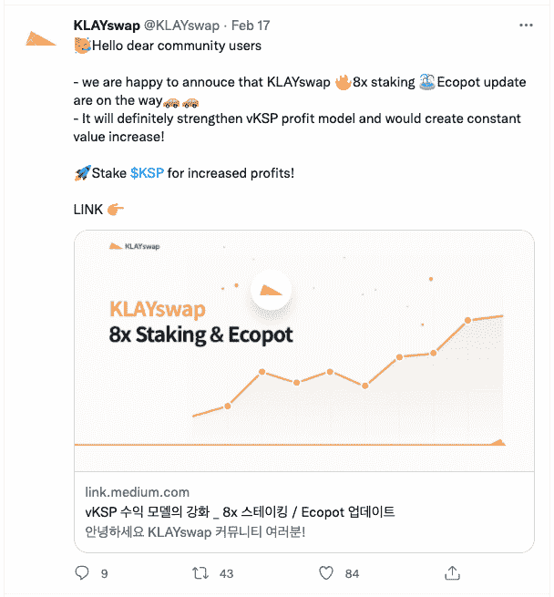
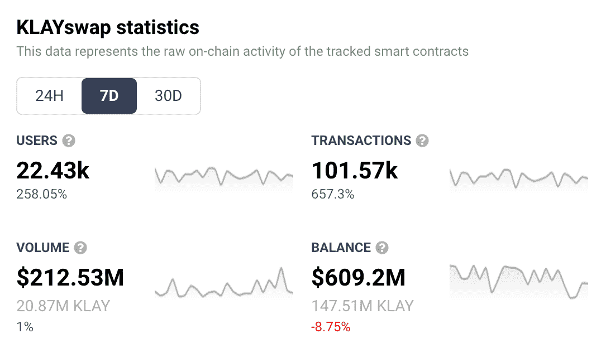

# KLAYswap 赌注模式承诺增加利润

> 原文：<https://web.archive.org/web/https://dappradar.com/blog/klayswap-staking-model-promises-increased-profits>

## 交换商店 KLAYswap 提供 8 倍赌注和 Ecopot 奖励

KLAYswap 的最新产品更新引入了极具吸引力的赌注奖励，这反过来给该平台带来了巨大的推动。2 月 17 日宣布的更新包括 8 倍赌注和 Ecopot 奖励分配。

在达普拉达，我们在我们的达普拉达排名页面上对攀登者和坠落者了如指掌。KLAYswap 在向其社区宣布其最新更新集后，在过去的 7 天里一直是一名登山者。该平台现在是 Klaytn DappRadar 排名(T1)中排名第一的 dapp，并且在所有协议的交换类别(T3)中排名(T2)前十。

KLAYswap Twitter announcement

Ecopot 奖励分配的引入是为了加强对 vKSP 持有者的补偿。vKSP 是 Klaytn DeFi 生态系统中使用的投票令牌。生态壶向代币持有者提供持续的代币奖励。这种持续的激励机制通过新 Ecopot 流动性的流入发挥作用，这反过来将增加 KLAYswap 的 TVL 和交易量。

将赌注奖励设定为 8 倍，在 KSP 锁定的连续期间，vKSP 持有人将获得相当于其通常投票权 8 倍的奖励。KSP 是克莱斯瓦普的本土标志。下注 KSP 的用户还可以获得下注奖励，支付他们的全部交易费用，获得掉落令牌奖励，并以 8 倍于平时的价格获得 Ecopot 令牌奖励。点击[此处](https://web.archive.org/web/20221229143525/https://dappradar.com/blog/what-is-staking-and-how-to-earn-passive-income)获取赌注的便捷指南。

在 2 月 17 日的更新之后，KLAYswap 的链上指标飙升。与该平台互动的独特钱包数量增长了 389%，达到 22.43 万个。交易量增长了 657%，交易量保持在大致水平。

KLAYswap 7 day analytics