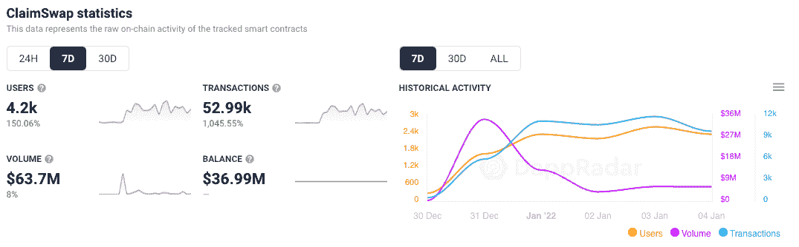
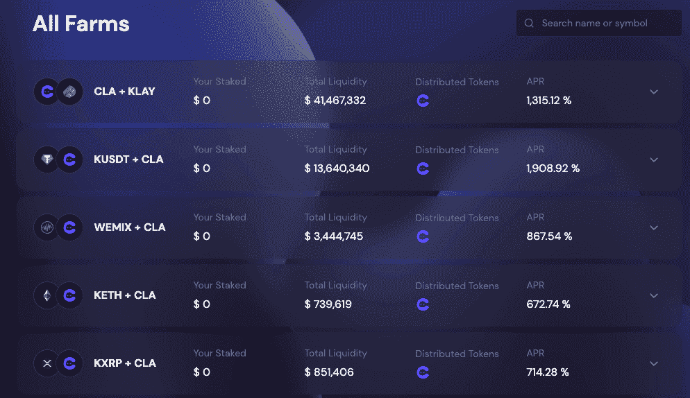
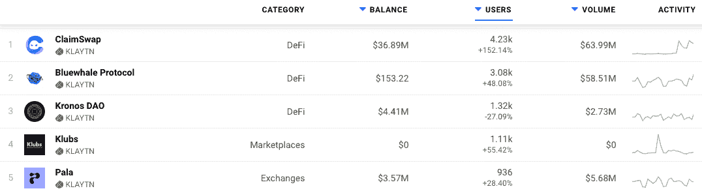
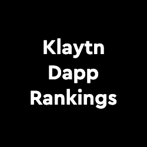
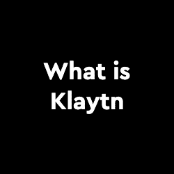
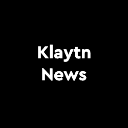

# Klaytn DEX ClaimSwap 活动钱包增长 150%

> 原文：<https://web.archive.org/web/https://dappradar.com/blog/klaytn-dex-claimswap-active-wallets-grow-150>

## 克莱滕生态系统不断扩大，为用户提供更多选择

自 12 月中旬推出以来，加密货币交换平台 [ClaimSwap 在](https://web.archive.org/web/20221206105630/https://dappradar.com/klaytn/defi/claimswap)度过了令人印象深刻的一周。代币交换平台上的活跃钱包周环比增长超过 150%，在撰写本文时将 ClaimSwap 置于 Klaytn dapps 之首。

ClaimSwap 的成功并不完全出人意料，因为它直接受到了 SushiSwap 的启发。由于克莱顿仍然是一个相对较小的生态系统，ClaimSwap 是生态系统中第一批 DeFi dapps 之一。在过去的 7 天里，活跃钱包激增了 150%以上，达到 4200 个。这些互联钱包完成了近 53，000 笔交易，通过 dapps 智能合约推动了超过 6，300 万美元的交易量。

ClaimSwap 是基于标准 AMM(自动做市商)模型的 Klaytn DEX 。已经提供类似服务的 KLAYswap 已经扩展了 Klaytn DeFi 生态系统。然而，在这个生态系统中还没有其他成熟的 DEX，给用户留下了有限的选择。ClaimSwap 团队的目标是提供一个更加用户友好的协议。就像 Uniswap-Sushiswap 的案子一样。

像 Uniswap 版本 1 和 2 一样，所有 ClaimSwap 的代码都将在审计后公开。允许任何人利用 ClaimSwap 代码在 Klaytn 上创建 DeFi dapp。正如在 Polygon 网络上观察到的，提供相似服务的多个 dapps 的到来可以给网络带来竞争和用户。ClaimSwap 相信 dapps 的整个 Klaytn 生态系统的增长将最终导致 ClaimSwap 的进一步使用和发展。

## 农业和奖励

该平台声称迄今为止锁定的总价值超过 2.98 亿美元，[农场为](https://web.archive.org/web/20221206105630/https://app.claimswap.org/farm)提供了一些丰厚的年利率，从 4%到超过 1900%不等。像往常一样，下注本地 Klaytn 代币如 KLAY 奖励 CLA 代币的较高回报。此外，这些 CLA 令牌在运行 ClaimSwap 的分散自治组织(DAO)中充当治理令牌。拥有 CLA 或持有被动收入令牌的用户可以通过投票机制为平台的发展做出贡献。

有趣的是，我们看到 ClaimSwap 并不是 Klaytn 上唯一一个在本周获得用户增长的平台。类似的 DeFi 服务 Bluewhale Protocol 的活跃用户增加了 48%以上，而 Pala 的排名明显下降，在过去七天里吸引了不到 1000 个活跃钱包。

## 克莱顿是什么？

Klaytn 是一家专注于 GameFi 和创意内容的公共区块链。由 Kakao 创建，KakaoTalk 是韩国免费和领先的消息服务，拥有超过 2.2 亿注册用户和 4700 万月活跃用户。自 2019 年 6 月推出以来，Klaytn 利用 Kakao 的现有用户群来推动用户采用，目前是韩国领先的区块链。它支持一个充满活力的 dapp 生态系统，如加密货币钱包 Klip，它与 KakaoTalk 信使应用程序相连。

Klaytn 的目标是将用户放在他们所做的一切的中心，计划提供与当前技术完全没有区别的区块链可用性。它们有效地使区块链不可见，消除了用户旅途中的摩擦点。为此，三星与 Kaytn 合作，推出了 Klayton 手机，这是 Galaxy Note 10 的一种变体。

[<picture></picture>](https://web.archive.org/web/20221206105630/https://dappradar.com/rankings/protocol/klaytn)[<picture></picture>](https://web.archive.org/web/20221206105630/https://dappradar.com/blog/klaytn-2-0-to-boost-efforts-on-global-ecosystem-expansion/)[<picture></picture>](https://web.archive.org/web/20221206105630/https://dappradar.com/blog/tag/klaytn)

***以上不构成投资建议。此处给出的信息仅供参考。请行使尽职调查，做你的研究。作者持有 ETH，BTC，AGIX，HEX，LINK，GRT，CRO，OMI，不可变 X，ENS，GALA，AVASTR，GMEE，CUBE，RADAR，FLOW，FTM，BNB，SPS，WRLD，ADA。***

 NewsletterUnsubscribe at any time. [T&Cs](https://web.archive.org/web/20221206105630/https://dappradar.com/terms) and [Privacy Policy](https://web.archive.org/web/20221206105630/https://dappradar.com/privacy-policy)