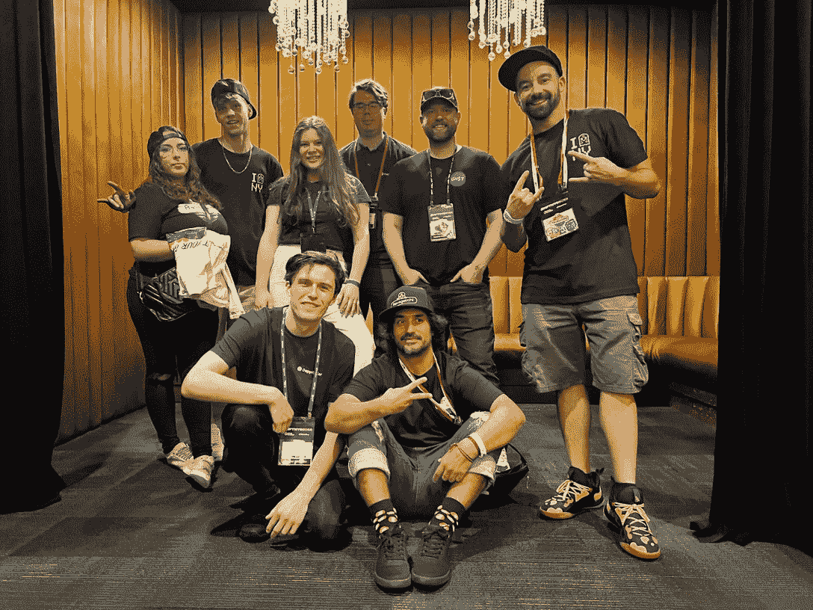

# Kornelija Sobutiene:领导 DappRadar 网站 3 营销的女性

> 原文：<https://web.archive.org/web/https://dappradar.com/blog/kornelija-sobutiene-the-woman-leading-web3-marketing-at-dappradar>

## 会见 DappRadar 的营销经理，了解她如何改变人们对 dapp 行业的看法

DappRadar 已经走了很长的路，成为世界上的 Dapp 商店，如果没有出色的员工，每一项成就都是不可能的。在这一系列的采访中，你将见到这一切背后的团队。本期杂志特别介绍了我们的营销经理 Kornelija Sobutiene，她是灵感和创造力的真正灯塔。了解她，了解在竞争如此激烈的行业中创建一个积极参与的社区所面临的挑战。

前卫，独特，友好。这些是任何好的营销策略都应该有的形容词，在 DappRadar 和 Kornelija 中也有。

在一个不断进化的行业中，DappRadar 不仅受益于实力，还受益于对新趋势的快速适应。然而，有了像 Kornelija 这样的专业人士，我们能够领导他们。

不管是哪个部门，这里的每个人都知道 Kornelija。她负责几个项目，扩大 DappRadar 在 Web3 领域的权威，并把我们许多人联系起来。

亲自去了解这个女人，她代表了 DappRadar 社区的真正意义。这是科内利亚。

## 你能给我们介绍一下你自己和你的职业生涯吗？

我是 [Kornelija](https://web.archive.org/web/20221201222111/https://www.linkedin.com/in/kornelijagudzeviciute/) 。我出生在立陶宛。高中毕业后，我决定离开立陶宛，去探索世界。我在英国完成了我的媒体&传播研究，我在荷兰的一家律师事务所做营销专员，在探索了 5 年之后，我决定回到立陶宛。

我回来了，开始找工作。我明白我需要找一家国际公司工作，因为在国外呆了几年后，我意识到国际经验会让我具备更广泛的技能和知识

## 你是如何进入分散应用程序世界的？

在这里我必须实话实说，在我 2019 年加入 [DappRadar](https://web.archive.org/web/20221201222111/https://dappradar.com/) 之前，我对区块链和 dapps 的唯一了解是，如果你玩[区块链游戏](https://web.archive.org/web/20221201222111/https://dappradar.com/topic/games)，你就可以真正拥有游戏内的物品。如果游戏出了问题，你可以确定你的物品不会随之消失。

简而言之，我可以说，我对区块链技术的好奇心和兴趣以及我在 DappRadar 的社交媒体专家角色推动我探索 dapps 世界。

## Web3、区块链和去中心化最让你兴奋的是什么？

首先，我真的很喜欢看到 Web3 社区有多紧密。在区块链空间，人们可以多么容易地建立关系网和交朋友。

DappRadar team visiting [NFT.NYC](https://web.archive.org/web/20221201222111/https://dappradar.com/blog/dappradar-visiting-nft-nyc) in June 2022

我喜欢看到 Web3 项目/产品给予社区的关注。理解在网络上创造大部分价值的方式是通过人们聚集在一起、合作并成为某个事物的一部分的社区是多么重要。

其次，很高兴看到 Web3 如何通过削减第三方内容共享平台来增强创作者的能力，以吸引他们的观众并使他们的艺术货币化。他们现在有了新的方法来吸引他们的粉丝并收回对他们创作的控制权。

## 你最喜欢的 Web3 项目是什么，为什么？(除了达普拉达)

[女人的世界](https://web.archive.org/web/20221201222111/https://dappradar.com/hub/nft-explorer/collection/world-of-women-nft)，毫无疑问。首先，我知道在过去的一年里，我们看到了如此多的新项目和 NFT 收藏正在建设。有时你会搞不清谁会长期留在这里。

当这个系列在 2021 年 7 月推出时，我能感觉到 WoW 就是其中之一。不仅因为伟大的艺术，还因为它背后有一个伟大的使命——“在这个新的网络时代，为世界各地的任何人创造成为所有者、创造者和贡献者的机会。”

*   **阅读 Kornelija 最喜欢的项目:** [女性 NFTs 的世界:促进多元化的蓝筹 NFT 项目](https://web.archive.org/web/20221201222111/https://dappradar.com/blog/world-of-women-nfts)

## 你为什么想加入 DappRadar 的营销团队？

我们是由媒体构建的一代——它在我们的生活中扮演着重要的角色。因此，我决定拥抱社交这个概念。我一直想帮助企业了解在社交媒体上的积极影响，以及如何利用它建立一个强大的社区。

最重要的是，我有机会开始与 DappRadar 一起在 crypto space 中构建这个社区。这是一个巨大的挑战，有很多课程和测试。但是现在谁不喜欢挑战呢？他们让我坚持下去！

## 在 DappRadar 工作的典型一天通常是什么样的？

我典型的一天从推特上开始。在那里，我可以找到密码行业的最新动态、加入潮流的项目以及当前关于市场本身的讨论，并和我的咖啡一起享用。接下来，我会补上我的闲置信息和电子邮件，并计划我的一天，因为这有助于我更有效率。

之后，我专注于支持我们的业务增长。我正与跨产品、工程和销售的跨职能团队合作，继续改进我们的产品和服务，并支持它们向更广泛的受众分发。

此外，我与我们的客户和合作伙伴密切合作，与他们建立密切的关系，并支持他们在 DappRadar 的营销活动。通过与他们的定期互动，我能够了解他们的需求和挑战，并提供能够帮助他们取得成功的解决方案。

## 作为 Web3 的营销人员，你面临的主要挑战是什么？

我认为这里最大的挑战是跟上这个行业正在发生的一切，并且“在火车到来之前赶到那里！”

跟上时代对我们公司和我都很重要。

这个行业还很新，变化真的很快很正常。一天，我们看到许多人跳上了 DeFi 的马车，第二天，他们就搬到了 NFTs。作为一家公司，我们需要尽快适应这些变化。

## 你给公司带来了什么？

我认为我给公司带来的最明显的品质是快乐和积极。众所周知，营销人员喜欢交谈，与你的队友建立关系对我来说非常重要。所以我总是尽力给我们的会议带来一点好的能量。

快乐团队=快乐的 Kornelija

> [Ver essa foto no insta gram](https://web.archive.org/web/20221201222111/https://www.instagram.com/reel/CisxyvAgbg_/?utm_source=ig_embed&utm_campaign=loading)

