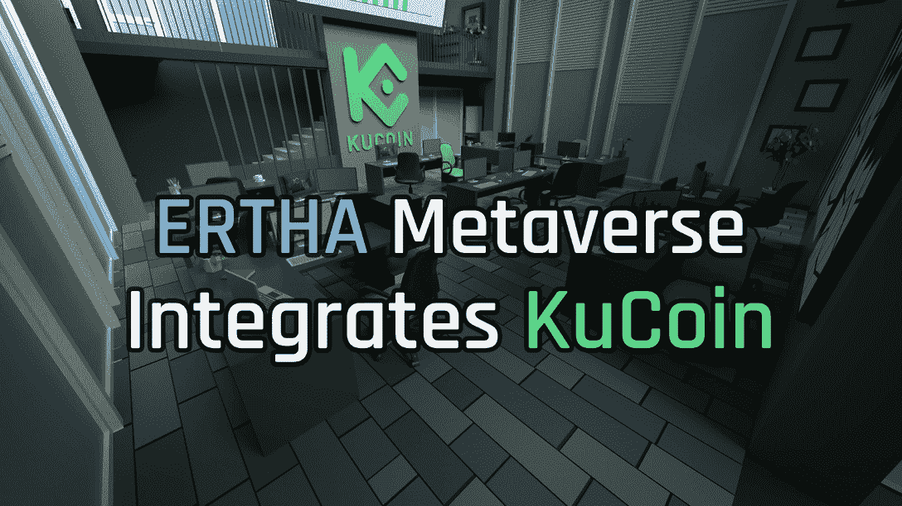

# KuCoin 和 Ertha 一起展示如何在元宇宙交易

> 原文：<https://web.archive.org/web/https://dappradar.com/blog/kucoin-teams-up-with-ertha-to-show-how-to-trade-in-the-metaverse>

## 访问 Ertha 测试版，体验 KuCoin 的虚拟办公室

KuCoin 宣布进入埃尔塔元宇宙，向数字公民展示关于交易的所有知识。他们以追求高质量的区块链项目而闻名，并与备受期待的元宇宙项目 Ertha 合作。

**概要:**

*   Ertha 是元宇宙在[币安智能链](https://web.archive.org/web/20220817125809/https://dappradar.com/rankings/protocol/binance-smart-chain)上的一个项目，结合了边玩边赚和边玩边学的机制。
*   KuCoin 在 Ertha 的到来旨在为用户提供最先进的元宇宙交易体验。
*   埃尔塔元宇宙由 360，000 块土地组成，这些土地是玩家创收的重要资源。
*   [限时七折卖地](https://web.archive.org/web/20220817125809/https://ertha.link/PUsXR)正在进行中。
*   Ertha 的早期测试版现在向所有用户开放，让他们体验游戏。

[元宇宙](/web/20220817125809/https://dappradar.com/blog/what-is-the-metaverse/)并没有脱离人们的现实生活。相反，它是对我们现实世界的补充。这就是为什么科技公司不断创新和尝试，为用户带来超现实和互动的元宇宙体验。

其中之一是 Ertha，这是元宇宙的一个项目，旨在复制现实生活环境，模拟人们为了生活而必须采取的行动。此外，在这个虚拟世界中，企业和伙伴关系正在形成。

KuCoin 是 crypto 最大的交易所之一，它最近宣布进入 Ertha 的元宇宙。那么两者的协作会产生什么样的协同效应呢？

## KuCoin 加入 Ertha 寻求双赢机会

大品牌已经进驻元宇宙。耐克、阿迪达斯、古驰、可口可乐以及更多的公司正在进军新的数字前沿。全球加密货币交易所 KuCoin 也已落户元宇宙，探索无缝数字资产交易的新场景。

Ertha 的边玩边赚和边玩边学机制为 NFT 的所有者提供了一个从他们的土地上赚取收入的真正机会。KuCoin 是最早抓住这一机会的投资者之一。随着虚拟世界和现实世界之间的界限变得模糊，KuCoin 认为有必要为元宇宙用户提供一个最先进的场所，让他们可以随时浏览实时市场图表并开始交易。

查看下面的视频，了解埃尔塔元宇宙为用户提供了什么——可定制的 NFTs、出色的图形、身临其境的体验等等！用户也可以登录 [**Ertha 的早期测试版**](https://web.archive.org/web/20220817125809/https://ertha.link/client) 自行尝试。

[https://web.archive.org/web/20220817125809if_/https://www.youtube.com/embed/06ubFLMtI70?feature=oembed](https://web.archive.org/web/20220817125809if_/https://www.youtube.com/embed/06ubFLMtI70?feature=oembed)

KuCoin 办公室只是 Ertha 生态系统中无限可能的一种。目前，已有超过 24000 块土地出售给早期投资者，他们正计划为用户提供前所未有的虚拟体验。如果你不想错过这个机会，利用独家优惠，在限定时间内以 30%的价格获得 [**创收的埃尔塔 NFT 土地**](https://web.archive.org/web/20220817125809/https://ertha.link/PUsXR) 。

## 什么是 Ertha，为什么它是独一无二的？

埃尔莎是一个讲故事方式独特的元宇宙人。[在厄尔萨](https://web.archive.org/web/20220817125809/https://ertha.link/P9H8C)中，人类发现自己处于灭绝的边缘，他们有机会通过建立一个新世界来纠正他们过去的错误。

Ertha 的世界是一个精心设计的游戏空间，玩家可以在这里创建新的政府和经济，并在玩家之间建立联盟。埃尔塔元宇宙被分成 [NFT 地块](https://web.archive.org/web/20220817125809/https://ertha.link/PUsXR)，每块土地都可以通过在其上发生的交易产生税收、费用和其他形式的收入。

对于那些寻找 metaverses 入门并有机会玩和赚的人来说，Ertha 提供了这样一个机会。在 Ertha 中，玩家必须平衡生产、贸易和财务预算，以最大化利润并在竞争中保持领先。

### 尔莎有什么特点？

Ertha 符合当前所有权经济的趋势，它的玩家所有权与被称为 HEXs 的独特 [NFTs 相关联。每个妖术都允许它的主人完全控制他们在元宇宙的土地。利用土地赚钱的方式多种多样，如国际贸易、税收、房地产投资等等。](https://web.archive.org/web/20220817125809/https://ertha.link/PUsXR)

与现实世界的土地类似，热门地点自然更有价值。这款游戏最近公布了一系列高价值销售，包括罗马 12 万美元和东京 5.9 万美元。

更重要的是，Ertha 旨在复制一个玩家驱动经济的现实生活环境。在冲突或和平时期，一个玩家的行动，无论是政治上的还是环境上的，都可以创造真正的改变，并产生深远的影响。

## 加入 Ertha Beta，开始边玩边赚

Ertha 继续将自己定位于元宇宙和 GameFi 领域的创新前沿。一系列著名的项目已经成功加入了 Ertha 的生态系统。KuCoin 的支持是对 Ertha 长期潜力的又一有力证明。

尔莎的早期测试版现已对所有人开放。它让玩家更近距离地观察它的游戏性和角色扮演系统。除了在这个虚拟世界中开始奇妙的冒险之外，边玩边学的机制还为玩家提供了令人兴奋的机会，让他们可以提前了解未来经济将如何运转。

了解更多关于 Ertha 的信息:

[推特](https://web.archive.org/web/20220817125809/https://twitter.com/ErthaGame)

[不和](https://web.archive.org/web/20220817125809/https://discord.gg/ertha)

[中等](https://web.archive.org/web/20220817125809/https://erthium.medium.com/)

[YouTube](https://web.archive.org/web/20220817125809/https://www.youtube.com/c/ERTHAgame)

[电报](https://web.archive.org/web/20220817125809/https://t.me/erthagame)

**免责声明** —这是一篇赞助文章。DappRadar 不认可本页面上的任何内容或产品。DappRadar 旨在提供准确的信息，但读者应该在采取行动之前总是自己做研究。DappRadar 的文章不能被认为是投资建议。