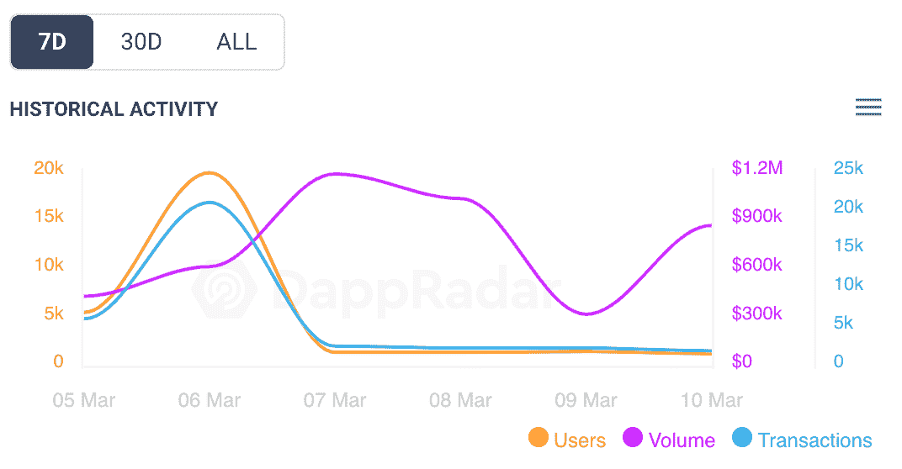
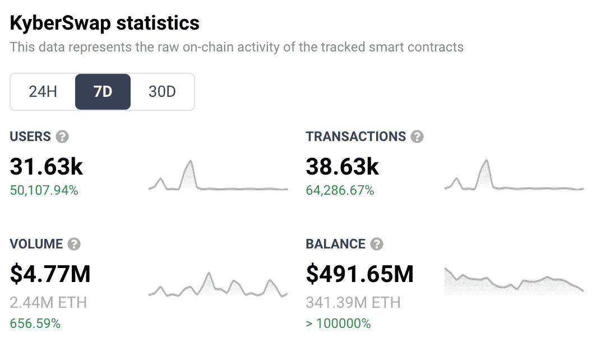
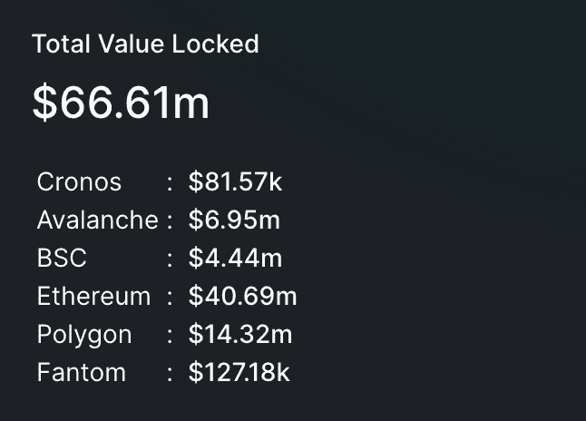

# 在 Arbitrum 上发布 KyberSwap 在社区中引起了轰动

> 原文：<https://web.archive.org/web/https://dappradar.com/blog/kyberswap-launch-on-arbitrum-created-hype-spike-in-community>

## KyberSwap 在 Arbitrum 上的推出与链上活动的巨大增长相一致

分散式交易所 KyberSwap 于 3 月 7 日在 Arbitrum 网络上推出，同时在其他各种区块链上推动其连锁活动。KyberSwap 加入 Arbitrum 上运行的 dex 列表，推动了交易所的数字扩展解决方案，并看到了链上活动的巨大峰值。

在[以太坊](https://web.archive.org/web/20220930100309/https://dappradar.com/rankings/protocol/ethereum)、 [BSC](https://web.archive.org/web/20220930100309/https://dappradar.com/rankings/protocol/binance-smart-chain) 、 [Polygon](https://web.archive.org/web/20220930100309/https://dappradar.com/rankings/protocol/polygon) 、 [Fantom](https://web.archive.org/web/20220930100309/https://dappradar.com/rankings/protocol/fantom) 、 [Avalanche](https://web.archive.org/web/20220930100309/https://dappradar.com/rankings/protocol/avalanche) 和 [Cronos](https://web.archive.org/web/20220930100309/https://dappradar.com/rankings/protocol/cronos) 上可用后，KyberSwap 将其服务扩展到了 Arbitrum 网络。这种更好的网络关系使用户能够更轻松、更低费用地在这些区块链之间交换代币。KyberSwap 自称为“DeFi 的第一个动态做市商”,旨在为“交易者”提供最佳象征性利率，为流动性提供者提供最大回报。

Arbitrum 实现了更快的交易，旨在消除与以太坊相关的昂贵的天然气费用。这是一个第二层扩展解决方案，帮助 KyberSwap 实现其最终目标:更快、更便宜、更安全。在过去的 7 天里，KyberSwap 的活跃用户数量增长了 50，000%，达到 31，631 个活跃用户。

## 连锁经营活动全面增加

KyberSwap 在 3 月 7 日与 Arbitrum 的集成确实看到了一些链上活动的巨大峰值，正如我们在下图中看到的那样。用户数量和交易量大幅上升，或许是因为预期到了 Kyberswap 与 Arbitrum 的整合。然后在 3 月 7 日，通过 dapp 智能合约的交易量，总收入，飙升。

[<picture></picture>](https://web.archive.org/web/20220930100309/https://dappradar.com/multichain/exchanges/kyberswap)

Source: DappRadar

过去一周，KyberSwap 的链上分析似乎显示所有类别都有大幅上升:

*   用户增加了 50.108%，达到 31，631 个活跃钱包
*   交易量上升了 64，287%，达到 38，632 笔
*   dapp 智能合同的总收入增长了 657%，超过 477 万美元
*   dapp 智能合约中的资产总值飙升了 10 万多

KyberSwap’s 7-day on-chain analytics

但这并不能说明全部。参与智能合约的用户激增可能是因为用户进入 KyberSwap 进行自己的调查，并查看与 Arbitrum 的集成，而没有实际交换或在平台上投入大量资金。从下面我们可以看到，目前锁定在 KyberSwap 上的 TVL 是 6661 万美元。

TVL in KyberSwap

当我们回顾凯伯斯瓦普的《TVL》过去一个月时，我们可以看到，在那段时间里，它几乎没有什么变化。这表明，虽然很多人对新的 KyberSwap/Arbitrum 集成感兴趣，但他们还没有投入资金。在撰写本文时，Arbitrum 版本的 KyberSwap 的流动性非常少，只有 37，000 美元。

那么，活动的峰值来自哪里呢？KyberSwap 本周推出了 Velas 区块链，同时其本地 KNC 令牌的价格也出现了飙升。此外，币安保管公司现在也为 KNC 提供支持，为这个分散的交易平台吸引眼球。此外，多边形版本的 KyberSwap 被集成到了从玩到赚的赛马游戏 Pegaxy 中。所有这些，除了在阿尔比特鲁姆的发射。这是一个很大的新闻，给 KyberSwap 带来了很多流量。