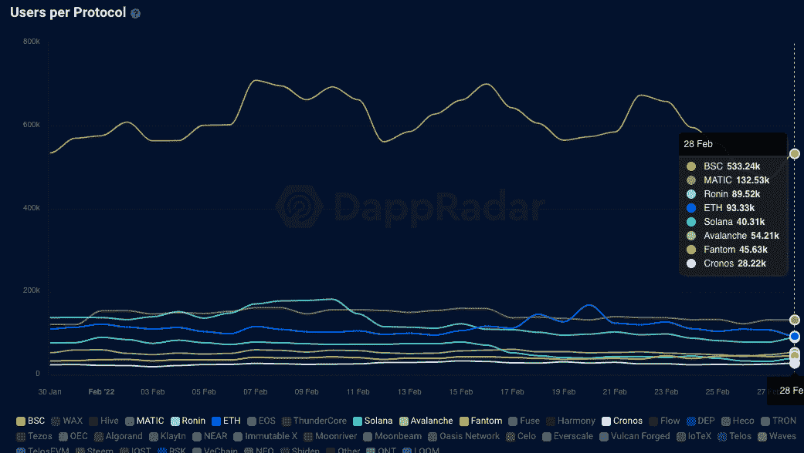
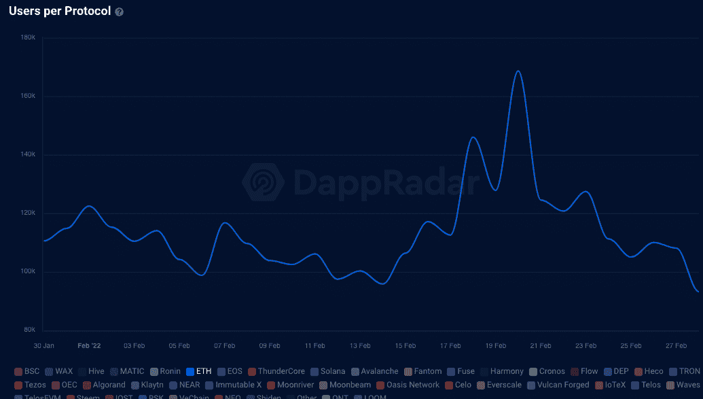
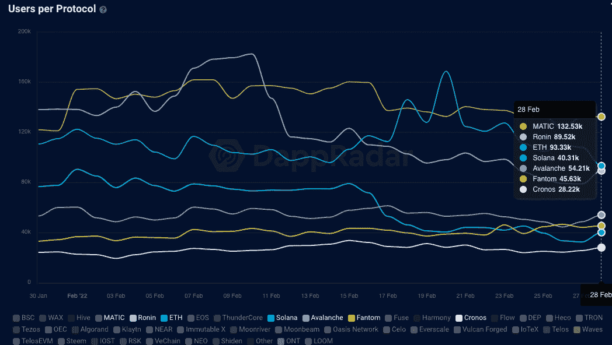
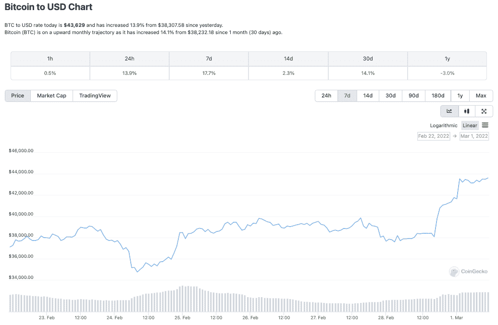
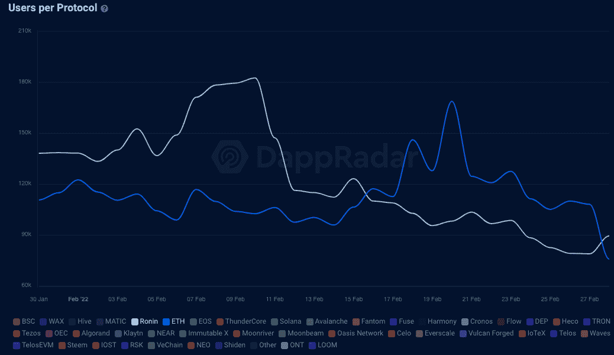
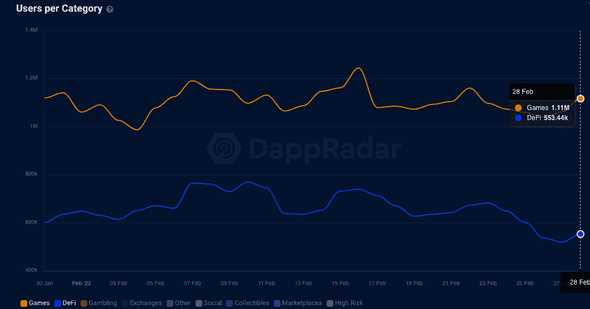
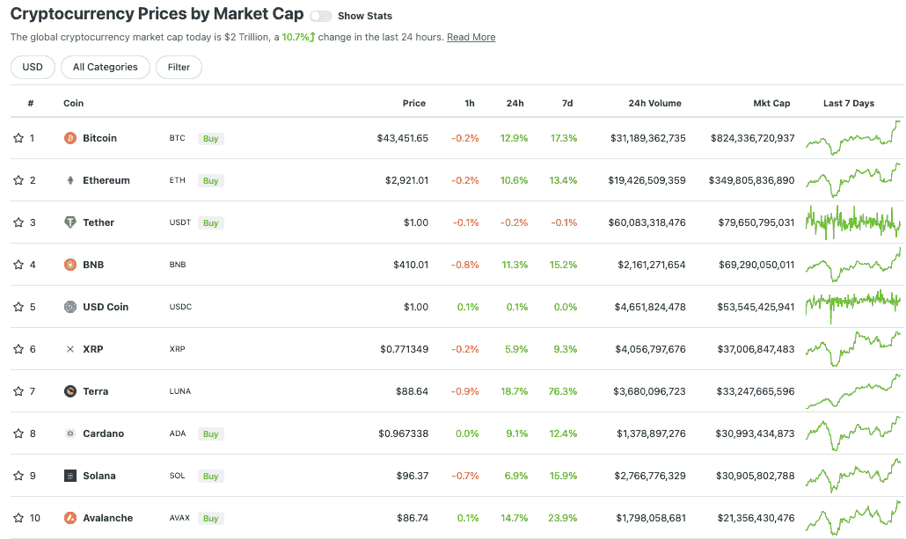
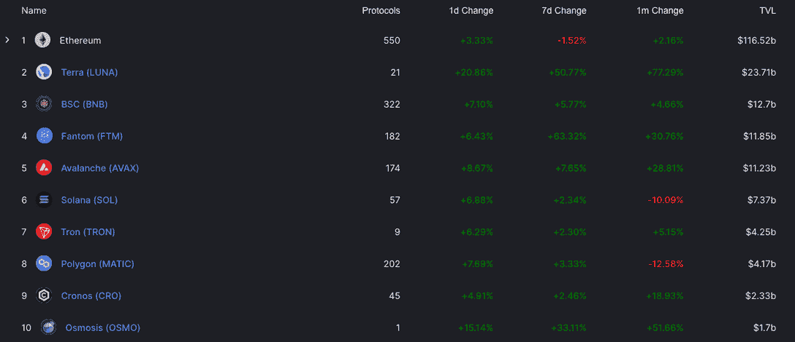

# 以太坊使用率下降，二层区块链脱颖而出

> 原文：<https://web.archive.org/web/https://dappradar.com/blog/layer-2-blockchains-get-ahead-as-ethereum-usage-dips>

## 领先网络的用户活动减少

过去几天，随着 Ronin、Fantom 和 Solana 等二层网络的增长，连接到以太坊 dapps 的独特活动钱包数量大幅下降。此外，BNB 连锁店遥遥领先，每天有超过 50 万个钱包连接到它的 dapps，而以太坊的日平均水平为 75，000 个。

Source: [DappRadar Industry Overview](https://web.archive.org/web/20221006051053/https://dappradar.com/industry-overview)

尽管 BNB 连锁店在连接到其 dapps 的用户中遥遥领先，但重要的是要记住[以太坊在其智能合约中持有超过 1160 亿美元的代币价值](https://web.archive.org/web/20221006051053/https://defillama.com/chain/Ethereum)，而 BNB 连锁店 dapps 持有[约 130 亿美元](https://web.archive.org/web/20221006051053/https://defillama.com/chain/BSC)。随着币安努力吸引豪赌客，质量与数量的古老问题似乎成为了现实。

然而，在过去的七天里，连接以太坊 dapps 的钱包急剧下降，从 2 月 20 日超过 168，000 的高点下降到写作时的不到 94，000。宏观事件正在发挥它们的作用，但是以太坊之外的网络活动出现了明显的转变。随着用户寻找更便宜、更快捷、更环保的替代产品，第 2 层解决方案和侧链变得更加重要。

Source: [DappRadar Industry Overview](https://web.archive.org/web/20221006051053/https://dappradar.com/industry-overview)

## 第 2 层网络显示决心

虽然过去几天以太坊上的用户活动似乎有所下降，但第二层网络和侧链解决方案如 [Polygon、Solana、Fantom、Avalanche 和 Cronos](https://web.archive.org/web/20221006051053/https://dappradar.com/rankings) 却有所增长。在过去的 12 个月里，这些平台都在努力从以太坊获取相关性，并吸引更多的用户。这些网络允许用户交易代币，并在使用以太坊 dapps 时执行所有相同的操作，但费用很低。

需要注意的是，侧链和第 2 层解决方案之间的区别是一个技术问题。尽管如此，两者都将用户活动从以太坊带走，并要求用户将他们的资产从一个区块链转移到另一个。决定区块链系统是第二层还是侧链的是安全元素和事务的终结性。

从 2 月 27 日到 28 日，连接到以太坊 dapps 的钱包从大约 108，000 个下降到刚刚超过 93，000 个。相反，Solana 看到了近 8000 的增长，而 Avalanche 在同一时间内看到了 6000 的增长。[多边形网络](/web/20221006051053/https://dappradar.com/blog/what-is-polygon-a-simple-explanation/)仅次于 BSC，遥遥领先以太坊，并保持了二月的大部分时间。

Source: [DappRadar Industry Overview](https://web.archive.org/web/20221006051053/https://dappradar.com/industry-overview)

从 2 月 27 日到 28 日，连接到上面突出显示的第二层网络的钱包数量增加了大约 10%。与此同时，随着交易员再次活跃起来，加密货币的总体价值也有所上升。BTC 在过去七天上涨超过 17%，在过去 24 小时内上涨近 14%，再次交易于 40，000 美元的关键线之上。

与此同时，连接以太坊 dapps 的钱包下降了 20%以上。这表明在市场下跌期间，交易商现在更多地使用第 2 层网络 dapps。尤其是 BSC 和 Polygon 上的那些。这只是反映了 2021 年从以太坊转移的一般活动，因为每天都有无数 NFT 收藏推出，网络变得堵塞和昂贵。

## 浪人翻转以太坊

在过去的两天里，连接到浪人区块链 dapps 的钱包比以太坊还多。这是最有趣的，因为 [DappRadar 只追踪了三个浪人 dapp](https://web.archive.org/web/20221006051053/https://dappradar.com/rankings/protocol/ronin)，相比之下[超过 3000 个以太坊 dapp](https://web.archive.org/web/20221006051053/https://dappradar.com/rankings/protocol/ethereum)。在写作时，一个游戏及其生态系统吸引的用户钱包比以太坊上所有 dapps 的总和还要多。值得注意的是，这一趋势持续了 2 月份的大部分时间。

Source: [DappRadar Industry Overview](https://web.archive.org/web/20221006051053/https://dappradar.com/industry-overview)

当然，浪人是领先的玩赚游戏 Axie Infinity、其市场和武士刀 DEX 的定制区块链。随着区块链游戏引领行业，Ronin 继续建立去年取得的成功——2022 年 2 月，DeFi dapps 的[用户数量持续翻了一番以上。](https://web.archive.org/web/20221006051053/https://dappradar.com/defi)

Source: [DappRadar Industry Overview](https://web.archive.org/web/20221006051053/https://dappradar.com/industry-overview)

## 这一切意味着什么？

我们反复使用活动钱包这个术语，因为我们指的是连接到 dapp 的用户钱包的数量。这是一个类似于移动应用程序世界的每日活跃用户的指标，同时理解一个人可以拥有多个区块链钱包的细微差别。简而言之，钱包连接表明使用和潜在增长。

虽然以太坊目前在网络上存储的价值最高，但其他网络正满怀信心地追逐它。然而，为了获得可观的收益，这些网络的 dapp 生态系统必须进一步发展并吸引更多的价值。第二层网络利用以太坊的安全性和底层技术，同时[允许更便宜的交易](/web/20221006051053/https://dappradar.com/blog/will-polygon-become-the-real-alternative-to-ethereum/)似乎在 2022 年获得相当大的收益，因为用户越来越意识到并了解如何访问和使用它们。

随着这些[第二层解决方案追逐领导者](/web/20221006051053/https://dappradar.com/blog/will-polygon-become-the-real-alternative-to-ethereum/)，它们作为投资主张变得更有吸引力。传统上，以太坊的 ETH 令牌是一项不错的投资。虽然没有人说它不再是了，但我们说现在在按市值排名的前十名令牌中有第二层和侧链替代产品。

Terra、Avalanche 和 Solana 现在与以太坊和 BNB 一起进入前十名，这意味着现在有五个支持智能合约的区块链进入前十名。倒回 12 个月，情况并非如此。

## 锁定的总价值呢？

连接到 dapp 和网络的钱包是一个关键指标，而另一个指标是网络或 dapp 从其用户的令牌中获取了多少价值。我们称之为总价值锁定，或 TVL。可以说，当考虑 DeFi dapps 时，这是一个更重要的指标，在 DeFi dapps 中，用户[下注并锁定令牌以获得奖励](/web/20221006051053/https://dappradar.com/blog/how-to-make-passive-income-on-trader-joe/)。

总价值锁定(TVL)排行榜在 2022 年初看起来完全不同。截至发稿时，以太坊在 TVL 拥有超过 1160 亿美元的资产，仍然是占据主导地位的网络，尽管其主导地位已从 1 月底的 65%降至 2 月份的 61%。我们还可以看到，在排名前十的网络中，它是唯一一个在过去七天内 TVL 下降的网络。

回到按市值排列的前十名令牌表，我们看到了明显的重叠。Terra、Solana、Avalanche、BNB 和以太坊都出现在 TVL 的十大网络中。Fantom、Polygon 和 Cronos 在列表中也很靠前。说明当一个 dapp 生态系统繁荣并吸引用户的时候，也能吸引更多的价值。帮助它攀登至关重要的 TVL 阶梯，进而吸引更多 dapp 项目在其网络上启动，完成增长和价值创造所需的循环。

 NewsletterUnsubscribe at any time. [T&Cs](https://web.archive.org/web/20221006051053/https://dappradar.com/terms) and [Privacy Policy](https://web.archive.org/web/20221006051053/https://dappradar.com/privacy-policy)

***以上不构成投资建议。此处给出的信息仅供参考。请行使尽职调查，做你的研究。作者持有 ETH、BTC、AGIX、HEX、LINK、GRT、CRO、OMI、不可变 X、GALA、AVASTR、GMEE、CUBE、RADAR、FLOW、FTM、BNB、SPS、WRLD、ATOM 和 ADA。***