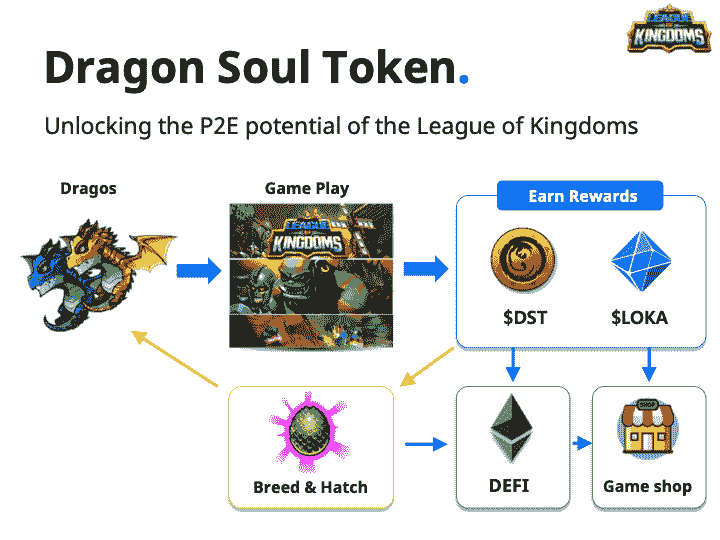
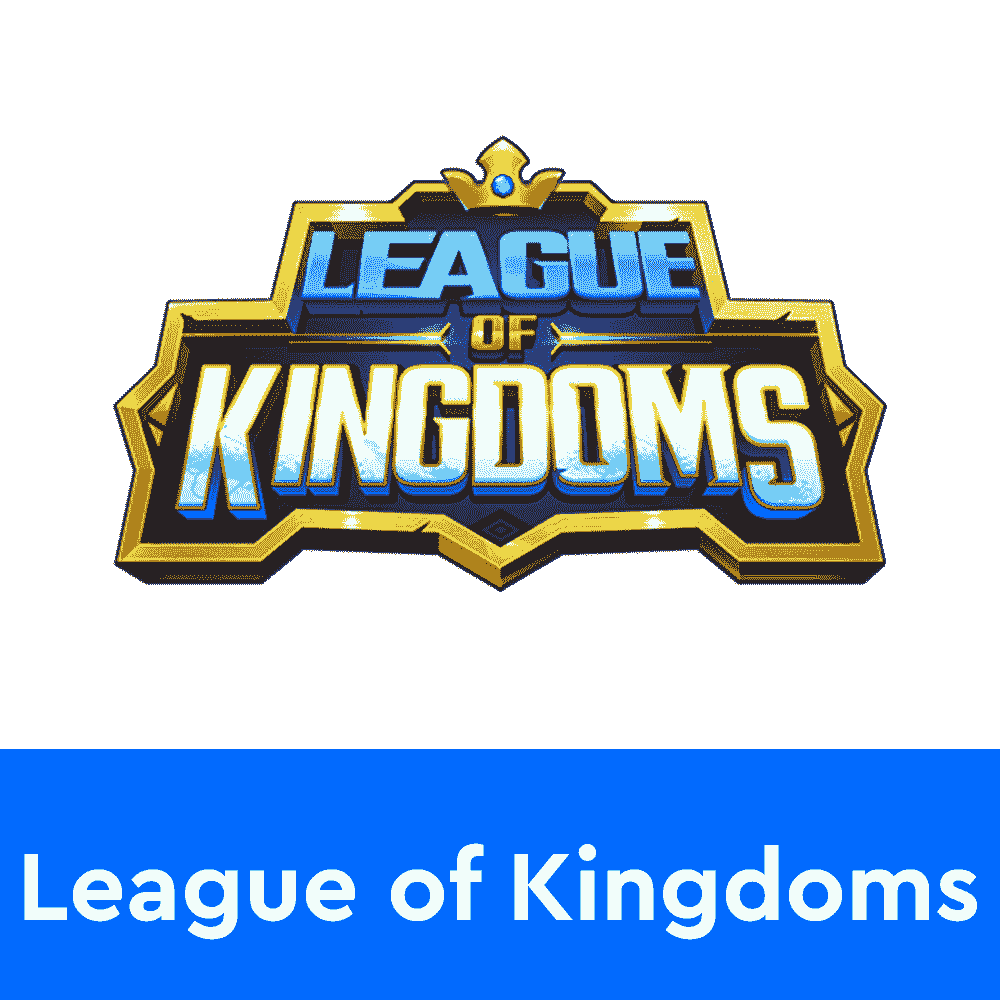
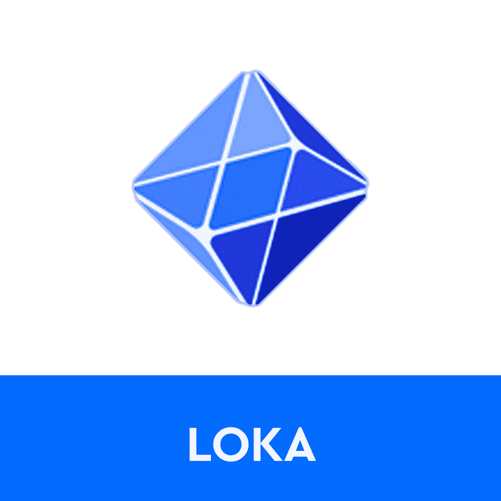
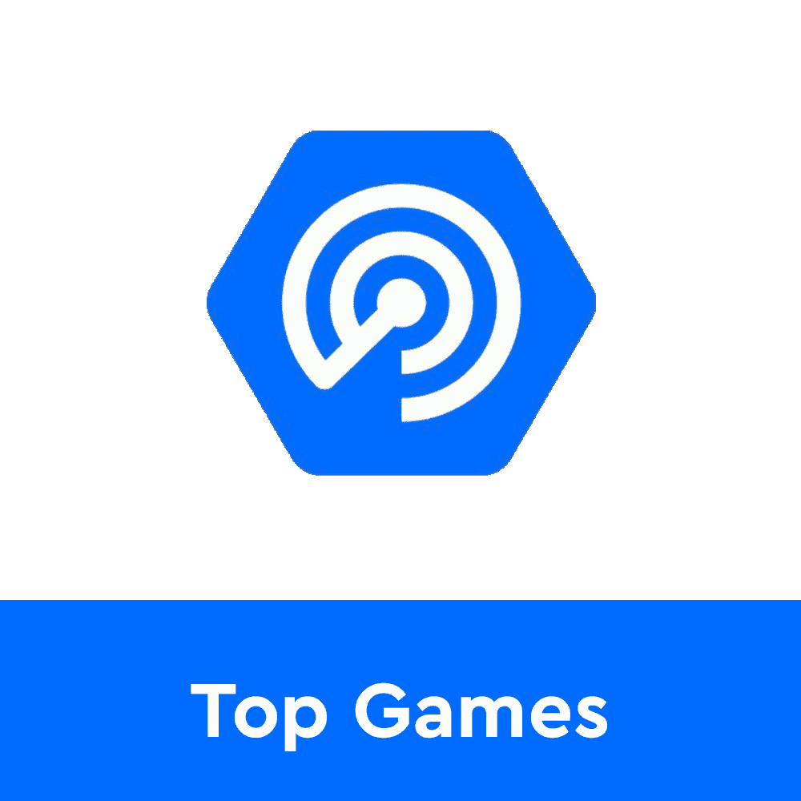

# 王国联盟和它的洛卡令牌

> 原文：<https://web.archive.org/web/https://dappradar.com/blog/league-of-kingdoms-and-its-loka-token>

## 一切你需要知道的关于玩赚战略游戏王国联盟和它的原生令牌洛卡

《王国联盟》是一款 MMO 战略游戏，玩家在游戏中互相争夺主导权。玩家有机会创造自己的王国，建造建筑并从中获得资源。更重要的是，由于本地的洛卡令牌，玩家可以成为王国联盟竞技场的一部分，并通过治理投票来决定游戏的命运。

在以太坊和多边形上运行的《王国联盟》吸引了大批追随者和玩家。由于丰富的游戏性，用户可以享受众多的功能。建立你的王国只是第一步。一旦安顿下来，你可以随时升级你的结构，或者冒险进行一项研究任务。投入资源寻找新的战斗技术或组成联盟。玩家也可以冒险去训练营，提升他们部队的技能和能力。创建一支强大的军队是王国联盟成功的关键因素之一。

农业和狩猎在游戏中也很重要，因为这些活动会奖励玩家急需的资源。你在耕作和狩猎时收集的物品将帮助你建立你的王国并强化你的结构。

[https://web.archive.org/web/20221217200039if_/https://www.youtube.com/embed/a1CWQgom4P8?feature=oembed](https://web.archive.org/web/20221217200039if_/https://www.youtube.com/embed/a1CWQgom4P8?feature=oembed)

## 什么是王国联盟竞技场(LOKA)？

王国联盟竞技场是平台背后的治理结构。它允许拥有洛卡代币的玩家参与所有与游戏相关的决策过程。

洛卡持有者有一个独特的优势，在许多关于游戏的高层决策中拥有最终发言权。令人印象深刻的是，这些也会影响整个游戏世界，不管谁拥有这个地区的土地。

更重要的是，竞技场提供了具有高收益池的赌注机制，玩家可以在其中增加他们的洛卡持有量。重要的是，玩家和用户需要下注 LOKA 令牌，以便参与治理投票。洛卡赌注的数量与你投票的份量相对应。

## 德拉戈 NFTs 和德拉戈灵魂令牌

您可能想知道此时“玩到赚”的要素在哪里？不用担心，Drago NFTs 和游戏内 Drago 灵魂令牌来了。Drago NFTs 是战斗伙伴，可以释放王国联盟的收入潜力。外出作战时，在你的部队旁边释放一辆德拉戈，以从游戏赚取结构中获益。

与你的部队并肩作战会给玩家带来 Drago 灵魂令牌(DST)奖励。有德拉戈·NFT 在场的情况下赢得比赛也能给玩家带来洛卡收入。看看下面详细的游戏经济分类。

重要的是，整个德拉戈 NFT 游戏赚取机制仍在开发中。该团队正致力于建立强大的游戏内经济，并预计在 2022 年底推出。

随着越来越多的玩家探索其有趣的游戏和赚钱机会，DappRadar 将继续监测王国联盟的生态系统。如果你想了解更多关于王国联盟和洛卡令牌的信息，请点击下面的链接。此外，你可以在 Twitter 上关注 DappRadar，并加入我们的 PRO Discord 频道，与其他王国联盟粉丝聊天。

[<picture></picture>](https://web.archive.org/web/20221217200039/https://dappradar.com/multichain/games/league-of-kingdoms)[<picture></picture>](https://web.archive.org/web/20221217200039/https://dappradar.com/hub/token/eth/LOKA?from=0x61e90a50137e1f645c9ef4a0d3a4f01477738406)[<picture></picture>](https://web.archive.org/web/20221217200039/https://dappradar.com/rankings/category/games) NewsletterUnsubscribe at any time. [T&Cs](https://web.archive.org/web/20221217200039/https://dappradar.com/terms) and [Privacy Policy](https://web.archive.org/web/20221217200039/https://dappradar.com/privacy-policy)