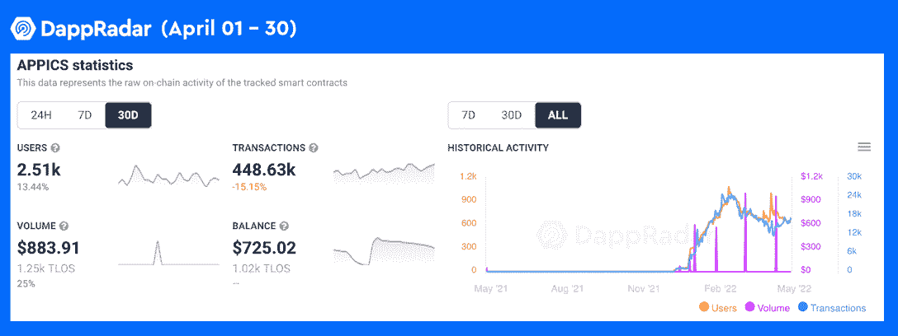
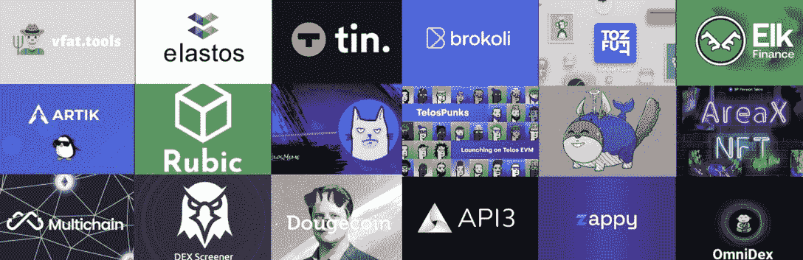
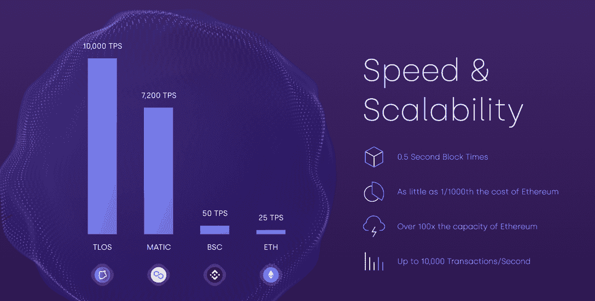
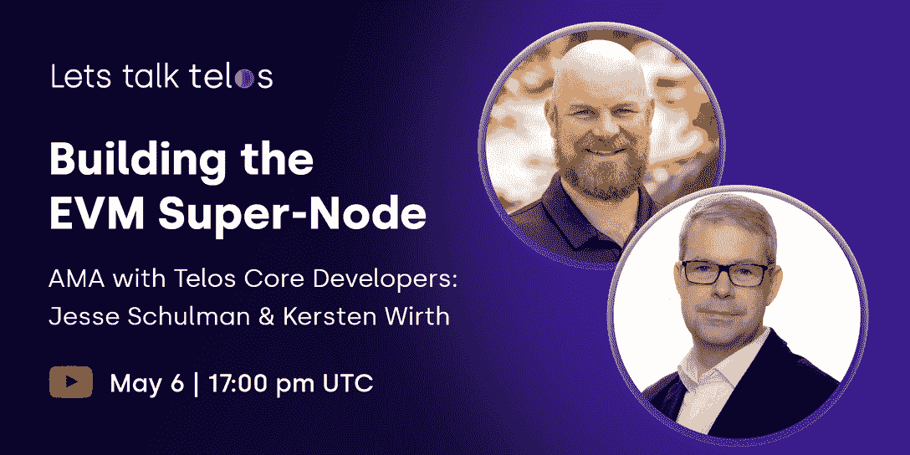

# 了解如何在低成本、高性能的 EVM 链 Telos 上构建 Dapps

> 原文：<https://web.archive.org/web/https://dappradar.com/blog/learn-how-to-build-dapps-on-telos-the-low-cost-high-performance-evm-chain>

## 加入 Telos AMA，了解最强大和可扩展的以太坊智能合约平台

**Telos 是一个速度极快的 EVM 兼容区块链，是 Web3 中发展最快的社区之一。该网络可以轻松支持每秒 10，000 笔交易，并且交易成本几乎为零。此外，Telos 努力让开发人员能够构建 dapps 以获得终极体验，并邀请他们参加即将举行的 AMA，以了解更多关于 Telos 的能力。**

**概要:**

*   泰勒斯区块链的生态系统发展迅速。
*   泰勒斯 EVM 以其独特的技术设计脱颖而出，具有多种优势。
*   Telos 团队邀请开发人员参加即将举行的 AMA，了解更多关于 Telos 的潜力。

[Telos 区块链](https://web.archive.org/web/20220927105349/https://dappradar.com/rankings/protocol/telos) ( [TLOS](https://web.archive.org/web/20220927105349/https://dappradar.com/hub/token/eth/TLOS/ETH?from=0x7825e833d495f3d1c28872415a4aee339d26ac88) )是一个去中心化的、符合 ESG(环境、社会和治理)的第一层区块链，于 2018 年成立。Telos 引领区块链生态系统的创新，以即时交易终结和极低的成本为用户提供非凡的体验。

Telos 生态系统正在各个领域迅速发展。根据 DappRadar 的说法，Telos 上的许多 dapps 自推出以来已经取得了里程碑式的成就。例如， [APPICS](https://web.archive.org/web/20220927105349/https://dappradar.com/telos/social/appics) 在 Telos 人气排行榜上独占鳌头，在所有社交 dapps 中排名第八。

经过多年的稳健发展，Telos 引入了 EVM 兼容性，为基于坚固性的应用提供了最佳解决方案，推动了 DeFi 和 NFT 油田的蓬勃发展。当区块链与 EVM 兼容时，以太坊、BSC、Polygon 和其他平台上的 dapps 也可以很容易地迁移到 Telos 区块链。因此，寻求高效、廉价和可扩展的区块链基础设施的团队选择加入泰勒斯 EVM 生态系统，以寻求项目的快速启动。下图显示了正在 Telos EVM 上运行的项目，还有更多正在进行中。

## 什么是泰洛斯 EVM，是什么让它独一无二？

[https://web.archive.org/web/20220927105349if_/https://www.youtube.com/embed/VQIYVG8tGsE?feature=oembed](https://web.archive.org/web/20220927105349if_/https://www.youtube.com/embed/VQIYVG8tGsE?feature=oembed)

对于熟悉 Solidity 编程语言的开发人员来说，Telos EVM 是一个最佳选择，同时也是寻找一个可扩展的以太坊兼容解决方案的最佳选择。与其他 EVM 链不同，泰勒斯 EVM 不仅仅是原始 Go 以太坊代码的一个分支。相反，这是一个全新的 EVM，从头开始重新设计，以充分释放 Telos 技术提供的力量。独特的设计给泰洛斯 EVM 带来了各种优势。

快如闪电的泰罗斯·区块链每秒钟可以创造两个新的积木。此外，他们为高吞吐量构建了 Telos EVM，支持每秒 10，000 次交易。那是以太坊容量的 100 倍。

性价比是泰罗斯 EVM 的另一个亮点。例如，泰洛斯 EVM 公司可以执行交易，只需以太坊要求的 0.1%的燃气费。值得注意的是，大多数泰罗斯 EVM 交易的成本将低至 0.01 美元左右。有了如此低的交易成本，交易者将能够交易少至 1 美元的金额，并且仍然看到利润。因此，泰洛斯 EVM 有能力彻底改变充满活力的德菲和 NFT 地区的面貌。

最重要的是，Telos 高度重视社区驱动的区块链生态系统。Telos 区块链建立了明确的规则，如果验证者违反这些规则，他们将受到惩罚。在 Telos 上，所有大宗商品生产商在收到交易时，必须按照先进先出的原则进行处理。他们不能为了利润而重新安排交易。这些因素加在一起，为泰洛斯 EVM 提供了强有力的保护。

## 用泰勒斯·EVM 建造 dapps

Telos 于 2022 年 2 月推出了第一次 Telos EVM 黑客马拉松，邀请以太坊的开发者将他们的雄心和想法带到 Telos EVM。黑客马拉松提供了赢取价值约 200，000 美元奖金的机会。此外，Telos 基金会已经锁定了 1200 万 TLOS 加密令牌，以加速未来四年 Telos 生态系统的扩张。

值得一提的是，Telos 通过提供各种资源来支持有才华的开发团队，努力推动区块链技术的广泛应用。即将举行的 AMA 邀请开发者探索泰勒斯 EVM 的无限机遇。[世界协调时 5 月 6 日 17:00，与 Telos 的核心开发人员 Jesse Schulman 和 Kersten Wirth 一起参加 AMA](https://web.archive.org/web/20220927105349/https://youtu.be/rz3g0eNXO6I) 。他们可以告诉你如何使用泰罗斯 EVM 构建用户友好、经济高效、可扩展的 dapps。

通过以下渠道了解更多关于 Telos 的信息:

[网站](https://web.archive.org/web/20220927105349/https://www.telos.net/)

[推特](https://web.archive.org/web/20220927105349/https://twitter.com/HelloTelos?s=20)

[不和](https://web.archive.org/web/20220927105349/https://discord.gg/9hurWxq3Gf)

[电报](https://web.archive.org/web/20220927105349/https://t.me/HelloTelos)

[但 Youtube 链接](https://web.archive.org/web/20220927105349/https://youtu.be/rz3g0eNXO6I)

**免责声明** —这是一篇赞助文章。DappRadar 不认可本页面上的任何内容或产品。DappRadar 旨在提供准确的信息，但读者应该在采取行动之前总是自己做研究。DappRadar 的文章不能被认为是投资建议。