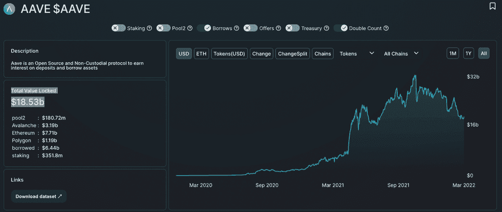
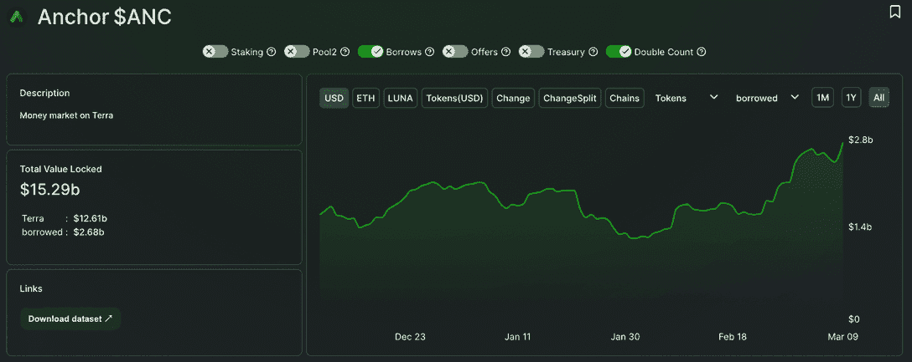
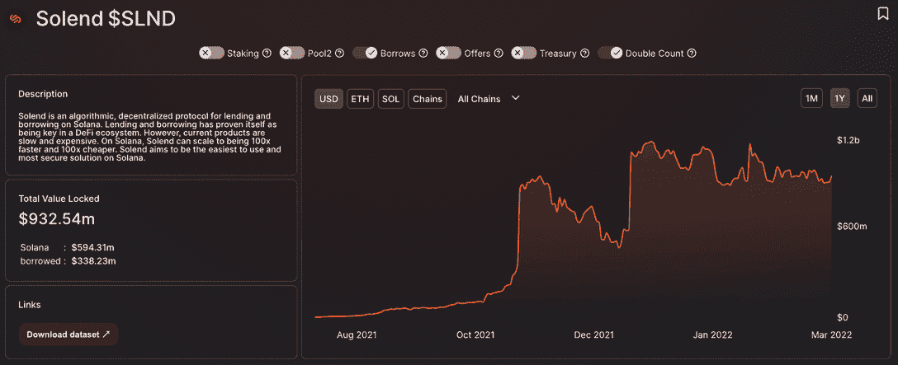
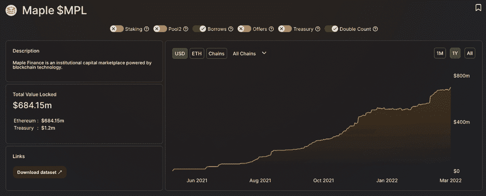

# 贷款在熊市中繁荣

> 原文：<https://web.archive.org/web/https://dappradar.com/blog/lending-thrives-in-bear-market>

## 贷款平台在熊市情景中增加了 TVL

**DeFi** **区块链多个借贷平台的用户活动和存款正在激增，因为交易员希望在熊市情景下最大限度地发挥其加密资产的盈利潜力。DeFi 中一个相对较新的想法是帮助将交易者的熊市转变为贷款者的牛市。**

加密贷款是指一种分散式金融，允许投资者将其加密货币借给不同的借款人，以获得利息支付。在各种平台上，奖励可以在 1%到 20%之间浮动，某些硬币的奖励更高。许多专门出借 crypto 的平台也接受与美元挂钩的 stablecoins。

本质上，我们强调了拥有更大资金且在可预见的时间内无意出售的加密货币持有者的借贷选择的可用性。在不利的交易条件下，借贷加密百分比收益可以成为任何投资策略的坚实臂膀。为了进一步证明这一点，我们可以看看几个区块链上的 DeFi 租借协议，看看这种影响是普遍的还是仅限于某些网络或 dapps。可以说，提供最佳回报的平台会吸引注意力，但并不总是最安全的选择。

## **Aave**

[Aave 可能是市场上最受认可的贷款协议](https://web.archive.org/web/20221129082614/https://dappradar.com/multichain/defi/aave)，它提供了一个分散的货币市场平台，储户通过向贷款池提供流动性来赚取利息，借款人通过利用这些贷款池来获得贷款。它还可以跨多个区块链操作，包括以太坊和多边形。[Aave](/web/20221129082614/https://dappradar.com/blog/aavegotchi-lending-drives-11-million-in-nft-sales/)中的 TVL 目前价值 185.3 亿美元，其中 64.4 亿美元(约三分之一)被贷款套牢。虽然下面分析的其他平台开始在贷款方面获得牵引力，但 Aave 已经领先了一段时间，去年几乎每个季度都将 TVL 翻倍。Aave 将其 TVL 从 2021 年 3 月 9 日的 52.3 亿美元增加到写作时的 180 多亿美元。

[贷款利率](https://web.archive.org/web/20221129082614/https://dappradar.com/multichain/defi/aave)取决于被借出的资产，并且经常变化，因此彻底浏览报价并根据自己的要求做出选择非常重要。

例如，目前存款 feiUSD，一种与美元挂钩的稳定货币，可以获得 8%多一点的 APY，而赌注 Sythetix 本地令牌将为储户赢得 5.5%的 APY。

## 锚

Anchor 是区块链土地上的一项贷款协议，该协议将 TVL 从 2022 年 2 月初的 12.3 亿美元增加到写作时的 26.8 亿美元。这一数字在大约六周内翻了一倍多，显示出持有人利用锚资产杠杆化的强烈意愿。目前 UST 的 APY 利率是 19.5%，这意味着 1000 美元的存款可以产生 195 美元的利润，减去任何适用的费用。可以说这是一个比在熊市中冒险安全得多的位置。

## 太阳光了

Solend 是 Solana 上用于借贷的算法化、去中心化协议,总价值超过 9 . 32 亿美元，其中 3 . 38 亿美元(超过三分之一)被冻结在借贷中。该平台比 Anchor 更灵活，允许出借人存放几种硬币，包括 USDC、ETH 和 SOL。每种代币的 APY 比率几乎每天都在变化，有些代币有乘数，还包括其他奖励。做一些扎实的研究来评估最佳职位是值得的。

例如，目前存款 Solana 的原生令牌 SOL 可以为储户赚取 30%左右的 APY，而存款 SLND，Solend 平台的令牌可以为储户赚取 26%左右的 APY。这是一个更有活力的贷款，因为奖励有多种形式，加起来有 26%。1.08%供应 APY + 23.81% SLND 奖励+ 1.19% SLND 期权。

## 枫叶金融

Maple 是以太坊上的一个贷款平台，允许贷款人通过贷款给加密领域的机构来产生收益。每个贷款池向众多借款人提供贷款，为贷款人提供多样化的风险敞口。此外，Maple 也是贷款人一劳永逸的解决方案，因为资金池代表对借款人进行尽职调查并管理资金池。该平台锁定的总价值已从 2 月初的 5.27 亿美元上升至撰写本文时的 6.84 亿美元。

用户[可以在众多的借贷池](https://web.archive.org/web/20221129082614/https://app.maple.finance/#/earn)中搜索，找到一个适合他们的目标，存入各种代币，然后坐下来。目前，BlockTower 资金池中 USDC 存款的最高 APY 为 18.5%，而在另一端，贷方在 Celsius wETH 资金池中可以获得 3.7%的 APY。

可以说，这个平台对银行来说更有分量，因为钱是借给机构投资者而不是个人的，而且风险可能更小。此外，在以太坊进行交易的事实意味着，目前在 Maple 上进行任何交易的费用都非常高，这意味着较小的投资者可能会避开这些交易，转而选择成本低得多的平台，如 Solend。

## 低迷时期的收入

加密货币现在比以往任何时候都更具活力和价值。2017 年，当市场崩溃时，人们别无选择，只能 HODL 或抛售。现在，仅仅五年后，我们就拥有了一个涵盖多个区块链和数千个 dapp 的完整 dapp 生态系统。大多数向投资者提供效用和价值，但无意放弃加密。相反，在熊市情况下，将资产借给他人以获取回报似乎是一种可靠的押注。

 NewsletterUnsubscribe at any time. [T&Cs](https://web.archive.org/web/20221129082614/https://dappradar.com/terms) and [Privacy Policy](https://web.archive.org/web/20221129082614/https://dappradar.com/privacy-policy)

***以上不构成投资建议。此处给出的信息仅供参考。请行使尽职调查，做你的研究。作者持有 ETH、BTC、AGIX、HEX、LINK、GRT、CRO、OMI、不变 X、ENS、GALA、AVASTR、GMEE、CUBE、RADAR、FLOW、FTM、BNB、SPS、WRLD、ATOM 和 ADA。***