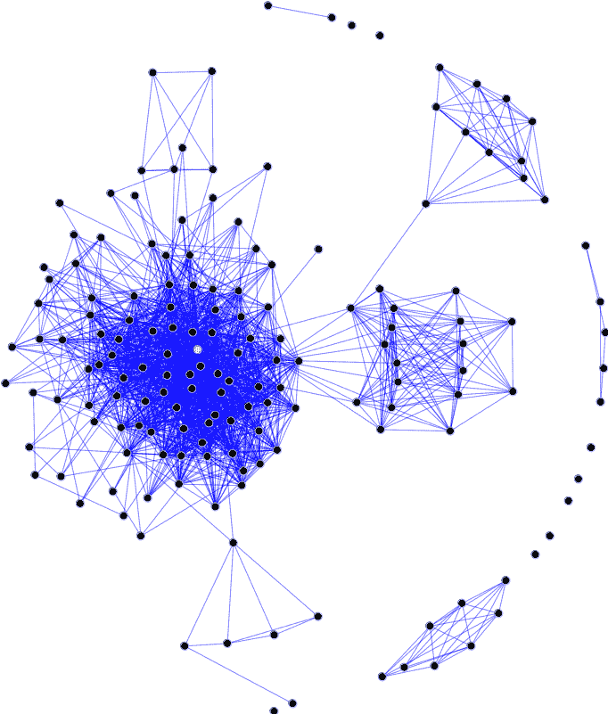
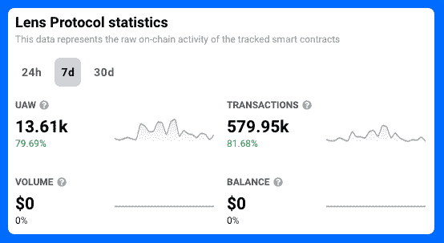
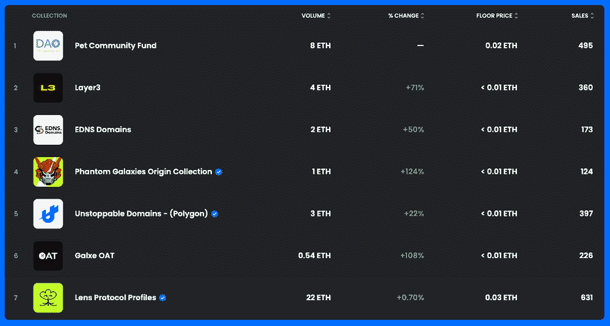

# 镜头协议:将社交媒体引入区块链

> 原文：<https://web.archive.org/web/https://dappradar.com/blog/lens-protocol-bringing-social-media-to-the-blockchain>

## 在过去的一周里，使用 dapp 的用户增加了 80%

Lens Protocol 正在构建能够改变 Web3 时代社交媒体面貌的基础设施。该平台将赋予用户和创作者对其在线状态的所有权。考虑到这一点，Lens Protocol 的最新举措是让人们控制自己的数字身份的第一步。这导致了他们的链上指标的巨大飞跃。

**亮点**

*   *在过去的七天里，连接到 Lens 协议的唯一活动钱包增长了 79.69%。同期，交易量增长了 81.68%*
*   *Lens Protocol 是一个协议，不是一个应用程序。Lens 正在建立平台和基础设施，创作者可以在上面放置他们的内容。这意味着用户可以使用相同的在线身份在各种应用程序之间移动。这个想法是为了促进信任和良好声誉的重要性。*
*   随着用户试图为他们的个人资料获得最好的名字，Lens 协议句柄已经成为 OpenSea 上的趋势。

[Explore Lens Protocol Data](https://web.archive.org/web/20221201051738/https://dappradar.com/polygon/social/lens-protocol)

## 什么是镜头协议？

Lens Protocol 是一个去中心化的社交图，为 Web3 社交媒体平台提供基础设施。他们的目标之一是在所有数字平台上给用户一个单一的、区块链安全的身份。Lens 的目标是利用 NFT 技术，让用户可以在社交元宇宙上无缝移动，而不是登录到独立的“过时的中央系统”。

镜头协议的目标超越所有权和身份。他们的使命也是帮助缓解我们在今天的社交媒体平台上看到的一些问题。Twitter、Meta 和抖音的算法都偏爱愤怒、愤慨和对抗。利用这些情绪的内容会获得点击、关注和金钱。

在过去五年左右的时间里，人们已经意识到网上的敌意已经蔓延到了现实世界。将敌意置于合作之上的内容导致了更加分裂和根深蒂固的公共话语。Lens Protocol 希望通过“让创作者拥有自己和社区之间的联系”来帮助缓解这种情况。

## 镜头协议将如何工作？

Lens Protocol 将为用户提供所谓的社交图谱。这是社交媒体公司向用户推荐视频、新闻或广告时使用的联系网络。使用算法，LinkedIn 和 Meta 等公司将根据用户社交图中的其他人，将内容呈现在用户面前。

A social graph making networked connections

Lens 希望开放这些工具，让创作者直接插入其中，而不是隐藏这些数据并将其货币化。然后，创作者可以准确地将他们的内容导向容易接受的受众。社交图谱也将对用户开放，因此他们可以选择他们想看的内容。

Lens 预测，这将阻止集中式社交媒体公司通过推广愤怒、敌对的帖子来争夺用户的注意力。

### 一个小故事来展示这是如何工作的

*   发布 Web3 博客的创建者建立个人资料并发布他们的文章。这些内容被附加到一个单独的配置文件中，该配置文件可以在各种应用程序之间移动和工作。
*   用户的社交图显示他们对 Web3 感兴趣。
*   现在，创作者可以分析社交图，并将其内容导向用户。
*   然后，用户可以关注创建者的个人资料，并参与他们的内容。他们还可以看到该个人资料在他们的社交图中有哪些其他联系，并开始与该社区互动。
*   如果创作者制作了好的内容，他们可以开始赚钱，并建立自己的声誉。

此外，用户将对其在线身份拥有完全的所有权，而创建者将对其内容拥有完全的所有权。由于没有一个集中的社交媒体平台能够完全控制他们的用户群，他们无法取消、取消或压制用户。

这也意味着创作者的内容是安全的，因为它不再受未知算法的支配。他们的作品不能被拿走，也不能因为版主的一时兴起而被屏蔽。

## 关于镜头协议，DappRadar 数据告诉了我们什么？

在过去的七天里，DappRadar 的数据显示，Lens Protocol 和平台的链上指标是一次有趣的旅程。Unique active wallets 增长了 80%，达到 13，610 个。unique active wallets 是衡量有多少个人 Web3 钱包与 dapp 连接的指标。

交易数量显示了通过 dapp 智能合约进行的交易数量，过去一周增长了 82%，达到 579，950 笔。这两个上升都与镜头协议的大发展相吻合。

[<picture></picture>](https://web.archive.org/web/20221201051738/https://dappradar.com/polygon/social/lens-protocol)

Data source: [DappRadar](https://web.archive.org/web/20221201051738/https://dappradar.com/polygon/social/lens-protocol)

镜头协议最近开始让人们要求他们的镜头手柄。这将与用户在所有由 Lens 支持的应用程序中使用的在线身份相关联，也称为个人资料。

独特的活动钱包和交易一飞冲天的原因是因为人们连接到该协议并要求他们的句柄。虽然不是一回事，但类似于人们在[以太坊区块链](https://web.archive.org/web/20221201051738/https://dappradar.com/rankings/protocol/ethereum)上宣称 [ENS 域名](https://web.archive.org/web/20221201051738/https://dappradar.com/blog/new-dapps-report-ens-domains-10k-club-numbers-dont-lie)给人一个身份。

## OpenSea 上的 Lens 协议趋势

本周，Lens Protocol 也成为了二手市场 OpenSea 的热门话题。已经有成千上万的手柄，人们在公开市场上以不同的价格交易它们。

Lens Protocol at number 7 on OpenSea trends

用户可以在公开市场上交易他们的手柄，因为 Lens 是一家 Web3 公司。安全所有权原则是公司工作的核心。如果用户能够建立一个强大的网上声誉，然后用这个档案来获利，这将是一件有趣的事情。如果他们可以，我们将会看到有钱人能够买到地位，而不是赢得地位。

[Check Lens Protocol Data](https://web.archive.org/web/20221201051738/https://dappradar.com/polygon/social/lens-protocol)

## 随身携带您的 Web3 之旅

使用 DappRadar 移动应用程序，再也不会错过 Web3。查看最受欢迎的 dapps 的性能，并关注您投资组合中的 NFT。您在 DappRadar 上的帐户会与我们的移动应用程序同步，这样您很快就可以选择实时接收提醒。

[Download the DappRadar app now](https://web.archive.org/web/20221201051738/https://dappradar.app.link/blog)[<picture></picture>](https://web.archive.org/web/20221201051738/https://play.google.com/store/apps/details?id=com.portfolio.dappradar)