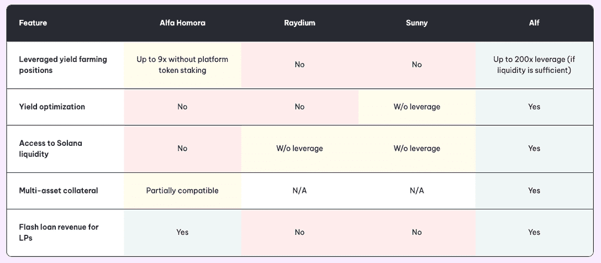
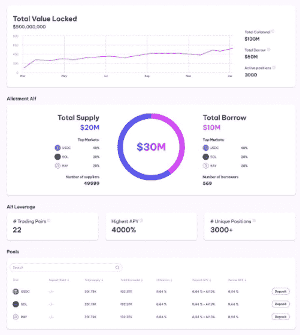
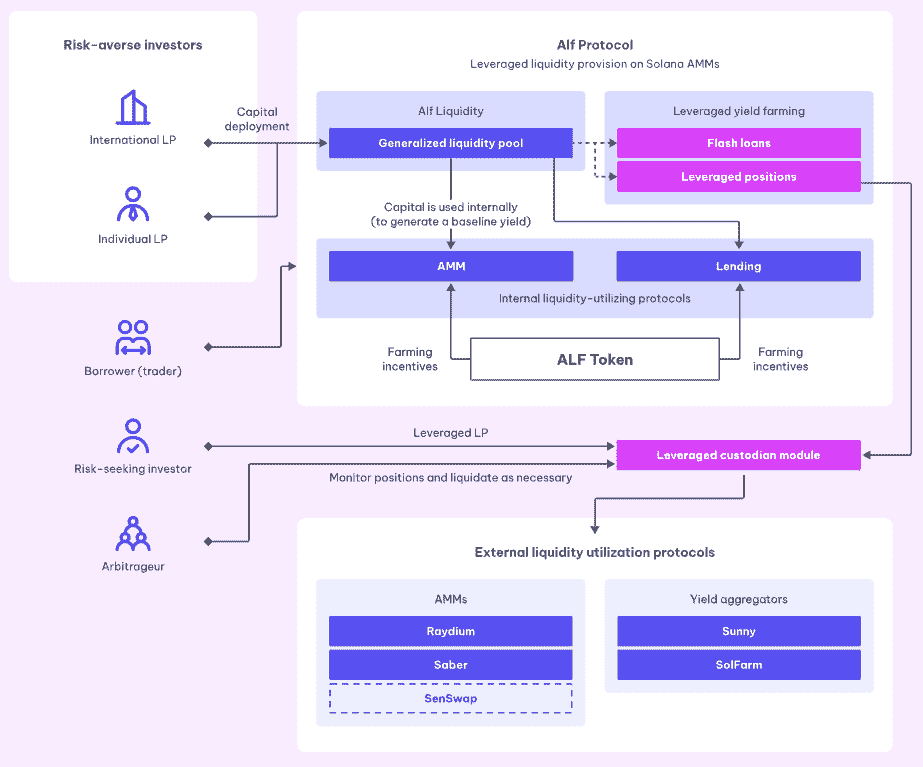
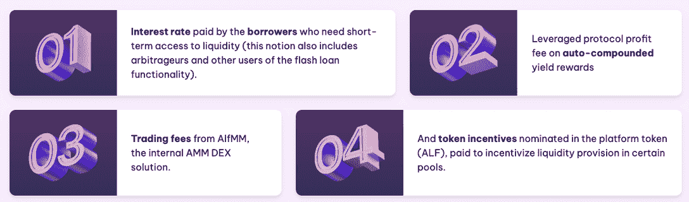
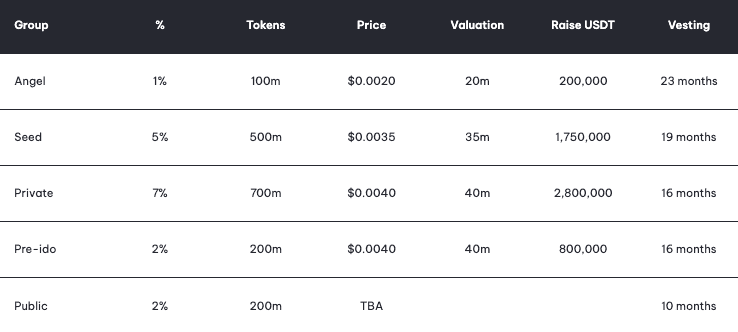

# 采用 ALF 方案的茄果类作物杠杆产量农业

> 原文：<https://web.archive.org/web/https://dappradar.com/blog/leveraged-yield-farming-on-solana-with-alf-protocol>

## 迈向 DeFi 3.0 的一步

Alf 是一个基于 Solana 的协议，旨在为寻求资本最大化的投资者寻求更好的条件。旨在作为做市商和交易商的工具，为杠杆收益农业和流动性供应创建独立的资金池。Alf 可被视为 dapp，旨在促进资本发起和高杠杆头寸产品的分散市场。

[ALF 协议的 Pre-IDO(初始 DEX 提供)回合当前开放并运行](https://web.archive.org/web/20221206165511/https://dappradar.com/solana/defi/alfprotocol)。本次发行将产生 2%的代币供应量(200，000，000 个代币),每枚代币售价 0.004 美元。

索拉纳生态系统创造了比以太坊 dapps 更低的进入壁垒，主要是由于成本。[Alf 协议](https://web.archive.org/web/20221206165511/https://dappradar.com/solana/defi/alfprotocol)得益于 Solana 快速、低成本的区块链技术，可提供高达 200 倍的杠杆头寸，具有高水平的安全性和容量。与其他领先的基于 Solana 的 DeFi dapps 相比，Alf 还为寻求杠杆作用和互操作性的严肃交易者提供更全面的服务。

## 控制简单的复杂仪器

Alf 的目标是确保用户可以轻松地浏览平台，并充分利用其功能。尽管设计尚未最终确定，但预览提供了团队计划内容的广泛概述。用户界面的最终版本可能在外观上有所改变，但保留相同的功能。

Alf 协议的仪表板将提供市场表现的简要快照。用户将看到锁定在 Alf 协议中的值、总供应和需求、表现最佳的对以及其他信息，以确保它们始终是最新的。

一旦用户有了一个概览，farming 面板就会在令牌对上提供 farming 选项。该小组将允许杠杆化和非杠杆化的农业选项，并提供详细的余额信息和预期的 APY。帮助投资者在投入资金前做出决策的基本信息。对 Alf 用户来说，真正的刺激来自于从同一个仪表板中访问高杠杆农业选项。

## 杠杆流动性准备金

自动做市商(AMM)的杠杆流动性规定的基本风险框架目前介于一段时间内通过 AMM 对交易的资本金额和一段时间内给定对报价之间的最大差额之间。例如，Uniswap 或 SushSwap 等标准 AMM 遭受非永久性损失，这是流动性提供商在报价与他们进入头寸时不同时产生的损失。当价格以这种方式偏离时，非永久性损失开始增加，这随着杠杆头寸的杠杆作用而放大，直到头寸被退出、去杠杆化或清算。

Alf 提供的解决方案是，当市场波动时，将借入的资金转移到其他类型的头寸，或者在亏损变得不成比例之前自动退出头寸。这是通过监测外部市场的价格并将其与 AMM 价格进行比较来维持的。

## 什么是杠杆产量农业

标准收益农业是一个过程，其中用户获得额外的激励，通常是以另一种令牌的形式，用于根据特定的 AMM 协议(如 PancakeSwap 或 UniSwap)向流动性池提供流动性。

举例来说，如果您向 SOL-USDt 流动性池提供 1 SOL 和 200 USDt 的流动性(假设 1 SOL = 200 USDt ),那么除了协议获得的交易费份额之外，您还将获得另一个令牌的奖励，例如令牌 Z。例如，10%的 APY，这是您作为任何 AMM 的流动性提供者通常会获得的利率。

杠杆产量农业是一种机制，允许农民提高产量农业的地位，这意味着借用外部流动性并增加其流动性以进行产量农业。由于对收益农场有更多的流动性，例如，多借两个 SOL，总计 3 个 SOL 和 600 美元，杠杆收益农场获得更多 Token Z 的回报和更大份额的交易费，作为承担增加的风险的交换。

## 用 Alf 赚钱的四种方法

一旦上线，Alf 希望在其平台上为用户提供四种主要的盈利方式。首先，将向希望短期获得流动性的借款人收取利率，比如那些使用快速贷款的借款人。其次，与其他平台一样，奖励可以自动复合，帮助用户无需人工劳动即可收集奖励。

第三，该平台的内部分散交易所 AlfMM 将对该平台上发生的所有代币互换收取交易费用，分配给流动性提供者。最后，为了激励 ALF 上某些重要池的增长，该协议将使用其固有的 Alf 令牌来大量奖励特定的流动性条款。

## Alf 协议摘要

对于交易者和投资者来说，产量农业已经成为一种流行的方式，在技术上持有的同时，最大限度地从其象征性持有中获得收益。它还通过为 Alf 的流动性供应提供象征性奖励，极大地帮助项目获得风险。可以说，让一个人对一个项目感兴趣的最好方法就是给他们一点投资。

更进一步说，杠杆收益农业不适合胆小的人，因为它在决策时涉及更高的风险。用户应该始终研究令牌对以及它们可能面临的特定风险。当然，没有绝对的要求来尝试和利用高达 200 倍。用户可以先从小处着手，测试他们的想法，然后再进行更大的飞跃。

Alf 协议正在努力工作，计划在整个系统中分阶段推出 testnet，以在更大范围内测试其效率和功能。如前所述，ALF 协议的 Pre-IDO(初始 DEX 提供)回合当前是开放和运行的。本次发行将铸造 2%的代币供应量，即 200，000，000 枚代币，每枚代币售价 0.004 美元。重要的是，这比初始投资者支付的价格高不了多少。

**通过以下链接了解有关 Alf 协议的更多信息:**

*   [网站](https://web.archive.org/web/20221206165511/https://alfprotocol.com/)
*   [推特](https://web.archive.org/web/20221206165511/https://twitter.com/AlfProtocol)
*   [电报](https://web.archive.org/web/20221206165511/https://t.me/alfprotocol)
*   [中等](https://web.archive.org/web/20221206165511/https://medium.com/@alfprotocol)
*   [伊多](/web/20221206165511/https://dappradar.com/cdn-cgi/l/email-protection#365f584053454276575a50464459425955595a1855595b)

 NewsletterUnsubscribe at any time. [T&Cs](https://web.archive.org/web/20221206165511/https://dappradar.com/terms) and [Privacy Policy](https://web.archive.org/web/20221206165511/https://dappradar.com/privacy-policy)

**免责声明** —这是一篇赞助文章。DappRadar 不认可本页面上的任何内容或产品。DappRadar 旨在提供准确的信息，但读者应该在采取行动之前总是自己做研究。DappRadar 的文章不能被认为是投资建议。