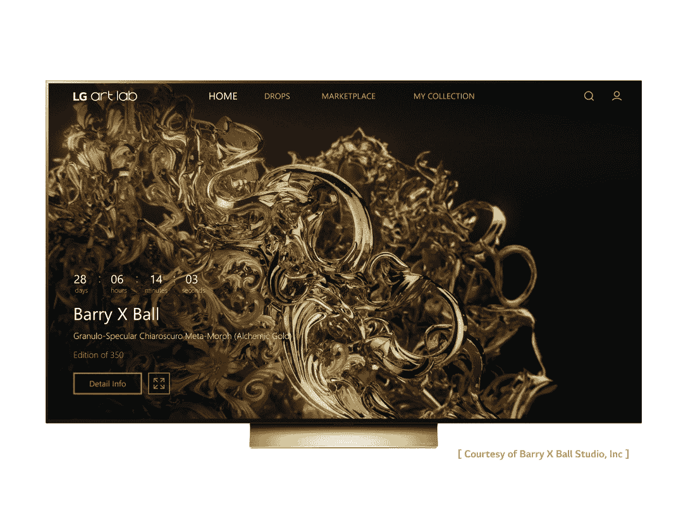

# LG 电子加入 Web3，推出 NFT 市场

> 原文：<https://web.archive.org/web/https://dappradar.com/blog/lg-electronics-joins-web3-with-launch-of-nft-marketplace>

## 另一家韩国跨国企业集团正在给传统市场带来创新

**LG 电子刚刚推出了平台 LG Art Lab。这是一个创新的 NFT 市场，旨在简化直接从您的电视主屏幕上交易数字艺术品的过程。用户第一次可以从他们的智能电视上购买、销售和欣赏高质量的数字艺术品。**

LG 艺术实验室现在可以在美国运行 webOS 5.0 的 LG 电视上使用，并且基于 [Hedera 网络](https://web.archive.org/web/20221208083833/https://dappradar.com/nft/protocol/hedera)。

此外，如果你想通过电视访问这个 NFT 市场，你必须获得一个 Wallypto 数字钱包地址，这是 LG 为智能手机推出的加密货币钱包，将于 2022 年第三季度发布。

市场首次亮相，声称是“给当代艺术爱好者的一次款待”，欢迎雕塑家巴里·X·鲍尔进入 NFT 空间。

Source: [LG Newsroom](https://web.archive.org/web/20221208083833/https://www.lgnewsroom.com/2022/09/lg-tvs-turn-living-room-into-digital-art-gallery-with-new-nft-platform/)

LG 用户可以获得他的一件数字艺术作品，这些作品使用最新的 3D 扫描和打印技术来重新诠释古典和现代主义雕塑。

预计在未来，海德拉区块链和 [LG 艺术实验室](https://web.archive.org/web/20221208083833/https://www.lgartlab.com/)市场将吸引更多的艺术家和收藏家。

*   **另请阅读:**[Hedera 如何通过其充满活力的 NFT 生态系统为项目提供支持](https://web.archive.org/web/20221208083833/https://dappradar.com/blog/how-can-hedera-empower-projects-with-its-vibrant-nft-ecosystem)

## 三星凭借 dappradar 领先于 web3 智能手机

LG 并不是唯一抓住机会涉足 dapp 行业的韩国科技巨头。在 2022 年，我们已经看到了传统品牌跳入 Web3 空间并投资区块链技术的趋势——无论是在 NFTs 还是元宇宙游戏虚拟世界。

例如，2022 年 8 月，[三星宣布与 DappRadar](https://web.archive.org/web/20221208083833/https://dappradar.com/blog/how-dappradars-partnership-with-samsung-blockchain-wallet-is-powering-the-next-generation-of-web3-smartphone-users) 合作，以促进分散式应用程序发现。2019 年推出的三星区块链钱包支持比特币、以太坊和 ERC 代币，最有可能启发或与 LG 的新 Wallypto 竞争。

## 不断了解和跟踪 NFT

LG 电子的这一声明是我们看到重要的 Web2 公司在未来迈出的又一大步。因此，这是向主流受众采用分散式应用迈出的又一步。

正如我们的[行业报告](https://web.archive.org/web/20221208083833/https://dappradar.com/reports)所示，尽管加密货币市场处于低迷状态，但公众对 NFTs 的兴趣依然浓厚。事实证明，强大的 NFT 收藏往往是抵御加密风暴的一种[。](https://web.archive.org/web/20221208083833/https://dappradar.com/blog/strong-nft-collections-provide-hedge-among-crypto-turmoil)

DappRadar 将继续关注 LG 进入 NFT 空间的旅程，并让您了解最新进展。

如果你喜欢了解 [NFTs](https://web.archive.org/web/20221208083833/https://dappradar.com/nft/protocol/hedera) ，一定要访问我们的[博客](https://web.archive.org/web/20221208083833/https://dappradar.com/blog/)，并在 [Twitter](https://web.archive.org/web/20221208083833/https://twitter.com/DappRadar) 上关注 DappRadar，保持领先。

***以上不构成投资建议。此处给出的信息仅供参考。请尽职调查并自行研究。***

 NewsletterUnsubscribe at any time. [T&Cs](https://web.archive.org/web/20221208083833/https://dappradar.com/terms) and [Privacy Policy](https://web.archive.org/web/20221208083833/https://dappradar.com/privacy-policy)