# 像互联网一样，元宇宙不会死

> 原文：<https://web.archive.org/web/https://dappradar.com/blog/like-the-internet-the-metaverse-cant-die>

## 元宇宙的概念仍在发展，其中的世界也在变化

**总结**

*   ***[自 2021 年 11 月的高点以来，沙盒、分散土地、Somnium Space 和隐体素经历了平静。](https://web.archive.org/web/20221201204754/https://dappradar.com/blog/like-the-internet-the-metaverse-cant-die/#drop-decentraland)***
*   ***[脸书更名为 Meta 可能导致元宇宙地价短期飙升](https://web.archive.org/web/20221201204754/https://dappradar.com/blog/like-the-internet-the-metaverse-cant-die/#why-drawback)。现在每个人都不知道下一步去哪里。***
*   像 Metroverse 和 Treeverse 这样较小的世界正在悄悄地建立他们的社区并从其他平台过去的错误中学习。
*   说元宇宙会失败就像说互联网会被关掉一样。很快它将成为我们游泳的水。

2021 年底，元宇宙的虚拟世界蓬勃发展。但自今年年初以来，分散土地和沙盒等空间的大玩家已经失去了活力。但是，当大玩家正在经历一个艰难的时期，新玩家正在等待为用户提供效用，价值和对元宇宙未来的希望。

到目前为止，2022 年对于元宇宙的一些大腕来说并不是一个好年景。[去中心化](https://web.archive.org/web/20221201204754/https://dappradar.com/ethereum/marketplaces/decentraland)、[沙盒](https://web.archive.org/web/20221201204754/https://dappradar.com/ethereum/games/the-sandbox)、[隐体素](https://web.archive.org/web/20221201204754/https://dappradar.com/ethereum/collectibles/cryptovoxels)和 [Somnium Space](https://web.archive.org/web/20221201204754/https://dappradar.com/ethereum/games/somnium-space) 自年初以来都在下跌。

土地销售已经下降，本地代币价格——[沙](https://web.archive.org/web/20221201204754/https://dappradar.com/hub/token/eth/SAND?from=0x3845badade8e6dff049820680d1f14bd3903a5d0)、[法力](https://web.archive.org/web/20221201204754/https://dappradar.com/hub/token/eth/MANA?from=0x0f5d2fb29fb7d3cfee444a200298f468908cc942)和魔方——继续走低。与虚拟世界互动的独特活动钱包的数量已经开始急剧下降，人们对这些平台未来的普遍兴奋已经明显消退。

## 分散土地的下降

甚至在最近的 3 月下旬，分散的土地似乎正在全速前进，因为它自信地成为元宇宙的国王。它举办了一个有超过 108，000 人参加的时装周。科技流行公主 Grimes 表演了一套 DJ，Dolce & Gabbana 派出其化身穿着最新的 NFT 高级时装走上 t 台。

但早在任何数字图标走上 t 台之前，DappRadar 的分散化连锁分析就表明，该平台已经在几个重要类别上出现了问题。

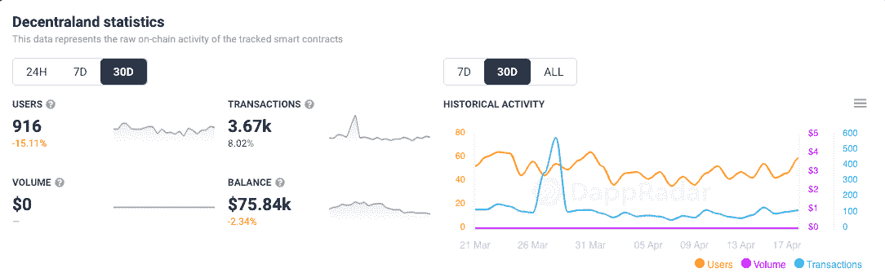

[DappRadar 30-day on-chain analytics for Decentraland](https://web.archive.org/web/20221201204754/https://dappradar.com/ethereum/marketplaces/decentraland)

正如我们在上面的图表中所看到的，在过去的 30 天里，与分散式网络连接的独立活跃钱包数量下降了 15.11%。就分散之地的访客总数而言，每天大约有 25，000 人进入虚拟世界。这似乎是一个健康的用户数量，但我们谈论的是一家估计市值超过 10 亿美元的公司。

其他重要的环比指标在过去 30 天也有所下降。NFT 交易量下降了 47.24%，交易非金融交易的人数下降了 37.27%。销售额下降了 44.29%，土地的楼面价和平均售价分别下降了 8.11%和 5.2%。

## 沙盒也在受苦

沙盒，另一个巨大的虚拟世界，显然走上了成功之路，最近也遭受了类似的下降。

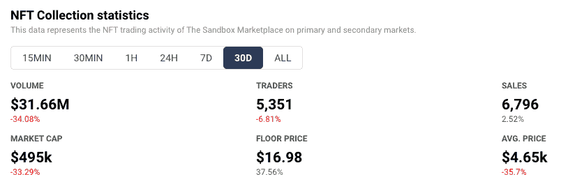

[DappRadar’s 30-day NFT collections statistics for The Sandbox](https://web.archive.org/web/20221201204754/https://dappradar.com/ethereum/marketplaces/the-sandbox-marketplace)

自 2022 年 2 月初以来，沙盒中的土地价格一直在下跌。沙盒中土地的平均价格目前徘徊在 2 ETH 左右(当前价格为 6100 美元)。2 月 6 日为 5.25 ETH(1.6 万美元)。如上图所示，沙盒中所有资产的平均价格，包括土地和游戏内 NFTs，在过去 30 天中下跌了 35.7%，至 1.5 ETH(4650 美元)。

在过去的 30 天里，与 dapp 的智能合约交互的唯一活跃钱包也下降了[，下降了 66.25%](https://web.archive.org/web/20221201204754/https://dappradar.com/ethereum/games/the-sandbox) 。价格和互动都下降了。尽管沙盒有名人代言，庞大的品牌合作伙伴和一轮全新的融资，可能使该公司估值达到 40 亿美元，但所有这一切都是如此。

拥有大部分沙盒的 Animoca Brands 肯定有很大的计划，利用其稳定的其他区块链平台来创建一个游戏和数字娱乐的虚拟世界。这种自上而下的集中系统可能不符合当前 web3 社区的精神。但对于大多数只想分散注意力的人来说，这可能是一个可以去玩的地方。

## 其他大牌也遵循同样的模式

[隐体素](https://web.archive.org/web/20221201204754/https://dappradar.com/blog/search/?q=cryptovoxels)和 [Somnium Space](https://web.archive.org/web/20221201204754/https://dappradar.com/blog/tag/somnium-space) 构成了四大虚拟世界中的另外两个 [DappRadar 已经追踪了一段时间](https://web.archive.org/web/20221201204754/https://dappradar.com/blog/over-100-million-in-metaverse-land-sales-last-week)。这些平台在许多分析类别中也遭遇了下滑，其中一个重要类别是土地价值。

对于那些购买土地希望其价值上涨的人来说，下面的表格摘自《沙丘分析》。它显示，自 2 月份的峰值以来，Somnium Space 的平均土地价格已经下降了 44%，从 17，679 美元降至 9，905 美元。

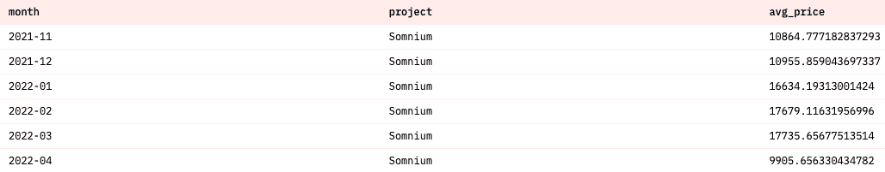

Dune Analytics: Somnium Space average land price peaked and fell in 2022

Cryptovoxels 的 250 天移动平均线也不适合阅读。对于任何在虚拟世界中持有土地的人来说，目前 1.23 ETH(3765 美元)的平均售价只是过去一年平均售价的一半多一点，对于任何在该游戏中持有土地的人来说，这是 2.2 ETH(6735 美元)。

下图中我们能看到的峰值发生在 2021 年 12 月 6 日。从那以后，游戏中的土地价值几乎一直在持续下降。

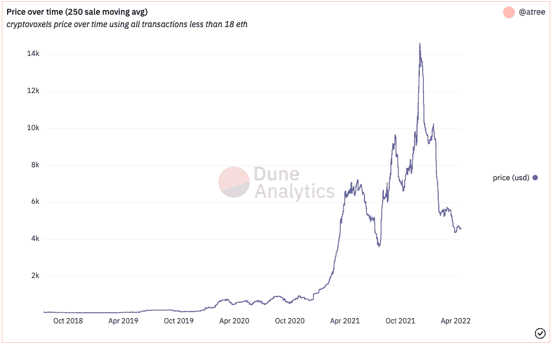

Dune Analytics: Cryptovoxels 250-day moving average for land price

那么，人们应该担心元宇宙的未来吗？虚拟世界的想法只是人们生活在疫情最糟糕时期的疯狂时代的一个标志吗？

想必脸书创始人兼首席执行官马克·扎克伯格不希望如此。他似乎把公司的巨额财富押在了 web3 虚拟世界的想法上。这位技术领袖甚至将他的公司名称改为 Meta，因为他预计元宇宙将是互联网的未来。

具有讽刺意味的是，正是扎克伯格在 2021 年 10 月 28 日宣布他的公司更名，引发了将我们带到这里的事件。当一家像脸书这样的大公司宣称未来是元宇宙时，其他所有人都会趁早加入进来。当这种情况发生时，价格上涨。

## 为什么最近的缺点？

他们称之为金融修正。自从脸书更名为 Meta，元宇宙一词成为日常用语的一部分，虚拟世界就被赋予了不切实际的价值。

这里应该注意的是，扎克伯格对“元宇宙”的概念与 web3 社区中的许多其他人不同。他认为他的元宇宙是一个单一的平台，包含了他现有的所有独立的平台。用户将能够在所有不同的、相互连接的部分之间移动，只要它们仍然在他的服务器上。这是一个戴着虚拟现实护目镜的中央系统。

因此，当脸书改名时，许多有闲钱又没什么经验的人都搬到了听起来相似的地方。我们只需要看一下分散地的原生令牌法力的价格图表就可以知道发生了什么。这条垂直线出现在 2021 年 10 月 28 日。它仍然没有回落到 Meta 诞生之前的 0.81 美元。

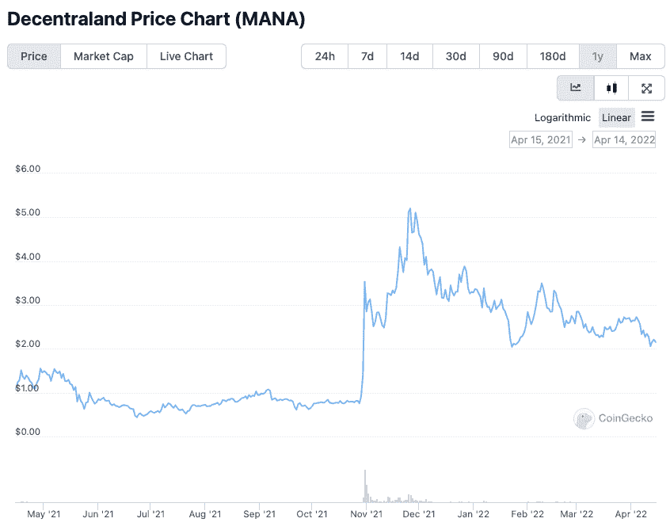

CoinGecko chart shows MANA price peaked on November 26th, 2021

沙盒的本地令牌 SAND 也发生了同样的事情。这一指标也一直高于 10 月 28 日之前的水平。它也遵循着同样的不平坦路径，从 11 月下旬狂热的高点向下，当时元宇宙正处于全面炒作模式，加密货币正在燃烧。

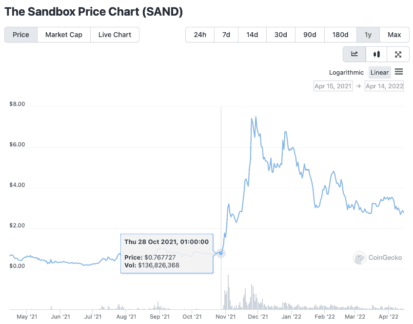

CoinGecko chart shows SAND price peaked on November 29th, 2021

分散土地和沙盒是受害者，目前，作为平台，在正确的时间正确的地点，在 Meta 的炒作下取得了成功。一旦扎克伯格点亮了元宇宙，人们就会涌向游戏中的名人。现在我们看到，如果脸书没有决定给公司改名，这些平台会回到原来的水平。

因此，如果我们将目前发生的事情视为一次调整，那么自 2021 年末高点下跌的元宇宙土地仍有复苏的希望。在一个充满期待和批评的社区的众目睽睽之下，他们可能发展得太快了，但如果他们能够回到一个主要受众能够负担得起土地的地方，那么他们可能会重新获得几个月前的一些信心。

## 对我们来说，没有“幽灵区”很重要

我们看到的四个虚拟世界的问题是，当它们变得太受欢迎时，公司资金开始进入市场，常规玩家被挤出市场。不幸的是，对每个参与者来说，是普通玩家群体让这些平台变得有价值。

分散之地的社区和活动制作人乔凡娜·格拉齐奥西·卡西米罗几周前说，“当然，没有‘鬼区’对我们来说很重要”。卡西米罗，她领导了分散式的时装周，当她说这些的时候，她可以代表整个元宇宙。

像阿迪达斯、雅达利、三星和普华永道这样的大公司都在分散地和沙盒购买了土地。对他们来说，花 50，000 美元在一些虚拟土地上并不是一笔巨大的支出；对一个正常人来说，这可能是一个巨大的金融风险。许多公司购买了他们的土地，因为他们不想错过元宇宙的未来。但现在他们有了，价格大幅上涨，他们没有做太多。

在现实世界中，资本的快速涌入可能导致中产阶级化和当地文化的空洞化，元宇宙昂贵的价格导致了同质化和乏味。这种情况持续得越久，这些虚拟社区就变得越小，这些城镇就变得越可怕。

对元宇宙来说幸运的是，它不是由四个虚拟世界组成的。元宇宙是一个互联平台的星座，也许有一天，用户将能够以单一身份居住和无缝移动。

## NFT 世界进入位置

Epic Games 首席执行官蒂姆·斯维尼去年告诉彭博,“元宇宙有潜力成为世界经济中价值数万亿美元的一部分。”。这位拥有堡垒之夜的公司的创始人当然知道他在谈论什么是 web3，以及这个空间是如何演变的。

他还说,“元宇宙就像互联网一样。任何公司都不能拥有它。虽然这对马克·扎克伯格和 Meta 来说可能是个坏消息，他们似乎打算通过他们的平台汇集所有的互联网活动，但其他较新的组织认为元宇宙是他们可以帮助建立的东西。

NFT 世界是目前的突出项目，以实现令人印象深刻的增长在 2022 年。查看 DappRadar 的 NFTs 排名页面，按市值计算，它目前排名第八。NFT 世界土地的历史平均销售价格是 1.65 ETH(5060 美元)。

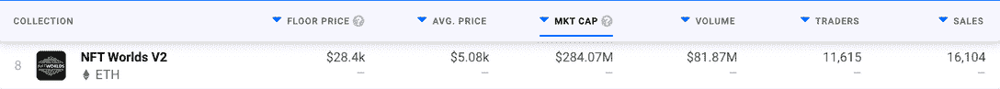

[DappRadar all-time NFT rankings](https://web.archive.org/web/20221201204754/https://dappradar.com/nft/collections)

如果你看看 NFT 世界过去 30 天的数据，你会发现平均销售价格低于 10 ETH(30，010 美元)。除了市值之外，所有其他统计指标都显示该平台正在走强。NFT 世界在 3 月推出的新赌注功能可能会导致市值下降。

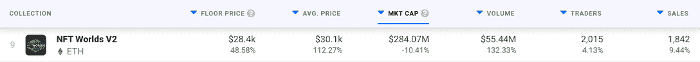

[DappRadar 30-day NFT rankings](https://web.archive.org/web/20221201204754/https://dappradar.com/nft/collections)

新的标桩功能为元宇宙土地的新可能性创造了许多令人兴奋的事情。引入对锁定它的奖励会导致它的供应减少和价格上升。这也给了人们一个购买土地和参与平台的理由，因为他们的贡献会得到回报。

在 NFT 世界土地价格上涨的另一面，购买土地对大多数人来说已经成为一个遥远的梦想。以目前 9.2 ETH(2.83 万美元)的底价，大多数人需要很长时间才能攒够钱买一套。这个领域一个有趣的发展是在 NFT 世界的土地上建立了一个二级市场，人们可以购买一小部分 NFT，分享一小部分利润。我在这里写的关于[的 Skuxxverse 为人们提供了购买 NFT 的机会，然后从土地赌注、租赁和游戏赚取收益中获得收入。](https://web.archive.org/web/20221201204754/https://dappradar.com/blog/future-of-metaverse-glimpsed-in-skuxxverse-and-the-sandbox)

## 较小的项目也参与进来

除了 NFT 世界，它现在拥有所有虚拟世界中第三高的累积土地销售额，较小的项目正在元宇宙创造他们自己的角落。

《银河创世纪》和《银河大停电》在虚拟世界中的累计土地销售额排名第四。Treeverse 于 2021 年 9 月成立，在 2022 年第一季度保持了强劲的土地价值，其链上分析继续保持强劲。

《银河》有两个世界:创世纪和黑暗。为每一个人铸造了 10，000 块土地。它们共同创造了 8230 万美元的销售额。如果你读了它的路线图，你会发现从一开始，赌注和奖励就是计划的一部分。

这反映在有多少人在创世纪中下注，创世纪在时间线上比大昏迷稍微远一点。该平台有 4，233 名用户，其中 3，973 人已将自己的土地标上了桩。这意味着目前所有土地的 97.3%都被标桩，用户现在正在获得该平台于 3 月底推出的原生令牌 MET。

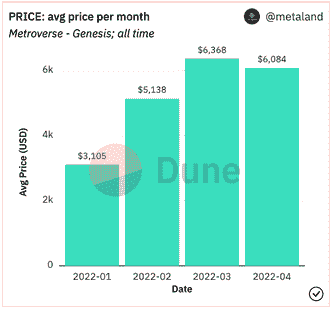

Dune Analytics: Metroverse Genesis land prices

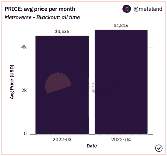

Dune Analytics: Metroverse Blackout land prices

在银河 Gensis 下注数百块土地的鲸鱼现在正在银河大停电中购买土地。一个名为 [electricFeel](https://web.archive.org/web/20221201204754/https://dappradar.com/hub/wallet/eth/0x12f37431468eb75c2a825e2cf8fde773ad94c8ea) 的用户在《银河创世纪》中总共拥有 227 块土地。[最近，他们一直在出售](https://web.archive.org/web/20221201204754/https://opensea.io/electricFeel?tab=activity&search[chains][0]=ETHEREUM&search[eventTypes][0]=AUCTION_SUCCESSFUL)他们的[无聊猿](https://web.archive.org/web/20221201204754/https://dappradar.com/ethereum/collectibles/bored-ape-yacht-club)、[变异猿](https://web.archive.org/web/20221201204754/https://dappradar.com/ethereum/collectibles/mutant-ape-yacht-club)和[志那都红豆](https://web.archive.org/web/20221201204754/https://dappradar.com/ethereum/collectibles/azuki)NFT，以便买下更多的银河土地。当任何在 NFT 领域拥有如此丰富经验和权力的人开始关注某个项目时，这可能意味着那里正在发生一些特殊的事情。

Treeverse 是元宇宙的另一个领域，它正在悄悄地稳步增长，而它更大、更知名的前身正在努力应对成功的制约。它是由著名的 NFT 创作者和收藏家 Loopify 创办的。他开始为 NFTress 做一个 NFT 收藏品项目，这个社区从那里开始自然发展。

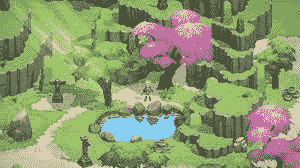

Image from Treeverse game

现在有了一整个开放的虚拟世界，有了科幻和幻想的元素。创始人的私人土地持有者于 2021 年 9 月获得土地，目前土地在二级市场上可以买到，底价为 1.3 ETH(4030 美元)。正如我们在下图中看到的，这与 Treeverse land 在 2021 年底实现的平均销售价格相差不远，当时任何与元宇宙相关的东西都可能定价过高。

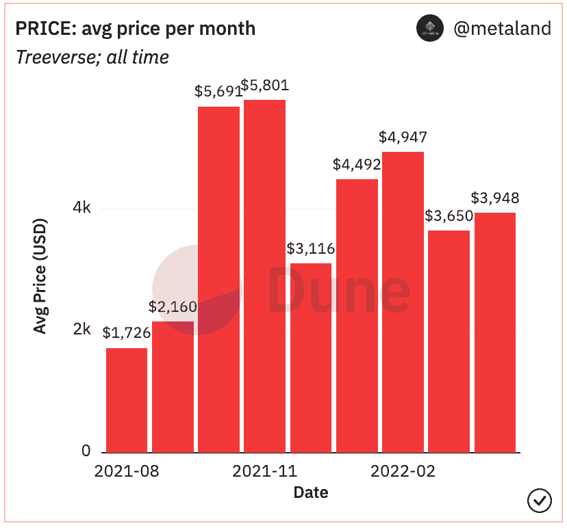

Dune Analytics: Treeverse land prices

有了忠诚的社区和回报丰厚的公用事业，这两个平台都表明，建设元宇宙的方式不止一种。

## 像互联网一样，元宇宙是不可阻挡的

这些新游戏经历了自身的成功，向我们展示了“元宇宙”逐渐消失的想法就像说智能手机完蛋了或电动汽车没有未来一样荒谬。iPhone 或特斯拉可能会放弃它们作为市场领导者的桂冠，但这些领域仍将在其他人的掌舵下向前发展。

同样，分散土地和沙盒可能会成为元宇宙历史的注脚。他们是早期的采用者，展示了什么是可能的，然后更新、更完善的平台出现了，他们从过去的错误中学习并努力解决它们。

这些虚拟世界目前对他们有利的是有机成长的机会，远离聚光灯。他们有忠实的社区，他们知道对日常用户来说，实用性与品牌合作和时装周一样重要。

尽管如此，分散土地和沙盒仍然是元宇宙最大的两个平台，这篇文章并不是说它们的时代已经结束了。他们意识到他们有问题要解决，他们将努力使他们的平台可持续发展。

我们应该从元宇宙的现状中吸取的主要东西是，即使一个虚拟世界崩溃了，还有其他人可以支撑这个空间。只要我们有互联网和想用它创造东西的人，我们就会有元宇宙。只是其中的世界可能会不时改变。