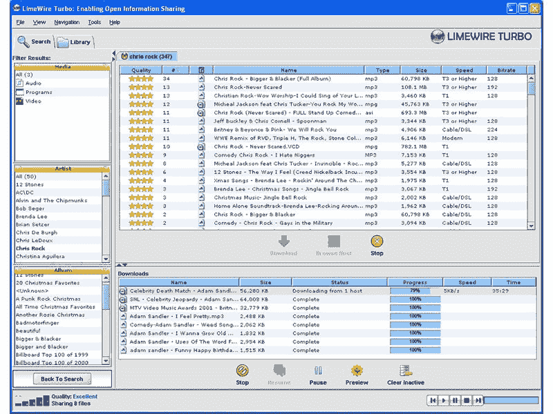

# LimeWire 将重返 NFT 市场

> 原文：<https://web.archive.org/web/https://dappradar.com/blog/limewire-to-make-comeback-as-nft-marketplace>

## 关闭十年后，这个文件共享网站又回来了

曾经很受欢迎、现已停业的文件共享网站 LimeWire 令人惊讶地宣布，它将作为 NFT 市场重新推出。LimeWire NFT 市场秉承其传统，将重点放在音乐上。

LimeWire 在 21 世纪初是一款非常流行的下载软件。在 2010 年与美国唱片业协会进行了漫长的法律斗争后，该网站最终关闭。在巅峰时期，LimeWire 是最流行的点对点文件共享网站之一，允许用户免费下载音乐和其他内容。

这当然发生在文件共享和数字版权的灰色地带，在那个法律像现在一样清晰的时代。LimeWire、BitTorrent 和 Napster 最终被 Spotify 和网飞等基于订阅的流媒体服务所取代。

*Things were different in the 00s *

新的 LimeWire 将专注于音乐，让用户购买和交易稀有物品，如限量版产品，未发布的演示和数字商品。该公司旨在为非功能性说唱音乐提供一种更容易接近的方式，并把说唱组合 Wu-Tang Clan 的经理 Tareef Michael 列入顾问委员会，以吸引用户。

## LimeWire 在酝酿中的一年重新启动

去年，奥地利兄弟 Julian 和 Paul Zehetmayr 购买了 LimeWire 的知识产权和其他资产。说他们从那时起就计划把平台带回来。如今，在关闭十多年后，LimeWire 作为一个非金融衍生品交易市场正在卷土重来。

*Julian and Paul Zehetmayr*

新平台的支付功能是与 Wyre 合作开发的。LimeWire 表示，它将以美元而不是加密的方式列出价格，用户将使用信用卡 fiat-ramp 购买代币。

“NFT 市场的问题是大多数平台都是分散的，”Julian Zehetmayr 告诉美国消费者新闻与商业频道记者。“如果你看看比特币，所有的交易所都在简化比特币的购买、交易和出售。在 NFT 领域，没有人做同样的事情。”

## 制作中的 LimeWire 令牌

到目前为止，LimeWire 的复兴资金来自 Zehetmayrs 家族通过出售他们过去的企业而私下筹集的资金。这对兄弟表示，他们计划通过发行 LimeWire 代币来筹集更多资金，他们将首先向一些选定的投资者出售代币，随后进行公开销售。

该令牌将授予持有者投票表决 LimeWire 政策变化以及哪些艺术家出现在其音乐排行榜上的权利。从根本上说，LimeWire 令牌将充当治理令牌。看看兄弟俩如何分发代币，以及他们是否会依靠已经在音乐上一致的项目来帮助他们传播信息，这将是一件有趣的事情。

## NFT 比特币基地市场

可以说，过去的文件共享网站和今天的 NFT 市场有很多相似之处。此外，两者都是在一个相当不受监管的空间中运作的。像比特币基地这样的平台之所以成功，是因为它们的大规模营销、简单的入职手续、重要的上下坡道的菲亚特。LimeWire 希望通过保持简单的用户体验，为 NFTs 带来类似的用户体验。此外，他们希望确保任何区块链或加密技术隐藏在后台。在接下来的几周和几个月里，看看这个项目如何展开将会很有趣，更重要的是，DappRadar 是否会跟踪这个平台的活动。

## 非功能性测试比以往任何时候都更加重要

2021 年，随着元宇宙和游戏效用的增加，人们对 NFT 收藏品和数字收藏品的兴趣增加。可以肯定地说， [NFTs 在 2021 年](/web/20220930104310/https://dappradar.com/blog/2021-dapp-industry-report/)大规模起飞，交易额达到数十亿美元。可以说，NFTs 带来了一种更直观、更容易理解的数字资产，这种资产现在有了自己的生命和受众。NFTs 吸引了从密码爱好者到名人的所有人，而且这种趋势看起来不会很快平息。

将 NFT 技术应用于音乐的想法已经讨论了很久。像菌丝体和 Audius 这样的组织在一段时间前试图开拓被称为 NFTs 的音乐。然而，中央集权的巨头们并不打算放弃他们对这个行业及其收入的控制。

虽然一些活动，如[莱昂国王乐队(Kings of Leon)去年发行了一张专辑](/web/20220930104310/https://dappradar.com/blog/kings-of-leon-sells-lifetime-nft-fan-tickets-for-441-963/)作为 NFT，并增加了活动门票等额外服务，以及[探听狗与 Gala Games](/web/20220930104310/https://dappradar.com/blog/snoop-dogg-and-gala-music-drop-nft-stash-boxes/) 合作，在数字空间重振死囚唱片品牌，但所有这些都指向更大的画面。但是，有一点在音乐中永远是准确的。艺术家需要接触观众，而观众想要各种各样的音乐，不幸的是，两者严重依赖对方。

这将是一个需要克服的核心挑战，以便有效地向前推进，并将权力重新交到艺术家手中。从长远来看，对于 LimeWire 这样的平台来说，或许更重要的是能够向艺术家展示切实的证据，证明除了 Apple Music 和 Spotify 这样的平台，还有其他选择。

[<picture></picture>](https://web.archive.org/web/20220930104310/https://dappradar.com/blog/what-are-non-fungible-tokens-nfts)[<picture></picture>](https://web.archive.org/web/20220930104310/https://dappradar.com/nft/marketplaces)[<picture></picture>](https://web.archive.org/web/20220930104310/https://dappradar.com/nft/sales)

***以上不构成投资建议。此处给出的信息仅供参考。请行使尽职调查，做你的研究。作者持有 ETH、BTC、AGIX、HEX、LINK、GRT、CRO、OMI、不变 X、ENS、GALA、AVASTR、GMEE、CUBE、RADAR、FLOW、FTM、BNB、SPS、WRLD、ATOM 和 ADA。***

 NewsletterUnsubscribe at any time. [T&Cs](https://web.archive.org/web/20220930104310/https://dappradar.com/terms) and [Privacy Policy](https://web.archive.org/web/20220930104310/https://dappradar.com/privacy-policy)