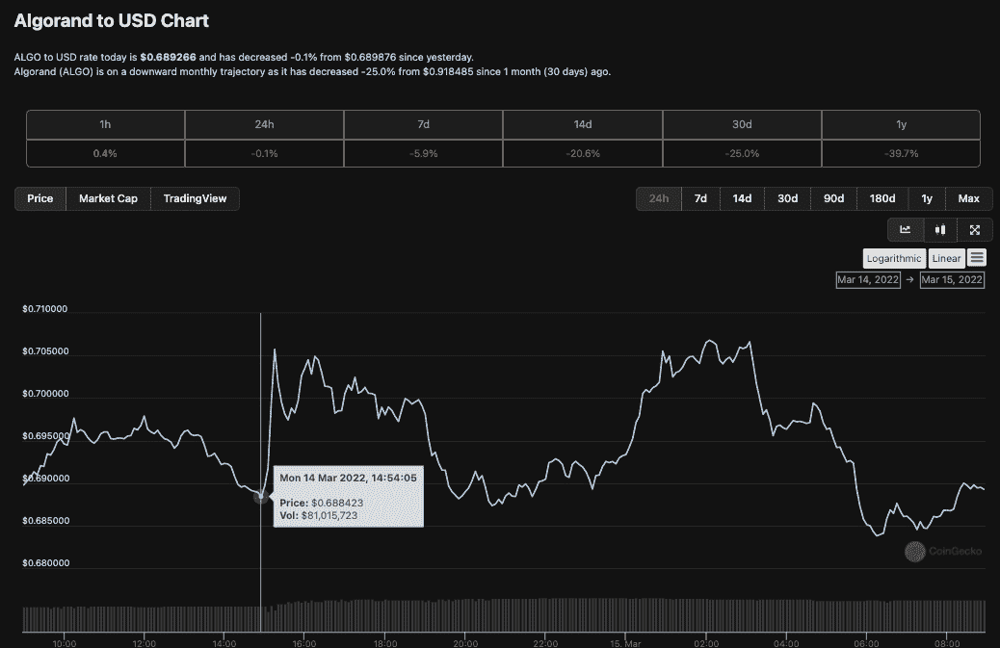

# LimeWire 将使用 Algorand 重新启动 NFT 市场

> 原文：<https://web.archive.org/web/https://dappradar.com/blog/limewire-will-use-algorand-to-relaunch-as-nft-marketplace>

## 购买和交易各种与音乐相关的数字资产

LimeWire 透露，[阿尔格兰德区块链](https://web.archive.org/web/20221001234116/https://dappradar.com/rankings/protocol/algorand)酒店将举办其 NFT 市场的发布会。除了在 Algorand 上铸造数字收藏品，LimeWire 还计划在今年晚些时候推出一种代币。吸引 LimeWire 符合 Algorand 的使命，即吸引希望在碳负区块链上运行的节能 NFT 生态系统和服务的项目。

上周我们报道了 LimeWire 作为艺术和娱乐的数字收藏品市场重新推出，最初的重点是音乐。[该项目背后的兄弟们](/web/20221001234116/https://dappradar.com/blog/limewire-to-make-comeback-as-nft-marketplace/)希望改造后的 LimeWire 将成为艺术家和粉丝创作、购买和交易数字收藏品的一站式商店，而不会遇到笨重且经常令人困惑的当前 NFT 用户体验。该公司有雄心勃勃的增长和合作计划，并希望在第一年内将数字收藏品带入主流并搭载 100 万用户。

新的 LimeWire 将允许音乐迷和收藏家购买和交易各种与音乐相关的数字资产，如限量版、预发布音乐、未发布的演示、图形艺术作品、独家现场版本以及数字商品和后台内容。在 algrand 上举办他们的 NFTs 似乎是一个很好的匹配，因为它的碳负服务是对各种社区中狂热的反 NFTs 狂热分子的一个很好的对策。

LimeWire 上周还宣布，将在 2022 年晚些时候推出令牌。这也会发生在阿尔格兰德。目前的信息仍然很少，但预计令牌持有者将能够访问独家内容，加入 LimeWire 社区，为艺术家投票并管理市场，降低费用并参与奖励计划。

## 为什么是阿尔格兰德？

Algorand 提供了一个环保的区块链，具有快速的交易速度和连接以太坊和多边形的交叉链桥。LimeWire 选择 algrand 是为了表明他们希望提供一个低成本的节能 NFT 市场，并与已经流行的网络实现互操作性。

根据目前的时间表，新的 LimeWire marketplace 将于 2022 年 5 月推出，并从第一天开始为中小型艺术家加入该平台打开大门。有兴趣在发布时成为市场一部分的创作者和艺术家可以使用 [LimeWire 等待列表页面](https://web.archive.org/web/20221001234116/https://c212.net/c/link/?t=0&l=en&o=3471182-1&h=1531519421&u=https%3A%2F%2Flimewire.com%2Fwaitlist&a=LimeWire+waitlist+page)进行注册，以便提前访问。

## 有 Price 的东西吗

格林威治时间 3 月 14 日下午 1 点，官方声明宣布下跌，几乎同时，ALGO 币的价格开始向北移动。然而，在撰写本文时，这种影响似乎是短暂的，价格回到了以前的水平。

## Algorand dapps 的扩展优势

当其他区块链依赖开发第 2 层解决方案来提供可扩展性时，Algorand 提供了这些现成的选项。[阿尔格兰德区块链](https://web.archive.org/web/20221001234116/https://dappradar.com/rankings/protocol/algorand)由两层不同的材料组成。在第一层，你会发现所有的智能合同。例如，用户可以在这里交换加密货币或创建新的区块链资产。真正的奇迹发生在他们的第二层，可以运行更复杂的智能合约。

阿尔格兰德区块链协议的核心是 PPOS 共识机制。该系统允许所有 ALGO 令牌持有者参与批量生产。这是一个低成本、高吞吐量的网络，其核心是数据块终结。每笔交易的成本约为 0.001 ALGO，不到 1 美分，非常适合 DeFi 和游戏用例。区块链每秒还可以处理多达 1000 笔交易，与比特币或以太坊不同，块终结发生在单个块之后。

阿尔格兰德在 2022 年一直表现良好，其 dapps 锁定的总价值从约 9600 万美元增加到上个月的 1.26 亿美元。AlgoFi 是一个基于 Algorand 的分散式贷款协议和 stablecoin，持有近 1 . 05 亿美元，或者说是这个数字的 83%。

[<picture></picture>](https://web.archive.org/web/20221001234116/https://dappradar.com/blog/what-are-non-fungible-tokens-nfts)[<picture></picture>](https://web.archive.org/web/20221001234116/https://dappradar.com/nft/marketplaces)[<picture></picture>](https://web.archive.org/web/20221001234116/https://dappradar.com/nft/sales)

***以上不构成投资建议。此处给出的信息仅供参考。请行使尽职调查，做你的研究。作者持有多种加密货币的头寸，包括 BTC、ETH 和 RADAR。***

 NewsletterUnsubscribe at any time. [T&Cs](https://web.archive.org/web/20221001234116/https://dappradar.com/terms) and [Privacy Policy](https://web.archive.org/web/20221001234116/https://dappradar.com/privacy-policy)