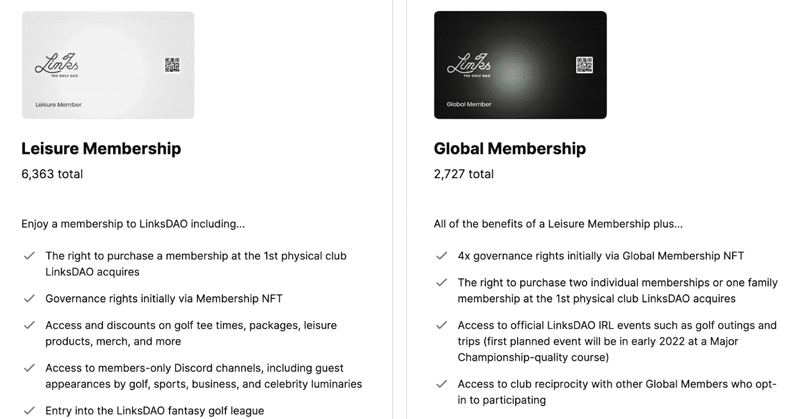

# 林克斯道创造终极乡村俱乐部体验

> 原文：<https://web.archive.org/web/https://dappradar.com/blog/linksdao-creates-the-ultimate-country-club-experience>

## 有了 LinksDAO NFT，你就能接触到世界各地真实的乡村俱乐部

LinksDAO 是一个位于以太坊的 NFT 系列，于 2022 年初推出，并承诺持有人未来可以获得专属的乡村俱乐部体验。在过去的 24 小时里，该系列凭借其跨越未来几年的雄心勃勃的路线图吸引了 634%的交易者。

12 月 31 日是一个相当令人惊讶的投放日期，林克斯道带着一股水花进入了 NFT 空间。该系列包括 6，363 张休闲会员通行证和 2，727 张全球会员通行证。这两种类型的会员资格授予不同的利益和进入即将到来的乡村俱乐部。

在过去的 24 小时内，LinksDAO 吸引了超过 1200 名交易者，录得超过 940 笔交易。结果，该系列产生了令人印象深刻的 260 万美元的交易量。根据 DappRadar 排名，这些数据让 LinksDAO 在过去 24 小时内跻身 NFT 收藏排行榜前十五名。

令人印象深刻的是，乡村俱乐部通行证的收集已经超过了 NFT 空间的大牌，如 NBA Top Shot，Cool Cats，甚至是最近几周最热门的项目之一 CloneX。

## 林克斯道雄心勃勃的路线图

LinksDAO 无疑是最近浮出水面的更有趣的 NFT 项目之一。虽然这个领域充斥着无数个人资料图片头像风格的生成项目，但 LinksDAO 采取了一种完全不同的方式。该项目押注于底层技术，使用区块链作为验证工具。该系列由两种不同的 NFT 组成，其中没有太多的设计。

然而，支持该项目的雄心勃勃的路线图吸引了大量的关注。据[官网](https://web.archive.org/web/20220929044034/https://linksdao.io/?utm_source=DappRadar&utm_medium=deeplink&utm_campaign=visit-website)介绍，LinksDAO 的第一步是实际组织去中心化的自治组织。这应该会在接下来的几个月内发生。从那时起，该项目将开始基于社区投票做出决定。当然，主要的想法是创建一个全球专属乡村俱乐部网络，只有 LinksDAO 持有者才能进入。

第一个物理链接道位置应该在 2022 年底或 2023 年初准备好迎接收藏家。第一个乡村俱乐部的实际地点和位置将由 DAO 决定。

LinksDAO 将强大社区的重要性提升到了一个新的高度。DAO 的成员将对这种精致的乡村俱乐部体验的未来做出每个重要的决定。这是区块链空间中一些最有趣的方面作为一个整体的令人兴奋的结合。

DappRadar 将继续监测 LinksDAO，因为该项目正在实施其雄心勃勃的路线图。如果你想追踪这个系列的最新销售数据，请查看 [DappRadar PRO](https://web.archive.org/web/20220929044034/https://dappradar.com/token/pro) 。或者，你可以在[推特](https://web.archive.org/web/20220929044034/https://twitter.com/dappradar)上关注 DappRadar，首先了解最新的 NFT 新闻。

 NewsletterUnsubscribe at any time. [T&Cs](https://web.archive.org/web/20220929044034/https://dappradar.com/terms) and [Privacy Policy](https://web.archive.org/web/20220929044034/https://dappradar.com/privacy-policy)