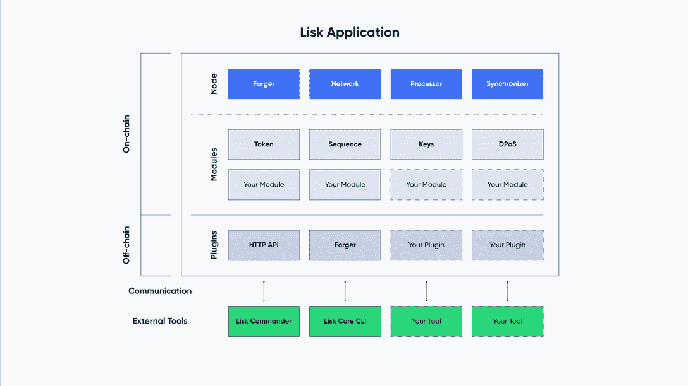

# Lisk:面向 JavaScript 开发者的模块化区块链平台

> 原文：<https://web.archive.org/web/https://dappradar.com/blog/lisk-a-modular-blockchain-platform-for-javascript-developers>

## Lisk 提供了一个易用且全面的区块链应用生态系统

Lisk 的目标是通过允许开发者在支持模块化的区块链上构建区块链应用程序，成为开发者最容易接近的区块链。借助 Lisk，开发人员可以使用支持可定制区块链应用的软件开发工具包(SDK)来构建、发布、分发和货币化应用。

**概要:**

*   Lisk 致力于提供一个区块链基础设施，让 JavaScript 开发者能够快速高效地构建区块链应用。
*   模块化是 Lisk 区块链的另一个突出特点，允许开发者灵活地构建他们理想的区块链应用。

为了给开发人员带来最高的效率，Lisk 选择了全球最流行的编程语言 JavaScript。Lisk 选择的潜在原因很简单。由于 JavaScript 受到许多开发人员的拥护，这意味着将应用程序迁移到 Lisk 区块链不需要开发人员用一种新语言重新发明它们。此外，开发人员可以利用 Lisk 易于使用的 SDK 和丰富的文档资源快速构建新的区块链应用程序。另外值得一提的是，模块化是 Lisk 的另一大特点。这使得开发人员能够将系统分解成可分离和可重新配置的组件，从而提高效率。

## Lisk 模块化区块链的亮点

最好的软件开发工具通常以高度模块化为特征，允许“模块”的重用和重组。模块化也促进了创新，因为新想法变得更容易实现。如下图所示，开发人员可以高度模块化地在 Lisk 区块链上创建区块链应用程序。

值得注意的是，Lisk 上的模块允许开发人员定义数据如何存储在区块链上、每个块执行的逻辑以及每个事务实现的逻辑。如果开发人员希望扩展和定制更高级的区块链应用程序，他们可以根据特定的需求创建新的模块。

Lisk 的模块化区块链能够快速响应不断变化的市场需求。能够处理更高复杂度功能的模块不断加入 Lisk 的开发工具箱。

### NFT 模块

专用的 NFT 模块可以帮助开发人员实现各种目标。首先，它为在区块链应用程序中需要 NFT 的区块链开发人员提供了一个易于使用、开箱即用且简单明了的解决方案。NFT 模块定义了一个标准的模块存储，并拥有一套功能，确保与存储的 NFT 安全和简单的互动。此外，它保证了 Lisk 生态系统的多个应用程序使用的 NFT 格式相互兼容，并且将 NFT 从一个链转移到另一个链变得比以往任何时候都更容易。

### 互用性模块

Lisk 主链在 Lisk 生态系统中起着核心作用。它充当中间链，在侧链之间中继跨链消息。为了在链之间实现顺畅高效的通信，互操作性模块将发挥至关重要的作用。它提供了在 Lisk 生态系统中的链之间传输信息的基本功能。

## Lisk 邀请 JavaScript 开发者加入其网络

Lisk 希望接触并装备任何对区块链开发感兴趣的开发人员，尤其是那些掌握了 JavaScript 的开发人员。作为区块链互操作性的坚定信徒，Lisk 致力于为下一代 web 应用程序提供最通用的基础设施。从去年开始， [Lisk 启动了 Lisk 资助计划](https://web.archive.org/web/20230101075424/https://dappradar.com/blog/lisk-grant-program-rewards-1-3m-usd-for-outstanding-business-ideas)来加速这一进程。在未来，Lisk 将继续努力创造一个充满活力的区块链生态系统，并孵化有前途的项目。到目前为止，许多项目都是由 Lisk 支持的，包括 [Kalipo](https://web.archive.org/web/20230101075424/https://kalipo.io/) ，一个支持分散自治组织(DAOs)的平台， [doEdu](https://web.archive.org/web/20230101075424/https://doedu.medium.com/doedu-an-edtech-blockchain-based-platform-35941455790a) ，一个教育平台，[collect](https://web.archive.org/web/20230101075424/https://colecti.com/)I，一个基于 Lisk 的 NFT 市场，等等。

要了解更多关于如何使用 Lisk 进行开发的信息，请查看以下渠道:

[网站](https://web.archive.org/web/20230101075424/https://lisk.com/)

[推特](https://web.archive.org/web/20230101075424/https://twitter.com/LiskHQ)

[不和](https://web.archive.org/web/20230101075424/https://discord.com/invite/7EKWJ7b)

[Github](https://web.archive.org/web/20230101075424/https://github.com/LiskHQ)

**免责声明** —这是一篇赞助文章。DappRadar 不认可本页面上的任何内容或产品。DappRadar 旨在提供准确的信息，但读者应该在采取行动之前总是自己做研究。DappRadar 的文章不能被认为是投资建议。

 NewsletterUnsubscribe at any time. [T&Cs](https://web.archive.org/web/20230101075424/https://dappradar.com/terms) and [Privacy Policy](https://web.archive.org/web/20230101075424/https://dappradar.com/privacy-policy)