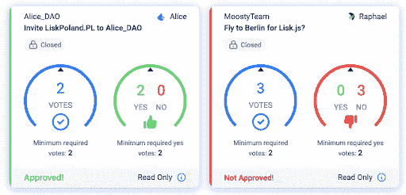

# Lisk 资助计划奖励杰出商业创意 130 万美元

> 原文：<https://web.archive.org/web/https://dappradar.com/blog/lisk-grant-program-rewards-1-3m-usd-for-outstanding-business-ideas>

## Lisk 资助计划将奖励选定的项目 130 万美元

**Lisk 是一个区块链应用平台，** **通过使用 JavaScript 及其易于集成的 SDK，为区块链生态系统提供可访问性。** **为了加速 Lisk 生态系统的发展，该团队启动了 Lisk 资助计划** **以支持企业家和开发人员构建区块链应用并利用 Lisk SDK 的使用效率。每个被选中的项目将获得 66，000 美元。目前，该计划正处于第四阶段，在其平台上成功启动了几个项目。**

Lisk 致力于创造一个人人都能从区块链技术中受益的世界。Lisk 的最终目标是提供一个互操作性解决方案，从而为一个以跨链技术为特色的大规模生态系统奠定坚实的基础。

考虑到这一点，Lisk 邀请开发人员利用强大的 Lisk SDK，构建这个充满分散式应用程序和服务的世界。同样重要的是，LSK 令牌和 Lisk 钱包将在 Lisk 生态系统中发挥重要作用，代表加密世界的真正价值和精神。所有这些不可知论的、竞争性的和实验性的实践都是 Lisk 拥抱创新的很好的例子。

Lisk 一直在沿着它的路线图高效地前进。值得注意的是，该团队在 2022 年 2 月达到了相当多的里程碑，包括发布了 [Lisk Desktop v2.2.0、Lisk Mobile v2.0.0、Lisk Service v0.6.1，以及更多](https://web.archive.org/web/20221208154206/https://lisk.com/blog/announcement/achievements-february-2022)。

与此同时，Lisk 赠款项目第四波仍在如火如荼地进行，从 1 月 1 日持续到 3 月 31 日。这是一个开发者项目，致力于促进区块链地区的创新和创业，帮助区块链的成熟创业公司从零开始创建和进一步发展。企业家和开发者可以获得 66，000 美元(以 LSK 代币支付)在 Lisk 平台上构建区块链应用程序。[申请](https://web.archive.org/web/20221208154206/https://lisk.com/grant-program)并通过资助项目委员会的评估对区块链的初创企业来说将是零到一的一步。

目前，Lisk Grant 计划的几个成功参与者正在使用 Lisk SDK 开发他们的区块链应用程序。让我们仔细看看其中一个成功的申请者， [Kalipo](https://web.archive.org/web/20221208154206/https://kalipo.io/) ，以及它为什么会脱颖而出。

## Kalipo 如何为 Lisk 做出贡献

Kalipo 提供了一个去中心化的自治组织(DAO)平台，使全球在线协作变得容易。此外，Kalipo 还为 Dao 配备了基金管理工具，以提高其日常运营的透明度和效率。Dao 允许社区成员施加影响并表达他们的观点。更重要的是，DAOs 将通过在商业或非盈利实体管理中提供充分的民主来颠覆传统的商业结构。

借助 Kalipo 易于使用的工具、有用的见解和预制模板，用户可以以分散的方式远程创建和管理他们的整个组织。例如，投票对于一个运转良好的民主国家来说是必不可少的，但如果组织得不好，就会耗费时间和精力。这往往导致选民出勤率低，甚至无效票。作为回应，Kalipo 推出了一款带有直观仪表盘的投票工具，便于操作和跟踪投票过程。

除此之外，Kalipo 的基金管理工具帮助 Dao 以透明、可信和分散的方式筹集和管理基金。

Kalipo 是 Lisk 基金会精心挑选参与第一波 [Lisk 资助计划](https://web.archive.org/web/20221208154206/https://lisk.com/blog/announcement/introducing-lisk-grant-program)的项目之一。Lisk 赠款计划旨在鼓励创新，并通过由 Lisk 支持的 dapps 促进充满活力的区块链生态系统的扩展。毫无疑问，Kalipo 开发一个完整的 DAO 平台以方便早期项目团队的雄心与 Lisk 生态系统协同工作。

## 应用要求

如何对区块链生态系统做出贡献并参与资助计划？首先，为程序应用  只需要最少两个创始团队成员，其中一个是 JavaScript 开发人员。原因很简单，Lisk 平台及其 SDK 和大多数人一样享受 JavaScript 的多功能性和可访问性。其次，团队必须有创业精神，将区块链技术带入现实世界的应用。接下来，你需要提交一份推介材料，包括对所有团队成员的描述和一份商业计划。如果提交成功，将与评估委员会进行面试。最后但同样重要的是，始终保持最新，用最新的 Lisk SDK 构建您的应用程序，并且所有代码都应该是完全开源的。

### 将你的想法付诸行动

Lisk 尊重并支持各种好的想法。只要你的项目能让用户离可互操作的未来更近一步，Lisk 鼓励你将想法付诸实践。同时，程序还提供了以下项目类别供开发者参考。

**建议类别**

*   稳定的硬币
*   隐私保护链
*   智能合同
*   放款
*   区块链桥
*   道斯
*   挑战
*   神谕

请注意，你的项目不一定要属于以上任何一类，这个列表只是为了启发你的灵感。

### 有用的链接

[网站](https://web.archive.org/web/20221208154206/https://lisk.com/)
[Lisk 资助计划](https://web.archive.org/web/20221208154206/https://lisk.com/grant-program)
[推特](https://web.archive.org/web/20221208154206/https://twitter.com/LiskHQ)
[不和](https://web.archive.org/web/20221208154206/https://discord.com/invite/7EKWJ7b)
[Github](https://web.archive.org/web/20221208154206/https://github.com/LiskHQ)

**免责声明** —这是一篇赞助文章。DappRadar 不认可本页面上的任何内容或产品。DappRadar 旨在提供准确的信息，但读者应该在采取行动之前总是自己做研究。DappRadar 的文章不能被认为是投资建议。