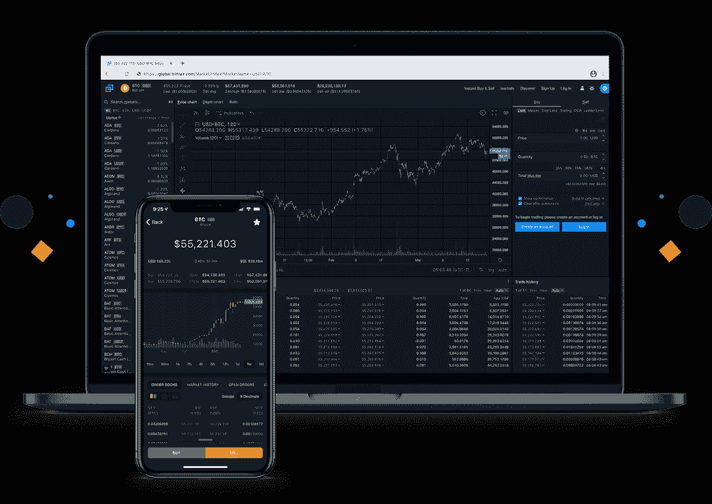
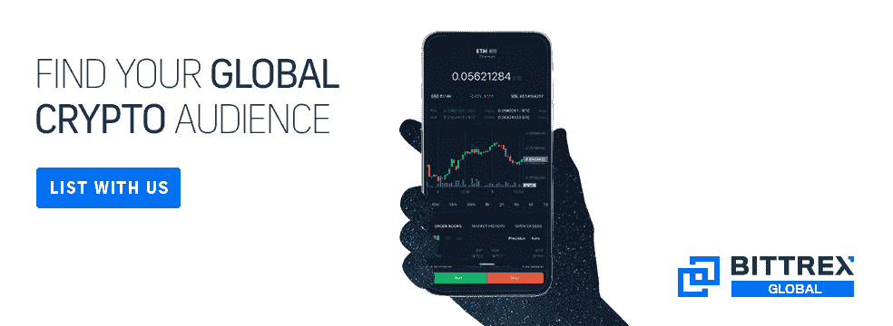

# Bittrex Global 列表:受到 500 多个令牌项目的信任

> 原文：<https://web.archive.org/web/https://dappradar.com/blog/list-with-bittrex-global-trusted-by-over-500-token-projects>

## 通过 Bittrex Global，您可以接触到数百万用户

获得 Bittrex Global 上的令牌将使 dapp 项目成为世界上最好的加密交易社区之一。Bittrex 为专业人士和新手客户提供了出色的交易体验，他们的创新推动了行业的发展。在 Bittrex 上市有助于 dapp 开发者为其生态系统带来健康增长。

## 目录

*   [什么是 Bittrex Global？](https://web.archive.org/web/20221130134012/https://dappradar.com/blog/list-with-bittrex-global-trusted-by-over-500-token-projects/#what-is)
*   在 Bittrex Global 上市有什么好处？
*   [如何在 Bittrex Global 上启动您的项目](https://web.archive.org/web/20221130134012/https://dappradar.com/blog/list-with-bittrex-global-trusted-by-over-500-token-projects/#how)
*   [有用的链接](https://web.archive.org/web/20221130134012/https://dappradar.com/blog/list-with-bittrex-global-trusted-by-over-500-token-projects/#links)

在 Q2 2022，加密货币市场显示出复苏的迹象。根据 [DappRadar 行业报告](/web/20221130134012/https://dappradar.com/blog/dappradar-q3-industry-report-on-chain-indicators-signal-a-recovering-crypto-market/)，从 7 月 1 日到 9 月 30 日，crypto 的市值增长了 8.5%(9.81 亿美元)。此外，与上一季度相比，DeFi 第三季度锁定的总价值(TVL)增长了 2.9%(690 亿美元)。

市场估值无疑揭示了加密货币增长的现状，但该行业的可持续性取决于用户的采用。在这方面，我们观察到 9 月份该行业独特的活跃钱包与上月相比增长了 12%(180 万)，这似乎是一个积极的迹象。

分散式应用程序越来越受欢迎。只有通过提供安全、顺畅和高效的交易体验，在用户和加密项目之间架起桥梁的交易平台，这才有可能实现。

Bittrex Global 就是这样的平台之一，它为专业客户和新手客户提供机构级的交易体验。

## 什么是 Bittrex Global？

Bittrex Global 是全球区块链行业最值得信赖的交易所之一。以其先进的安全性和合规性而闻名，数百万加密用户选择 Bittrex Global 来寻找和交易他们的下一枚硬币或代币。此外，该平台通过提供 500 多种代币供选择、移动应用程序市场和即时买卖服务，方便每个人轻松获得加密货币投资。

作为历史最悠久的交易所之一，Bittrex Global 自 2014 年成立以来一直支持创新和合规。Bittrex Global 总部位于列支敦士登和百慕大，拥有世界一流的监管金融系统作为后盾，让用户在交易加密货币时可以高枕无忧。

[List on Bittrex Global now](https://web.archive.org/web/20221130134012/https://global.bittrex.com/discover/coin-and-token-listings?utm_source=DappRadar&utm_medium=content&utm_campaign=LWUCampaign&utm_content=DappRadarSPContent)

## 在 Bittrex Global 上市有什么好处？

在线交易平台提供了访问加密货币的途径。合规性、安全性和全方位的硬币对于用户评估平台是否提供用户友好的体验至关重要。Bittrex Global 的业务遍及欧洲、亚洲和美洲。团队可以指望 Bittrex 上市加密货币，因为它们得到了平台合法性和多年监管经验的支持。

除此之外，与它一起上市意味着团队将有机会接触加密货币领域最广泛、最成熟的用户之一。该平台为项目建立了一个全面的用户接触点矩阵，以成功开展活动。

Bittrex Global 将与团队合作，采用全面的营销策略，利用最有效的渠道将团队的项目呈现在观众面前。那么让我们来看看那些渠道是什么。

*   比特播客的出现
*   电报站和 ama
*   贸易竞赛
*   解说视频
*   电子邮件爆炸
*   特色新闻简报
*   推特和脸书公告
*   脸书、推特和 LinkedIn 帖子

[Join Bittrex Global to reach millions of users](https://web.archive.org/web/20221130134012/https://global.bittrex.com/discover/coin-and-token-listings?utm_source=DappRadar&utm_medium=content&utm_campaign=LWUCampaign&utm_content=DappRadarSPContent)

## 如何在 Bittrex Global 上市

想在增长最快的加密市场之一启动您的项目吗？以下步骤简要介绍了如何顺利加入 Bittrex Global 的平台。

1.  前往[此链接](https://web.archive.org/web/20221130134012/https://forms.bittrex.li/get-listed)加入 Bittrex 全球大家庭。
2.  填写包含联系人、项目和 exchange 信息的表单。
3.  然后，团队将安排一次跟进电话，与您讨论细节。
4.  一旦你上市，你的硬币或代币将可供数百万活跃的加密用户使用。

每一步，您都可以依靠 Bittrex Global 的支持。从上市前到上市后。

上市前:期待定期的电话联系，让你的项目通过上市程序。对于某些令牌，团队最快可以在两周内完成这一过程。

**上市推广:** Bittrex Global 将利用其广泛的营销渠道，为您的代币提供成功所需的支持和关注。

**上市后:**Bittrex 全球平台寻求建立合作伙伴关系，而不仅仅是上市。发布后，它将继续推动合作建议、产品发布和内容的发展。

[Join Bittrex Global now](https://web.archive.org/web/20221130134012/https://global.bittrex.com/discover/coin-and-token-listings?utm_source=DappRadar&utm_medium=content&utm_campaign=LWUCampaign&utm_content=DappRadarSPContent)

## **有用的链接**

**网站**

*   [官网](https://web.archive.org/web/20221130134012/https://global.bittrex.com/)
*   [上市登陆页面](https://web.archive.org/web/20221130134012/https://global.bittrex.accesscom/discover/coin-and-token-listings)
*   [Bittrex 全球(新闻)](https://web.archive.org/web/20221130134012/https://bittrex.com/discover)
*   [Bittrex 全球(支持)](https://web.archive.org/web/20221130134012/https://bittrex.zendesk.com/hc/en-us)

**社交媒体链接**

*   [推特](https://web.archive.org/web/20221130134012/https://twitter.com/BittrexGlobal)
*   [脸书](https://web.archive.org/web/20221130134012/https://www.facebook.com/BittrexGlobal/)
*   [GitHub](https://web.archive.org/web/20221130134012/https://bittrex.github.io/api/v3)
*   [Instagram](https://web.archive.org/web/20221130134012/https://www.instagram.com/bittrex_global/)
*   [Youtube](https://web.archive.org/web/20221130134012/https://www.youtube.com/c/BittrexGlobal)
*   [LinkedIn](https://web.archive.org/web/20221130134012/https://www.linkedin.com/company/bittrexglobal/)
*   [电报](https://web.archive.org/web/20221130134012/https://t.me/s/bittrexglobal)

**免责声明** —这是一篇赞助文章。DappRadar 不认可本页面上的任何内容或产品。DappRadar 旨在提供准确的信息，但读者应该在采取行动之前总是自己做研究。DappRadar 的文章不能被认为是投资建议。