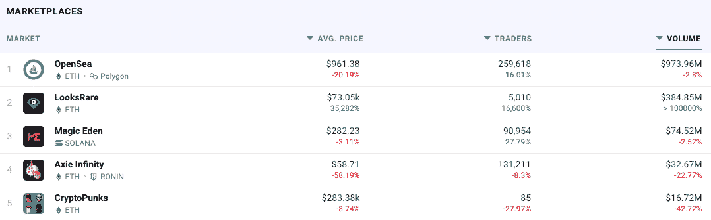
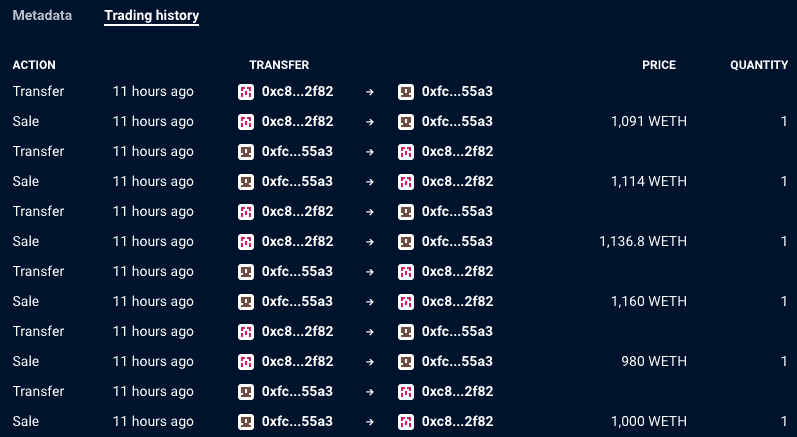
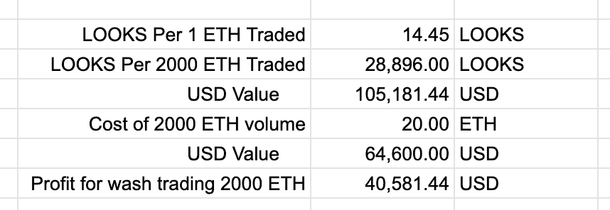
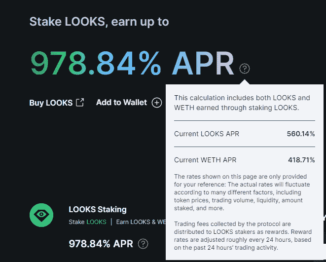

# 看 NFT 市场被空投中的 Wash 交易击中

> 原文：<https://web.archive.org/web/https://dappradar.com/blog/looksrare-nft-marketplace-hit-by-wash-trading-amidst-airdrop>

## 洗交易或营销天才-你决定

总部位于以太坊的 NFT 市场 LooksRare 本周引起了轰动，因为其空投要求刺激了该平台上的 wash 交易。自推出以来，LooksRare 已经产生了超过 3.85 亿美元的交易量，在 DappRadar NFT 市场排名中排名上升至第二位。

当 NFT 的所有者将它卖给自己以刺激价格上涨时，或者在这种情况下，收集外观令牌时，数字收藏品领域的清洗交易就会发生。一些观众认为这是犯规，而其他人则称之为天才。

这种清洗交易正在刺激令人印象深刻的交易量数字，并推动市场排名上升。这样一来，更多的眼球都在市场上，空投机会和恶性循环就能形成。七天的交易量几乎是 Opensea 的 50%,然而交易者的数量要少得多，只有 5000 人，而 Opensea 有 260000 人。表明一小群交易者主宰着这个平台，他们自己买卖以获取回报。

例如，查看 Meebit #16728 的 NFT 页面，我们可以看到这个特殊的 NFT 在过去 24 小时内换了 6 次主人。每一笔交易都发生在两个钱包之间，这清楚地表明 NFT 的主人是在向自己出售 NFT。

## 崩溃

LooksRare 有四个阶段的交易奖励，将持续 721 天。最初阶段每天向交易者发放 2，866，500 枚 LOOKS 代币。根据现在的价格，每天 1090 万美元。这意味着，如果您在符合条件的 NFT 看盘上完成交易，交易量将计入当天的交易奖励，并在当天结束时获得 2，866，500 张看盘的一部分。

当许多交易者试图创造尽可能多的交易量来分享 1090 万美元的奖励时，问题就出现了。此外，由于市场费用统一为 2%，只要总交易量低于 5 亿美元，wash 交易就能盈利。这也是为什么 wash 交易者利用有资格获得 0%版税的交易奖励的收藏，如 Meebits 和 Loot。因此，他们的 wash 交易成本较低，导致平台上 Meebits 的交易量达到 40，500 ETH。

## 这里谁负责？

许多人预计该平台已经介入并停止了这种类型的活动，但当你采取更全面的观点时，很明显清洗交易是有成本的。每一笔交易都会给赌注者带来 2%的佣金。例如，如果用户交易 1，000 个 ETH，他们的成本将下降 20 个 ETH。然而，通过 wash 交易 1，000 ETH，用户创造了 2，000 ETH 的交易量，因为他们同时代表买方和卖方。wash 交易员获得了双重回报，并通过 dapps 智能合约发送交易量。

使用下面由一名观众在 Twitter 上提供的[快速计算，我们可以看看一个拥有 2,000 ETH 量的人在 LooksRare 平台上线的第一天会获得多少代币。](https://web.archive.org/web/20230101235852/https://twitter.com/dingalingts/status/1481135507073822725/photo/1)

Source: [Twitter](https://web.archive.org/web/20230101235852/https://twitter.com/dingalingts/status/1481135507073822725/photo/1) 

显然，尽管有任何费用，第一天对 wash 交易者来说是非常有利可图的。尽管如此，许多变量开始发挥作用，这意味着利润可能会大幅减少。主要是，交易者不知道还有多少其他的洗盘交易者。其次，很难预测每天的象征性价格。

另一方面，日常交易者仍然可以获得可观的浏览量，并受到激励在平台上押注代币，这阻止了他们出售代币并降低代币价值。

## 概括起来

这里发生的是, [LooksRare](https://web.archive.org/web/20230101235852/https://dappradar.com/nft/marketplaces) 在吸引交易者离开领先的 NFT 市场 Opensea 方面做得非常好。可以说，这就是空投的全部意图，然后允许这种清洗交易发生。在某些方面，这类似于 [SushiSwap 不久前对 Uniswap](/web/20230101235852/https://dappradar.com/blog/sushiswap-what-just-happened/) 所做的。

由于现在在 LooksRare 上交易是有利可图的，有机交易量将继续从 Opensea 转移过来。随着这种情况的发生，wash 交易的数量将有望有机减少，因为那些希望使用它的人将与那些不仅仅是农业代币的人分享奖励。

为了与领先的 NFT 市场 Opensea 竞争，Opensea 是一个每月产生数十亿交易量的平台巨头。LooksRare 采取了强有力的措施进行竞争，看起来将会赢得一些市场份额。有了可以说是更加圆滑的 UX 和明显的商业道德，为交易者提供了一个更加透明、分散和用户友好的平台，看这如何发展将会非常有趣。

 NewsletterUnsubscribe at any time. [T&Cs](https://web.archive.org/web/20230101235852/https://dappradar.com/terms) and [Privacy Policy](https://web.archive.org/web/20230101235852/https://dappradar.com/privacy-policy)

***以上不构成投资建议。此处给出的信息仅供参考。请行使尽职调查，做你的研究。作者持有 ETH、BTC、AGIX、HEX、LINK、GRT、CRO、OMI、不变 X、ENS、GALA、AVASTR、GMEE、CUBE、RADAR、FLOW、FTM、BNB、SPS、WRLD、ATOM 和 ADA。***