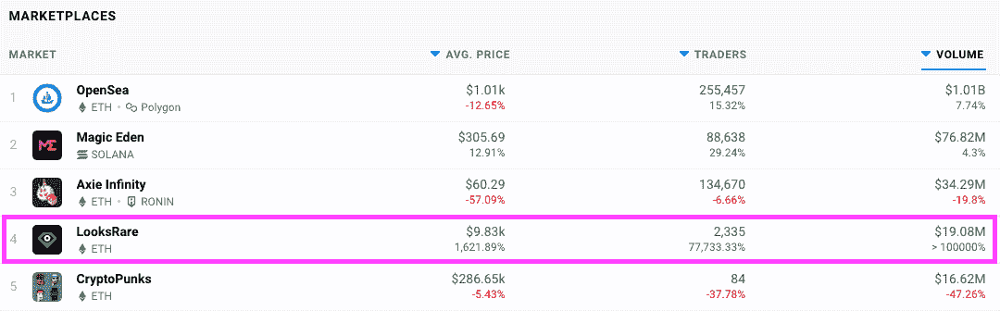
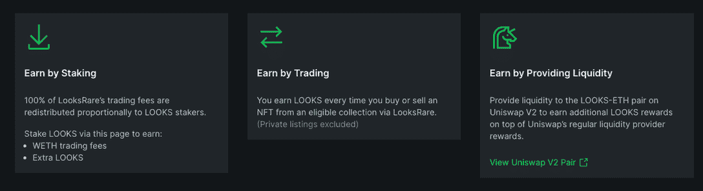

# looks are NFT 市场令牌空投是活的

> 原文：<https://web.archive.org/web/https://dappradar.com/blog/looksrare-nft-marketplace-token-airdrop-is-live>

## 你在 OpenSea 上花费/收到至少 3 ETH 吗？

LooksRare 是一个基于以太坊的 NFT 新市场，它于本周登陆并引起了轰动，同时它还发布了一项空投公告，面向在过去六个月内在领先的 NFT 平台 OpenSea 上花费或收到至少 3 ETH 的任何人。

尽管该平台刚刚推出，但 LooksRare 市场的交易量已经达到顶峰。自 2021 年 12 月 27 日推出 LooksRare 以来，它已经从 2335 名交易者那里获得了超过 1900 万美元的收入。

这似乎是一个聪明的营销举措，airdrop 将 LOOKS tokens 放在最热衷于收集、购买和销售 NFT 的用户手中。此外，收集空投物资的一项规定是，收集者必须列出至少一件 NFT 供出售。

查看峰值指标，似乎许多交易者收集了他们的空投，而不是兑现和支付目前高昂的汽油费，继续在新的市场上购买数字收藏品。或者，new LOOKS 令牌持有者可以在 WETH 和 LOOKS 市场中直接下注他们的令牌以获得奖励，这将有助于通过 dapps 智能合约流动的交易量。总的来说，该平台为用户提供了三种参与生态系统的方式。

## 如何宣称长相:

声称你看起来很快，因为它只活了几天。

*   去 https://looksrare.org/
*   连接您的钱包
*   点击主页顶部横幅中的检查按钮，查看您是否有资格
*   重要事项:在列出 NFT 之前，请检查资格
*   如果你有资格，列出一个 NFT 出售
*   点击横幅中的申领令牌按钮并确认交易
*   在[奖励页面](https://web.archive.org/web/20221206030459/https://looksrare.org/rewards#owned?utm_source=blog&utm_medium=social&utm_campaign=launch-blog)下注，开始赚取交易费

## 什么是外观

[LooksRare 是一个社区优先的 NFT 市场](https://web.archive.org/web/20221206030459/https://dappradar.com/ethereum/marketplaces/looksrare),参与该市场会获得奖励。用户向[购买或出售 NFT 赚取奖励。](https://web.archive.org/web/20221206030459/https://looksrare.org/rewards)与 OpenSea 不同，用户在市场上的参与和交易会获得奖励。可以说，在关于 OpenSea 令牌和空投 looks 的传言中，我们基本上是在 OpenSea 上领先一步。随着 DeFi 机制继续渗透到 dapps 中，今天的用户希望奖励成为他们交互的任何服务的一部分。

如前所述，LooksRare 市场位于以太坊，所以它和 OpenSea 交易几乎所有相同的 NFT 收藏品。Meebits、涂鸦和酷猫等收藏品。除了在 LooksRare 上，用户可以赚取代币进行交易。此外，用户可以在 WETH 中下注他们的 LOOKS 令牌以获得更多奖励，在撰写本文时，LOOKS 高达 751.26%的 APR。当更多的用户加入赌注计划时，APR 将下降。

该平台有很好的用户体验和整体感觉，并允许用户将 NFT 与他们和其他平台同时列出，以获得最大的曝光率。收藏优惠让买家对整个收藏出价，而创作者版税在销售点立即支付。有趣的是，买家也可以结合 ETH 和 WETH 进行购买。

## 如何宣称长相:

声称你看起来很快，因为它只活了几天。

*   去 https://looksrare.org/
*   连接您的钱包
*   点击主页顶部横幅中的检查按钮，查看您是否有资格
*   如果你有资格，列出一个 NFT 出售
*   点击横幅中的申领令牌按钮并确认交易
*   在[奖励页面](https://web.archive.org/web/20221206030459/https://looksrare.org/rewards#owned?utm_source=blog&utm_medium=social&utm_campaign=launch-blog)下注，开始赚取交易费

 NewsletterUnsubscribe at any time. [T&Cs](https://web.archive.org/web/20221206030459/https://dappradar.com/terms) and [Privacy Policy](https://web.archive.org/web/20221206030459/https://dappradar.com/privacy-policy)

***以上不构成投资建议。此处给出的信息仅供参考。请行使尽职调查，做你的研究。作者持有 ETH、BTC、AGIX、HEX、LINK、GRT、CRO、OMI、不变 X、ENS、GALA、AVASTR、GMEE、CUBE、RADAR、FLOW、FTM、BNB、SPS、WRLD、ATOM 和 ADA。***