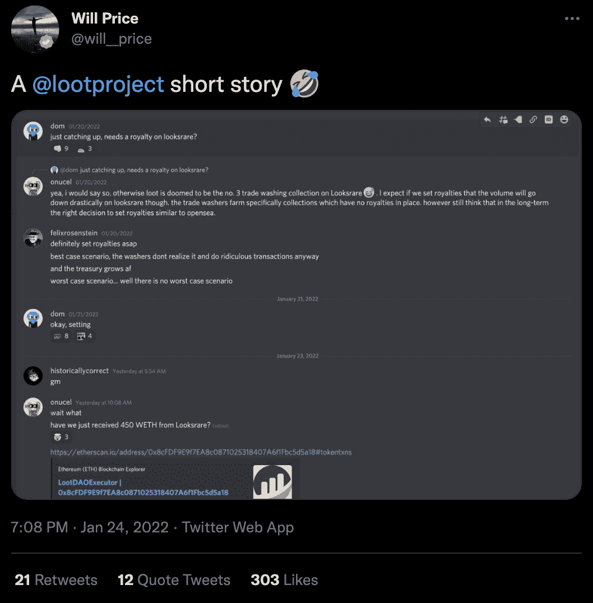
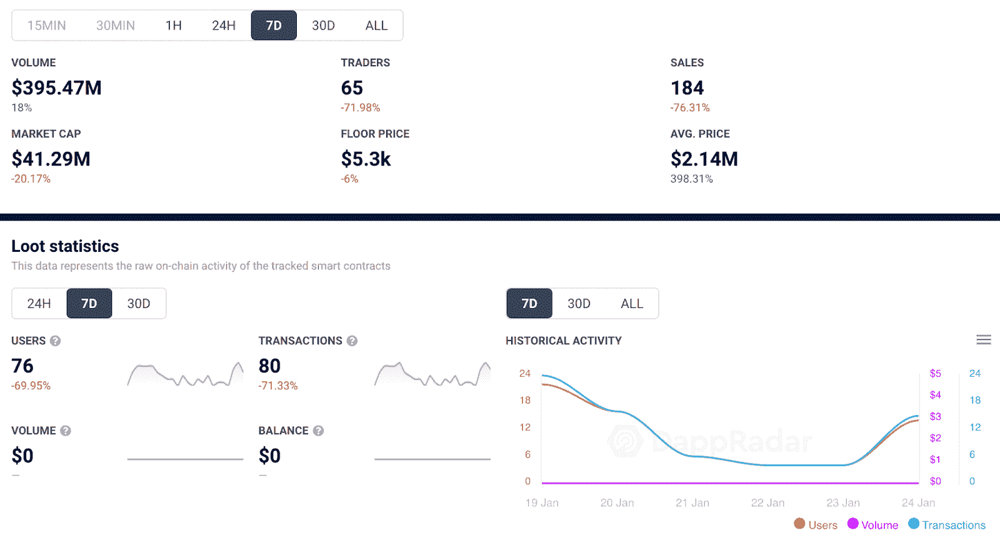

# Loot 引入版税费用，为国库带来 450 ETH

> 原文：<https://web.archive.org/web/https://dappradar.com/blog/loot-introduces-royalty-fees-trading-volume-drops>

## 每笔交易收取 5%的版税，以对抗 LooksRare 上的人为交易

在基于以太坊的新市场 Loot 推出后，冒险者战利品的交易活动在过去几周内经历了一次复兴。作为一个免版税的收藏，Loot 吸引了许多有问题的交易，这些交易很容易被定性为清洗交易。然而，为了限制这种现象，该团队引入了 5%的版税费用，该费用将在每笔销售中扣除。

迅速的行动是必要的，因为 Loot 社区认为 wash 交易活动是不必要的关注。事实上，根据 [DappRadar 的数据](https://web.archive.org/web/20230119060339/https://dappradar.com/nft/collections)，在过去的几周里，战利品包一直是最卖座的销售之一。

例如， [Loot Bag #2579](https://web.archive.org/web/20230119060339/https://dappradar.com/hub/assets/eth/0xff9c1b15b16263c61d017ee9f65c50e4ae0113d7/2579) 登记了两笔销售额，约为 15.000 WETH。在出售时，这大约是 4700 万美元。这是一个明显高于任何常规战利品销售的价格，因为该系列的平均销售价格为 200 万美元(包括过去几周的销售数据)。然而，更深入地探究交易历史会发现，这个 NFT 只是在两个钱包之间移动。终归还是在原主人的作品集里。当然，这些昂贵的销售给业主带来了大量的外观奖励。

重要的是，2579 号赃物袋并不是唯一这样的案例。这些收藏是有意针对的，因为没有版税。然而，社区开始注意到 NFTs 在 [LooksRare](https://web.archive.org/web/20230119060339/https://dappradar.com/ethereum/marketplaces/looksrare) 上看到的虚幻活动 Loot。因此，团队决定也在这个市场上设立版税。

令人印象深刻的是，这给财政部带来了巨大的收益。人们继续进行交易，却没有意识到版税的变化。根据 Etherscan 的记录，版税推出后不久，Loot Treasury 的版税增加了约 450 ETH。

## 由于 LooksRare 版税，战利品交易活动直线下降

Loot 从一开始就在 OpenSea 等其他二级市场上建立了版税机制。然而，由于几周前,[looks are 在 NFT 掀起了一阵风暴，这肯定是团队需要做的事情。因此，在过去的 30 天里，Loot smart contracts 迎来了 151%以上的独特活动钱包。](https://web.archive.org/web/20230119060339/https://dappradar.com/blog/looksrare-nft-marketplace-token-airdrop-is-live/)

然而，自从 LooksRare 销售将招致版税的公告发布后，Loot 的交易活动直线下降。在过去的七天里，交易者的数量减少了 70%以上，而销售额下降了 76%。此外，该系列被人为夸大的市值开始缩水，回到最初的估值，在过去七天里损失了 20%以上。

在 1 月 23 日左右，当 LooksRare 上的 Loot NFTs 引入 5%的版权费时，活动的显著下降是显而易见的。虽然看到你的项目输出数据显示为红色并不令人愉快，但这是一个正确的选择。

Loot 社区是 NFT 空间中最专注的社区之一，5%的版税不会影响真正的销售活动。最重要的是，该系列已经在其他市场上推出了此类费用。然而，专利费使得收藏家参与水货交易的利润大大降低。根据 DappRadar 最新的[鲸鱼分析报告](https://web.archive.org/web/20230119060339/https://dappradar.com/blog/whale-report-are-looksrare-rewards-attracting-whales)，LooksRare 空投正在激励许多交易者寻求 0%的版税收入，因为这增加了他们的收入。然而，他们在洗盘时得到的回报受到了 5%费用的严重影响。

无论是在传统金融领域还是在加密领域，清洗交易都是一种长期存在的现象。然而，像 Loot 决定引入版权费这样的明智之举是朝着正确方向迈出的一步。DappRadar 将继续监测 [Loot](https://web.archive.org/web/20230119060339/https://dappradar.com/ethereum/collectibles/loot) 和 [LooksRare](https://web.archive.org/web/20230119060339/https://dappradar.com/ethereum/marketplaces/looksrare) ，因为其他集合继续吸引 wash 交易活动。你可以在 LooksRare [这里](https://web.archive.org/web/20230119060339/https://dappradar.com/blog/looksrare-nft-marketplace-hit-by-wash-trading-amidst-airdrop/)阅读更多关于洗盘交易的内容。此外，您还可以查看 [DappRadar PRO](https://web.archive.org/web/20230119060339/https://dappradar.com/token/pro) ，它可以让您获得最新的连锁 NFT 销售数据。

 NewsletterUnsubscribe at any time. [T&Cs](https://web.archive.org/web/20230119060339/https://dappradar.com/terms) and [Privacy Policy](https://web.archive.org/web/20230119060339/https://dappradar.com/privacy-policy)