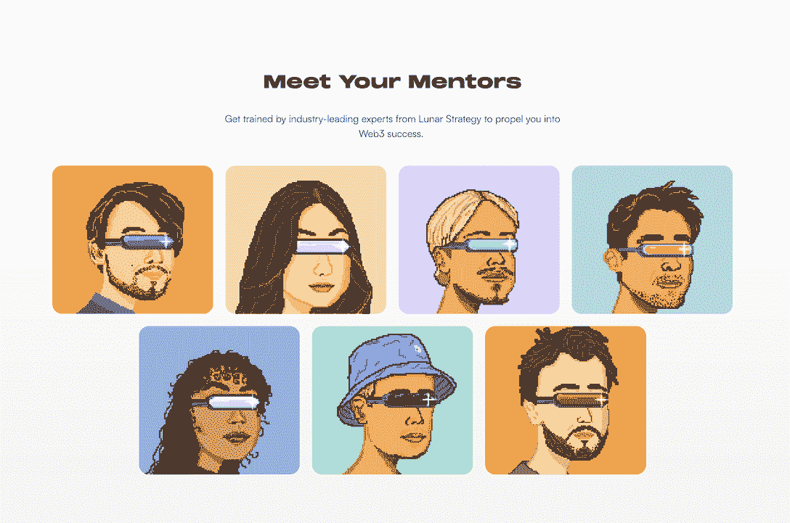

# Lunar Strategy 首席执行官谈 NFTs 和营销的未来

> 原文：<https://web.archive.org/web/https://dappradar.com/blog/lunar-strategy-ceo-on-nfts-and-the-future-of-marketing>

## Tim Haldorsson 揭示了每个品牌在涉足 web3 领域之前应该知道的事情。

DappRadar 启动了一系列与行业影响者的新访谈，通过品牌、营销和艺术专业人士的视角，我们更深入地探讨了网络游戏、游戏和元宇宙等 web3 主题。

从 web2 品牌到 web3 品牌的过渡正在进行中。更重要的是，社交媒体平台正以飞快的速度进入 web3。 [Instagram 通过 Polygon](https://web.archive.org/web/20221004011009/https://dappradar.com/blog/nfts-on-instagram-how-it-works-why-its-special) 提供 NFT 支持，Reddit 推出了可收藏的 Avatar` Marketplace 等。

随着像 [BAYC](https://web.archive.org/web/20221004011009/https://dappradar.com/hub/nft-explorer/collection/bored-ape-yacht-club) 、[crypto 朋克](https://web.archive.org/web/20221004011009/https://dappradar.com/hub/nft-explorer/collection/cryptopunks)和 [CloneX](https://web.archive.org/web/20221004011009/https://dappradar.com/hub/nft-explorer/collection/clonex) 这样的化身蓝筹 NFT 集合的爆发，我们只能想象社交媒体能够为 web3 解锁的巨大价值。

而且，[NFT 不仅仅是好看的图片](https://web.archive.org/web/20221004011009/https://dappradar.com/blog/what-are-non-fungible-tokens-nfts)；你可以拥有[的商业权利](https://web.archive.org/web/20221004011009/https://dappradar.com/blog/snoop-dogg-and-eminem-use-nft-ownership-for-new-music-video)来使用它们。目前，这类藏品的起拍价非常昂贵，但或许 web2 的出现将催生一种新的 NFT，包括更容易获得的所有权。

[https://web.archive.org/web/20221004011009if_/https://www.youtube.com/embed/fkEaXYLOW-s?feature=oembed](https://web.archive.org/web/20221004011009if_/https://www.youtube.com/embed/fkEaXYLOW-s?feature=oembed)

DappRadar s [NFT 收藏品浏览器](https://web.archive.org/web/20221004011009/https://dappradar.com/hub/nft-explorer)通过机器学习算法来估算价格，该算法通过查看过去销售的元数据来确定你最珍贵资产的价值。这是在这个激动人心的领域导航的必备工具。

[<picture></picture>](https://web.archive.org/web/20221004011009/https://dappradar.com/hub/nft-explorer)

## NFTs 和元宇宙对营销的未来意味着什么？

我有机会与月球战略首席执行官蒂姆·哈尔多森(Tim Haldorsson)坐下来回答这个问题。我们讨论了 NFTs 和元宇宙对品牌的至关重要性，以及为什么它不仅仅是炒作。

## 告诉我们关于你自己和你的项目

我叫 Tim Haldorsson，是一名居住在葡萄牙里斯本的瑞典人，这个城市近年来已经成为欧洲的一个加密中心。我在 2017 年通过我的营销工作进入了 crypto，然后决定在 2019 年创办一家 crypto 营销机构，将我的兴趣和技能结合起来。从那以后，公司不断扩大，现在我们已经帮助 100 多家公司发展了他们的社区。

## 品牌想要进入 NFTs 和元宇宙的第一步是什么？

你能给用户提供什么附加值？这可能是进入一个新的社区，代币或独家活动或产品。如果你的主要目标是从社区中赚钱，而没有提供足够的效用，那么你的项目很可能会失败。

## 什么秘密营销策略是最成功的创造炒作？

最成功的加密营销策略包括高调的影响者和忠诚的追随者，他们支持与他们追随的原因一致的项目。结合强有力的故事讲述和提供社区价值，这些仍然是创造长期轰动的最佳方式。

## 除了大肆宣传之外，建立可持续社区的最佳方式是什么？

建立一个可持续发展的社区的关键是要有社区管理者和一个积极主动的团队来照顾这个社区，并使它成为一个令人愉快和有吸引力的学习经历。他们需要激励成员每天或每周与项目互动，无论是出于财务还是教育目的。

## 对非功能性测试和元宇宙有哪些典型的误解？

有些人认为，[元宇宙](https://web.archive.org/web/20221004011009/https://dappradar.com/blog/what-is-the-metaverse)只是人们使用虚拟现实眼镜，生活在虚拟现实中；这让很多人对此持怀疑态度。然而，从拥有数字商品到在不同社区互动，元宇宙无所不包。

关于 [NFTs](https://web.archive.org/web/20221004011009/https://dappradar.com/nft) ，人们认为只是人们买来作为炒作的图片或者数字字符。但事实并非如此:我们看到它们被用于门票、会员资格、证书等等。

## 品牌必须不惜一切代价避免哪些错误？

将他们的营销努力仅仅集中在销售该系列的短期目标上。即使你设法实现了 NFT 系列的瞬间售罄，人们还是会开始抛售，因为他们没有足够的理由长期持有 NFT。一旦开始，这就是一个下坡路，引发更多的人出售，然后项目崩溃。

相反，采取更长期的整体方法，建立一个强大、有影响力的社区，鼓励会员保留。

## 你如何说服一个大品牌进入元宇宙并接受 NFTs？

在最基本的层面上，需要有效用。当你向社区提供激励时，用户就会追随你。但所有品牌都以同样的方式拥抱 NFTs 是没有意义的。

## 为什么元宇宙不只是炒作？

因为元宇宙已经在这里了:在这里，数字产品有了用武之地，人们围绕着项目建立起了数字社区。艺术家已经能够将数字收藏品货币化并出售给他们的粉丝。参与元宇宙的公司、艺术家和项目的数量与日俱增。

Source: [Lunar Strategy](https://web.archive.org/web/20221004011009/https://lunarstrategy.com/)

## 与 web2 品牌合作后，你和你的团队学到了什么？

我们了解到，Web2 brands 的许多高管对 Web3 世界的运作方式仍知之甚少，包括社区建设和社交媒体战略的运作方式。这意味着我们的大部分策略都是先教育后发展。

## 你如何选择与哪些品牌合作？

当一家公司以我知道的方式与我交谈时，他们真诚地希望为他们试图围绕品牌创建的社区提供额外的好处。这可以是抢手的收藏品、现实世界的公用事业、网络等形式。

## 品牌通常想要什么样的非功能性翻译，为什么？

许多大品牌都有兴趣，但害怕跨越 10，000 个 NFT 系列，也害怕投入时间来发展一个足够容纳这些大型系列的社区。

因此，许多品牌从更安全的赌注开始，比如在沙盒中购买土地，在完全投入之前进行一次性的 1/1 NFT 拍卖或其他测试概念的方式。然后，在做了初步测试并获得反馈后，品牌通常会对大规模测试持开放态度。

## 你认为 NFTs、社交媒体和创造者经济的未来在哪里？

我可以预见，未来几乎所有的门票和会员资格都将是 NFT，以正确验证所有权。我还看到数字收藏品类别正在变得巨大:这将是从头像到配件，到数字游戏和元诗句的一切。艺术家和创作者也将越来越多地创作数字艺术的限量版。

 NewsletterUnsubscribe at any time. [T&Cs](https://web.archive.org/web/20221004011009/https://dappradar.com/terms) and [Privacy Policy](https://web.archive.org/web/20221004011009/https://dappradar.com/privacy-policy)