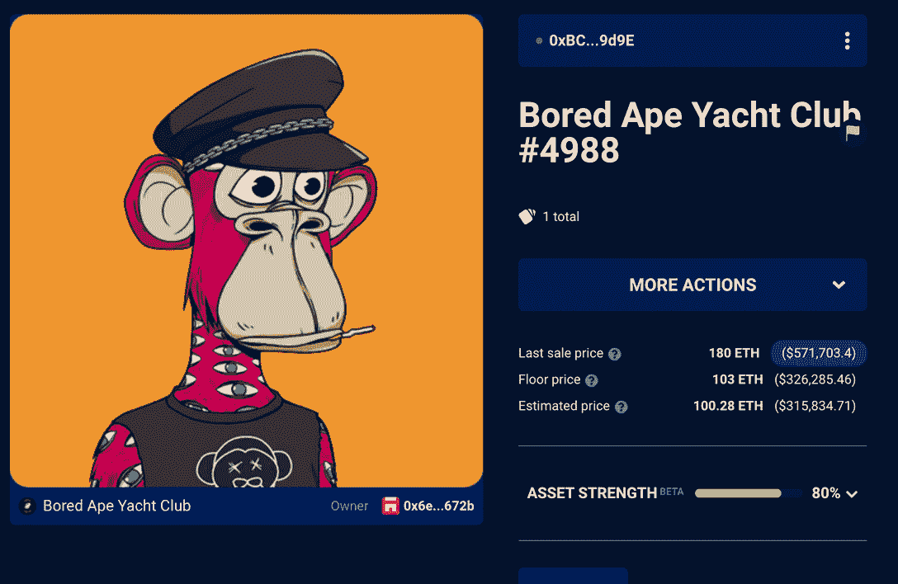
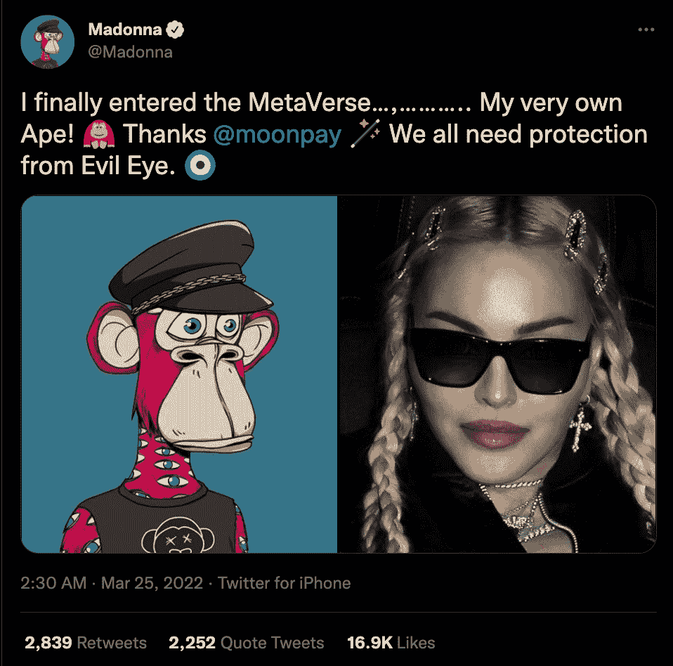
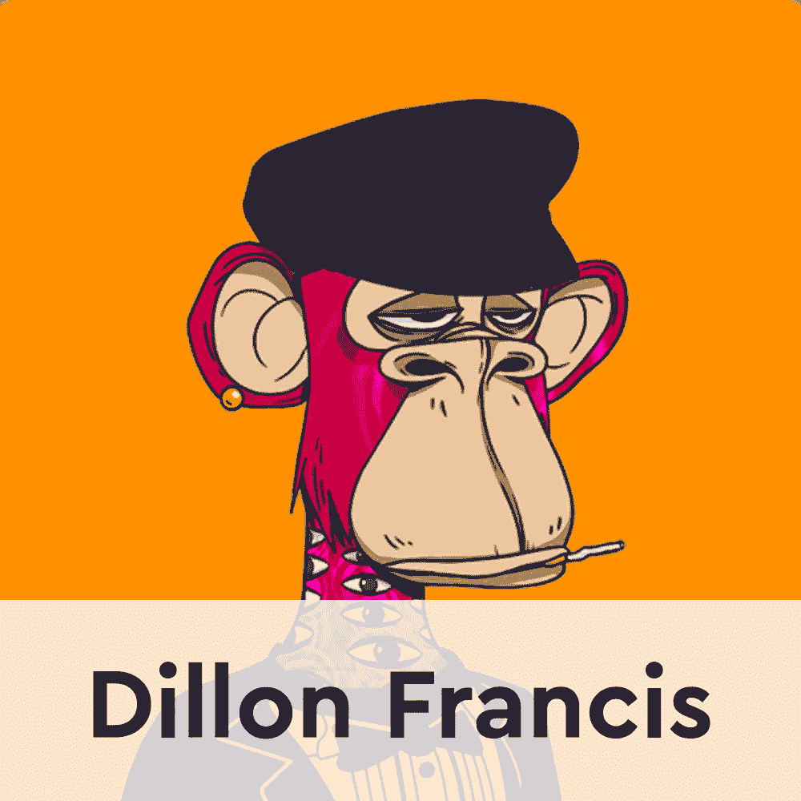
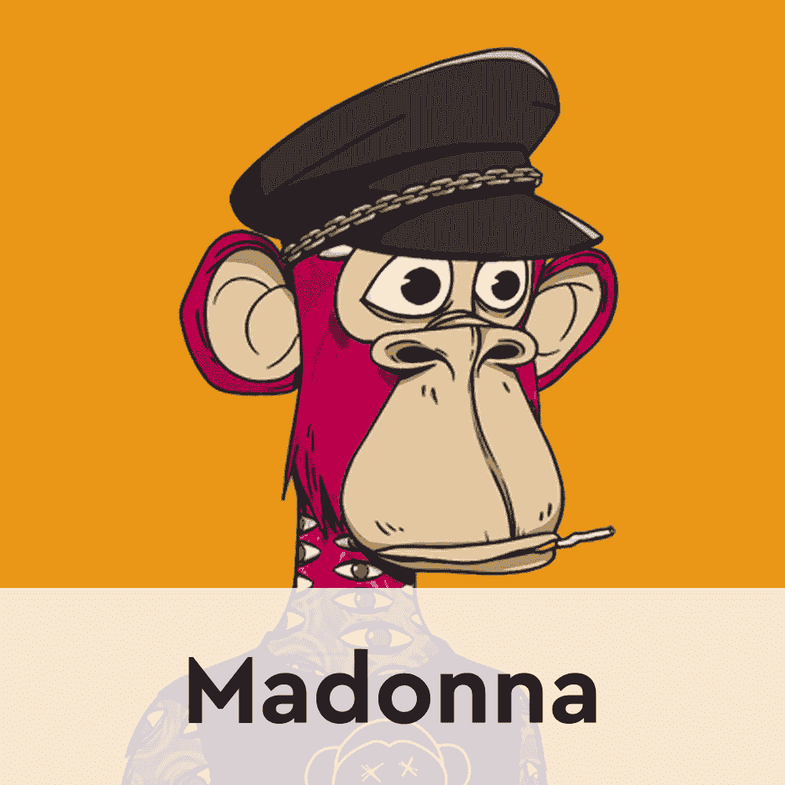
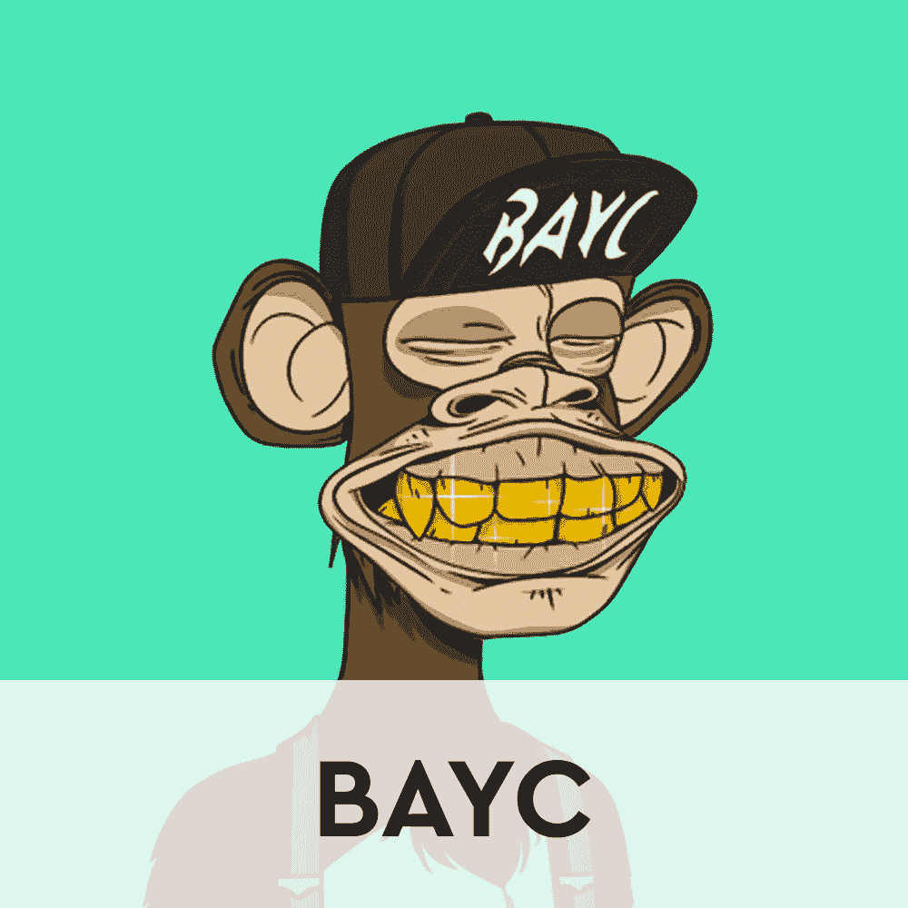
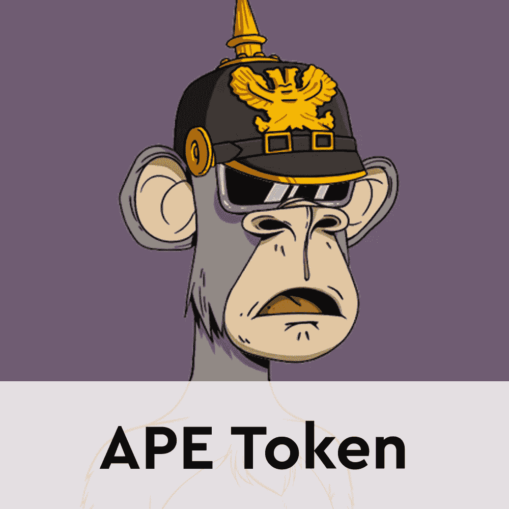

# 麦当娜带着定制的 NFT 加入了 BAYC 家族

> 原文：<https://web.archive.org/web/https://dappradar.com/blog/madonna-joins-the-bayc-family-with-a-customized-nft>

## 这位流行偶像通过 Moonpay 的服务购买了 BAYC #4988

麦当娜，迄今为止流行乐坛最著名的人物之一，在昨天购买了 BAYC #4988 之后，已经加入了 Bored Ape 游艇俱乐部的大家庭。这笔交易是通过 Moonpay 的钱包促成的，这已经成为大名人的标准做法。更有趣的是麦当娜利用了她对 NFT 的知识产权。**她在分享消息前改变了它的设计。**

无聊猿游艇俱乐部是加密新闻的前沿，因为宇迦实验室上周推出了猿令牌。围绕代币的活动增加也推高了藏品的底价。尽管如此，这并没有阻止麦当娜通过 [Moonpay.eth](https://web.archive.org/web/20221001123313/https://dappradar.com/hub/wallet/eth/0xd75233704795206de38cc58b77a1f660b5c60896) 以 180 ETH 的价格收购 [BAYC #4988](https://web.archive.org/web/20221001123313/https://dappradar.com/hub/assets/eth/0xbc4ca0eda7647a8ab7c2061c2e118a18a936f13d/4988) 。这位流行歌星在购买时花了大约 466，072 美元。

除了新买的 BAYC，[麦当娜的钱包](https://web.archive.org/web/20221001123313/https://dappradar.com/hub/wallet/eth/0x6ef962ea7e64e771d3a81bce4f95328d76d7672b)目前还有另外十张 NFT，都是无偿转让的。这可能意味着粉丝们已经开始聚集起来，把 NFT 的礼物寄到这位流行歌星的以太坊地址。

## 麦当娜设计了她自己的贝克 NFT

当然，麦当娜加入 NFT 社区本身就是一个大新闻。然而，更令人印象深刻的是，她充分利用了自己作为 BAYC NFT 所有者的权利。歌手 Twitter 上的官方声明显示了原始 BAYC #4988 的修改版本。

正如你所看到的，麦当娜的帖子和她作品集里展示的原始图像之间有一些显著的差异。NFT 的背景从原来的橙色变成了“新朋克蓝”，眼睛的形状和颜色也不一样了。此外，歌手决定她想删除香烟 [BAYC #4988](https://web.archive.org/web/20221001123313/https://dappradar.com/hub/assets/eth/0xbc4ca0eda7647a8ab7c2061c2e118a18a936f13d/4988) 最初作为属性。

由于宇迦实验室对 NFT 收藏品的创新方法，这个“发现差异”游戏才成为可能。Bored Ape 游艇俱乐部系列和该系列的所有后续系列授予所有者对知识产权(IP)的完全权利。这意味着 BAYC 所有者可以以他们喜欢的任何方式使用、更改和定制他们的 NFT。

麦当娜并不是第一个利用 BAYC 全部知识产权的名人。女演员格温妮丝·帕特洛(Gwyneth Paltrow)也做了同样的事情，她在一段视频中透露她加入了 BAYC 家族，视频中她的 [BAYC #6141](https://web.archive.org/web/20221001123313/https://dappradar.com/hub/assets/eth/0xbc4ca0eda7647a8ab7c2061c2e118a18a936f13d/6141) 没有戴原来的帽子，而是留着一头金色长发。

另一个有趣的细节是，DappRadar 上的最后一个名人介绍，Dillon Francis，与一只非常相似的猿一起加入了 BAYC 家族。你可以比较下面的两个原件。

[<picture></picture>](https://web.archive.org/web/20221001123313/https://dappradar.com/hub/wallet/eth/0x58473e9ac681c4424ca74619281ff71801d002d6)[<picture></picture>](https://web.archive.org/web/20221001123313/https://dappradar.com/hub/wallet/eth/0x6ef962ea7e64e771d3a81bce4f95328d76d7672b)

随着越来越多的贵宾购买他们的第一只蓝筹股 NFT，达普雷达将继续关注名人 NFT 空间。你可以浏览名人钱包的完整列表，或者在 Twitter 上关注 DappRadar，了解最新的名人 NFT 新闻。此外，你可以查看下面的链接，了解为什么无聊猿游艇俱乐部如此受欢迎。

[<picture></picture>](https://web.archive.org/web/20221001123313/https://dappradar.com/ethereum/collectibles/bored-ape-yacht-club)[<picture></picture>](https://web.archive.org/web/20221001123313/https://dappradar.com/blog/bored-ape-yacht-club-launch-apecoin-with-ape-token-airdrop)[<picture></picture>](https://web.archive.org/web/20221001123313/https://dappradar.com/hub/token/eth/APE?from=0x4d224452801aced8b2f0aebe155379bb5d594381) NewsletterUnsubscribe at any time. [T&Cs](https://web.archive.org/web/20221001123313/https://dappradar.com/terms) and [Privacy Policy](https://web.archive.org/web/20221001123313/https://dappradar.com/privacy-policy)