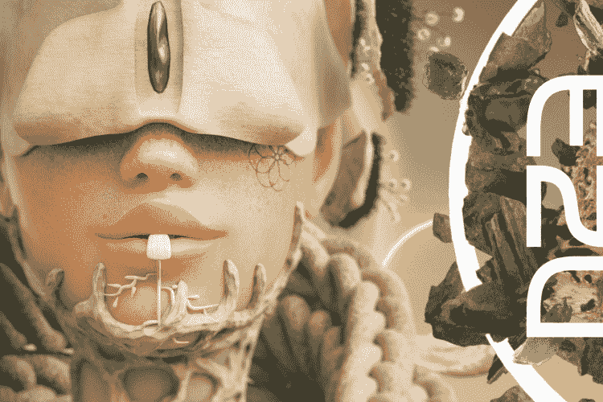
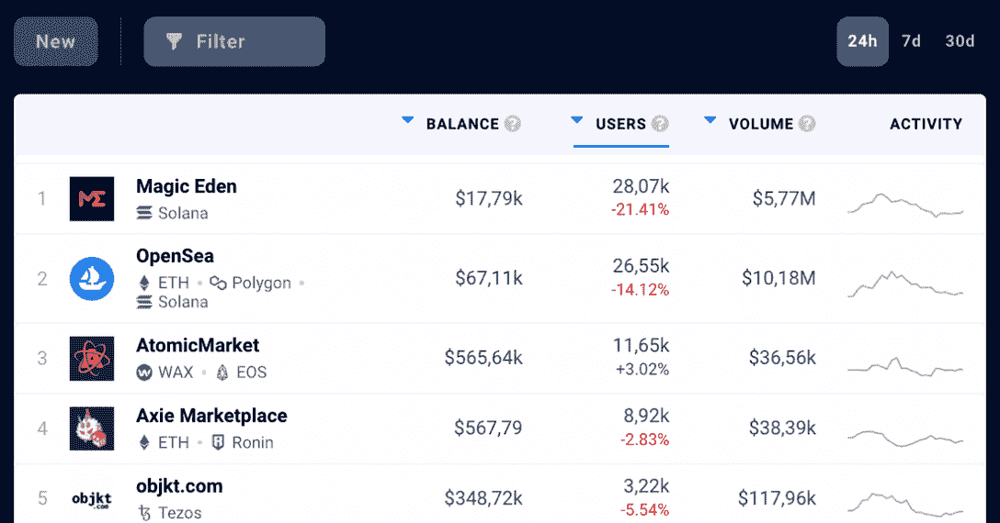

# 继以太坊重磅炸弹之后，魔法伊甸园引领市场

> 原文：<https://web.archive.org/web/https://dappradar.com/blog/magic-eden-leads-the-market-after-ethereum-bombshell>

## 在 DappRadar 的排名中，NFT 市场现在位于 OpenSea 之上

NFT 市场的竞争越来越激烈。通过在周二宣布其以太坊集成，Magic Eden 震惊了 NFT 社区。它被称为索拉纳 NFT 商人的顶级市场。现在该平台正在扩大其帝国，以覆盖以太坊。对于 Magic Eden 来说，这是一个改变的开始，它已经在 DappRadar 的用户数量排名上超过了巨头 OpenSea。

## 支持索拉纳和以太坊的魔法伊甸园

[魔法伊甸园](https://web.archive.org/web/20221208093250/https://dappradar.com/solana/marketplaces/magic-eden)期待已久的与以太坊网络的融合终于到来了。正如所宣布的，这只是市场走向多连锁店未来的第一步。

该声明是通过官方 Magic Eden 博客发布的，同时发布的还有一份完整的路线图和对该平台目标的保证——大规模采用 NFTs。

为了让这个雄心勃勃的项目成功，Magic Eden 旨在简化在以太坊上创建和交易 NFT 的整个体验。该计划包括向以太坊 NFTs 的创造者提供与他们已经给予索拉纳 NFTs 创造者相同的铸造支持。他们计划在八月中旬这样做。他们将首先推出 EZU(T1)，这是魔法伊甸园的第一个官方以太坊 NFT 系列。

作为迷幻剂匿名组织的姐妹项目，《EZU》将在待定日期在 ETH 和 SOL 的铸币厂上市，并且是 Voltura 实验室的另一个产品。

*   **你可能也喜欢读:** [如何在魔法伊甸园上买卖 NFTs】](https://web.archive.org/web/20221208093250/https://dappradar.com/blog/how-to-buy-and-sell-nfts-on-magic-eden)

## 最常用的 NFT 市场

为了更好地跟踪分散应用的性能， [DappRadar](https://web.archive.org/web/20221208093250/https://dappradar.com/) 提供了易于使用的全面工具。一周的新闻通常反映在图表和数据告诉我们的内容中，所以密切关注机会非常重要。

例如，魔术伊甸园最近一直在上升，这一事实清楚地反映在 NFT 市场用户数量的迅速增加上。

DappRadar 的 NFT 市场排名记录显示，在声明发布后的 24 小时内，超过 28，070 个不同的钱包与该平台进行了互动。这比前 7 天记录的平均数字高出约 110%。

这使得魔法伊甸园迅速攀升至排行榜首位，甚至领先于巨人 [OpenSea](https://web.archive.org/web/20221208093250/https://dappradar.com/blog/what-is-opensea-and-how-to-use-it-the-beginners-guide) 。

现在，OpenSea 和 Magic Eden 将争夺更多类似的市场。这是因为在以太坊上创建的第一个 NFT 市场 OpenSea 于 2022 年 4 月开始将 Solana NFTs 集成到其平台中。

我们可以期待一场行业领导者的战斗，我们 DappRadar 将密切关注这场战斗。

*   **进一步阅读:** [交易索拉纳 NFTs:魔法伊甸园 vs OpenSea](https://web.archive.org/web/20221208093250/https://dappradar.com/blog/trading-solana-nfts-magic-eden-vs-opensea)

## 用 DappRadar 跟踪 NFT 市场和收藏品

达普拉达将继续沿着[魔法伊甸园](https://web.archive.org/web/20221208093250/https://dappradar.com/solana/marketplaces/magic-eden)的道路引领 NFT 社区。您可以使用我们的 [NFT 市场排名](https://web.archive.org/web/20221208093250/https://dappradar.com/nft/marketplaces)来跟踪市场的表现。

为了更深入地了解如何管理你自己的 NFT 投资组合，我们推荐使用 [DappRadar NFT 投资组合跟踪器](https://web.archive.org/web/20221208093250/https://dappradar.com/hub/wallet/)。

[https://web.archive.org/web/20221208093250if_/https://www.youtube.com/embed/WHL_uYv8riA?start=15&feature=oembed](https://web.archive.org/web/20221208093250if_/https://www.youtube.com/embed/WHL_uYv8riA?start=15&feature=oembed)

密切关注这些顶级表演者，查看他们的官方 dapp 页面:[魔法伊甸园](https://web.archive.org/web/20221208093250/https://dappradar.com/solana/marketplaces/magic-eden)和[开放海洋](https://web.archive.org/web/20221208093250/https://dappradar.com/multichain/marketplaces/opensea)。

如果你想进一步了解令人兴奋的去中心化应用世界中的最佳项目，那么关注 DappRadar [博客](https://web.archive.org/web/20221208093250/https://dappradar.com/blog/)、 [YouTube](https://web.archive.org/web/20221208093250/https://www.youtube.com/c/DappRadar) 频道和 [Twitter](https://web.archive.org/web/20221208093250/https://twitter.com/dappradar) 账户。

 NewsletterUnsubscribe at any time. [T&Cs](https://web.archive.org/web/20221208093250/https://dappradar.com/terms) and [Privacy Policy](https://web.archive.org/web/20221208093250/https://dappradar.com/privacy-policy)