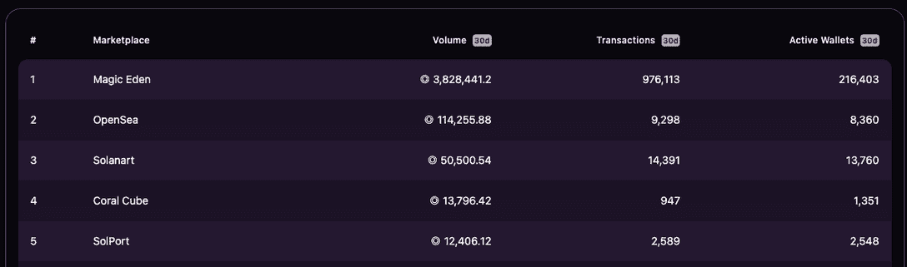
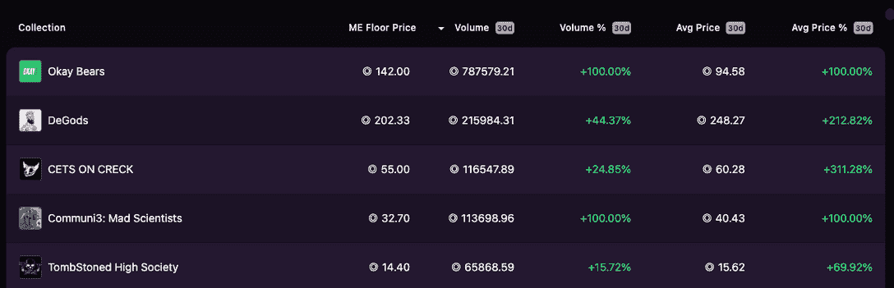
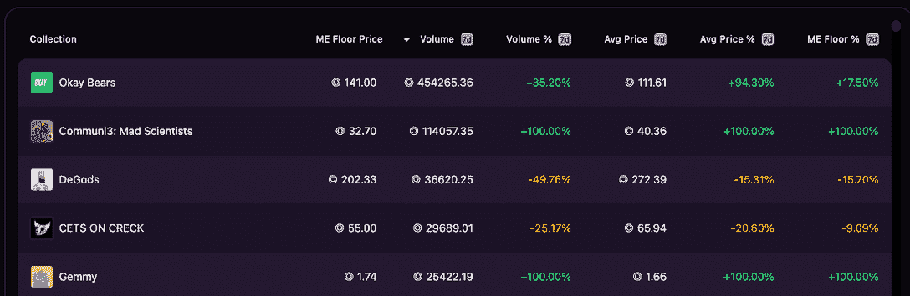
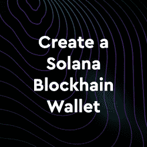
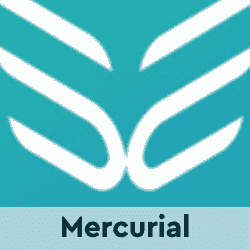
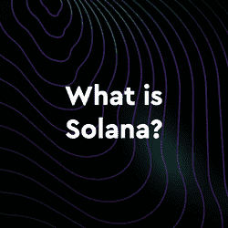

# 魔术伊登&索拉纳帮助 NFTs 重回正轨

> 原文：<https://web.archive.org/web/https://dappradar.com/blog/magic-eden-solana-help-get-nfts-back-on-track>

## 魔术伊甸园在过去 30 天里创造了超过 3 亿美元的交易量

随着索拉纳区块链上的 NFT 收藏品开始引起人们的注意，NFT 市场 Magic Eden 这个月的交易量超过了 3 亿美元。魔术伊甸园的成功反映了索拉纳 NFT 社区的增长，这可能标志着 NFT 收藏的又一波炒作。

## 摘要

*   [神奇的伊甸园](https://web.archive.org/web/20221129082458/https://dappradar.com/solana/marketplaces/magic-eden) NFT 交易量在过去 30 天里热达 3.116 亿美元
*   [Okay Bears 和 DeGods](https://web.archive.org/web/20221129082458/https://dappradar.com/blog/dapp-industry-report-april-2022/#Moonbirds-and-Solana-help-NFTs-get-back-on-track) 的平均售价分别上涨了 100%和 212%
*   4 月份，索拉纳在 NFT 创造了 2.95 亿美元的交易量，比 3 月份增长了 91%

在过去的 30 天里，[魔法伊甸园](https://web.archive.org/web/20221129082458/https://dappradar.com/solana/marketplaces/magic-eden)和[索拉纳 NFT 收藏](https://web.archive.org/web/20221129082458/https://dappradar.com/solana/marketplaces/magic-eden)已经产生了超过 380 万索尔的交易量，或 3.116 亿美元。共有 216，403 个活动钱包完成了近 100 万笔交易。这一表现让魔术伊甸园遥遥领先于对手[索拉纳](https://web.archive.org/web/20221129082458/https://dappradar.com/solana/marketplaces/solanart)，更重要的是，领先于 [OpenSea](https://web.archive.org/web/20221129082458/https://dappradar.com/multichain/marketplaces/opensea) ，索拉纳 NFT 也在这里举办。

这很重要，因为有人担心 OpenSea 可能会抢了 Magic Eden 等本土索拉纳市场的风头。这些本地索拉纳市场几乎完全由[托管索拉纳 NFT](https://web.archive.org/web/20221129082458/https://dappradar.com/nft/marketplaces)，而 OpenSea 已经在以太坊 NFT 上拥有强大的垄断地位，同时还支持 Flow 和更重要的 Polygon。然而，看起来 NFT 的崇拜者正在用他们的区块链钱包投票，因为魔术师伊登显然是索拉纳的国王。

## **Okay Bears 和 DeGods 的崛起**

[Okay Bears 和 DeGods](https://web.archive.org/web/20221129082458/https://dappradar.com/blog/dapp-industry-report-april-2022/#Moonbirds-and-Solana-help-NFTs-get-back-on-track) 的平均售价分别上涨了 100%和 212%。截至发稿时，一只 Okey Bear 的平均价格约为 95 索尔，约合 8000 美元。而 DeGods 的平均成交价约为 250 索尔，接近 2.1 万美元。记住，2021 年 10 月，DeGods 的铸造价格为 3 索尔，约合 500 美元，那些相信 Solana NFTs 和 diamond hands 的人今天可能会坐得很好。

Okey Bears 和 DeGods 看起来将成为 Solana 的第一批蓝筹股。然而，看看过去七天的交易量趋势，我们看到图表中还有其他东西在上升。Communi3 的底价约为 32 索尔，排名第二，Gemmy 排名第五，底价仅为 1.74 索尔。随着交易者开始抢购索拉纳上的 NFT，这两种收藏品可能会变得更有价值。

## 索拉纳上的魔法伊甸园是什么？

Magic Eden 是一个基于 T2 索拉纳区块链 T3 的分散式应用程序 T1。它允许用户创建和管理用于各种目的的 NFT，包括数字收藏品、游戏资产等等。它为创作者提供了最大的核心流动性，在 Solana 的二级交易量中占据了 90%以上的市场份额。

[魔法伊甸园发射台](https://web.archive.org/web/20221129082458/https://dappradar.com/solana/marketplaces/magic-eden)是一个独家的铸币平台，申请过程比较困难。它自诩只接受了 3%的 Launchpad 应用程序来尝试和展示 Solana 上的[最佳 NFT 项目。](https://web.archive.org/web/20221129082458/https://dappradar.com/rankings/protocol/solana)

Magic Eden 还专注于游戏，目前在 Solana 上托管 90%的游戏内二级市场交易。NFT 市场也与游戏项目合作推出了伊甸园游戏。

## NFTs 成熟

NFT 市场继续证明反对者是错误的。像 Moonbirds 和 Otherside 这样的炒作项目继续在以太坊积累大量的交易量，而 Solana 和其他区块链在 NFT 市场制造更多的噪音。根据最新的 DappRadar 行业报告，在 4 月份，Solana 在 NFT 交易中获得了 2.95 亿美元，比 3 月份的交易量增长了 91%。同样，值得注意的是，Solana 上的 NFTs 的平均销售价格已经上升到大约 350 美元，显示了这些资产的价值。

可以说，第二波 NFT 炒作总是会到来，这只是一个弄清楚哪个区块链可以拿起接力棒并带着它跑的问题。索拉纳是那个人吗？围绕其实际功能和正常运行时间的一系列负面影响将受到质疑。然而，数字不会说谎，索拉纳上的[魔法伊甸园和 NFT 收藏毫无疑问在上升。](https://web.archive.org/web/20221129082458/https://dappradar.com/solana/marketplaces/magic-eden)

[<picture></picture>](https://web.archive.org/web/20221129082458/https://dappradar.com/blog/how-to-set-up-a-solana-blockchain-wallet)[<picture></picture>](https://web.archive.org/web/20221129082458/https://dappradar.com/solana/defi/mercurial)[<picture></picture>](https://web.archive.org/web/20221129082458/https://dappradar.com/blog/what-is-solana)[<picture></picture>](https://web.archive.org/web/20221129082458/https://dappradar.com/solana/defi/solend)[<picture></picture>](https://web.archive.org/web/20221129082458/https://dappradar.com/blog/tag/solana)[<picture></picture>](https://web.archive.org/web/20221129082458/https://dappradar.com/solana/marketplaces/solanart)

***以上不构成投资建议。此处给出的信息仅供参考。请行使尽职调查，做你的研究。作者持有多种加密货币的头寸，包括 BTC、瑞士法郎和雷达。***