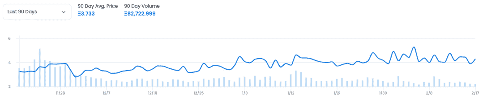

# 芒努斯·卡尔森和沙盒将国际象棋移至元宇宙

> 原文：<https://web.archive.org/web/https://dappradar.com/blog/magnus-carlsen-and-the-sandbox-move-chess-into-the-metaverse>

## 芒努斯·卡尔森的 Play Magnus 集团宣布与 Animoca Brands 合作，将国际象棋带到元宇宙

世界象棋冠军芒努斯·卡尔森坐在沙盒的国际象棋桌上，Animoca Brands 与 Play Magnus Group (PMG)合作，将这项古老的娱乐活动引入元宇宙。此次合作将引入虚拟世界活动和 NFT 收藏，将经典的智力游戏带到一个新的前沿。

以前是人类和机器对弈；现在，当国际象棋到达元宇宙时，人类正在机器里下棋。基于区块链的虚拟世界沙盒宣布将主办 PMG 的融水冠军国际象棋巡回赛，作为 PMG 和 Animoca Brands 合作伙伴关系的一部分。

此外，Animoca Brands 的另一家子公司 Lympo 将领导冠军国际象棋巡回赛 NFT 系列的开发。在接下来的五年里，该公司将根据 PMG 的冠军国际象棋巡回赛创建一系列可收藏的棋手卡和一款“受区块链象棋启发”的游戏。他们还将铸造社交令牌，授予持有者额外的玩家和社区访问权限。

同样属于 Animoca Brands 的沙盒在去年 11 月的牛市中成为了[的头条](https://web.archive.org/web/20230116090113/https://dappradar.com/blog/tag/the-sandbox)，因为它的[土地价格成为了元宇宙最贵的](https://web.archive.org/web/20230116090113/https://dappradar.com/blog/most-expensive-land-in-the-metaverse)。他们把史努比·道格算作公民；这位说唱歌手可以在自己的虚拟豪宅中找到。阿迪达斯最近收购了一些他们命名为 AdiVerse 的土地，宣称对区块链拥有主权。现在，沙盒可以把国际象棋世界冠军和梦幻足球爱好者芒努斯·卡尔森算作它的最新成员之一。

## 沙盒不断扩大

自去年的惊人上涨以来，在此期间，土地的价格和它们的象征物(沙子)的价值都大幅上涨，沙盒市场的情况有所降温。正如我们在下图中看到的，在 2021 年 11 月的交易热潮之后，交易数量大幅下降。

[<picture></picture>](https://web.archive.org/web/20230116090113/https://opensea.io/collection/sandbox)

说到这里，投资者和沙盒居民不应该太紧张。价格相对稳定，交易波动可以部分归因于沙盒最近进行的区块链移民。

让我们仔细看看过去几个月受到影响的沙盒经济的一些领域，以及未来可能的发展方向。

*   随着大硬币的移动，剩下的硬币也会移动。对于加密货币来说，这个事实仍然成立。虽然较小硬币和代币的价格越来越少与 BTC 和瑞士联邦理工学院挂钩，但如果这两个巨头倒下，其他所有东西也会倒下。SAND 目前的价格为 4.07 美元，比 11 月份的高点(8.40 美元)低了 50%多一点。你是否认为这是一个问题，取决于你是否认为当前的市场低迷是一个必要的调整，还是一个终端下降的迹象。

*   **Polygon partnership**–沙盒最近宣布在 Polygon 网络上推出新的赌注机制。在这一改变之前，想在沙子上下注的人只能在以太坊/沙农池中下注。现在，沙盒已经与 Polygon 合作，玩家可以零汽油费下注他们的 mSAND。在[这篇文章](https://web.archive.org/web/20230116090113/https://dappradar.com/blog/the-sandbox-sand-token-staking-launched-on-polygon)的结尾，了解如何下注和赚取沙子。

*   **土地**–以太坊-多边形桥接的结果是，土地交易率下降了。然而，向第二层生态系统的迁移只是道路上的暂时颠簸。如前所述，价格没有大幅下降。事实上，如果我们仅从 ETH 的角度考虑销售，价格趋势线是上升的。但是随着 ETH 相对于美元的下跌，法定货币的土地价格也下跌了。