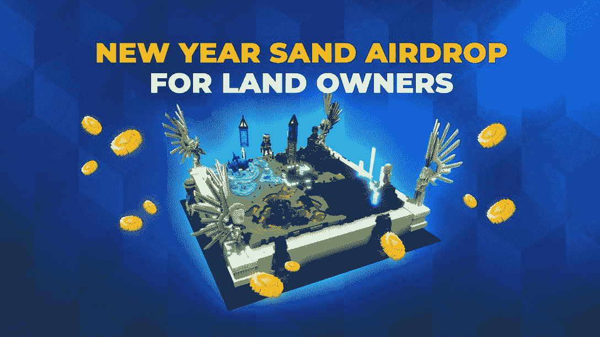
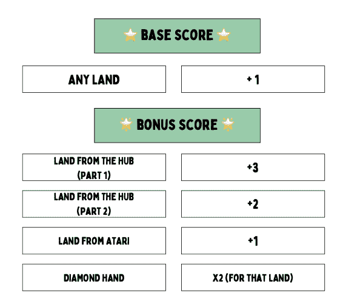
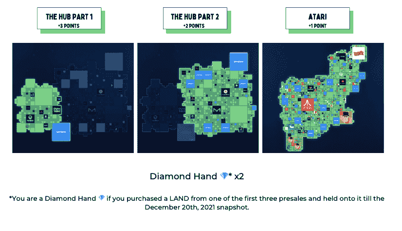
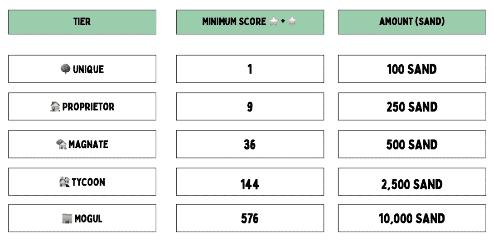

# 沙箱旁的主要空投沙子

> 原文：<https://web.archive.org/web/https://dappradar.com/blog/major-sand-airdrop-by-the-sandbox>

## 2022 年 1 月空投沙子，基于土地所有权

领先的元宇宙平台沙盒计划庆祝里程碑式的 2021 年，并通过空投沙盒来奖励土地所有者，以此来庆祝其游戏的推出。截至 2022 年 1 月，沙盒统计了超过 17，000 名土地所有者，并向社区分发了超过 8，000 万个沙盒。

作为对那些多年来支持游戏和购买土地的人的进一步感谢，沙盒团队在新年开始时向多边形网络上的土地持有者空投沙子。SAND 是整个沙盒元宇宙中使用的实用工具和治理令牌

最初[沙盒在以太坊区块链](https://web.archive.org/web/20221206180105/https://dappradar.com/blog/tag/the-sandbox)推出了它的基础设施，但现在它已经转移到 Polygon。即使以太坊上仍然存在许多 NFT，但虚拟世界平台将在未来的道路上更多地拥抱 Polygon。目前，Polygon 上的流动性提供活动已经吸引了 1.27 亿美元的总价值锁定(TVL)，而以太坊上的池有 4460 万美元的 TVL。

## 如何获得沙空投

截至 2021 年 12 月 20 日 00:00:00 UTC，拥有至少一块土地的任何人都有资格获得奖励。airdrop 将感谢核心社区中的每一个人，并对那些拥有钻石手的人发出特别的呼喊。钻石手是加密货币领域使用的一个术语，用来描述投资者能够度过风暴，并在价格波动期间持有其资产。在这种情况下，沙盒是感谢他们安然度过任何和所有的市场动荡，并显示出对沙盒的信任。从本质上讲，一个人买地越早，得到的积分就越多。

那些在有史以来前三次预售中的一次购买土地，然后一直持有到 12 月 20 日抓拍的人赢得了钻石手的称号。

然后总分数(基础分数+奖励分数)遵循下面的图表来定义土地持有者将获得的奖励。如前所述，只要您在预售期间购买了该土地，并且截至 2021 年 12 月 20 日 00:00 AM UTC 仍持有该土地，您就有资格获得该土地的钻石手乘数。

那些有索赔权的人根本不需要做任何事情。在接下来的几周内，SAND 将被直接投放到符合条件的钱包中。请注意这次空投将在多边形上完成。

**沙盒进入第二层**

在宣布与 Polygon 的[合作关系后，沙盒团队一直致力于完成向第二层生态系统的转换。移动到多边形的第二层将给用户带来许多改进，首先是游戏过程中花费在油费上的巨大减少。](/web/20221206180105/https://dappradar.com/blog/the-sandbox-migrates-to-polygon-this-summer/)

为了鼓励用户迁移到 Polygon，Sandbox 团队实现了一个新的 mSAND/MATIC staking pool。向 Quickswap 上的 mSAND/MATIC 对提供流动性的 SAND 持有人将有资格分享每月的 SAND 分配。如果您想参加这一新的赌注计划，并在 Polygon 上用 mSAND-MATIC 对赢得 SAND，请参见本指南[获取 LP 代币以开始](https://web.archive.org/web/20221206180105/https://medium.com/sandbox-game/introducing-msand-matic-staking-at-the-sandbox-319f983d20a4)。

## 沙盒炒作

沙盒在去年年底受到了大量的炒作，因为它的原生 SAND 令牌无情地上升到新的 ATHs。说唱歌手和 NFT 大亨 Snoop Dog 宣布他将在沙盒元宇宙建立他的豪宅和 NFT 收藏，在那里他还将举办现场音乐会并与玩家互动。而其他品牌和受欢迎的 IP 如关怀熊，行尸走肉，雅达利和蓝精灵也潜入了不断增长的元宇宙平台。

[<picture></picture>](https://web.archive.org/web/20221206180105/https://dappradar.com/ethereum/games/the-sandbox)[<picture></picture>](https://web.archive.org/web/20221206180105/https://dappradar.com/hub/token/eth?to=0x3845badade8e6dff049820680d1f14bd3903a5d0)[<picture></picture>](https://web.archive.org/web/20221206180105/https://dappradar.com/blog/the-sandbox-land-valuation-report)

***以上不构成投资建议。此处给出的信息仅供参考。请行使尽职调查，做你的研究。作者持有 ETH、BTC、AGIX、HEX、LINK、GRT、CRO、OMI、不变 X、ENS、GALA、AVASTR、GMEE、CUBE、RADAR、FLOW、FTM、BNB、SPS、WRLD、ATOM 和 ADA。***