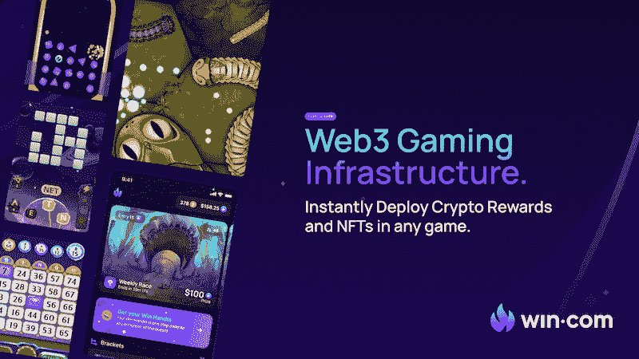
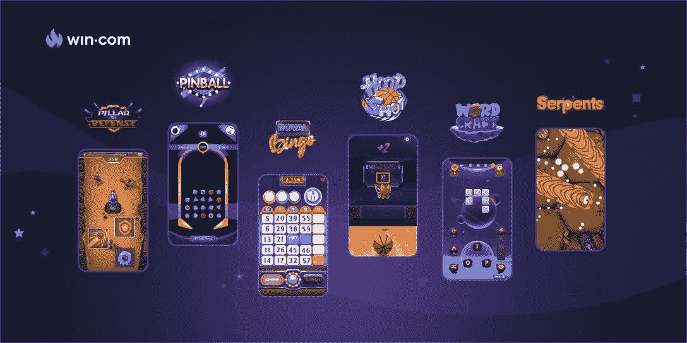
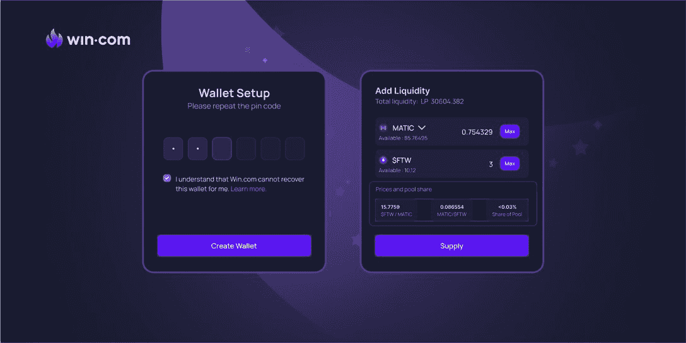
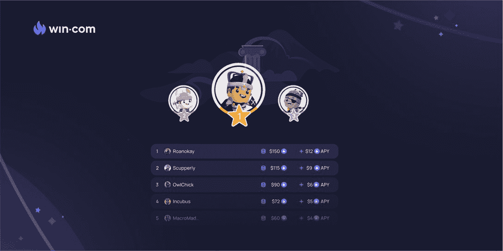
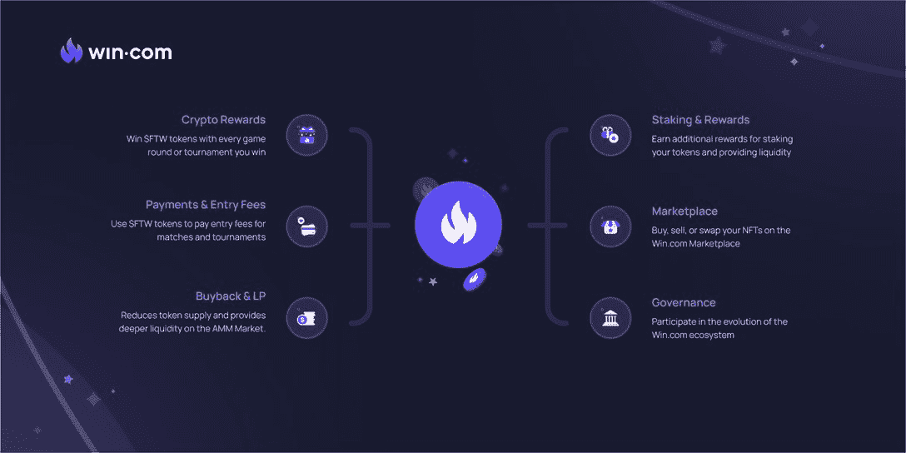

# 使用 Win.com 游戏平台玩任何游戏

> 原文：<https://web.archive.org/web/https://dappradar.com/blog/make-any-game-play-to-earn-with-win-com-gaming-platform>

## 用 Win 的 SDK 和两行代码将移动电子竞技、游戏和游戏收入结合起来

**Win.com 通过提供多功能 SDK 和支持电子竞技的游戏平台，重新定义了游戏即赢。游戏开发者可以很容易地将他们的游戏升级为玩家可以以技能为基础的方式争夺奖励的旅程，这更加公平和刺激。**

**概要:**

*   Win SDK 允许游戏开发人员仅用两行代码集成支持 NFT、提供 crypt0 奖励的游戏赚取机制。
*   Win 提供专有的非保管钱包，使用户能够完全控制自己的资产。
*   **此外，Win 还提供基于级别的赌注系统。**
*   **FTW token 通过各种实用程序促进 Win 的生态系统。**

根据 Newzoo 的预测，到 2022 年，电子竞技市场将达到 18 亿美元。此外，据 Statista 统计，[移动游戏预计将在 2022 年达到 1249 亿美元，成为最大的游戏市场。随着电子竞技的发展，它将增加移动游戏的刺激，进一步释放这个行业的潜力。](https://web.archive.org/web/20220928025029/https://www.statista.com/outlook/dmo/digital-media/video-games/mobile-games/worldwide)

电竞的兴起不仅仅是因为年轻一代对游戏的热爱，更是因为它为游戏货币化提供了新思路。过去几年，游戏行业一直在寻找更具创新性的盈利方式。由于区块链的技术，链上游戏赚取机制成为游戏通过将玩家的游戏时间转化为收入来赚钱的另一个关键战略。

当电竞遇上 play-to-earn，让我们想象一下他们的结合会给游戏行业带来怎样的火花。这就是 Win.com(Win)发挥作用的地方，它为任何手机游戏增加了一个从玩到赚的层面，并将它变成了一个电子竞技舞台。突然之间，任何玩电子游戏的人都可以从他们的成就中赚钱，从游戏中赚钱不再只是高技能人才的专利。

## 用两行代码实现 Win SDK 的先玩后赚

“玩即赚”已经成为最有效的游戏盈利方式之一，也是区块链游戏玩家最渴望的游戏属性。Win SDK 为开发人员提供了一个全面的先玩后赚模型。得益于 Win，开发人员可以更加专注于为他们的游戏创造差异化，如游戏性、讲故事和视觉效果。

那么与 Win SDK 集成有什么好处呢？

*   首先，它提供了一个复杂的匹配和玩家评级算法，使 PvP 游戏。同时，它保证了玩家配对总是公平的。
*   此外，它采用了一个基于 NFT 的平衡系统，为游戏化机制提供动力，并以诱人的福利吸引玩家。
*   此外，实时分析将跟踪所有相关数据，并提供对用户旅程的深入洞察。
*   最后但并非最不重要的一点是，一个经验丰富、专注的支持团队全天候待命。

## Win 为游戏开发者提供了一个动态的生态系统

凭借其核心的灵活性和即时终结性，Win 的技术使游戏开发者能够在激烈的 Web3 游戏行业中竞争。此外，Win 的开箱即用解决方案将玩家的参与度从第一级提升到了下一级

### 从玩到赚到玩到赢

Win 致力于带来激动人心的游戏体验，将从玩到赚的机制提升到从玩到赢的水平。借助 Win SDK，开发人员可以用不同的游戏模式升级他们基于技能的游戏，例如一对一或多人锦标赛，以及分层联盟。因此，玩家可以参加这些电子竞技比赛，争夺奖金池的份额。Win 的平台上有一些支持电子竞技的游戏，供玩家获取有吸引力的奖励。

## 使用 Win DeFi Wallet 跟踪、下注和赢取奖金

Win 为用户提供了一个非托管钱包，这是一个 100%去中心化的钱包，让用户可以完全控制自己的私钥，从而控制自己的数字资产。最重要的是，用户可以有一个直观的界面来跟踪和了解他们的加密组合。

[Win 邀请用户参与其赌注奖励活动](https://web.archive.org/web/20220928025029/https://win.com/staking?utm_source=DappRadar&utm_medium=PR&utm_campaign=hello)，其中 500，000 FTW 代币将通过赌注奖励池分发。要开始下注，用户需要创建一个 Win wallet。

值得一提的是，Win 引入了 NFT 驱动的基于级别的赌注过程。在赌注系统中，胜利领域的[英雄是 NFT 角色，他们可以启动用户的赌注过程。那么如何实现这一点呢？首先，玩家需要通过与 Win 平台互动，增加自己的英雄等级来获得经验。例如，您可以使用您的英雄作为游戏中的角色来玩游戏，进行任务，并参加锦标赛。这些是培养和提升你的英雄的方法，这样他们会帮助你获得更大的回报，并增加你的赌注。](https://web.archive.org/web/20220928025029/https://win.com/heroes?utm_source=DappRadar&utm_medium=PR&utm_campaign=hello)

## 令牌组学

在 Win 的生态系统中，FTW 令牌提高了用户对各种实用程序的参与度。除了下注这个 ERC-20 代币作为奖励，用户可以使用它作为支付方式在市场上交易 NFT 或支付锦标赛入场费。此外，用户将在 FTW 中获得锦标赛奖金。

对于开发人员来说，FTW 也是一种强大的经济手段，因为开发人员不需要设置新的令牌。相反，他们可以使用 FTW 来促进他们的游戏内经济和生态系统。通过这种方式，开发者可以专注于制作游戏、讲故事、视觉设计等。，为玩家带来极致游戏体验。

下图展示了 FTW 的多功能性，Win 的团队将在未来不断为 token 持有者带来更多的好处。

## 最后的想法

Win 不仅为开发人员带来了多功能的 SDK，还通过电子竞技平台优化了玩家体验，从而释放了游戏赚取的力量。值得注意的是，区块链博彩业在 2021 年增长到 30 亿美元。此外，预计到 2025 年将增至 397 亿美元。尽管这一趋势势不可挡，但 Win 可以将游戏开发者从所有链上电子竞技升级的压力和货币化的斗争中解救出来。

为了了解密码世界的最新动态，请在 Twitter 上关注 DappRadar。如果你想在 Win.com 的**找到更多，请查看以下频道。**

[网站](https://web.archive.org/web/20220928025029/https://win.com/?utm_source=DappRadar&utm_medium=PR&utm_campaign=hello)
[博客](https://web.archive.org/web/20220928025029/https://win.com/blog?utm_source=DappRadar&utm_medium=PR&utm_campaign=hello)
[推特](https://web.archive.org/web/20220928025029/https://twitter.com/winplatform)
[不和](https://web.archive.org/web/20220928025029/https://discord.gg/MuvBKXp4aH)

**免责声明** —这是一篇赞助文章。DappRadar 不认可本页面上的任何内容或产品。DappRadar 旨在提供准确的信息，但读者应该在采取行动之前总是自己做研究。DappRadar 的文章不能被认为是投资建议。