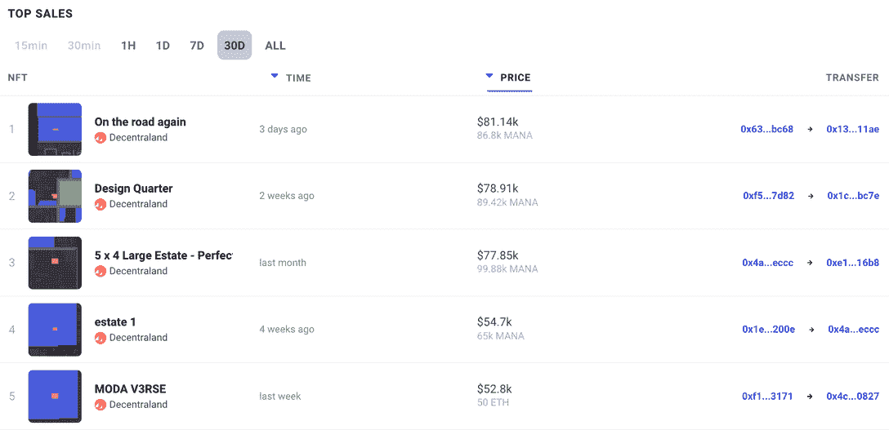
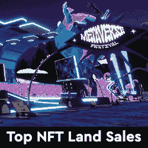
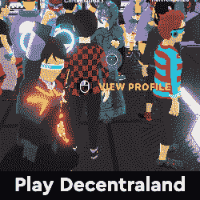
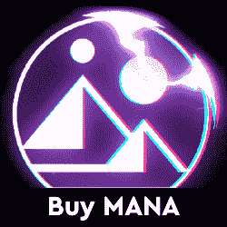

# 法力是趋势:基本面仍然强劲吗？

> 原文：<https://web.archive.org/web/https://dappradar.com/blog/mana-was-trending-are-the-fundamentals-still-strong>

## 更好地了解什么是 HODL，什么是放手

**分散王国是一个使用** **以太坊区块链的虚拟现实平台。用户可以创建、体验内容和应用，并从中获利。MANA 是分散平台上所有交易的原生令牌。**

[分散地使用两个令牌:](/web/20221231021338/https://dappradar.com/blog/explained-decentraland-mana-token/)法力和地。每当有人购买 NFT 时，一定比例的代币被烧掉。

NFTs 可以是虚拟土地、你的虚拟角色的数字服装或者作为 NFTs 出售的互动装置。

除了燃烧或[花费法力来换取土地](/web/20221231021338/https://dappradar.com/blog/metaverse-land-in-decentraland-ahead-of-bored-apes-top-10-nft-sales/)之外，用户还可以与其他用户交换法力来换取分散土地上的物品和服务。

用户在[分散土地虚拟世界](https://web.archive.org/web/20221231021338/https://dappradar.com/ethereum/games/decentraland)中购买土地，他们以后可以利用、建造和货币化。该平台于 2019 年推出封闭测试版，并于 2020 年 2 月向公众开放。

从那以后，用户在他们的土地上创造了各种各样的体验，包括互动游戏、蔓延的 3D 场景和各种其他互动体验。

[分散世界是元宇宙](https://web.archive.org/web/20221231021338/https://dappradar.com/ethereum/games/decentraland)和下一代虚拟世界。通过阅读本文了解关于[元宇宙](https://web.archive.org/web/20221231021338/https://dappradar.com/blog/what-is-the-metaverse)的一切。

[https://web.archive.org/web/20221231021338if_/https://www.youtube.com/embed/G1r8q0tq1_0?feature=oembed](https://web.archive.org/web/20221231021338if_/https://www.youtube.com/embed/G1r8q0tq1_0?feature=oembed)

## 法力是趋势

在 2021 年牛市的巅峰时期，MANA 和分散的土地受到了[脸书更名为 Meta](https://web.archive.org/web/20221231021338/https://dappradar.com/blog/into-the-metaverse-visa-facebook-steve-aoki-and-lionel-messi/) 的公告以及元宇宙平台上突然出现的聚光灯的鼓舞。

2021 年 10 月 20 日星期三，MANA 的代币价格为 0.77 美元。到 2021 年 11 月 25 日，触及 5.85 美元。在不到一个月的时间里，涨幅高达 659%。

最重要的是，分散的土地开发和围绕元宇宙的炒作(还没有平息)推动了收益，这些原因今天仍然有效。

此外，Animoca Brands 的[区块链博彩](https://web.archive.org/web/20221231021338/https://dappradar.com/rankings/category/games)和 NFT 空间的领导者的参与为团队和前景增加了重要的分量。

[法力](https://web.archive.org/web/20221231021338/https://dappradar.com/hub/token/eth/MANA?from=0x0f5d2fb29fb7d3cfee444a200298f468908cc942)能回到 5.85 美元的高点甚至更高吗？

## 见见团队

2015 年，一群朋友提出了一个问题:当单个实体控制虚拟现实的未来时，会发生什么？

下一个问题更有说服力:我们是否想要一个集中的看门人来决定价格、征税、审查用户、管理内容和将我们的数据货币化？

由此，阿里·梅里奇和埃斯特万·奥尔达诺创立了分散土地基金会，现在由非营利组织分散土地基金会监管。

此外，作为一个由区块链技术支持的虚拟世界平台，分散之地的实际团队是玩家和创造者。

## 著名的合作伙伴

2021 年末和 2022 年初，[知名品牌出现在分散土地](https://web.archive.org/web/20221231021338/https://dappradar.com/blog/search/?q=decentraland)或在其中购买土地。其中包括三星、阿迪达斯、雅达利、普华永道、Miller Lite，以及世界知名拍卖行[苏富比](https://web.archive.org/web/20221231021338/https://en.wikipedia.org/wiki/Sotheby%27s)在 Decentrlaand 举办首次元宇宙拍卖会。

2022 年 3 月，[分散地举办了元宇宙时装周](https://web.archive.org/web/20221231021338/https://dappradar.com/blog/search/?q=decentraland)，各大时尚品牌纷纷亮相，包括杜嘉班纳&，汤米·席尔菲格，Elie Saab，尼古拉斯·柯克伍德·丹尼尔，佩里·埃利斯，模仿基督，雅诗兰黛。

此外，包括 [Deadmau5、Paris Hilton 和 Grimes](https://web.archive.org/web/20221231021338/https://dappradar.com/blog/search/?q=decentraland) 在内的音乐艺术家在平台上举办音乐会，超过 80 名艺术家在 2021 年 10 月的[元宇宙](/web/20221231021338/https://dappradar.com/blog/what-is-the-metaverse/)音乐节上表演。

## 十年时间表

*   分散公司启动:2012 年 5 月 15 日
*   法力令牌发布时间:2017 年 10 月 28 日
*   首次土地拍卖:2017 年 12 月
*   分散土地市场发布:2018 年 3 月
*   封闭测试版发布:2019 年 2 月
*   公开发布:2020 年 2 月

## 法力价格统计

*   今天的法力价格:0.82 美元
*   市值排名:#38
*   历史最高价:2021 年 11 月 25 日 5.85 美元
*   历史新低:2017 年 10 月 31 日 0.009 美元

## 举起

分散的土地在四轮融资中总共筹集了 2550 万美元。总的来说，分散土地由十个投资者资助，包括 Animoca Brands、Broslyn Capital 和 Digital Currency Group。

Animoca Brands 是数字娱乐、区块链和游戏化领域的领导者，致力于推进数字产权并为建立开放的元宇宙做出贡献。

随着超过 340 个投资组合的不断增长，包括 Shot、Axie Infinity、OpenSea、Dapper Labs (NBA Top Shot)、Yield Guild Games、Harmony、Alien Worlds、Star Atlas 等，他们与分散化土地的参与是积极的。

## 净销售额

分散土地公司已经通过向公众出售虚拟土地在元宇宙开拓了一片天地，并吸引了一些相当大的买家。

例如，美国最大的银行摩根大通在分散的土地上创建了一个名为 [Onyx Lounge](https://web.archive.org/web/20221231021338/https://gadgets360.com/cryptocurrency/news/jp-morgan-decentraland-lounge-metaverse-web3-first-bank-metanomics-jamie-dimon-2771686) 的休息室，成为第一家进入元宇宙的贷款机构。

此外，玩家可以在分散市场[上创造和出售低价值的游戏内 NFT 物品。过去 30 天里](https://web.archive.org/web/20221231021338/https://dappradar.com/nft/marketplaces)[最昂贵的土地交易是 86，800 MANA](https://web.archive.org/web/20221231021338/https://dappradar.com/hub/nft-explorer/collection/decentraland) ，大约 80，000 美元。

## 最新发展

在 DappRadar 博客上浏览超过 100 篇文章，涵盖来自[分散的新闻和事件。最新发展如下:](https://web.archive.org/web/20221231021338/https://dappradar.com/blog/search/?q=decentraland)

*   2021 年 11 月—[分散土地上的虚拟房地产以 242 万美元的价格售出](https://web.archive.org/web/20221231021338/https://dappradar.com/blog/virtual-real-estate-in-decentraland-sold-for-2-42-million)
*   2022 年 2 月**–**[Vice Media Group 在分散地](https://web.archive.org/web/20221231021338/https://dappradar.com/blog/vice-media-group-unveils-hq-in-decentraland)**–**[元宇宙在分散地先于百无聊赖的猩猩](https://web.archive.org/web/20221231021338/https://dappradar.com/blog/metaverse-land-in-decentraland-ahead-of-bored-apes-top-10-nft-sales)**–**[三星在分散地发布新款 Galaxy S22 手机](https://web.archive.org/web/20221231021338/https://dappradar.com/blog/samsung-unveils-new-galaxy-s22-phone-in-decentraland)
*   2022 年 6 月—[NFT 投资的电影《无限机器》将在分散地首映](https://web.archive.org/web/20221231021338/https://dappradar.com/blog/nft-financed-movie-the-infinite-machine-will-premiere-in-decentraland)

## 我现在的法力可以做什么？

玩家需要法力令牌来参与区块链版本的游戏，在市场上交易资产，以及购买土地 NFT，这是游戏中的数字土地。法力可以在一些集中的兑换平台下注。如果你不介意锁定代币，你可以在三到六个月的固定期限内出借法力，每年赚取大约 2%的利息。

## 摘要

去中心化的土地去年价值大幅增长，然而，这种增长可能还没有结束。这是因为分散管理和[元宇宙概念](/web/20221231021338/https://dappradar.com/blog/what-is-the-metaverse/)仍处于其成长故事的早期阶段。

因此，像研究任何其他长期投资一样研究 MANA 看看你是否认为会有很多人使用它，你是否了解它的管理，以及它与其他虚拟世界平台相比如何。

也许分散土地最令人兴奋的方面是玩家和投资者都可以购买虚拟房地产。和普通房产一样，有些地块比其他地块值钱得多，各有利弊。

总之，经过五年多的努力，分散管理是元宇宙的一项坚实举措。与现实世界品牌的强大合作伙伴关系以及领先公司 Animoca Brands 的大量投资应该会使分散式土地成为该领域的重要参与者。

[<picture></picture>](https://web.archive.org/web/20221231021338/https://dappradar.com/ethereum/marketplaces/decentraland)[<picture></picture>](https://web.archive.org/web/20221231021338/https://dappradar.com/ethereum/marketplaces/decentraland)[<picture></picture>](https://web.archive.org/web/20221231021338/https://dappradar.com/hub/token/eth/MANA?from=0x0f5d2fb29fb7d3cfee444a200298f468908cc942) NewsletterUnsubscribe at any time. [T&Cs](https://web.archive.org/web/20221231021338/https://dappradar.com/terms) and [Privacy Policy](https://web.archive.org/web/20221231021338/https://dappradar.com/privacy-policy)