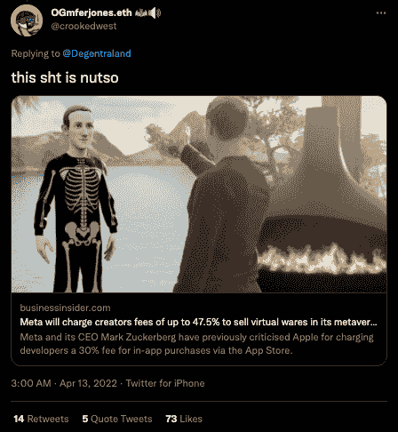

# 马克·扎克伯格和梅塔不懂网络 3 经济

> 原文：<https://web.archive.org/web/https://dappradar.com/blog/mark-zuckerberg-and-meta-dont-understand-web3-economy>

## Meta 向创作者收取高达 47.5%的税

Meta 将向创作者收取高达 47.5%的费用，以在其元宇宙世界销售虚拟物品，这远远高于苹果在其应用程序商店向开发者收取的费用，也远远高于在 Web3 空间运营的成熟 NFT 市场的费用。这一声明在区块链遭到了巨大的质疑，大多数评论家认为马克·扎克伯格不了解 Web3。

## 摘要

*   Meta 将向在其元宇宙销售虚拟物品的创作者收取高达 47.5%的费用
*   没有迹象表明 NFT 是否代表项目
*   NFT 主要市场的平均费用在 2.5%到 10%之间
*   Web3 社区称扎克伯格和 Meta 毫无头绪，脱离现实

在 4 月 11 日星期一的一篇博客文章中，Meta 说它正在测试其定制的元宇宙平台 Horizon Worlds 中的虚拟销售。创作者将能够为用户的头像出售时尚配饰等物品，并独家访问定制的虚拟世界。该声明与扎克伯格早些时候的承诺相矛盾，即帮助开发者逃避苹果应用商店对开发者应用内购买收取的 30%的费用。

## 元费用解释

Meta 对其虚拟现实系统 Meta Quest(原名 Oculus)的销售额收取 30%的平台费。除此之外，Meta 的元宇宙系统 Horizon Worlds 将收取 25%的销售费用。这意味着 Meta 将从售价中抽取高达 47.5%的提成，留给卖方 52.5%。为了进一步解释，如果创建者以 1.00 美元的价格出售一件物品，那么 Meta Quest 商店费用将是 0.30 美元，Horizon 费用将是 0.17 美元(剩余部分的 25%)，在任何所得税适用之前，创建者剩下 0.53 美元。NFT 社区很快对此发表了评论。

更进一步的细微差别是，通过元平台讨论的商品可能不是 NFT 商品，而是虚拟服装和游戏皮肤，这更类似于 Roblox，创作者可以在他们的市场上销售。尽管如此，几乎 50%的税收似乎不公平，尤其是当我们考虑到像 Opensea 和 LooksRare 这样的平台上的费用只是总额的一小部分时。

## NFT 市场收费多少？

苹果应用商店向开发者收取 30%的游戏内物品销售税，这是免费应用开发者的主要收入来源。然而，现有的 NFT 市场费用要低得多，目前 DappRadar 追踪的[市场的费用从 20%到 2.5%不等。](https://web.archive.org/web/20221002012409/https://dappradar.com/nft/marketplaces)

这里需要注意的是 [NFT 的市场](https://web.archive.org/web/20221002012409/https://dappradar.com/nft/marketplaces)会产生汽油费，而[的大部分都在以太坊](https://web.archive.org/web/20221002012409/https://dappradar.com/nft/marketplaces/protocol/ethereum)，那里的汽油费是区块链最高的。向区块链发送 NFT 的创作者需要支付汽油费，因此像[索拉纳](https://web.archive.org/web/20221002012409/https://dappradar.com/nft/marketplaces/protocol/solana)和 [BNB 连锁店](https://web.archive.org/web/20221002012409/https://dappradar.com/nft/marketplaces/protocol/binance-smart-chain)这样的替代网络平台在 2022 年找到了立足点，因为它们为创作者提供了更低的准入门槛。

最相似的是[去中心化](https://web.archive.org/web/20221002012409/https://dappradar.com/ethereum/marketplaces/decentraland)，创作者被鼓励参与到开放的去中心化经济中，通过制作和出售物品给其他玩家。[分散土地市场](https://web.archive.org/web/20221002012409/https://dappradar.com/ethereum/marketplaces/decentraland)费用仅为 2.5%，比 Meta 的预期费用低 45%。以下是 NFT 主要收藏品和艺术品市场的收费结构。最高的费用出现在 NFT 的市场上，那里的创作者卖出更少的作品以获得更高的价值，比如在 Nifty Gateway 或 [Foundation](https://web.archive.org/web/20221002012409/https://dappradar.com/ethereum/marketplaces/foundation) 上发现的 NFT 艺术[。](https://web.archive.org/web/20221002012409/https://dappradar.com/blog/xcopy-sold-23-million-through-nifty-gateway-in-10-minutes)

## NFT 市场的市场费用

*   [Opensea](https://web.archive.org/web/20221002012409/https://dappradar.com/multichain/marketplaces/opensea)–每笔销售的天然气费+ 2.5%的市场费
*   [稀有](https://web.archive.org/web/20221002012409/https://dappradar.com/multichain/marketplaces/rarible)–汽油费+ 2.5%的市场费用
*   Solanart–每笔交易销售价格的 3%市场费用
*   [分散土地](https://web.archive.org/web/20221002012409/https://dappradar.com/ethereum/marketplaces/decentraland)–在分散土地市场出售物品收取 2.5%的费用
*   [Axie Infinity market place](https://web.archive.org/web/20221002012409/https://dappradar.com/multichain/games/axie-infinity)–最近将费用提高至 5.25%
*   [基础](https://web.archive.org/web/20221002012409/https://dappradar.com/ethereum/marketplaces/foundation)–天然气费+15%的额外市场费
*   [已知产地](https://web.archive.org/web/20221002012409/https://dappradar.com/ethereum/marketplaces/knownorigin)–天然气费+ 15%的市场费

[<picture></picture>](https://web.archive.org/web/20221002012409/https://dappradar.com/ethereum/marketplaces/decentraland)[<picture></picture>](https://web.archive.org/web/20221002012409/https://dappradar.com/ethereum/marketplaces/the-sandbox-marketplace)[<picture></picture>](https://web.archive.org/web/20221002012409/https://dappradar.com/ethereum/games/somnium-space)

## NFT 市场仍然繁荣

今年 3 月，剔除可疑的看房活动后，NFT 市场在 Q1 创造了 120 亿美元的收入(T2)，比 2021 年第四季度的记录略微下降了 2%。NFT 空间的另一个积极迹象是，除以太坊之外，在区块链发生的销售数量有所增加。Avalanche 上的[交易数量比上一季度增长了 582%](/web/20221002012409/https://dappradar.com/blog/dapp-industry-report-q1-2022-overview/) ，而 Solana 和 Polygon 上的[交易数量比上一季度增长了 34%](/web/20221002012409/https://dappradar.com/blog/dapp-industry-report-q1-2022-overview/) (季度环比)。

顶级的以太坊 NFT 项目有一个成熟的市场，对大多数人来说可能遥不可及。因此，看到其他网络上的非功能性网络传输也在加快步伐是一件好事，表明 NFT 的采用才刚刚开始。

## 最佳公关

虽然宣布收取 47.5%的费用会遭到整个区块链世界的强烈批评，但它确实提高了全球对 Meta 的意图及其将用于传递这些想法的平台的认识。可以说，这只是一个事实调查任务，因为没有什么可以阻止 Meta 在高收费问题上的大转弯。

与此同时，该公告向我们这些在这个行业中根深蒂固的人表明，Meta 再次将利润率置于合作和社区参与之上，像一把剑一样挥舞着其庞大的用户数据库，以证明向创作者社区收取这些费用是合理的。随着广告收入流的侵蚀和新用户的缺乏，这可能标志着曾经占主导地位的社交媒体平台的结束。时间会证明一切。

 NewsletterUnsubscribe at any time. [T&Cs](https://web.archive.org/web/20221002012409/https://dappradar.com/terms) and [Privacy Policy](https://web.archive.org/web/20221002012409/https://dappradar.com/privacy-policy)

***以上不构成投资建议。此处给出的信息仅供参考。请行使尽职调查，做你的研究。作者持有多种加密货币的头寸，包括 BTC、瑞士法郎和雷达。***