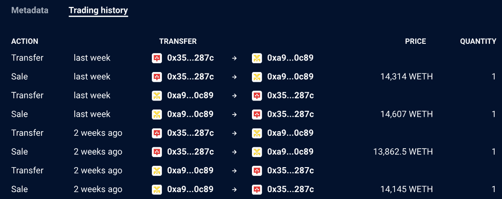
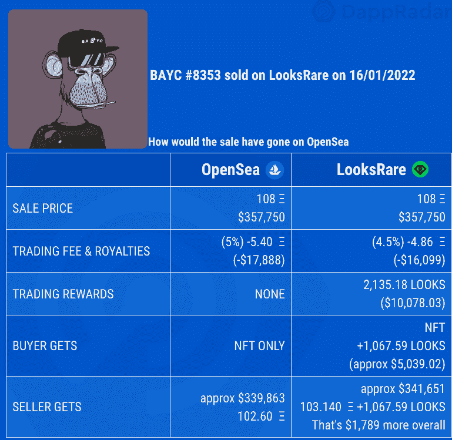

# 营销天才还是违规操作:两个钱包在 LooksRare 上创造了 11 亿美元

> 原文：<https://web.archive.org/web/https://dappradar.com/blog/marketing-genius-or-foul-play-two-wallets-generate-1-1-billion-on-looksrare>

## 我们分享我们的观点

以太坊 NFT 市场 LooksRare 自 1 月 10 日推出以来已经创造了 47 亿美元的收入，远远超过了 OpenSea。然而，DappRadar 在 1 月 10 日至 17 日之间的分析显示，23%或约 11 亿美元来自两个钱包之间的人为交易。

LooksRare 是一个基于以太坊的 NFT 市场。dapp 的核心前提是向使用该平台的 NFT 交易群体奖励一个基础令牌——表情，刺激交易活动，同时引导交易员进行人为交易以赚取表情。

简单来说，一个 NFT 的主人把它卖给他们控制的另一个钱包，模拟交易，从而赚取报酬。在同一笔交易中同时成为 NFT 买家和卖家的个人将立即优化他们的利润，在这种情况下，将获得 LOOKS tokens 作为奖励。

## 两个钱包在非金融交易中交易了 11 亿美元

[在最近的一份鲸类分析报告中，](https://web.archive.org/web/20221201195554/https://dappradar.com/blog/whale-report-are-looksrare-rewards-attracting-whales)我们分析了过去 30 天全行业最有价值的 100 笔 NFT 交易。我们发现 99%发生在 LooksRare 上，涉及 Meebits、Loot 或 cryptophunksv 2——OGcrypto 朋克集合的非官方版本。有趣的是，这三个收藏没有附加版税，所以最初的创作者没有从交易中受益。

然而，Loot 首先在 1 月 24 日采取行动，增加了 5%的销售提成费，结果为国库收入超过 450 ETH。深潜的动机[是像现在在 LooksRare 上观察到的那样的大交易价值触发了 NFT 鲸运动的可能性。](https://web.archive.org/web/20221201195554/https://dappradar.com/blog/whale-report-are-looksrare-rewards-attracting-whales)

同样的两个钱包参与了样本中的前 25 笔交易。这两个钱包([钱包 1](https://web.archive.org/web/20221201195554/https://dappradar.com/hub/wallet/eth/0x35d0ca92152d1fea18240d6c67c2adfe0cca287c) 和[钱包 2](https://web.archive.org/web/20221201195554/https://dappradar.com/hub/wallet/eth/0xa99a76dddbb9678bc33f39919bc76d279c680c89) )在 2022 年 1 月 10 日至 17 日的八天内从这 25 笔交易中产生了超过 362，500 ETH 或 11 亿美元。

通过钱包中某些非功能性交易的交易历史很容易看出，NFT 在钱包之间来回出售，产生了外观奖励。然而，当查看两个钱包时，看不到 LOOKS tokens。可以说，这个人可以交易它们，购买更多的 NFT，或者简单地将它们发送到另一个钱包。

传统金融世界中的人工交易也称为洗盘交易，通常用于获取财务收益或人为抬高某物的价值。就 LooksRare 而言，该系统的机制允许——甚至可能刺激——这种交易，而该平台本身目前似乎没有采取行动阻止这种交易的流动。

快速上升的交易量帮助 LooksRare 吸引了行业的注意力，超过了 OpenSea，并使自己崭露头角。随着回报变少，人们的注意力仍然集中在那些人为交易上，这种活动很快就会平静下来，但就目前而言，LooksRare 位于 NFT 主要市场的顶端。

## 看，我们在往上爬

这一举动已经将一个只有几周历史的 NFT 市场提升到了与领先市场 OpenSea 几乎同等的地位。本质上，这个公式，如果使用正确，对 NFT 的交易者来说是非常有益的，现在在 LooksRare 上交易 NFT 是有财务意义的。

上面的例子显示了普通交易的样子，以及交易者如何从使用 LooksRare over OpenSea 中获益。在这个例子中，卖家通过使用 LooksRare 获得了 1789 美元，买家获得了他们想要的 NFT，外加大约 5000 美元的 LOOKS tokens。如果不被滥用，这个系统运行良好。然而，很清楚为什么有些人在占便宜。

"*没有一个行业对激进营销不陌生，但随着我们的空间如此充满活力和竞争，我们已经非常习惯了。LooksRare 的上市策略是天才之举还是恶作剧？这不是我或 dapradar 可以判断的——我们的角色是提供一个全面、客观和以数据为导向的 dapp 生态系统的观点。*目前可以确定的是，LooksRare 的销量在市场上名列前茅。我们将拭目以待，看看他们的战略会把他们引向何方，以及那些希望复制他们模式的人会走向何方。**

这并不是 NFT 市场第一次试图采用这种策略来抢占市场份额。2020 年，以太坊上出现了一个名为 Rarible 的新市场，它的 RARI 代币也紧随其后。每周一，75，000 个 RARI 代币被分发到过去七天一直活跃在市场上的钱包中，卖家和买家各半。与在 LooksRare 上一样，交易员从事人为交易，以赚取更多 RARI。除了这里，他们不需要用蓝筹股 NFT 集合来做这件事——他们只需要上传任何东西，然后来回 ping 它就可以得到过多的金额。

Rarible 的一个显著区别是，它允许人们使用他们的艺术作品或图像制作 NFT，导致大量低于标准的艺术作品涌入市场，降低了整体质量和体验。一个新的用户注册系统开始生效，创作者必须证明艺术品是他们的，以及创作的动机，这使得许多追逐利润的人不再使用这个平台。

 NewsletterUnsubscribe at any time. [T&Cs](https://web.archive.org/web/20221201195554/https://dappradar.com/terms) and [Privacy Policy](https://web.archive.org/web/20221201195554/https://dappradar.com/privacy-policy)