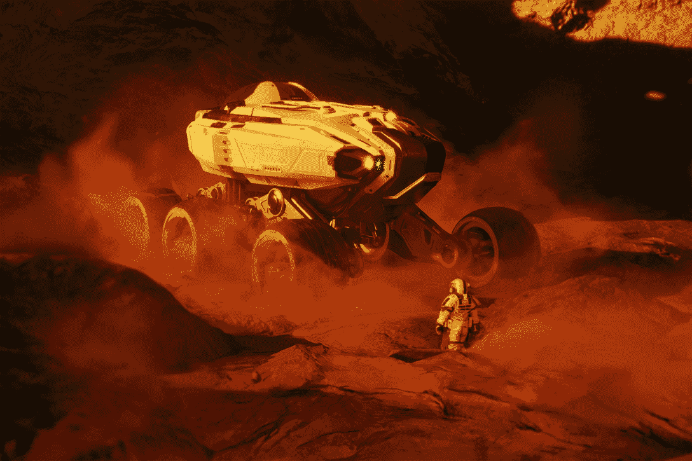
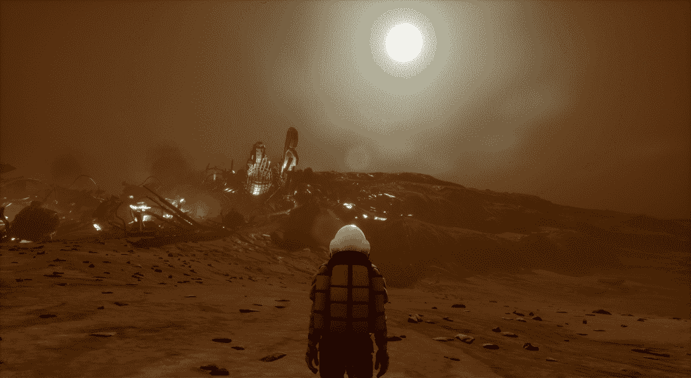
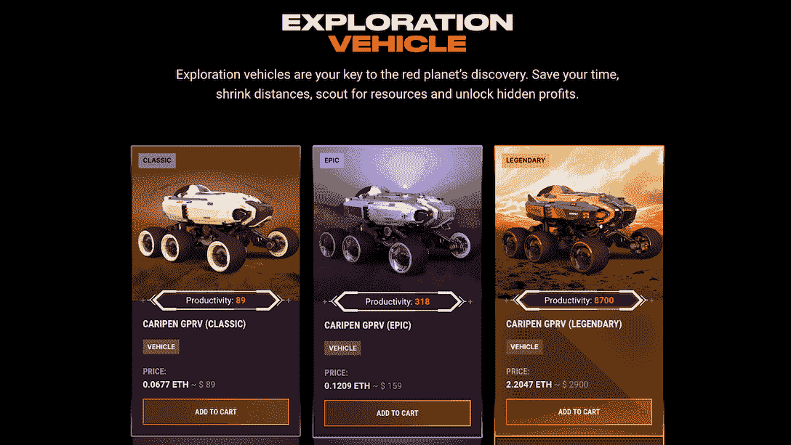

# Mars4 引入新的游戏来增加玩家的收入:车辆 NFTs

> 原文：<https://web.archive.org/web/https://dappradar.com/blog/mars4-introduces-new-gameplay-to-boost-player-earning-power-the-vehicle-nfts>

## 玩家可以使用飞行器 NFT 探索虚拟火星并获得被动收入。

元宇宙游戏《火星四号》发布了一款名为 Caripen GPRV 的 NFT 汽车，以丰富其游戏性。这些时尚的交通工具帮助玩家在虚拟的火星星球上探索和积累财富。值得注意的是，这些非木材森林不仅被用作运输机械，还为其所有者创造收入。

内容:

*   [什么是火星四号:一个互动的游戏赚取元宇宙](https://web.archive.org/web/20221128040903/https://dappradar.com/blog/mars4-introduces-new-gameplay-to-boost-player-earning-power-the-vehicle-nfts/#what-is)
*   [如何通过 Mars4 中的车辆 NFT 获得收入](https://web.archive.org/web/20221128040903/https://dappradar.com/blog/mars4-introduces-new-gameplay-to-boost-player-earning-power-the-vehicle-nfts/#how-to)
    *   [勘探和开采土地以获取利润](https://web.archive.org/web/20221128040903/https://dappradar.com/blog/mars4-introduces-new-gameplay-to-boost-player-earning-power-the-vehicle-nfts/#explore)
    *   [持有车辆非机动车驾驶证并获得被动收入](https://web.archive.org/web/20221128040903/https://dappradar.com/blog/mars4-introduces-new-gameplay-to-boost-player-earning-power-the-vehicle-nfts/#hold)
    *   [用非功能性车辆交易溢价](https://web.archive.org/web/20221128040903/https://dappradar.com/blog/mars4-introduces-new-gameplay-to-boost-player-earning-power-the-vehicle-nfts/#trade)
*   [开始火星之旅的关键时刻](https://web.archive.org/web/20221128040903/https://dappradar.com/blog/mars4-introduces-new-gameplay-to-boost-player-earning-power-the-vehicle-nfts/#start)

基于 NASA 数据的虚拟太空冒险游戏 Mar4 ，从试玩版开始就一直在不断进化。玩家和太空爱好者喜欢这个互动的太空生存游戏，因为它提供了一个地理上精确的 3D 虚拟火星上的沉浸式旅程。

为了增强其故事情节和游戏性，Mars4 发布了 [Caripen GPRV](https://web.archive.org/web/20221128040903/https://4mars.me/3qilGKi) ，这是 NFT 为探索和驰骋红色星球的[土地](https://web.archive.org/web/20221128040903/https://4mars.me/3RMjqqw)而创造的车辆。同样值得一提的是，这些 NFT 不仅是游戏中至关重要的装备，还能为它们的所有者创造收入。

这篇文章给了你一个如何充分利用这些看起来很棒的交通工具的好主意。

## 什么是火星四号:一个互动的游戏赚取元宇宙

“玩赚”游戏因缺乏引人入胜的游戏性而受到了很多批评。相反，许多游戏旨在吸引投机者利用与平台相关的代币市值波动。

因此，玩家最终会一遍又一遍地单调重复同样的任务，这从长远来看损害了游戏的可持续性。另一方面，密码和 NFT 是强大的工具，如果使用得当，它们可以让玩家受益匪浅。

Mars4 决定创造一个真正有趣的游戏，让玩家参与到精心设计的游戏中，并让玩家拥有由 NFTs 驱动的经济。

由于 Mars4 非凡的视觉效果，Mars4 游戏让玩家沉浸在广阔壮丽的火星空间中。此外，该游戏是一个伟大的冒险，让玩家参与各种元素，如管理，征服，生存，探索等。

当开发者可以为玩家提供无与伦比的基础游戏，然后使用 NFT 来增强可玩性和玩家利益时，将会显著改善用户的体验。 [Mars4 是一个很好的例子](https://web.archive.org/web/20221128040903/https://4mars.me/3AWcKiE),展示了如何在不影响游戏体验的情况下将 NFT 集成到游戏中。

现在就来看看 Mars4，开始一段光荣的旅程。

但是在火星上行驶并不是这些四轮怪兽的唯一使用案例！徒步在火星上探险似乎过于雄心勃勃。所以这就是[车辆 NFT](https://web.archive.org/web/20221128040903/https://4mars.me/3qilGKi) 发挥作用的地方。

## 如何利用 Mars4 中的汽车非功能性运输系统赚钱

所有 Mars4 NFTs 都有多种用途，例如关键的游戏内设备和为其所有者创造收入。由于它们服务于不同的功能，从中获得的收益也不同。让我们举一个多功能车辆的例子，NFTs， [Caripen GPRV](https://web.archive.org/web/20221128040903/https://4mars.me/3qilGKi) 。

Caripen GPRV 是一种灵活的探测车辆，配有地面穿透雷达，可以探测岩石的矿物成分。Caripen 协助玩家高效采矿，擅长探索广阔的环境，寻找散布在火星表面的稀有矿石。

### 勘探和开采土地以获取利润

NFT 的每块土地都有六个隐藏资源槽。有些资源是常见的，而另一些是极其罕见的。但是，最重要的是，所有这些都是玩家在火星上生存所必需的。

加勒比 GPRV 可以帮助玩家收集这些资源。例如，他们可以利用加勒比 GPRV 项目来释放他们土地上的资源。一旦解锁，玩家可以通过游戏内市场挖掘和出售收集的资源。

此外，拥有 Caripen GPRV 车辆 NFT 的玩家可以开发他人土地上的资源并从中获利。这意味着，对于那些自己没有土地的人来说，这是一笔宝贵的 NFT 资产。

[前往 Mars4 游戏，](https://web.archive.org/web/20221128040903/https://4mars.me/3qilGKi)为自己买一个卡通，现在就开始玩吧！

### 持有车辆非营业执照，赚取被动收入

如果你不是游戏爱好者，也不用担心。持有任何 Mars4 的 NFT 都会从社区池中产生被动收入。

社区资金池是向所有 NFT 持有者分配 Mars4 收入的工具。Mars4 每次产生收入，都会有一部分进入社区池。土地所有者可以投票决定如何以及何时将碳池分配给 NFT 持有者。

一个名为“生产力得分”的游戏内衡量标准衡量用户从社区池中获得的数量。拥有一辆 Mars4 车辆可以提高玩家的生产力得分，并使他们能够从持有 NFT 中获得更多被动收入。

[前往 Mars4 游戏，](https://web.archive.org/web/20221128040903/https://4mars.me/3qilGKi)装备一个 Caripen，现在就开始玩吧！

### 用车辆非功能性交通工具换取额外费用

和所有的非功能性交通工具一样，汽车非功能性交通工具的价格取决于市场需求，因此存在利润空间。此外，由于 Mars4 NFTs 的供应量有限，随着更多的玩家加入游戏，这些 NFT 的价格将因稀缺而上涨。

此外，车辆比土地少。因此，许多没有 Caripen GPRVs 的土地所有者将依靠向他人付费来勘探和开采他们的土地。或者，他们可以从二级市场购买车辆，这增加了需求。

[https://web.archive.org/web/20221128040903if_/https://www.youtube.com/embed/4lnlrnpQbxE?feature=oembed](https://web.archive.org/web/20221128040903if_/https://www.youtube.com/embed/4lnlrnpQbxE?feature=oembed)

## 开始火星之旅的关键时刻

Mars4 的游戏开发正在按照其路线图稳步推进，第一个游戏试玩已经上线。由于制作精良，该项目获得了玩家的巨大支持，NFT 一半以上的地块已经售出。

增加 Mars4 车辆 NFT 在游戏中打开了许多新的可能性，并为未来的内容和改进提供了基础。此外，拥有一辆 NFT 只需 89 美元。任何人都可以加入 Mars4 项目，成为玩家驱动的生态系统和经济的一部分。

## 随身携带您的 Web3 之旅

使用 DappRadar 移动应用程序，再也不会错过 Web3。查看最受欢迎的 dapps 的性能，并关注您投资组合中的 NFT。您在 DappRadar 上的帐户会与我们的移动应用程序同步，这样您很快就可以选择实时接收提醒。

[Download the DappRadar app now](https://web.archive.org/web/20221128040903/https://dappradar.app.link/blog)[<picture></picture>](https://web.archive.org/web/20221128040903/https://play.google.com/store/apps/details?id=com.portfolio.dappradar)

了解更多关于 Mars4 的信息

[网站](https://web.archive.org/web/20221128040903/https://4mars.me/3qilGKi)

[推特](https://web.archive.org/web/20221128040903/https://twitter.com/MARS4_me)

[不和](https://web.archive.org/web/20221128040903/https://discord.gg/uKxj3YeE85)

**免责声明** —这是一篇赞助文章。DappRadar 不认可本页面上的任何内容或产品。DappRadar 旨在提供准确的信息，但读者应该在采取行动之前总是自己做研究。DappRadar 的文章不能被认为是投资建议。