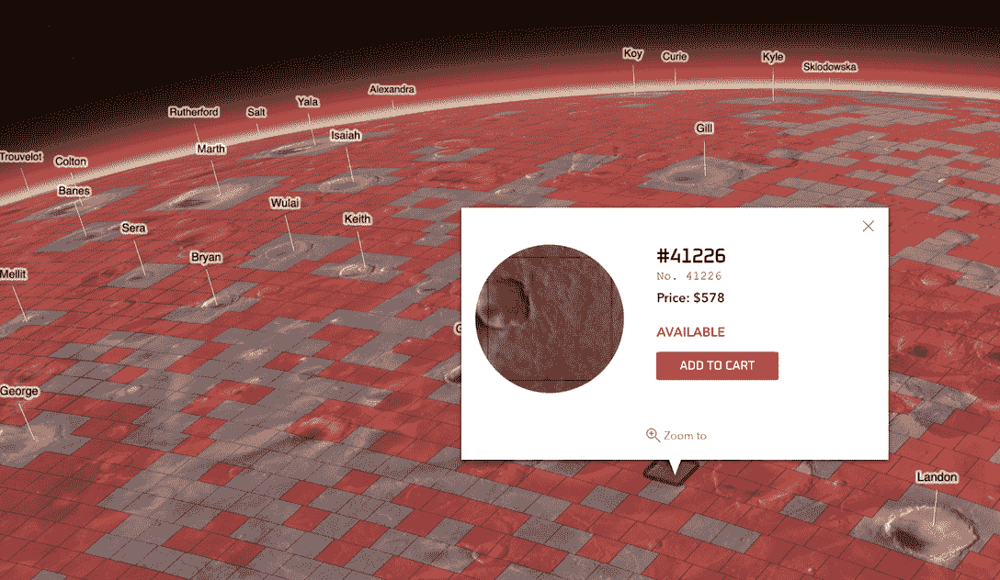
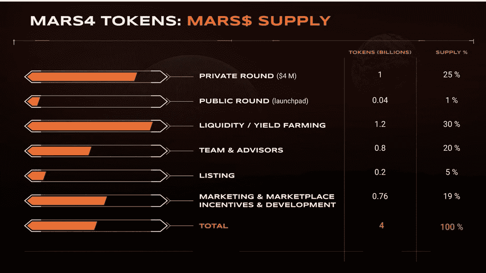

# Mars4 发布了它的第一个游戏演示:在真实的火星上玩、建和赚

> 原文：<https://web.archive.org/web/https://dappradar.com/blog/mars4-releases-its-first-game-demo-play-build-and-earn-on-the-real-mars>

## MARS4 是一款独特的游戏，以基于美国宇航局数据的游戏内 3D 火星地图为特色。玩家可以拥有、探索和殖民 99，888 块 NFT 土地。

NFT 一半以上的土地被出售

[**Mars4**](https://web.archive.org/web/20220630223439/https://4mars.me/3Qxteoi) **近日推出了首款游戏试玩版供其 NFT 持有者欣赏。该游戏首次使用 NASA 数据为其游戏内地图建模，为用户提供了无与伦比的太空冒险。**

**概要:**

*   Mars4 是一款交互式 3D [元宇宙](https://web.archive.org/web/20220630223439/https://dappradar.com/blog/tag/metaverse)游戏，其中[的游戏赚取](https://web.archive.org/web/20220630223439/https://dappradar.com/blog/tag/play-to-earn)机制融入了 PvE 生存游戏。
*   在游戏中，有 99，888 [块 NFT](https://web.archive.org/web/20220630223439/https://dappradar.com/nft) 土地供玩家拥有、探索、开拓和赚取被动收入，其中一半以上已经售出。
*   MARS4 是 Mars4 元宇宙的原生[标记](https://web.archive.org/web/20220630223439/https://dappradar.com/hub/tokens/ethereum/all/)。
*   玩家可以使用 MARS4 购买游戏内物品，支付租金，并将其作为被动收入赚取。

对于许多游戏爱好者来说，太空主题的视频游戏并不新鲜。在 DappRadar，我们推出了许多优秀的太空主题游戏 dapps，如 [Ertha](https://web.archive.org/web/20220630223439/https://dappradar.com/binance-smart-chain/games/ertha) 、 [Moon](https://web.archive.org/web/20220630223439/https://dappradar.com/blog/moon-explained-the-first-play-to-earn-lunar-metaverse-project/) 和 [Star Atlas](https://web.archive.org/web/20220630223439/https://dappradar.com/solana/games/star-atlas) 。都有其独特的玩法和卖点。

但一款基于美国宇航局数据的游戏中的 3D 火星地图是这类游戏中的第一款。 [Mars4 是一款虚拟火星探索游戏](https://web.archive.org/web/20220630223439/https://4mars.me/3H9hWSZ)，它通过令人惊叹的视觉效果和独特的游戏方式为用户带来身临其境的体验。

## 什么是 Mars4？

[火星 4 元宇宙官方预告片|率先投资红色星球 NFTs](https://web.archive.org/web/20220630223439/https://www.youtube.com/watch?v=m2jILZWexig)

MARS4 是一款交互式 3D 元宇宙游戏，在 PvE 生存游戏中融入了从玩到赚的机制。该游戏旨在为一个更大的密码投资者、游戏玩家和太空爱好者社区创建一个令人兴奋的、迷人的、由 P2E 驱动的火星元宇宙。

使用 [NFT 浏览器](https://web.archive.org/web/20220630223439/https://dappradar.com/hub/nft-explorer)发现您最喜欢的游戏 NFT，并获得可操作的准确数据。

为了建立一个自我维持的元宇宙，Mars4 背后的团队精心设计了一个三支柱驱动的机制，以促进游戏内的生态系统。三大支柱分别是[火星陆地 NFT](https://web.archive.org/web/20220630223439/https://4mars.me/3xkx63q) 、[火星 4 令牌](https://web.archive.org/web/20220630223439/https://4mars.me/3aSscD9)和 [P2E 玩法](https://web.archive.org/web/20220630223439/https://4mars.me/3H9hWSZ)。

## 成为 Mars4 享有特权的 NFT 土地所有者

Mars4 的世界展现在一个地理上精确的 3D 虚拟火星上，该虚拟火星是由美国宇航局和其他太空机构的数据创建的。总共有 [99，888 块 NFT 土地](https://web.archive.org/web/20220630223439/https://4mars.me/3xkx63q)允许玩家拥有、探索、殖民和赚取被动收入。

值得一提的是，被动收入包括来自收入分配工具[社区池](https://web.archive.org/web/20220630223439/https://4mars.me/3xwMESX)的奖励。土地所有者可以享受从池中赚取更大报酬的特权。

值得注意的是，在所有的国家森林公园中，有 888 处是“稀有”的，而且每一处占地面积都要大得多。令太空爱好者着迷的是，一块罕见的土地包含了火星上一个著名的拓扑特征，从命名的环形山到奥林匹斯山。

卖地已经在进行了，99888 块地只剩下 42%，还不到一半。由于拥有土地是掌握 Mars4 的 P2E 游戏的[关键，玩家必须在出售之前抓住宝贵的机会。](https://web.archive.org/web/20220630223439/https://4mars.me/3H9hWSZ)

## 令牌组学解释说

MARS4 是 Mars4 的本土标志，是这个可持续发展的 P2E 生态系统的支柱。令牌有多种用途。首先，玩家可以在 MARS4 元宇宙使用 Mars4 支付商品、服务和租金。

此外，Mars4 NFT 土地所有者可以从他们土地上的每笔交易中获得收益，作为被动收入。另一种赚取财富的方法是把它们押在苏珊的温泉上。

用户可以从 [SushiSwap](https://web.archive.org/web/20220630223439/https://dappradar.com/multichain/defi/sushi) ，Bittrex，Mexc，Pancakeswap，KuCoin 获取 MARS4。令牌供应明细如下所示。

## 火星之旅已经起航

Mars4 团队已经为这个项目开发出了一个强大的地图，使其成为最具沉浸感的元数据之一。游戏演示已经准备好，玩家可以在火星四号元宇宙上建造他们梦想的建筑了。[现在就来看看游戏演示吧](https://web.archive.org/web/20220630223439/https://4mars.me/3H9hWSZ)，开始在火星表面进行一些实地研究吧！

最后但同样重要的是，以社区驱动的本质为核心，Mars4 将按照玩家喜欢的方式发展。最终，Mars4 的目标是成为一个 DAO，一个真正参与性的元宇宙项目，利用其社区的智慧和力量。

了解有关 Mars4 的更多信息:

[网站](https://web.archive.org/web/20220630223439/https://4mars.me/3Qxteoi)

[推特](https://web.archive.org/web/20220630223439/https://4mars.me/3tMmc5v)

[不和](https://web.archive.org/web/20220630223439/https://4mars.me/3Qxteoi)