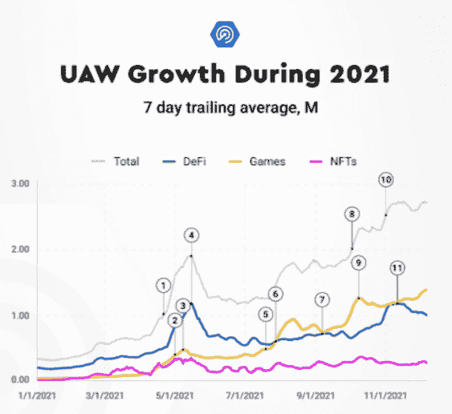
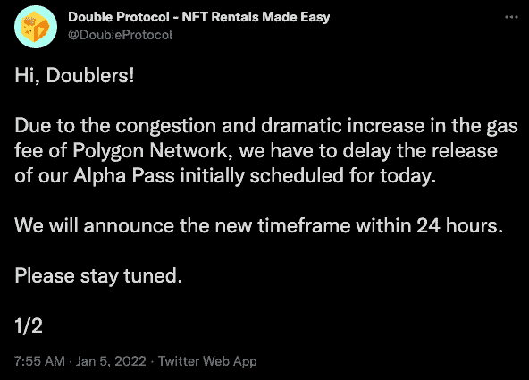
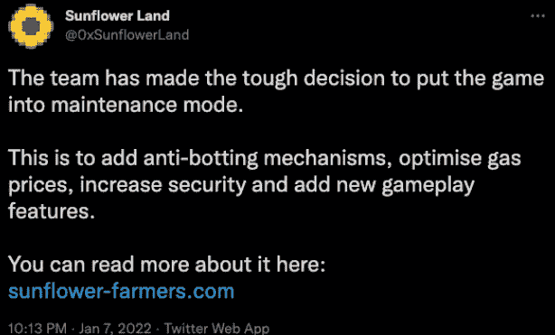
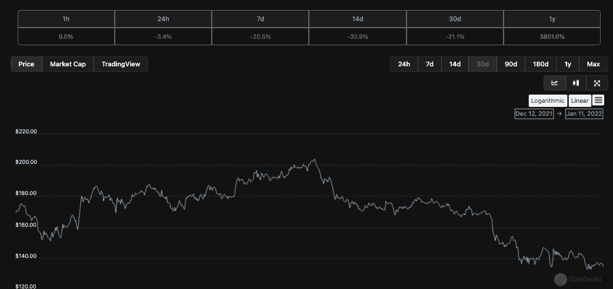

# 大规模采用&多链范式:我们准备好了吗？

> 原文：<https://web.archive.org/web/https://dappradar.com/blog/mass-adoption-the-multichain-paradigm-are-we-ready>

## 区块链融入主流社会的好、坏、丑

在过去的六个月里，随着区块链空间的 dapp 用户数量达到创纪录的水平，大家都在谈论“大规模采用”。这种使用激增的关键驱动力:区块链游戏，尤其是游戏赚钱运动。然而，最近发生的许多事件质疑我们是否准备好成为主流。当我们进入 2022 年，我们带着批判的眼光。

去年，一切都开始朝着正确的方向(至少我们认为是正确的方向)融合并加速发展:根据[我们的数据显示](https://web.archive.org/web/20221201210410/https://dappradar.com/blog/2021-dapp-industry-report)，这个行业处于多链、跨类别的发展状态，这使我们处于大规模采用的风口浪尖。结合了 DeFi、NFTs 和游戏机会的 Play-to-earn 游戏，加上围绕任何“元”的宣传，迅速获得了牵引力，并在 2021 年推动创纪录数量的用户使用 dapps。

这种游戏状态——多链、跨类别、元——是 DappRadar 一直推动的。这是我们业务的核心——我们认为游戏、NFTs 和金融的结合将为大规模采用提供最直接的途径，而不是一个类别赢得霸权之战。但是，让我们摘下粉红色的护目镜，评估一下最近在多链前沿发生的好的、坏的和丑陋的事情。

## 游戏:有压力，但压力测试

“玩即赚”游戏为区块链带来了前所未有的活跃钱包和交易。Axie Infinity 在以太坊上蓬勃发展，但在其浪人的侧链上却欣欣向荣。此外,《外星世界》几乎超越了《蜡像区块链》,并将运营转移到 BSC 以追求更多活跃用户。然而，一些区块链发现他们的弱点在处理大量交易时暴露了出来——这是游戏 dapp 的一个常见特征。尽管如此，区块链游戏在成为主流之前提供了一个急需的压力测试。

## 为什么游戏会产生这么多的交易？

由于大多数“玩即赚”游戏都围绕着完成任务和游戏挑战以赚取代币的原则，所以用户需要进行许多交易——例如，比使用 DeFi 或 NFT dapp 时要多得多。DeFi 中的操作可能达到每个钱包 4 或 5 次交易，而购买 NFT 可能只会遇到 1 或 2 次。想想在一个不断让玩家晋级、与游戏挑战互动、奖励玩家的 dapp 中需要多少次交易——每次都需要一次交易。

因此[当我们谈论 DappRadar](https://web.archive.org/web/20221201210410/https://dappradar.com/blog/category/games) 上的游戏时，我们通常会谈到独特的活跃钱包指标。当我们谈论 NFTs 和 DeFi 时，我们依靠数量和销售数字[。希望现在可以清楚为什么这些指标可以用来谈论 dapp 领域的增长。](https://web.archive.org/web/20221201210410/https://dappradar.com/blog/category/games)

## 多边形、装箱和增加的用户成本

Polygon，[流行的以太坊侧链](/web/20221201210410/https://dappradar.com/blog/what-is-polygon-a-simple-explanation/)，被吹捧为前者的气体和交易速度问题的解决方案，其问题因一个单一游戏 dapp 而凸显出来。《T2》中的游戏《向日葵农民》堵塞了网络，推高了交易费用。这个游戏的前提很简单:你播种来种植植物，收获并出售它们来获得 SFF 代币，然后你可以出售或交换这些代币。核心令牌组学的工作原理是，购买和种植种子的成本大约是收获后的一半。

另一个关键因素是此类游戏中存在的机器人。玩家需要的动作非常单调。只需点击几下，你就可以开始赚钱了。因此，可以将操作分配给知道如何操作的人。每个机器人将有一个指定的钱包。一旦他们连接到 dapp，他们就被注册为一个唯一的活动钱包，他们完成的每一笔交易都在区块链上注册，因此由 DappRadar 注册。

一个用户可以管理他们的钱包和一大群机器人。然而，这并不是什么新鲜事，尽管对戴普斯和区块链来说都非常令人恼火，但这种情况已经发生了一段时间。可以说，对于 dapps 来说，问题并不是那么大，因为膨胀的用户数量会导致媒体提及和正面报道。一般来说，像 DappRadar 这样的平台有责任清理和报告指标，这是我们不懈努力的目标。

到目前为止，除了让达普斯、区块链和我们在达普雷达的数据团队头疼之外，这还没有产生明显的影响。然后，大量的交易开始影响 Polygon 的天然气费用，人们开始更加注意。值得注意的是，这个游戏并没有完全被机器人控制，那里有成千上万的真实用户拼命地与机器人争夺奖励。

[<picture></picture>](https://web.archive.org/web/20221201210410/https://dappradar.com/rankings)[<picture></picture>](https://web.archive.org/web/20221201210410/https://dappradar.com/hub/wallet)[<picture></picture>](https://web.archive.org/web/20221201210410/https://dappradar.com/hub/swap)

## 高需求推高了交易成本

矿工每个块处理一定数量的事务。然而，当有太多事务时，用户需要竞争让区块链处理他们的操作。他们需要支付更多的汽油费，因此交易成本上升。具有讽刺意味的是，这是分散式区块链的一个重要好处——发送垃圾邮件或试图破坏网络需要付费。攻击越猛烈，费用就越高，这就是为什么这项技术比容易被攻击的集中式系统更受欢迎的原因。然而，在这种情况下，当一个网络的整个营销语言都集中在速度和低费用上，开始向用户收取更多的交易费用时，它可能会垮台。

考虑到价格的上涨，费用从大约 0.00009 美元上涨到大约 0.001 美元。所以，价格的上涨对于没有受过训练的人来说是很难察觉的。在以太坊上，用户可以支付 50 到 100 美元的交易费用。因此，游戏不能在那里运行，像 Axie Infinity 这样的游戏现在已经将操作转移到他们定制的 Ronin sidechain。

尽管费用的增加看起来微不足道，但用户们开始关注，而且，一如既往，当费用增加到他们的口袋里时，他们会表达他们的担忧。由于成本上升，网络上的其他 dapps 被迫推迟活动和初始令牌分发，因为他们不想让他们的用户支付更高的汽油费。

Source: [Twitter](https://web.archive.org/web/20221201210410/https://twitter.com/DoubleProtocol/status/1478606054883614724)

与此同时，向日葵农民团队还有另一个令人头疼的问题要处理，那就是一个合同错误，如果暴露出来，dapp 可能会变得毫无用处。1 月 7 日，向日葵农民队传递消息，随后关闭游戏，并将 SFF 令牌列入黑名单。值得注意的是，游戏会回来，玩家会再次成为一个整体。为了多边形网络和游戏本身的利益，这是一个暂时的举动，试图阻止机器人的流动，恢复正常运作。

Source: [Twitter](/web/20221201210410/https://dappradar.com/blog/sunflower-farmers-taken-offline-after-clogging-polygon-blockchain/)

此外，它显示了一些东西。首先，Polygon 可以处理大量增加的事务。只是这样做会增加天然气的成本——这是任何了解区块链的人都会预料到的。其次，网络需要对游戏开发商保持警惕，并确保他们在发布前尽一切努力阻止机器人的进入。当 bot 活动开始对网络上的其他 dapps 产生连锁反应时，这对每个人来说都是一个问题。

## 索拉纳摔倒了

索拉纳区块链也被吹捧为以太坊的竞争对手，在几个月内遭遇了三次断电。目前还不清楚这个问题是因为高流量导致的简单网络故障，还是因为黑客的 DDoS 攻击导致的网络崩溃。索拉纳基金会还没有证实这些，尽管它不能否认网络见证了一个放缓，因为它可以被实时跟踪。然而，正如 DappRadar 的一名观众所指出的，即使受到攻击，Solana 每秒也能处理比以太坊更多的事务。

Solana 在这些事件之前一直飞得很高，这留下了许多问题，即区块链如何可能受到 DDoS 攻击，以及为什么在如此短的时间内发生了这么多次。溶胶的价格随着负面新闻而暴跌，在过去的 30 天里下跌了 21%。此外，它还推动了其他与 EVM 兼容的连锁店如 Avalanche 和 Fantom 采取行动。

## 以太坊坐得漂亮

以太坊处于特权地位。它具有先发优势和广泛的知名度，此外，它已经成为鲸鱼交易商的家园，利用有史以来第一批建造的 dapps。这些投资者乐于为一个想法付费；看起来——10 万美元交易中的 50 美元微不足道。但不是在你想转移几百块钱的时候。

由于以太坊的汽油费如此之高，这个网络对玩挣钱游戏或轻浮的商人来说不是一个友好的地方。它的 dapps 吸引了更多的用户和那些愿意支付一次性汽油费的人。天然气价格目前再次达到峰值，因为每周都有几批 NFT 藏品抵达以太坊，消耗大量天然气并处理交易。

然而，人们也一直清楚，单靠以太坊无法维持交易的大规模采用水平，因此需要第 1 层和第 2 层解决方案的帮助来承担网络的一些负担。因此出现了 BSC、Polygon 和 Solana 等平台。如果这些平台能够有效应对以太坊无法应对的事情，协同作用就变得绝对，叙事也能从‘以太坊杀手’变成‘以太坊助手’。

## 团结一致

我们在这里不指责任何 dapp、dapp 类别或链，因为它们都为区块链技术的发展做出了贡献，推动了更多的采用。

作为一个集体，区块链网络可以向用户扩展所需的计算能力和交易成本，而不会让他们厌烦后台工作的细节。在 DappRadar，我们看到了一个未来，dapp 运行的网络并不重要，只要它直观地为用户服务，并能做到它所说的。

尽管如此，压力测试对于成功的进化来说是必不可少的，而且到目前为止，大多数区块链还没有受到像游戏赚钱那样的猛烈攻击。将区块链推向极限将确保他们在需要时做好应对需求的准备。这也是一种区分专业人士和业余爱好者的方式，因为我们将迎来肯定会是多链发布和探索的一年。

大规模采用是一个可以实现的目标——但这条道路上的具体曲折还不清楚。

一个多链范式，[在其中多个区块链和他们的 dapp](https://web.archive.org/web/20221201210410/https://dappradar.com/rankings)和谐地找到成功，这是 DappRadar 所相信的，并且被烘焙到我们的雷达令牌的核心。作为一个多链平台，我们希望用户获得尽可能多的机会，没有任何访问限制或把关 dapps。

 NewsletterUnsubscribe at any time. [T&Cs](https://web.archive.org/web/20221201210410/https://dappradar.com/terms) and [Privacy Policy](https://web.archive.org/web/20221201210410/https://dappradar.com/privacy-policy)