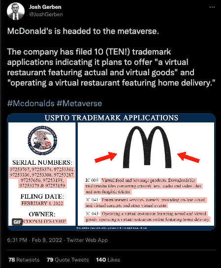

# 麦当劳元宇宙餐厅将推出送餐服务

> 原文：<https://web.archive.org/web/https://dappradar.com/blog/mcdonalds-metaverse-restaurants-to-feature-food-delivery-service>

## 从虚拟世界订购汉堡和薯条送到你家门口

麦当劳已经申请了商标，透露了在元宇宙开设送餐服务的计划。这家标志性的美国快餐连锁店提交了十份商标申请，披露了他们推出虚拟餐厅的计划，该餐厅以实际和虚拟商品为特色，并进一步计划提供送货上门服务。

这则新闻是在[麦当劳显然在上个月**BTC 危机后投放了**](https://web.archive.org/web/20221129075802/https://twitter.com/coinerstakingls/status/1461894358014185472)欢迎加密公司申请工作的巨幅广告之后。信仰不是没有讽刺意味的。这家美国连锁餐厅看起来正准备通过在虚拟空间注册十个商标来进军元宇宙。商标律师兼 Gerben 知识产权公司创始人 Josh Gerben [于 2 月 9 日在 Twitter](https://web.archive.org/web/20221129075802/https://twitter.com/JoshGerben/status/1491449758967562240?cxt=HHwWgIDUuevp2LIpAAAA) 上发布了一张展示商标细节的图片。

该应用程序概述了该连锁餐厅将为艺术品、音频和视频文件以及 NFT 提供“可下载的多媒体文件”。此外，计划还包括虚拟食品和饮料项目以及用户可以聚集的虚拟设施。

金色拱门加入面包店和咖啡连锁店 Panera Bread，将其品牌推广到元宇宙。2 月 3 日，Panera Bread 为一家名为 [Paneraverse](https://web.archive.org/web/20221129075802/https://twitter.com/JoshGerben/status/1491138460266405888) 的虚拟餐厅和咖啡馆连锁店提交了一份类似的商标申请。

## 大品牌纷纷效仿

麦当劳是最新一个宣布进入元宇宙的大品牌。然而，在这种情况下，他们似乎更进了一步，允许元宇宙平台的用户订购食物，并将其送到现实世界中的位置——这一想法在《就绪玩家一号》等电影中得到了美化。

[https://web.archive.org/web/20221129075802if_/https://www.youtube.com/embed/ZNgNm4p2KAg?feature=oembed](https://web.archive.org/web/20221129075802if_/https://www.youtube.com/embed/ZNgNm4p2KAg?feature=oembed)

## 元宇宙小吃

分散的社区已经通过利用比萨饼连锁多米诺骨牌的服务测试了类似的服务。比萨饼摊位允许人们从虚拟世界订购他们真正的比萨饼，而不需要离开他们的椅子。当然，直到门铃响。

麦当劳和达美乐只是进入元宇宙的几个品牌。许多人已经承诺进入虚拟世界。本周我们已经看到育碧[在沙盒](https://web.archive.org/web/20221129075802/https://dappradar.com/blog/game-company-ubisoft-brings-raving-rabbids-into-the-sandbox)中收购土地，同时还有与时尚品牌古驰的合作。

[<picture></picture>](https://web.archive.org/web/20221129075802/https://dappradar.com/blog/what-are-non-fungible-tokens-nfts)[<picture></picture>](https://web.archive.org/web/20221129075802/https://dappradar.com/nft/marketplaces)[<picture></picture>](https://web.archive.org/web/20221129075802/https://dappradar.com/nft/sales) NewsletterUnsubscribe at any time. [T&Cs](https://web.archive.org/web/20221129075802/https://dappradar.com/terms) and [Privacy Policy](https://web.archive.org/web/20221129075802/https://dappradar.com/privacy-policy)

***以上不构成投资建议。此处给出的信息仅供参考。请行使尽职调查，做你的研究。作者持有 ETH、BTC、AGIX、HEX、LINK、GRT、CRO、OMI、不可变 X、GALA、AVASTR、GMEE、CUBE、RADAR、FLOW、FTM、BNB、SPS、WRLD、ATOM 和 ADA。***